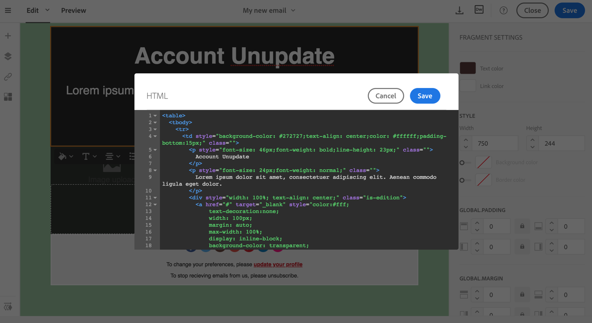
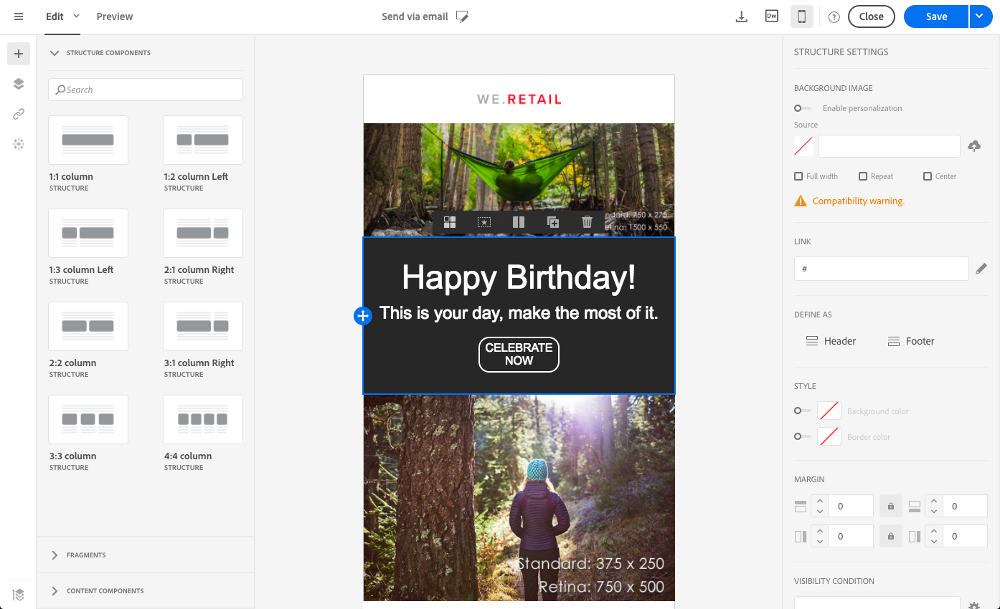
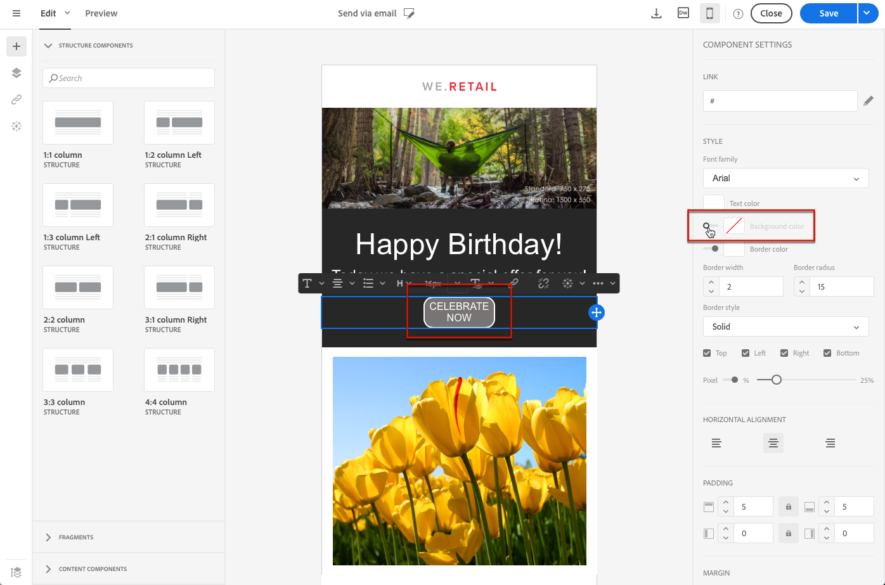

# プレーンテキスト、HTML、モバイルの E メールフォーマットの編集 {#plain-text-and-html-modes}

E メールデザイナーを使用すると、E メールの複数のレンダリングを編集できます。 テキスト版の E メールを生成し、E メールのHTMLソースを編集し、モバイル表示用の E メールをデザインできます。

## E メールのテキストバージョンの生成 {#generating-a-text-version-of-the-email}

デフォルトでは、 **[!UICONTROL Plain text]** 電子メールのバージョンが自動的に生成され、 **[!UICONTROL Edit]** バージョン。

パーソナライゼーションバージョンに追加されたHTMLフィールドとコンテンツブロックも、プレーンテキストバージョンと同期されます。

>[!NOTE]
>
>プレーンテキストバージョンのコンテンツブロックを使用するには、コンテンツブロックにHTMLコードが含まれていないことを確認します。

プレーンテキストバージョンとHTMLバージョンを異ならせるには、 **[!UICONTROL Sync with HTML]** 切り替える **[!UICONTROL Plain text]** 電子メールの表示。

その後、必要に応じてプレーンテキストバージョンを編集できます。

>[!NOTE]
>
>次を編集する場合、 **[!UICONTROL Plain text]** 同期が無効になっている間のバージョン。次に **[!UICONTROL Sync with HTML]** 」オプションを選択すると、プレーンテキストバージョンで行ったすべての変更がHTMLバージョンに置き換えられます。 変更内容 **[!UICONTROL Plain text]** ビューは、 **[!UICONTROL HTML]** 表示

## HTMLでの E メールコンテンツソースの編集 {#editing-an-email-content-source-in-html}

最も上級のユーザーおよびデバッグの場合は、電子メールコンテンツをHTMLで直接表示および編集できます。

E メールのバージョンを編集するには、2 つのHTML方法があります。

* 選択 **[!UICONTROL Edit]** > **[!UICONTROL HTML]** をクリックして、e メール全体のHTMLバージョンを開きます。

   

* WYSIWYG インターフェイスで、要素を選択し、 **[!UICONTROL Source code]** アイコン

   選択した要素のソースのみが表示されます。 選択した要素が **[!UICONTROL HTML]** コンテンツコンポーネント 他のコンポーネントは読み取り専用モードですが、E メールのフルHTMLバージョンでも編集できます。

   

コードのHTMLを変更すると、E メールの応答性が損なわれる可能性があります。 必ず、 **[!UICONTROL Preview]** 」ボタンをクリックします。 [メッセージのプレビュー](../../sending/using/previewing-messages.md)を参照してください。

## モバイルレンダリング用の E メールのデザイン {#switching-to-mobile-view}

モバイル表示用のすべてのスタイルオプションを個別に編集することで、E メールのレスポンシブデザインを微調整できます。 例えば、余白やパディングの調整、より小さいまたは大きいフォントサイズの使用、ボタンの変更、電子メールのモバイルバージョンに応じた異なる背景色の適用をおこなうことができます。

すべてのスタイルオプションをモバイル表示で使用できます。 E メールデザイナーのスタイル設定については、このページで既に説明しています。

1. E メールを作成し、コンテンツの編集を開始します。 詳しくは、 [新規での E メールコンテンツのデザイン](../../designing/using/designing-from-scratch.md#designing-an-email-content-from-scratch).
1. 専用のモバイルビューにアクセスするには、 **[!UICONTROL Switch to mobile view]** 」ボタンをクリックします。

   

   E メールのモバイルバージョンが表示されます。 デスクトップビューで定義されたすべてのコンポーネントとスタイルが含まれます。

1. 背景色、整列、パディング、余白、フォントファミリー、テキストカラーなど、すべてのスタイル設定を個別に編集する。

   

1. モバイル表示でスタイル設定を編集すると、変更はモバイル表示にのみ適用されます。

   例えば、画像のサイズを小さくし、緑の背景を追加して、モバイル表示でのパディングを変更します。

   

1. モバイルデバイスで表示する際に、コンポーネントを非表示にできます。 それには、「 **[!UICONTROL Show only on desktop devices]** から **[!UICONTROL Display options]**.

   また、デスクトップデバイスでこのコンポーネントを非表示にすることもできます。つまり、このコンポーネントはモバイルデバイスでのみ表示されます。 それには、「 **[!UICONTROL Show only on mobile devices]**.

   例えば、このオプションを使用すると、モバイルデバイスには特定の画像を表示し、デスクトップデバイスには別の画像を表示できます。

   このオプションは、モバイル表示またはデスクトップ表示から設定できます。

   

1. もう一度 **[!UICONTROL Switch to mobile view]** ボタンをクリックして標準のデスクトップビューに戻ります。 先ほど行ったスタイルの変更は反映されません。

   

   >[!NOTE]
   >
   >唯一の例外は **[!UICONTROL Style inline]** 設定。 スタイルのインライン設定の変更は、標準のデスクトップビューにも適用されます。

1. テキスト編集、新しい画像のアップロード、新しいコンポーネントの追加など、E メールの構造またはコンテンツに対するその他の変更。 は標準ビューにも適用されます。

   例えば、モバイル表示に戻り、テキストを編集して、画像を置き換えます。

   

1. もう一度 **[!UICONTROL Switch to mobile view]** ボタンをクリックして標準のデスクトップビューに戻ります。 変更が反映されます。

   

1. モバイル表示でスタイルを削除すると、デスクトップモードで適用されたスタイルに戻ります。

   例えば、モバイル表示では、ボタンに緑の背景色を適用します。

   

1. デスクトップビューに切り替え、同じボタンにグレーの背景を適用します。

   

1. もう一度モバイル表示に切り替え、今すぐ無効にします **[!UICONTROL Background color]** 設定。

   

   デスクトップビューで定義した背景色が適用されるようになりました。灰色（空白ではなく）に変わります。

   唯一の例外は **[!UICONTROL Border color]** 設定。 モバイル表示で無効にした場合、デスクトップ表示で境界線の色が定義されている場合でも、境界線は適用されなくなりました。

>[!NOTE]
>
>モバイルビューは、 [フラグメント](../../designing/using/using-reusable-content.md#about-fragments).
