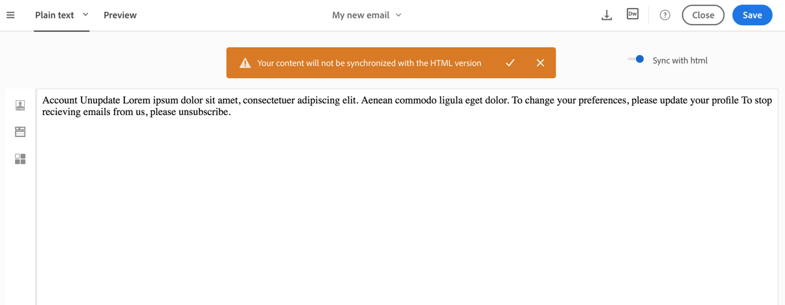
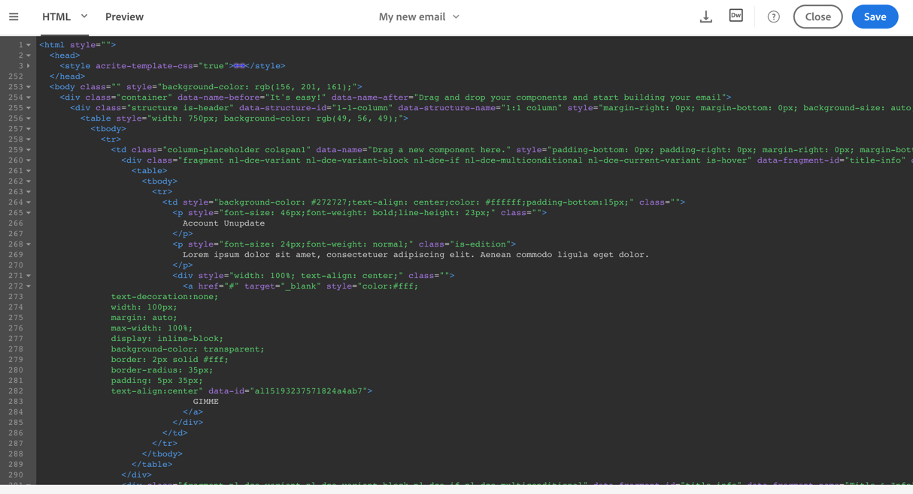
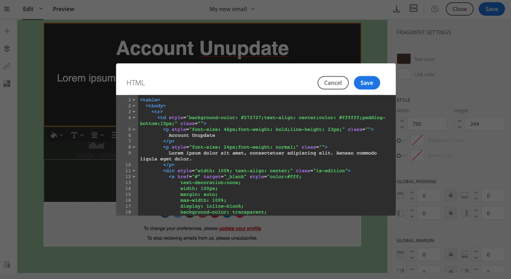
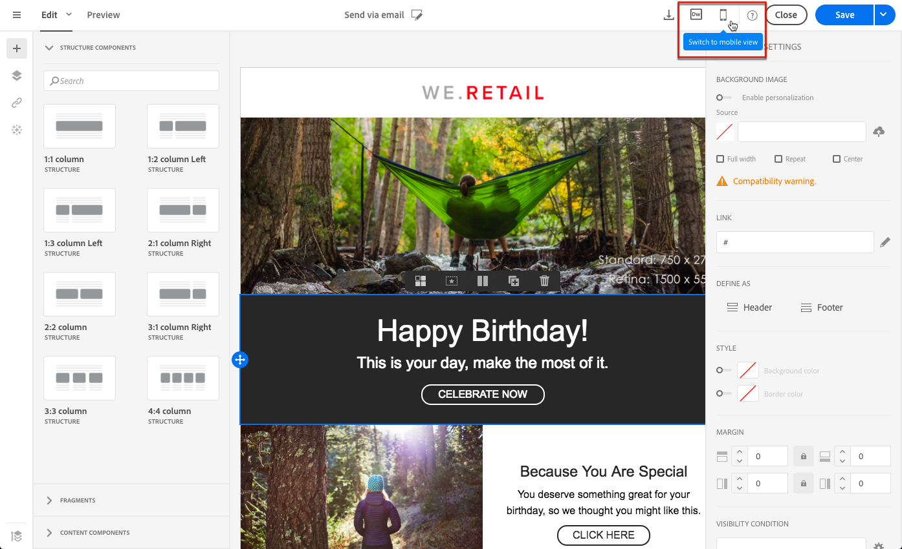
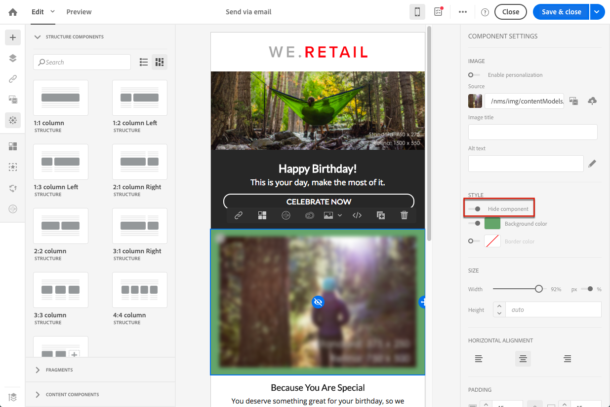
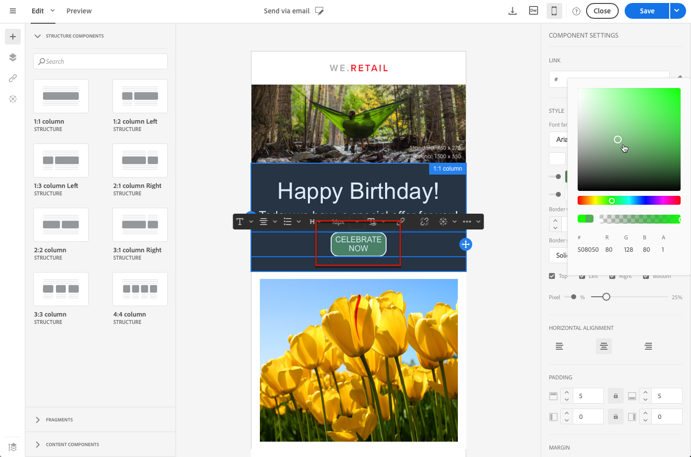
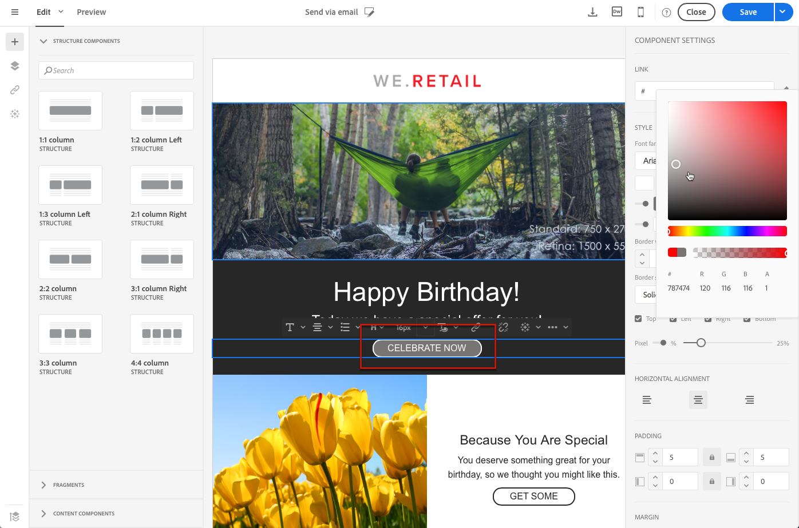
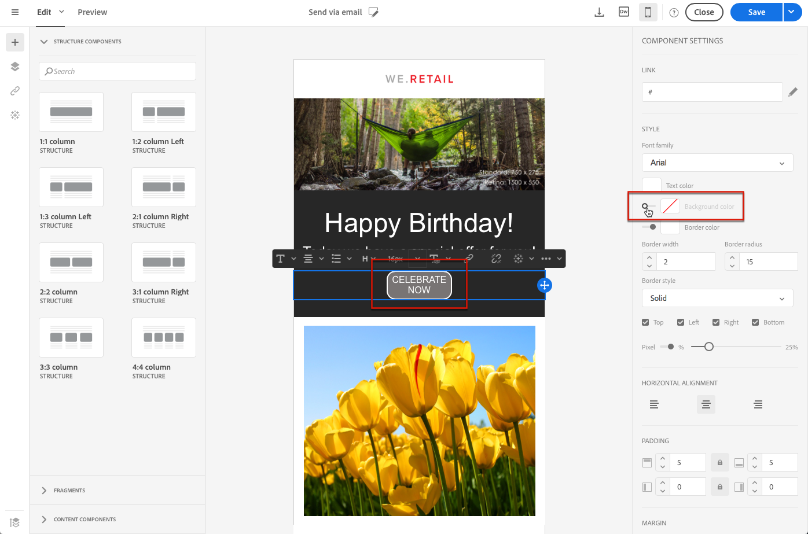

# プレーンテキスト、HTMLおよびモバイルメール形式の編集 {#plain-text-and-html-modes}

メールDesignerでは、メールの複数のレンダリングを編集できます。 メールのテキストバージョンを生成したり、メールのHTML ソースを編集したり、モバイルビュー用のメールをデザインしたりできます。

## メールのテキストバージョンの生成 {#generating-a-text-version-of-the-email}

デフォルトでは、メールの&#x200B;**[!UICONTROL Plain text]** バージョンが自動的に生成され、**[!UICONTROL Edit]** バージョンと同期されます。

HTML版に追加されたパーソナライゼーションフィールドとコンテンツブロックも、プレーンテキスト版と同期されます。

>[!NOTE]
>
>コンテンツブロックをプレーンテキスト版で使用するには、コンテンツブロックにHTML コードが含まれていないことを確認します。

プレーンテキスト版とHTML版を異なるバージョンにするには、メールの&#x200B;**[!UICONTROL Plain text]**&#x200B;表示から&#x200B;**[!UICONTROL Sync with HTML]** スイッチをクリックして、この同期を無効にできます。

その後、必要に応じてプレーンテキストバージョンを編集できます。

>[!NOTE]
>
>同期が無効になっている間に&#x200B;**[!UICONTROL Plain text]** バージョンを編集すると、次回&#x200B;**[!UICONTROL Sync with HTML]** オプションを有効にすると、プレーンテキストバージョンで行ったすべての変更がHTML バージョンに置き換えられます。 **[!UICONTROL Plain text]** ビューで行われた変更は、**[!UICONTROL HTML]** ビューに反映できません。

## HTMLでのメールコンテンツソースの編集 {#editing-an-email-content-source-in-html}

最も高度なユーザーとデバッグの場合は、HTMLで電子メールコンテンツを直接表示および編集できます。

HTML版のメールを編集するには、次の2つの方法があります。

* **[!UICONTROL Edit]** > **[!UICONTROL HTML]**&#x200B;を選択して、メール全体のHTML バージョンを開きます。

  

* WYSIWYG インターフェイスから要素を選択し、**[!UICONTROL Source code]** アイコンをクリックします。

  選択した要素のソースのみが表示されます。 選択した要素が&#x200B;**[!UICONTROL HTML]** コンテンツコンポーネントの場合、ソースコードを編集できます。 その他のコンポーネントは読み取り専用モードですが、HTMLのフルバージョンのメールで編集できます。

  

HTMLのコードを変更すると、電子メールの応答性が低下する可能性があります。 必ず&#x200B;**[!UICONTROL Preview]** ボタンを使用してテストしてください。 [メッセージのプレビュー](../../sending/using/previewing-messages.md)を参照してください。

## モバイルレンダリング用メールのデザイン {#switching-to-mobile-view}

モバイルディスプレイのすべてのスタイルオプションを個別に編集することで、メールのレスポンシブデザインを微調整できます。 例えば、余白やパディングを調整したり、フォントサイズを小さくしたり大きくしたり、ボタンを変更したり、モバイル版の電子メールに適した背景色を適用したりできます。

すべてのスタイルオプションは、モバイルビューで使用できます。 メールDesignerのスタイル設定は、このページで以前に示されています。

1. メールを作成し、コンテンツの編集を開始します。 詳しくは、[電子メールコンテンツをゼロからデザイン ](../../designing/using/designing-from-scratch.md#designing-an-email-content-from-scratch)するを参照してください。
1. 専用のモバイルビューにアクセスするには、**[!UICONTROL Switch to mobile view]** ボタンを選択します。

   

   メールのモバイル版が表示されます。 デスクトップビューで定義されたすべてのコンポーネントとスタイルが含まれます。

1. 背景色、整列、パディング、余白、フォントファミリー、テキストカラーなど、すべてのスタイル設定を個別に編集できます。

   

1. モバイルビューでスタイル設定を編集する場合、変更はモバイルディスプレイにのみ適用されます。

   例えば、画像のサイズを小さくしたり、緑色の背景を追加したり、モバイルビューでパディングを変更したりします。

   

1. モバイルデバイスで表示する場合は、コンポーネントを非表示にできます。 これをおこなうには、**[!UICONTROL Display options]**&#x200B;から&#x200B;**[!UICONTROL Show only on desktop devices]**&#x200B;を選択します。

   また、このコンポーネントをデスクトップデバイスで非表示にすることもできます。つまり、モバイルデバイスでのみ表示されます。 これを行うには、**[!UICONTROL Show only on mobile devices]**&#x200B;を選択します。

   例えば、このオプションを使用すると、モバイルデバイスに特定の画像を表示したり、デスクトップデバイスに別の画像を表示したりできます。

   このオプションは、モバイルビューまたはデスクトップビューから設定できます。

   

1. もう一度&#x200B;**[!UICONTROL Switch to mobile view]** ボタンをクリックして、標準のデスクトップビューに戻ります。 先ほど行ったスタイルの変更は反映されません。

   

   >[!NOTE]
   >
   >唯一の例外は&#x200B;**[!UICONTROL Style inline]**&#x200B;設定です。 スタイルのインライン設定の変更は、標準のデスクトップビューにも適用されます。

1. テキスト編集、新しい画像のアップロード、新しいコンポーネントの追加など、メールの構造やコンテンツに対するその他の変更も、標準ビューに適用されます。

   例えば、モバイル表示に切り替え、テキストを編集して画像を置き換えます。

   

1. もう一度&#x200B;**[!UICONTROL Switch to mobile view]** ボタンをクリックして、標準のデスクトップビューに戻ります。 変更が反映されます。

   

1. モバイルビューでスタイルを削除すると、デスクトップモードで適用されたスタイルに戻ります。

   例えば、モバイルビューでは、ボタンに緑色の背景色を適用します。

   

1. デスクトップビューに切り替え、同じボタンにグレーの背景を適用します。

   

1. もう一度モバイルビューに切り替え、**[!UICONTROL Background color]**&#x200B;設定を無効にします。

   

   デスクトップビューで定義された背景色が適用されるようになりました。グレーになります（空白ではありません）。

   唯一の例外は&#x200B;**[!UICONTROL Border color]**&#x200B;設定です。 モバイルビューで無効にすると、境界線の色がデスクトップビューで定義されていても、境界線は適用されなくなります。

>[!NOTE]
>
>モバイルビューは、[ フラグメント ](../../designing/using/using-reusable-content.md#about-fragments)では利用できません。
