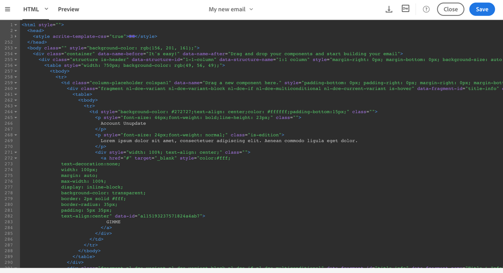

# プレーンテキスト、HTMLおよびモバイルE メールフォーマットの編集 {#plain-text-and-html-modes}

電子メールデザイナーでは、電子メールの複数のレンダリングを編集できます。 電子メールのテキスト版を生成したり、電子メールのHTMLソースを編集したり、モバイル表示用の電子メールをデザインしたりできます。

## 電子メールのテキストバージョンの生成 {#generating-a-text-version-of-the-email}

デフォルトでは、電子メールの **[!UICONTROL Plain text]** バージョンは自動的に生成され、 **[!UICONTROL Edit]** バージョンと同期されます。

また、HTMLバージョンに追加されたパーソナライゼーションフィールドやコンテンツブロックもプレーンテキストバージョンと同期されます。

>[!NOTE]
>
>プレーンテキストバージョンでコンテンツブロックを使用するには、HTMLコードが含まれていないことを確認します。

HTMLバージョンとは異なるプレーンテキストバージョンを使用する場合は、電子メールの **[!UICONTROL Sync with HTML]****[!UICONTROL Plain text]** 表示にあるスイッチをクリックして、この同期を無効にできます。

その後、必要に応じてプレーンテキストバージョンを編集できます。

>[!NOTE]
>
>同期が無効な状態で **[!UICONTROL Plain text]** バージョンを編集する場合、次回この **[!UICONTROL Sync with HTML]** オプションを有効にすると、プレーンテキストバージョンで行ったすべての変更がHTMLバージョンに置き換えられます。 **[!UICONTROL Plain text]** 表示で行った変更は、 **[!UICONTROL HTML]** 表示に反映されません。

## HTMLでの電子メールコンテンツソースの編集 {#editing-an-email-content-source-in-html}

最も上級のユーザーおよびデバッグ作業を行う場合は、電子メールコンテンツをHTMLで直接表示および編集できます。

電子メールのHTMLバージョンを編集するには、次の2つの方法があります。

* / **[!UICONTROL Edit]** を選択 **[!UICONTROL HTML]** して、電子メール全体のHTMLバージョンを開きます。

   

* WYSIWYGインターフェイスで要素を選択し、アイコンをクリックし **[!UICONTROL Source code]** ます。

   選択した要素のソースのみが表示されます。 選択した要素が **[!UICONTROL HTML]** contentコンポーネントの場合は、ソースコードを編集できます。 その他のコンポーネントは読み取り専用モードですが、電子メールの完全なHTMLバージョンでは編集できます。

   

HTMLコードを変更すると、電子メールの応答性が損なわれる可能性があります。 ボタンを使用してテストを行ってくだ **[!UICONTROL Preview]** さい。 [メッセージのプレビュー](../../sending/using/previewing-messages.md)を参照してください。

## モバイルレンダリング用の電子メールのデザイン {#switching-to-mobile-view}

モバイル表示用のすべてのスタイルオプションを個別に編集することで、電子メールのレスポンシブデザインを微調整できます。 例えば、余白とパディングを調整したり、小さめまたは大きめのフォントサイズを使用したり、ボタンを変更したり、電子メールのモバイルバージョンに合わせて異なる背景色を適用したりできます。

モバイル表示では、すべてのスタイルオプションを使用できます。 電子メールデザイナーのスタイル設定は、このページで事前に表示されています。

1. コンテンツを編集する電子メールおよび開始を作成します。 詳しくは、「ゼロから電子メールコンテンツを [デザインする](../../designing/using/designing-from-scratch.md#designing-an-email-content-from-scratch)」を参照してください。
1. 専用のモバイル表示にアクセスするには、 **[!UICONTROL Switch to mobile view]** ボタンを選択します。

   

   電子メールのモバイルバージョンが表示されます。 デスクトップ表示で定義されたすべてのコンポーネントとスタイルが含まれます。

1. 背景色、配置、パディング、マージン、フォントファミリー、テキスト色など、すべてのスタイル設定を個別に編集する。

   

1. モバイル表示でスタイル設定を編集する場合、変更はモバイルディスプレイにのみ適用されます。

   例えば、画像のサイズを小さくし、緑の背景を追加して、モバイル表示でパディングを変更します。

   

1. コンポーネントをモバイルデバイスに表示するときに非表示にすることができます。 これを行うには、からを選択 **[!UICONTROL Show only on desktop devices]** し **[!UICONTROL Display options]**&#x200B;ます。

   また、デスクトップデバイスでこのコンポーネントを非表示にすることもできます。これは、このコンポーネントがモバイルデバイスにのみ表示されることを意味します。 これを行うには、を選択し **[!UICONTROL Show only on mobile devices]**&#x200B;ます。

   例えば、このオプションを使用すると、モバイルデバイスに特定の画像を表示し、デスクトップデバイスに別の画像を表示できます。

   このオプションは、モバイル表示ーまたはデスクトップーから設定できます。

   

1. 標準のデスクトップ表示に戻るには、もう一度 **[!UICONTROL Switch to mobile view]** ボタンをクリックします。 先ほど変更したスタイルは反映されません。

   

   >[!NOTE]
   >
   >唯一の例外は **[!UICONTROL Style inline]** 設定です。 スタイルのインライン設定の変更は、標準のデスクトップ表示にも適用されます。

1. テキストの編集、新しい画像のアップロード、新しいコンポーネントの追加など、電子メールの構造またはコンテンツに対するその他の変更。 は、標準表示にも適用されます。

   例えば、モバイル表示に切り替え、テキストを編集して画像を置き換えます。

   

1. 標準のデスクトップ表示に戻るには、もう一度 **[!UICONTROL Switch to mobile view]** ボタンをクリックします。 変更が反映されます。

   

1. モバイル表示でスタイルを削除すると、デスクトップモードで適用されたスタイルに戻ります。

   例えば、モバイル表示では、ボタンに緑の背景色を適用します。

   

1. デスクトップ表示に切り替え、同じボタンにグレーの背景を適用します。

   

1. もう一度モバイル表示に切り替え、設定を無効にし **[!UICONTROL Background color]** ます。

   

   デスクトップ表示で定義されている背景色が適用されるようになりました。灰色に変わります（空白ではありません）。

   唯一の例外は **[!UICONTROL Border color]** 設定です。 モバイル表示で無効にした場合、デスクトップ表示で境界線の色が定義されていても、境界線が適用されなくなりました。

>[!NOTE]
>
>モバイル表示はフ [ラグメント内では使用できません](../../designing/using/using-reusable-content.md#about-fragments)。
