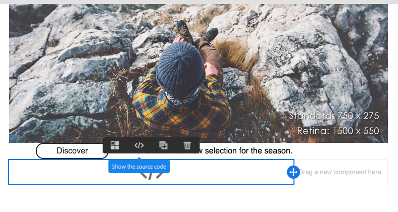

# メールデザイナーの基本を学ぶ {#quick-start}

E メールデザイナーでは、E メールを作成する 4 つの方法が用意されています。

E メールを作成できます [E メールデザイナーでの新規起動](#without-existing-content):

1. 以下が可能です。 **空白のキャンバスからの e メールの作成** これにより、構造やコンテンツのコンポーネントを簡単に追加し、コンテンツをパーソナライズして配信を迅速に送信できます。 また、スタイル要素を完全に管理することもできます。 詳しくは、 [すぐに始める](#from-scratch-email) または [完全なドキュメント](../../designing/using/designing-from-scratch.md#designing-an-email-content-from-scratch).

1. 以下が可能です。 **標準テンプレートからの e メールの作成** テンプレートを選択し、ここから新しい e メールコンテンツを作成します。 [詳細情報](#building-content-from-an-out-of-the-box-template)

また、E メールを作成することもできます [既存のコンテンツを使用](#with-existing-content):

1. 以下が可能です。 **既存のコンテンツをHTMLする** （外部または従来のエディターで作成）。 [詳細情報](#converting-an-html-content)
1. 以下が可能です。 **既存のHTML内容の読み込み** 互換モードですぐに使用できます。 [詳細情報](#compatibility-mode)

| コンテンツなし | コンテンツを使用 |
|---|---|
| [ゼロからの E メールの作成](#from-scratch-email) | [既存のHTMLコンテンツの変換](#converting-an-html-content) |
| [標準テンプレートからのコンテンツの作成](#building-content-from-an-out-of-the-box-template) | [既存のインポートHTML](#compatibility-mode) |

## エディターを使用した E メールのデザイン {#without-existing-content}

>[!NOTE]
>
>どちらの作成方法でも、E メールを送信する前に件名を入力することが重要です。 方法を学ぶ [件名を追加](#add-a-subject-line).

### ゼロからの E メールの作成 {#from-scratch-email}

E メールを簡単に作成し、コンポーネントを追加し、コンテンツをパーソナライズして、配信をすばやく送信できます。 必要に応じて、スタイル設定オプションをコンテンツに合わせて調整できます。 スタイル設定とインライン属性の管理について詳しくは、 [E メールスタイルの編集](../../designing/using/styles.md).

1. メールの作成.
1. ホームページを閉じます。

### 件名行の追加 {#add-a-subject-line}

件名は、E メールの送信時に必須です。 詳しくは、 [E メールの件名行の定義](../../designing/using/subject-line.md).

1. 次に進みます。 **[!UICONTROL Properties]** Email Designer ホームページの「 」タブ（ホームアイコンからアクセス可能）に、 **[!UICONTROL Subject]** 」セクションに入力します。

### 構造コンポーネントの追加 {#add-structure-components}

構造コンポーネントは、E メールのレイアウトを定義します。 詳しくは、 [E メールの構造の定義](../../designing/using/designing-from-scratch.md#defining-the-email-structure).

「構造」コンポーネントで、使用するレイアウトのコンポーネントをドラッグ&amp;ドロップします。

>[!NOTE]
>
>E メールに追加される様々なコンテンツレイアウトを選択できます。

### コンテンツコンポーネントの追加 {#add-content-components}

画像、テキスト、ボタンなど、複数のコンテンツコンポーネントを E メールに追加できます。 詳しくは、 [コンテンツコンポーネント](../../designing/using/designing-from-scratch.md#about-content-components).

* **画像**

   1. In **コンテンツコンポーネント**&#x200B;で、画像を構造コンポーネントの 1 つにドラッグ&amp;ドロップします。
   1. クリック **参照**.
   1. お使いのコンピューターからイメージファイルを選択します。

  

* **パーソナライゼーションを含むテキスト**

   1. In **コンテンツコンポーネント**&#x200B;を使用して、構造コンポーネントの 1 つにテキストをドラッグ&amp;ドロップします。
   1. コンポーネントをクリックし、テキストを入力します。
   1. パーソナライゼーションフィールドを追加するには、 **パーソナライゼーションフィールドを挿入** 」と入力します。
   1. 「名」など、必要なフィールドを選択します。

  

* **HTML**

   1. In **コンテンツコンポーネント**&#x200B;を使用して、HTMLを構造コンポーネントの 1 つにドラッグ&amp;ドロップします。
   1. クリック **ソースコードを表示**.
   1. HTMLの内容を入力します。
   1. 「**保存**」をクリックします。

  

  HTMLに詳しい場合は、元のフッターからHTMLコードをコピー&amp;ペーストし、 **[!UICONTROL Html]** コンテンツコンポーネント。 詳しくは、 [コンテンツコンポーネントについて](../../designing/using/designing-from-scratch.md#about-content-components).

  

### 電子メールコンポーネントのスタイル設定

電子メールのスタイル設定は、例えば、コンポーネントのパディングを変更することで調整できます。 スタイル設定とインライン属性の管理について詳しくは、 [E メールスタイルの編集](../../designing/using/styles.md).

1. をクリックします。 **テキストコンポーネント**.
1. 右側のパレットで、に移動します。 **パディング**.
1. ロックアイコンをクリックすると、上、下、右、左の各パラメータの同期が解除されます。
1. 調整 **パディング** 必要に応じて。
1. 「**保存**」をクリックします。

これで、E メールを保存して送信できます。

### 標準テンプレートからのコンテンツの作成 {#building-content-from-an-out-of-the-box-template}

お客様へのお知らせメッセージ、ニュースレター、再エンゲージメント E メールなど、標準のテンプレートから E メールを作成し、パーソナライズできます。

1. E メールを作成し、そのコンテンツを開きます。 詳しくは、 [E メールの作成](../../channels/using/creating-an-email.md).
1. ホームアイコンをクリックして、 **[!UICONTROL Email Designer]** ホームページ。
1. 次をクリック： **[!UICONTROL Templates]** タブをクリックします。
1. 標準のテンプレートをHTMLします。
様々なテンプレートは、複数のタイプの要素の様々な組み合わせを表します。 例えば、「フェザー」テンプレートには余白があり、「アストロ」テンプレートには余白がありません。 詳しくは、 [コンテンツテンプレート](../../designing/using/using-reusable-content.md#content-templates).
1. 次に進みます。 **[!UICONTROL Properties]** Email Designer ホームページの「 」タブ（ホームアイコンからアクセス可能）に、 **[!UICONTROL Subject]** 」セクションに入力します。
1. これらの要素を組み合わせて、多数の E メールのバリアントを作成できます。 例えば、構造コンポーネントを選択し、 **[!UICONTROL Duplicate]** を選択します。
1. 左側の青い矢印を使用して要素を移動し、構造コンポーネントを別のコンポーネントの下または上にドラッグできます。 詳しくは、[メール構造の編集](../../designing/using/designing-from-scratch.md#defining-the-email-structure)を参照してください。
1. また、コンポーネントを移動して、各構造要素の構成を変更することもできます。 詳しくは、[フラグメントとコンポーネントの追加](../../designing/using/designing-from-scratch.md#defining-the-email-structure)を参照してください。
1. 必要に応じて、各要素のコンテンツ（画像、テキスト、リンク）を変更します。
1. 必要に応じて、スタイル設定オプションをコンテンツに合わせます。 詳しくは、[メールスタイルの編集](../../designing/using/styles.md)を参照してください。

## 既存の E メールコンテンツの使用 {#with-existing-content}

組み合わせて複数の E メールで再利用できる、モジュール式のテンプレートとフラグメントのフレームワークを構築する場合は、E メールHTMLを E メールデザイナーテンプレートに変換することを検討してください。

### HTMLコンテンツを変換中 {#converting-an-html-content}

この使用例では、HTML電子メールを電子メールデザイナーコンポーネントにすばやく変換できます。 このトピックについて詳しくは、 [HTMLコンテンツを変換中](../../designing/using/using-existing-content.md#converting-an-html-content).

>[!CAUTION]
>
>この節は、HTMLコードに詳しいユーザー向けです。

>[!NOTE]
>
>互換モードと同様に、HTMLコンポーネントは、制限付きオプションで編集できます。インプレース編集のみ実行できます。

### HTMLE メールの読み込みと編集 {#compatibility-mode}

コンテンツをアップロードする際、電子メールデザイナーの WYSIWYG エディターに完全に準拠して編集可能にするには、特定のタグがそのコンテンツに含まれている必要があります。

既存の E メールを E メールデザイナー互換の E メールに変換する方法について詳しくは、 [この節](../../designing/using/using-existing-content.md#compatibility-mode).
