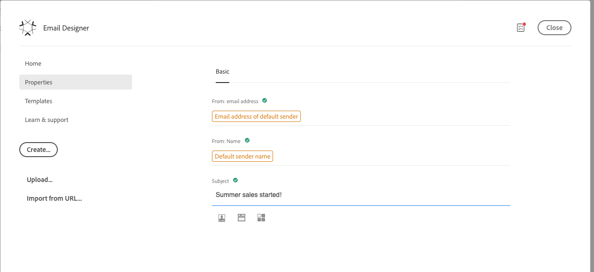
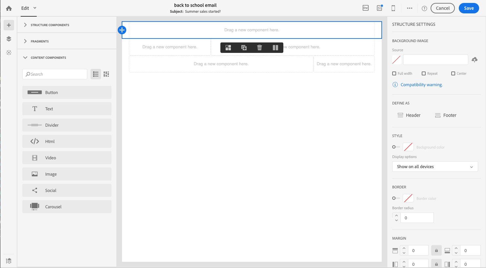
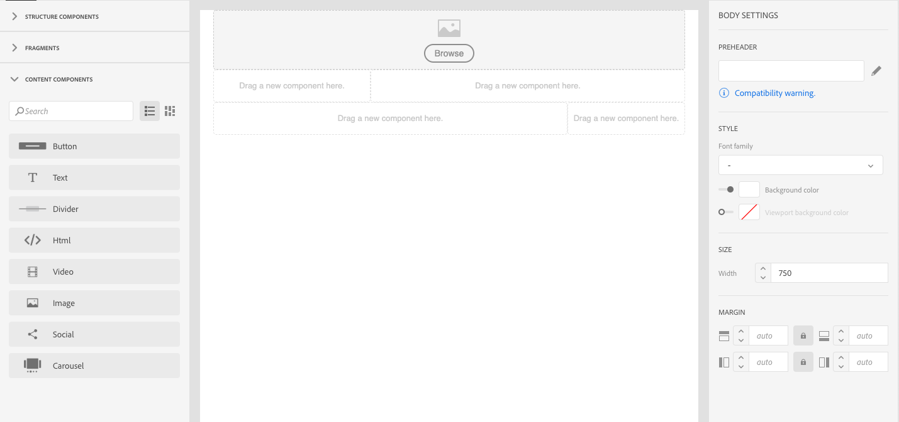
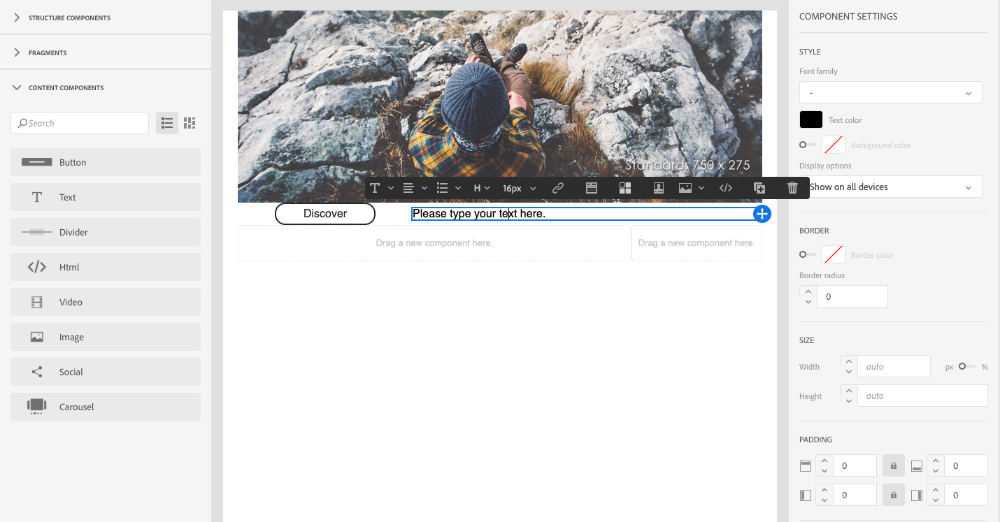
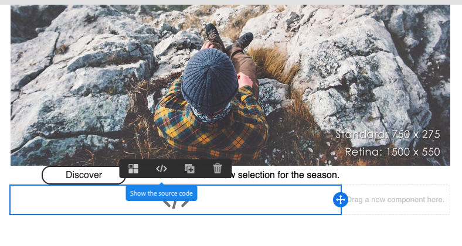
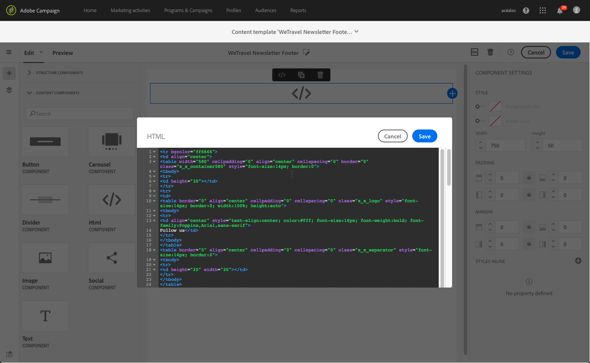
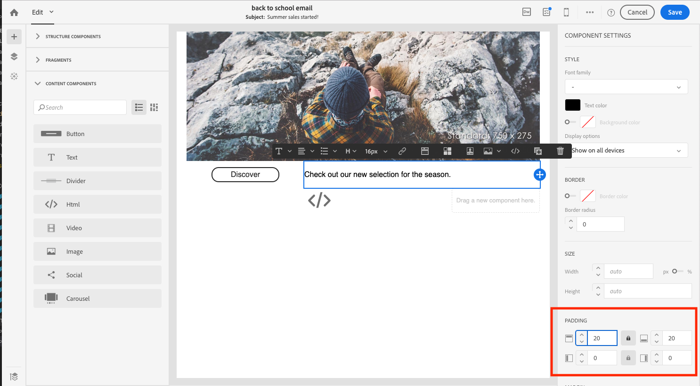

# E メールデザイナーの基本を学ぶ {#quick-start}

メールDesignerには、メールを作成する4つの方法があります。

電子メール [を電子メール Designer](#without-existing-content)で新たに作成できます。

1. 構造コンポーネントとコンテンツコンポーネントを簡単に追加し、コンテンツをパーソナライズして配信をすばやく送信することで、**空白のキャンバス**&#x200B;からメールを作成できます。 また、スタイル要素を包括的に管理することもできます。 詳しくは、[すぐに使い始める](#from-scratch-email)または[完全なドキュメント ](../../designing/using/designing-from-scratch.md#designing-an-email-content-from-scratch)を参照してください。

1. テンプレートを選択し、ここから新しいメールコンテンツを作成すると、すぐに使えるテンプレート **からメールを**&#x200B;作成できます。 [詳細情報](#building-content-from-an-out-of-the-box-template)

既存のコンテンツ ](#with-existing-content)を含むメール [を作成することもできます。

1. （外部または従来のエディターで作成された）既存のHTML コンテンツ **を**&#x200B;変換できます。 [詳細情報](#converting-an-html-content)
1. 既存のHTML コンテンツを&#x200B;**読み込むことができます**&#x200B;すぐに互換モードで。 [詳細情報](#compatibility-mode)

| コンテンツなし | コンテンツで |
|---|---|
| [ ゼロからメールを作成](#from-scratch-email) | [既存のHTML コンテンツを変換しています](#converting-an-html-content) |
| [すぐに使えるテンプレートからコンテンツを作成する](#building-content-from-an-out-of-the-box-template) | [既存のHTMLの読み込み](#compatibility-mode) |

## エディターでのメールのデザイン {#without-existing-content}

>[!NOTE]
>
>どちらも、作成戦略では、メールを送信する前に件名を埋めることが重要です。 件名を[追加する方法](#add-a-subject-line)について説明します。

### ゼロからメールを作成する {#from-scratch-email}

容易に電子メールを作成し、コンポーネントを追加して、コンテンツをパーソナライズし、すばやく配信できます。 必要に応じて、コンテンツに合わせてスタイル設定オプションを調整できます。 スタイル設定とインライン属性の管理について詳しくは、[電子メールスタイルの編集](../../designing/using/styles.md)を参照してください。

1. メールの作成。
1. ホームページを閉じます。

### 件名の追加 {#add-a-subject-line}

電子メールを送信する場合、件名は必須です。 詳しくは、[電子メールの件名の定義](../../designing/using/subject-line.md)を参照してください。

1. 電子メールDesignerのホームページ（ホームアイコンからアクセス可能）の「**[!UICONTROL Properties]**」タブに移動し、「**[!UICONTROL Subject]**」セクションに入力します。

### 構造コンポーネントの追加 {#add-structure-components}

構造コンポーネントは、メールのレイアウトを定義します。 詳しくは、[電子メールの構造の定義](../../designing/using/designing-from-scratch.md#defining-the-email-structure)を参照してください。

構造コンポーネントで、使用するレイアウトのコンポーネントをドラッグ&amp;ドロップします。

>[!NOTE]
>
>電子メールに追加する様々なコンテンツレイアウトを選択できます。

### コンテンツコンポーネントの追加 {#add-content-components}

画像、テキスト、ボタンなど、複数のコンテンツコンポーネントをメールに追加できます。 詳しくは、[ コンテンツコンポーネント ](../../designing/using/designing-from-scratch.md#about-content-components)を参照してください。

* **画像**

   1. **コンテンツコンポーネント**&#x200B;で、画像をいずれかの構造コンポーネントにドラッグ&amp;ドロップします。
   1. 「**参照**」をクリックします。
   1. コンピューターから画像ファイルを選択します。

  

* **パーソナライズ付きテキスト**

   1. **コンテンツコンポーネント**&#x200B;で、テキストをいずれかの構造コンポーネントにドラッグ&amp;ドロップします。
   1. コンポーネントをクリックし、テキストを入力します。
   1. パーソナライゼーションフィールドを追加するには、ツールバーの「**パーソナライゼーションフィールドを挿入**」をクリックします。
   1. 名など、必要なフィールドを選択します。

  

* **HTML**

   1. **コンテンツコンポーネント**&#x200B;で、HTMLをいずれかの構造コンポーネントにドラッグ&amp;ドロップします。
   1. 「**ソースコードを表示**」をクリックします。
   1. HTMLのコンテンツを入力します。
   1. 「**保存**」をクリックします。

  

  HTMLに精通している場合は、**[!UICONTROL Html]** コンテンツコンポーネントを使用して、元のフッターからHTML コードをコピー&amp;ペーストできます。 詳しくは、[ コンテンツコンポーネントについて](../../designing/using/designing-from-scratch.md#about-content-components)を参照してください。

  

### メールコンポーネントのスタイル設定

メールのスタイル設定は、コンポーネントのパディングを変更するなどして調整できます。 スタイル設定とインライン属性の管理について詳しくは、[電子メールスタイルの編集](../../designing/using/styles.md)を参照してください。

1. **テキストコンポーネント**&#x200B;をクリックします。
1. 右側のパレットで、**パディング**&#x200B;に移動します。
1. ロックアイコンをクリックして、上下または左右のパラメーター間の同期を解除します。
1. 必要に応じて&#x200B;**パディング**&#x200B;を調整します。
1. 「**保存**」をクリックします。

メールを保存して送信できるようになりました。

### すぐに使用できるテンプレートからコンテンツを作成する {#building-content-from-an-out-of-the-box-template}

顧客ウェルカムメッセージ、ニュースレター、リエンゲージメントメールなど、すぐに使えるテンプレートを利用して、電子メールを作成し、パーソナライズできます。

1. メールを作成し、そのコンテンツを開きます。 詳しくは、[電子メールの作成](../../channels/using/creating-an-email.md)を参照してください。
1. ホームアイコンをクリックして、**[!UICONTROL Email Designer]** ホームページにアクセスします。
1. 「**[!UICONTROL Templates]**」タブをクリックします。
1. HTMLテンプレート：
異なるテンプレートは、いくつかの種類の要素の様々な組み合わせを示します。 例えば、「ぼかし」テンプレートには余白があり、「アストロ」テンプレートには余白がありません。 詳しくは、[ コンテンツテンプレート ](../../designing/using/using-reusable-content.md#content-templates)を参照してください。
1. 電子メールDesignerのホームページ（ホームアイコンからアクセス可能）の「**[!UICONTROL Properties]**」タブに移動し、「**[!UICONTROL Subject]**」セクションに入力します。
1. これらの要素を組み合わせることで、さまざまなメールのバリエーションを作成できます。 例えば、構造コンポーネントを選択し、コンテキストツールバーから「**[!UICONTROL Duplicate]**」をクリックすることで、メールセクションを複製できます。
1. 左側の青い矢印を使用してエレメントを移動し、構造コンポーネントを他のコンポーネントの下または上にドラッグできます。 詳しくは、[メール構造の編集](../../designing/using/designing-from-scratch.md#defining-the-email-structure)を参照してください。
1. また、コンポーネントを移動して、各構造要素の組織を変更することもできます。 詳しくは、[フラグメントとコンポーネントの追加](../../designing/using/designing-from-scratch.md#defining-the-email-structure)を参照してください。
1. 画像、テキスト、リンクなど、ニーズに応じて各要素のコンテンツを変更します。
1. 必要に応じて、コンテンツにスタイル設定オプションを合わせます。 詳しくは、[メールスタイルの編集](../../designing/using/styles.md)を参照してください。

## 既存のメールコンテンツの使用 {#with-existing-content}

複数の電子メールで再利用できるように、モジュール形式のテンプレートとフラグメントを組み合わせて使用するフレームワークを構築する場合は、電子メールのHTMLを電子メールのDesigner テンプレートに変換することを検討してください。

### HTML コンテンツの変換 {#converting-an-html-content}

このユースケースでは、HTMLの電子メールをDesignerの電子メールコンポーネントに素早く変換する方法を提供します。 このトピックについて詳しくは、[HTML コンテンツの変換](../../designing/using/using-existing-content.md#converting-an-html-content)を参照してください。

>[!CAUTION]
>
>この節は、HTML コードに精通しているユーザー向けです。

>[!NOTE]
>
>互換モードと同様に、HTML コンポーネントは限られたオプションで編集可能です。インプレースエディションのみ実行できます。

### HTML電子メールの読み込みと編集 {#compatibility-mode}

コンテンツをアップロードする場合、電子メールDesignerのWYSIWYG エディターで完全に準拠し、編集可能な特定のタグが含まれている必要があります。

既存の電子メールをEmail Designer互換の電子メールに変換する方法について詳しくは、[この節](../../designing/using/using-existing-content.md#compatibility-mode)を参照してください。
