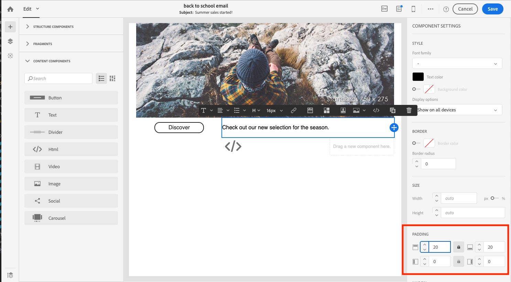

# 電子メールデザイナーの基本を学ぶ {#quick-start}

Eメールデザイナーには、Eメールを作成する4つの方法が用意されています。

Eメールデザイナー](#without-existing-content)で、新規に開始するEメール[を作成できます。

1. 空のキャンバス&#x200B;**からEメールを**&#x200B;作成するには、構造やコンテンツコンポーネントを簡単に追加し、コンテンツをパーソナライズして配信をすばやく送信します。 また、スタイル要素を完全に管理することもできます。 詳しくは、[すばやく開始する](#from-scratch-email)か、[完全なドキュメント](../../designing/using/designing-from-scratch.md#designing-an-email-content-from-scratch)を参照してください。

1. テンプレートを選択し、ここから新しいEメールコンテンツを作成することで、**標準のテンプレート**&#x200B;からEメールを作成できます。 [詳細情報](#building-content-from-an-out-of-the-box-template)

既存のコンテンツ](#with-existing-content)を使用して電子メール[を作成することもできます。

1. 既存のHTMLコンテンツ&#x200B;**は、（外部で作成した、またはレガシーエディターで作成した）**&#x200B;変換できます。 [詳細情報](#converting-an-html-content)
1. 互換性モードで、既存のHTMLコンテンツ&#x200B;**を**&#x200B;すぐにインポートできます。 [詳細情報](#compatibility-mode)

| コンテンツなし | コンテンツを使用 |
|---|---|
| [ゼロからのEメールの作成](#from-scratch-email) | [既存のHTMLコンテンツの変換](#converting-an-html-content) |
| [標準テンプレートからのコンテンツの作成](#building-content-from-an-out-of-the-box-template) | [既存のHTMLのインポート](#compatibility-mode) |

## エディターを使用したEメールのデザイン {#without-existing-content}

>[!NOTE]
>
>どちらの作成方法でも、Eメールを送信する前に件名を入力することが重要です。 [件名行](#add-a-subject-line)を追加する方法を説明します。

### ゼロからのEメールの作成 {#from-scratch-email}

Eメールを簡単に作成し、コンポーネントを追加し、コンテンツをパーソナライズして、配信をすばやく送信できます。 必要に応じて、スタイル設定オプションをコンテンツに合わせることができます。 スタイル設定とインライン属性の管理について詳しくは、[電子メールスタイルの編集](../../designing/using/styles.md)を参照してください。

1. メールの作成.
1. ホームページを閉じます。

### 件名行の追加 {#add-a-subject-line}

件名行は、Eメールの送信時に必須です。 詳しくは、[Eメールの件名行の定義](../../designing/using/subject-line.md)を参照してください。

1. Eメールデザイナーホームページの「**[!UICONTROL Properties]**」タブ（ホームアイコンからアクセス可能）に移動し、「**[!UICONTROL Subject]**」セクションに入力します。

### 構造コンポーネントの追加 {#add-structure-components}

構造コンポーネントは、Eメールのレイアウトを定義します。 詳しくは、[Eメールの構造の定義](../../designing/using/designing-from-scratch.md#defining-the-email-structure)を参照してください。

構造コンポーネントで、使用するレイアウトのコンポーネントをドラッグ&amp;ドロップします。

>[!NOTE]
>
>Eメールに追加する様々なコンテンツレイアウトを選択できます。

### コンテンツコンポーネントの追加 {#add-content-components}

画像、テキスト、ボタンなど、複数のコンテンツコンポーネントをEメールに追加できます。 詳しくは、[コンテンツコンポーネント](../../designing/using/designing-from-scratch.md#about-content-components)を参照してください。

* **画像**

   1. **コンテンツコンポーネント**&#x200B;で、画像を構造コンポーネントの1つにドラッグ&amp;ドロップします。
   1. 「**参照**」をクリックします。
   1. コンピュータからイメージファイルを選択します。

   

* **パーソナライゼーションを含むテキスト**

   1. **コンテンツコンポーネント**&#x200B;で、テキストを構造コンポーネントの1つにドラッグ&amp;ドロップします。
   1. コンポーネントをクリックし、テキストを入力します。
   1. パーソナライゼーションフィールドを追加するには、ツールバーの「**パーソナライゼーションフィールドを挿入**」をクリックします。
   1. 「名」など、必要なフィールドを選択します。

   

* **HTML**

   1. **コンテンツコンポーネント**&#x200B;で、HTMLを構造コンポーネントの1つにドラッグ&amp;ドロップします。
   1. 「**ソースコードを表示**」をクリックします。
   1. HTMLコンテンツを入力します。
   1. 「**保存**」をクリックします。

   

   HTMLに詳しい場合は、**[!UICONTROL Html]**&#x200B;コンテンツコンポーネントを使用して、元のフッターからHTMLコードをコピー&amp;ペーストできます。 詳しくは、[コンテンツコンポーネントについて](../../designing/using/designing-from-scratch.md#about-content-components)を参照してください。

   

### 電子メールコンポーネントのスタイル設定

例えば、コンポーネントのパディングを変更して、Eメールのスタイルを調整できます。 スタイル設定とインライン属性の管理について詳しくは、[電子メールスタイルの編集](../../designing/using/styles.md)を参照してください。

1. **テキストコンポーネント**&#x200B;をクリックします。
1. 右側のパレットで、**パディング**&#x200B;に移動します。
1. ロックアイコンをクリックすると、上と下、右、左の各パラメータの同期が解除されます。
1. 必要に応じて&#x200B;**パディング**&#x200B;を調整します。
1. 「**保存**」をクリックします。

これで、Eメールを保存して送信できます。

### 標準テンプレートからのコンテンツの作成 {#building-content-from-an-out-of-the-box-template}

お客様へようこそメッセージ、ニュースレター、再エンゲージメントEメールなど、標準のテンプレートからEメールを作成し、パーソナライズできます。

1. Eメールを作成し、その内容を開きます。 詳しくは、[Eメールの作成](../../channels/using/creating-an-email.md)を参照してください。
1. ホームアイコンをクリックして、**[!UICONTROL Email Designer]**&#x200B;ホームページにアクセスします。
1. 「**[!UICONTROL Templates]**」タブをクリックします。
1. 標準のHTMLテンプレートを選択します。
様々なテンプレートは、複数のタイプの要素の様々な組み合わせを表します。 例えば、「羽」テンプレートには余白があり、「鉄」テンプレートには余白がない。 詳しくは、[コンテンツテンプレート](../../designing/using/using-reusable-content.md#content-templates)を参照してください。
1. Eメールデザイナーホームページの「**[!UICONTROL Properties]**」タブ（ホームアイコンからアクセス可能）に移動し、「**[!UICONTROL Subject]**」セクションに入力します。
1. これらの要素を組み合わせて、多数のEメールのバリエーションを作成できます。 例えば、構造コンポーネントを選択してコンテキストツールバーの「**[!UICONTROL Duplicate]**」をクリックすると、Eメールセクションを複製できます。
1. 左側の青い矢印を使用して要素を移動し、構造コンポーネントを別のコンポーネントの下または上にドラッグできます。 詳しくは、[メール構造の編集](../../designing/using/designing-from-scratch.md#defining-the-email-structure)を参照してください。
1. また、コンポーネントを移動して、各構造要素の構成を変更することもできます。 詳しくは、[フラグメントとコンポーネントの追加](../../designing/using/designing-from-scratch.md#defining-the-email-structure)を参照してください。
1. 必要に応じて、各要素のコンテンツを変更します。画像、テキスト、リンク。
1. 必要に応じて、スタイル設定オプションをコンテンツに合わせます。 詳しくは、[メールスタイルの編集](../../designing/using/styles.md)を参照してください。

## 既存のEメールコンテンツの使用 {#with-existing-content}

複数のEメールで再利用するために組み合わせ可能な、モジュール化されたテンプレートとフラグメントのフレームワークを構築する場合は、EメールのHTMLをEメールデザイナーテンプレートに変換することを検討してください。

### HTMLコンテンツの変換 {#converting-an-html-content}

この使用例では、HTML電子メールをEメールデザイナーコンポーネントにすばやく変換できます。 このトピックについて詳しくは、[HTMLコンテンツの変換](../../designing/using/using-existing-content.md#converting-an-html-content)を参照してください。

>[!CAUTION]
>
>この節は、HTMLコードに詳しいユーザー向けです。

>[!NOTE]
>
>互換モードと同様に、HTMLコンポーネントは制限付きオプションで編集できます。インプレース編集のみ実行できます。

### HTML電子メールの読み込みと編集 {#compatibility-mode}

コンテンツをアップロードする際には、EメールデザイナーのWYSIWYGエディターに完全に準拠し、編集可能な特定のタグがそのコンテンツに含まれている必要があります。

既存のEメールをEメールデザイナー互換のEメールに変換する方法について詳しくは、[この節](../../designing/using/using-existing-content.md#compatibility-mode)を参照してください。
