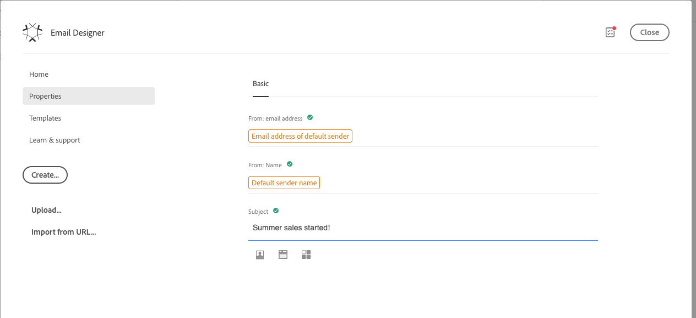

# クイックスタート電子メールコンテンツデザイン{#quick-start}

電子メールデザイナは、4つの方法で電子メールを作成します。

新規に開始する電子メールを作成できます。

* 空のキャンバスから電子メールを作成するには、構造やコンテンツコンポーネントを簡単に追加し、コンテンツをカスタマイズして配信を迅速に送信します。 また、スタイル要素を完全に管理することもできます。 詳細については、すぐに [始めるか](../../designing/using/quick-start.md#from-scratch-email) 、完全なドキュメントを [参照してください](../../designing/using/designing-from-scratch.md#designing-an-email-content-from-scratch)。

* テンプレートを選択し、ここから新しい電子メールコンテンツを作成すると、標準のテンプレートから電子メールを作成できます。 [詳細](../../designing/using/quick-start.md#building-content-from-an-out-of-the-box-template)

また、既存のコンテンツを含む電子メールを作成することもできます。

* 既存のHTMLコンテンツを（外部またはレガシーエディタで作成）変換できます。 [詳細](../../designing/using/quick-start.md#converting-an-html-content)
* 互換モードで、既存のHTMLコンテンツを直ちに読み込むことができます。 [詳細](../../designing/using/quick-start.md#compatibility-mode)

## 既存のコンテンツなし {#without-existing-content}

### 最初から電子メールを作成する {#from-scratch-email}

電子メールの作成、コンポーネントの追加、コンテンツのカスタマイズを簡単に行い、配信を迅速に送信できます。 必要に応じて、スタイル設定オプションをコンテンツに合わせることができます。 スタイル設定とインライン属性の管理の詳細については、「電子メールスタイルを編 [集する」を参照してくださ](../../designing/using/styles.md)い。

### 件名行の追加 {#add-a-subject-line}

電子メールを送信する場合、件名行は必須です。 詳細については、「電子メ [ールの件名行の定義」を参照してください](../../designing/using/subject-line.md)。

1. 電子メールを作成します。
1. ホームページを閉じます。
1. 電子メール·デ **[!UICONTROL Properties]** ザイナのホームページのタブ（ホーム·アイコンからアクセス可能）に移動し、セクションに入力 **[!UICONTROL Subject]** します。



### 構造コンポーネントの追加 {#add-structure-components}

構造コンポーネントは、電子メールのレイアウトを定義します。 詳細については、「電子メ [ールの構造の定義」を参照してください](../../designing/using/designing-from-scratch.md#defining-the-email-structure)。

Structureコンポーネントで、使用するレイアウトのコンポーネントをドラッグ&amp;ドロップします。

>[!NOTE]
>
>電子メールに追加する別のコンテンツレイアウトを選択できます。


### コンテンツコンポーネントの追加 {#add-content-components}

画像、テキスト、ボタンなど、複数のコンテンツコンポーネントを電子メールに追加できます。 詳細は、「コンテンツコンポーネント」 [を参照してくださ](../../designing/using/designing-from-scratch.md#about-content-components)い。

* 画像

1. [コンテ **ンツコンポーネント**]で、イメージを構造コンポーネントの1つにドラッグ&amp;ドロップします。
1. [参照]をク **リックします**。
1. コンピュータからイメージファイルを選択します。


* 個人用設定を含むテキスト

1. [コンテ **ンツコンポーネント**]で、文字を構造コンポーネントの1つにドラッグ&amp;ドロップします。
1. コンポーネントをクリックし、テキストを入力します。
1. 個人用設定フィールドを追加するには、ツールバーの[個人用設 **定フィールドの挿入** ]をクリックします。
1. [名]など、必要なフィールドを選択します。


* HTML

1. 「≪コンテ **ンツ·コンポーネント**|Content Components|marvel≫」で、HTMLを構造コンポーネントの1つにドラッグ·アンド·ドロップします。
1. [ソース **コードを表示する]をクリックします**。
1. HTMLコンテンツを入力します。
1. [保存]をク **リックします**。


HTMLに詳しい場合は、コンテンツコンポーネントを使用して、元のフッターからHTMLコードをコピー&amp;ペースト **[!UICONTROL Html]** できます。 詳細については、「コンテンツコンポーネントにつ [いて」を参照してくださ](../../designing/using/designing-from-scratch.md#about-content-components)い。


### 電子メールコンポーネントのスタイル設定

たとえば、コンポーネントのパディングを変更することで、電子メールのスタイルを調整できます。 スタイル設定とインライン属性の管理の詳細については、「電子メールスタイルを編 [集する」を参照してくださ](../../designing/using/styles.md)い。

1. 「テキスト」コンポーネ **ントをクリックします**。
1. 右側のパレットで、[パディング]に移動し **ます**。
1. ロックアイコンをクリックして、上下または左右のパラメータ間の同期を解除します。
1. 必要に応 **じて** 、[パディング]を調整します。
1. [保存]をク **リックします**。


メールを保存して送信できます。

### 既存のテンプレートからコンテンツを作成する {#building-content-from-an-out-of-the-box-template}

お客様のようこそ、ニュースレター、再契約の電子メールなど、すぐに使えるテンプレートから電子メールを作成し、カスタマイズできます。

1. 電子メールを作成し、その内容を開きます。 詳細については、「電子メールを作 [成する」を参照してください](../../channels/using/creating-an-email.md)。
1. ホーム·アイコンをクリックして、ホーム·ページに **[!UICONTROL Email Designer]** アクセスします。
1. タブをクリック **[!UICONTROL Templates]** します。
1. 標準のHTMLテンプレートを選択します。
異なるテンプレートは、複数のタイプの要素のさまざまな組み合わせを表します。 たとえば、「フェザー」テンプレートには余白があり、「アストロ」テンプレートには余白がありません。 詳細については、「コンテンツテンプレート」を [参照してください](../../designing/using/using-reusable-content.md#content-templates)。
1. 電子メール·デ **[!UICONTROL Properties]** ザイナのホームページのタブ（ホーム·アイコンからアクセス可能）に移動し、セクションに入力 **[!UICONTROL Subject]** します。
1. これらの要素を組み合わせて、多くの電子メールバリアントを作成できます。 たとえば、構造コンポーネントを選択し、コンテキストツールバーからをクリックすると、電子メール **[!UICONTROL Duplicate]** セクションを複製できます。
1. 左側の青い矢印を使用して要素を移動し、別の構造コンポーネントの下または上にドラッグできます。 詳細については、「電子メール構 [造の編集」を参照してください](../../designing/using/designing-from-scratch.md#defining-the-email-structure)。
1. また、各構造要素の構成を変更するために、コンポーネントを移動することもできます。 詳細については、「フラグメントとコンポーネ [ントを追加する」を参照してくださ](../../designing/using/designing-from-scratch.md#defining-the-email-structure)い。
1. 必要に応じて、各要素の内容を変更します。画像、テキスト、リンク
1. 必要に応じて、スタイル設定オプションをコンテンツに合わせます。 詳細については、「電子メールのスタイルを編 [集する」を参照してくださ](../../designing/using/styles.md)い。

## 既存のコンテンツを使用 {#with-existing-content}

複数の電子メールで再利用できるモジュラー型テンプレートとフラグメントのフレームワークを構築する場合は、電子メールHTMLを電子メールデザイナテンプレートに変換することを検討する必要があります。

### HTMLコンテンツの変換 {#converting-an-html-content}

この使用例では、HTML電子メールを電子メールデザイナのコンポーネントに変換する簡単な方法を提供します。

>[!CAUTION]
>
>このセクションは、HTMLコードに詳しいユーザー向けです。

>[!NOTE]
>
>互換モードと同様に、HTMLコンポーネントは次の制限されたオプションで編集可能です。インプレイスエディションのみ実行できます。

電子メールデザイナの外部で、元のHTMLが再利用可能なセクションに分割されていることを確認します。

1. 電子メールデザイナを開いて、空の電子メールコンテンツを作成します。
1. ボディレベルの属性を設定します。背景色、幅など 詳細については、「電子メールのスタイルを編 [集する」を参照してくださ](../../designing/using/styles.md)い。

そうでない場合は、HTMLとは異なるブロックを切り離します。 たとえば、次のセクションは明確に識別されます。

```
<!-- 3 COLUMN w/CTA (SCALED) -->
<table width="100%" align="center" cellspacing="0" cellpadding="0" border="0" role="presentation" style="max-width:680px;">
<tbody>
<tr>
<td class="padh10" align="center" valign="top" style="padding:0 5px 20px 5px;">
<table width="100%" cellspacing="0" cellpadding="0" border="0" role="presentation">
<tbody>
<tr>
...
</tr>
</tbody>
</table>
</td>
</tr>
</tbody>
</table>
<!-- //3 COLUMN w/CTA (SCALED) -->
```

すべてのブロックを識別したら、電子メールデザイナで、既存の電子メールの各セクションに対して次の手順を繰り返します。

1. 構造コンポーネントを追加します。 詳細については、「電子メール構 [造の編集」を参照してください](../../designing/using/designing-from-scratch.md#defining-the-email-structure)。
1. HTMLコンポーネントを追加します。 詳細については、「フラグメントとコンポーネ [ントを追加する」を参照してくださ](../../designing/using/designing-from-scratch.md#defining-the-email-structure)い。
1. HTMLをそのコンポーネントにコピー&amp;ペーストします。
1. モバイルビューに切り替えます。 詳細は、この節を参照して [ください](../../designing/using/styles.md#switching-to-mobile-view)。

   CSSが見つからないため、応答ビューが壊れています。

1. これを修正するには、ソースコードモードに切り替え、スタイルセクションを新しいスタイルセクションにコピー&amp;ペーストします。  例：

   ```
   <style type="text/css">
   a {text-decoration:none;}
   body {min-width:100% !important; margin:0 auto !important; padding:0 !important;}
   img {line-height:100%; text-decoration:none; -ms-interpolation-mode:bicubic;}
   ...
   </style>
   ```

   >[!NOTE]
   >
   >この後に、別のカスタムスタイルタグでスタイルを追加してください。
   >
   >電子メールデザイナで生成されたCSSを変更しないでください。
   >
   >* `<style data-name="default" type="text/css">(##)</style>`
   >* `<style data-name="supportIOS10" type="text/css">(##)</style>`
   >* `<style data-name="mediaIOS8" type="text/css">(##)</style>`
   >* `<style data-name="media-default-max-width-500px" type="text/css">(##)</style>`
   >* `<style data-name="media-default--webkit-min-device-pixel-ratio-0" type="text/css">(##)</style>`


1. モバイルビューに戻り、コンテンツが正しく表示されているか確認し、変更を保存します。

### HTML電子メールのインポートと編集 {#compatibility-mode}

コンテンツをアップロードする場合、電子メールデザイナのWYSIWYGエディタで完全に準拠し、編集可能な特定のタグ付けを含める必要があります。

アップロードされたHTMLのすべてまたは一部が、必要なタグ付けに準拠していない場合、コンテンツは'互換モード'で読み込まれ、UIを通じての編集の可能性が制限されます。

互換モードでコンテンツをロードした場合でも、インタフェースを介して次の変更を実行できます（使用できないアクションは非表示になります）。

* テキストの変更、またはイメージの変更
* リンクと個人用設定フィールドの挿入
* 選択したHTMLブロックのスタイルオプションを編集します
* 条件付きコンテンツの定義


新しいセクションを電子メールに追加したり、高度なスタイル設定を行ったりする他の変更は、HTMLモードを使用して電子メールのソースコードで直接行う必要があります。
互換性モードでは、ドラッグ&amp;ドロップは使用できませんが、従来のエディタと同じ機能セットが保証されます。

既存の電子メールを電子メールデザイナー互換の電子メールに変換する方法の詳細については、この節を参照 [してください](../../designing/using/using-existing-content.md)。
