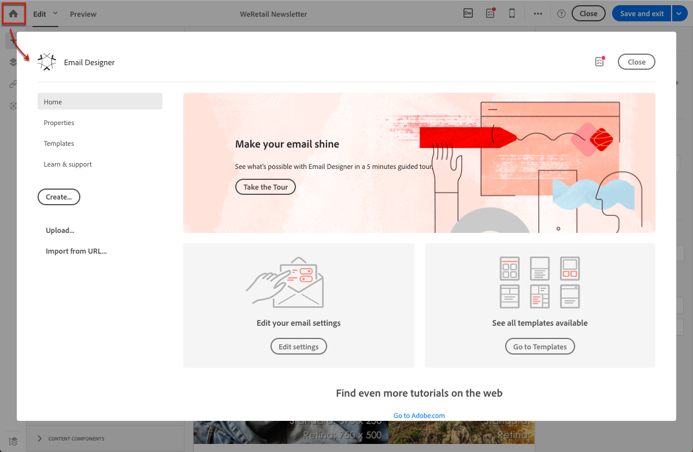

# Selecting an existing content{#selecting-an-existing-content}

Adobe Campaignには、事前に定義されたコンテンツのセットが付属しており、開始するのに役立ちます。これらのいずれかを使用することも、送信する必要のあるメッセージのコンテンツがAdobe Campaign以外で準備されている場合は、コンピュータまたはURLから読み込むこともできます。

電子メールまたはランディングページを作成するときに、別のソースから既存のコンテンツを読み込むことができます。

>[!NOTE]
>
>The images below show how to load an existing content using the [Email Designer](../../designing/using/about-email-content-design.md#about-the-email-designer).

1. 電子メールまたはランディングページを作成した後、そのコンテンツを開きます。
1. Click the home icon to access the **[!UICONTROL Email Designer]** home page.

   

1. 読み込むコンテンツのソースを選択します。

   * [コンテンツテンプレート](../../start/using/about-templates.md#content-templates):タブをクリック **[!UICONTROL Templates]** します。
   * [新規にコンテンツを開始するには、](../../designing/using/about-email-content-design.md#designing-an-email-content-from-scratch)次のようにします。 **[!UICONTROL Create]** ボタンをクリックします。
   * [コンピュータ上のZIPまたはHTMLファイルとしてのコンテンツ](../../designing/using/importing-content-from-a-file.md): **[!UICONTROL Upload]** ボタンをクリックします。
   * [既存のURLのコンテンツ](../../designing/using/importing-content-from-a-url.md) （電子メールの場合のみ）: **[!UICONTROL Import from URL]** ボタンをクリックします。
   

1. コンテンツを読み込みます。選択したコンテンツが現在のコンテンツに置き換えられます。

   読み込みが完了すると、コンテンツを編集しパーソナライズすることができます。

   >[!NOTE]
   >
   >[電子メールDesigner](../../designing/using/about-email-content-design.md#about-the-email-designer) では、特定のタグ付けが使用されます。キャンペーンにアップロードされる標準のHTMLコンテンツは、電子メールデザイナーから完全に互換性があり、編集可能なタグと一致する必要があります。If not matching, your content is uploaded in [compatibility mode](../../designing/using/about-email-content-design.md#email-designer-compatibility-mode). To make existing contents compatible, see [this section](../../designing/using/editing-existing-contents-with-the-email-designer.md).

**関連トピック:**

* [電子メールの作成](../../channels/using/creating-an-email.md)
* [ランディングページの管理](../../channels/using/about-landing-pages.md)

