# メールスタイルの管理 {#managing-styles}

電子メール Designerでは、エレメントを選択すると、選択したコンテンツの種類に固有のいくつかのオプションが&#x200B;**[!UICONTROL Settings]** ペインに表示されます。 これらのオプションを使用すると、メールのスタイルを簡単に変更できます。

## 要素の選択 {#selecting-an-element}

電子メールDesigner インターフェイスでエレメントを選択するには、次のいずれかを実行します。

* メールを直接クリックし，
* または、左側の&#x200B;**パレット**&#x200B;にあるオプションから使用可能な構造ツリーを参照します。

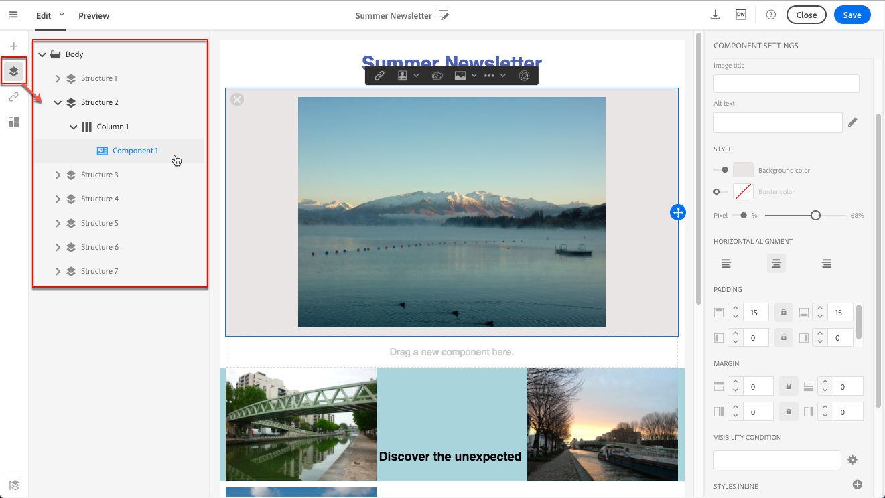

構造ツリーを参照すると、より正確に選択できます。 次のいずれかを選択できます。

* 構造全体の要素です，
* 構造コンポーネントを構成する列の1つ，
* または列内にあるコンポーネントのみです。

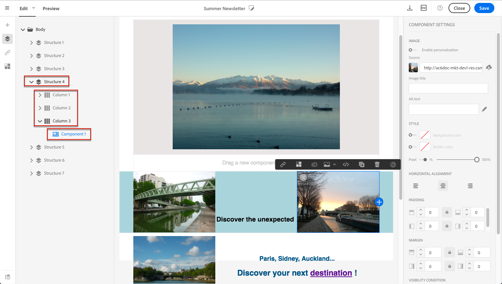

列を選択するには、次の操作も実行できます。

1. 構造コンポーネントを選択します（メール内で直接、または左側の&#x200B;**パレット**&#x200B;から利用できる構造ツリーを使用）。
1. **コンテキストツールバー**&#x200B;から、**[!UICONTROL Select a column]**&#x200B;をクリックして、目的の列を選択します。

[このセクション &#x200B;](#example--adjusting-vertical-alignment-and-padding)の例を参照してください。

## スタイル設定の調整 {#adjusting-style-settings}

1. メール内の要素を選択します。 詳しくは、[要素の選択](#selecting-an-element)を参照してください。
1. 必要に応じて設定を調整します。 選択した各要素には、異なる設定セットが用意されています。

   背景の挿入、サイズの変更、水平方向または垂直方向の整列の変更、カラーの管理、[&#x200B; パディングまたはマージン &#x200B;](#selecting-an-element)の追加などを行うことができます。

   これを行うには、**[!UICONTROL Settings]** ペインに表示されるオプションを使用するか、[&#x200B; インラインスタイル属性を追加](#adding-inline-styling-attributes)します。

   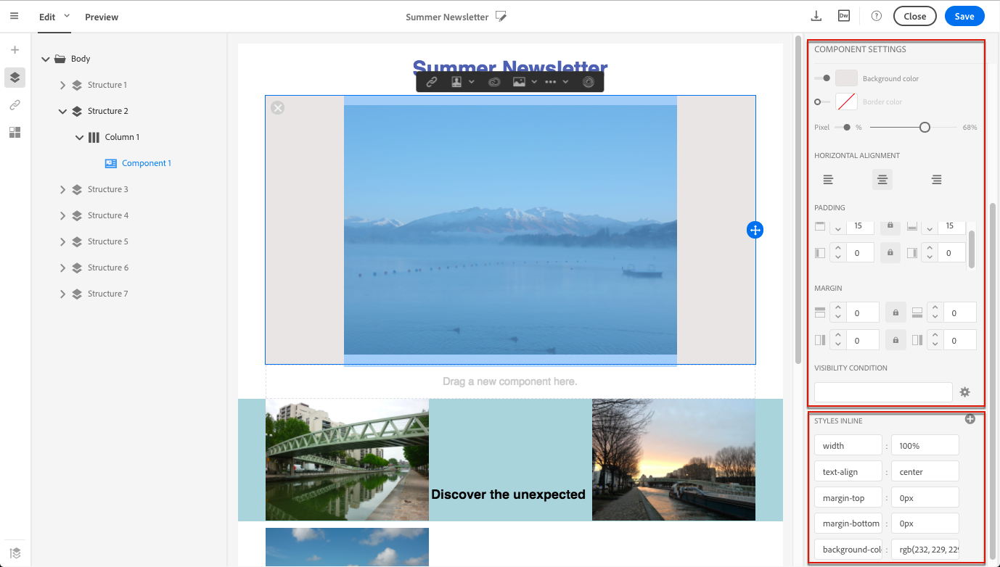

1. コンテンツを保存します。

## パディングと余白の調整 {#about-padding-and-margin}

メールDesignerのインターフェイスでは、パディングとマージンの設定をすばやく調整できます。

**[!UICONTROL Padding]**：この設定を使用すると、要素の境界線内にあるスペースを管理できます。

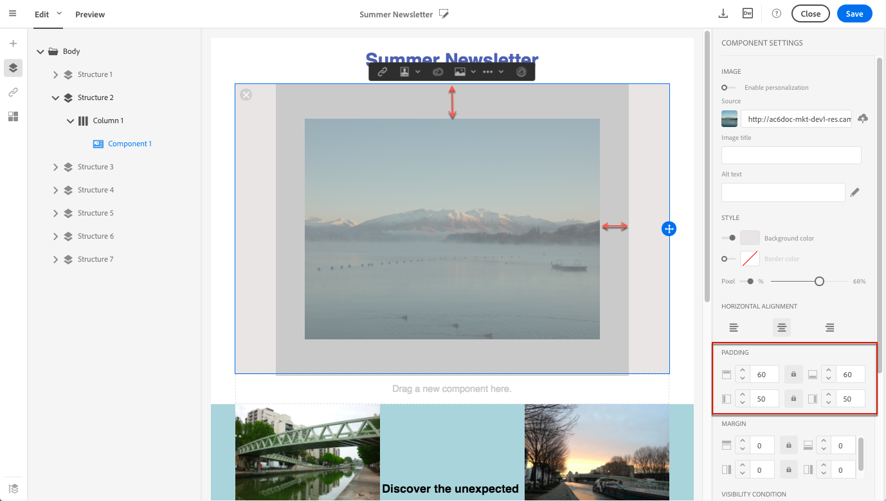

例：

* パディングを使用して、画像の左右の余白を設定します。
* 上下のパディングを使用して、**[!UICONTROL Text]**&#x200B;または&#x200B;**[!UICONTROL Divider]** コンポーネントにさらに間隔を追加します。
* 構造要素内の列間に境界線を設定するには、各列にパディングを定義します。

**[!UICONTROL Margin]**：この設定を使用すると、要素の境界線と次の要素の間のスペースを管理できます。

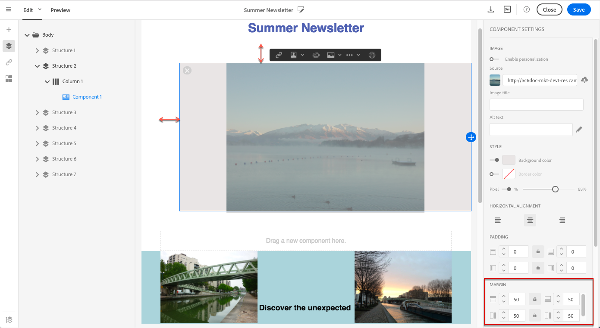

>[!NOTE]
>
>選択（構造コンポーネント、列またはコンテンツコンポーネント）に応じて、結果は異なります。 Adobeでは、列レベルで&#x200B;**[!UICONTROL Padding]**&#x200B;および&#x200B;**[!UICONTROL Margin]** パラメーターを設定することをお勧めします。

**[!UICONTROL Padding]**&#x200B;と&#x200B;**[!UICONTROL Margin]**&#x200B;の両方で、ロックアイコンをクリックして、上下または左右のパラメーター間の同期を解除します。 これにより、各パラメーターを個別に調整できます。

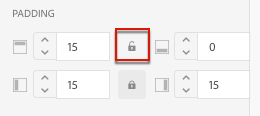

## スタイルの整列 {#about-alignment}

* **テキストの整列**：一部のテキストにマウスのカーソルを置き、コンテキストツールバーを使用して整列します。

  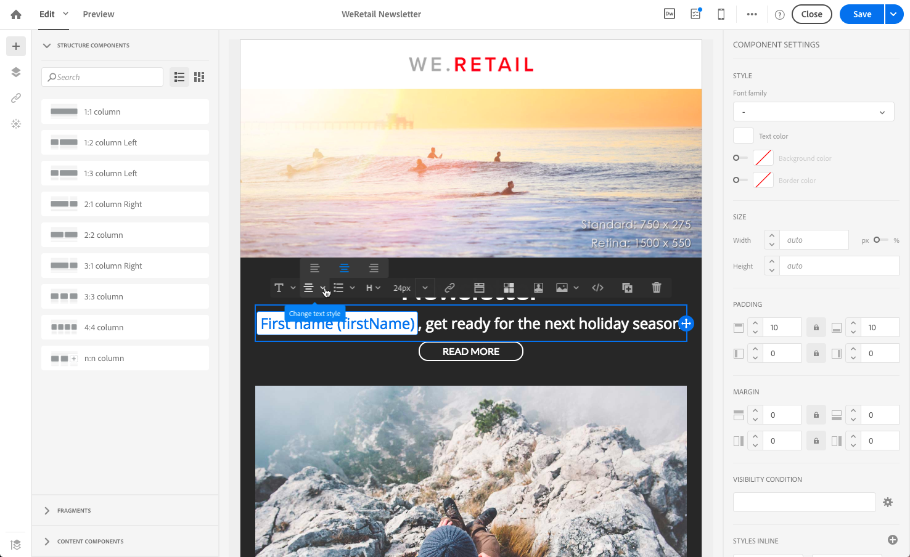

* **水平方向の整列**&#x200B;は、テキスト、画像、ボタンに適用できます。現在、**[!UICONTROL Divider]**&#x200B;および&#x200B;**[!UICONTROL Social]** コンポーネントには適用できません。

  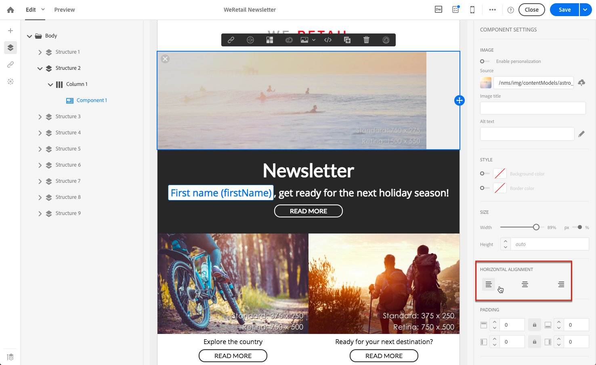

* **垂直方向の整列**&#x200B;を設定するには、構造コンポーネント内の列を選択し、設定ペインからオプションを選択します。

  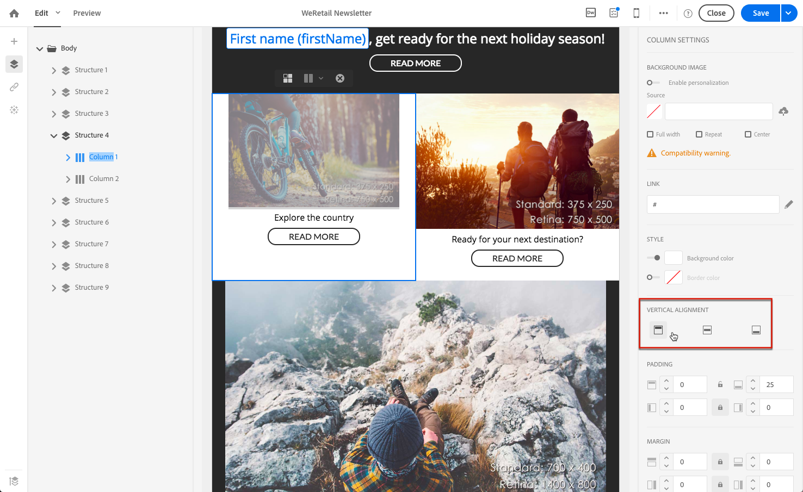

## 背景の設定 {#about-backgrounds}

>[!CONTEXTUALHELP]
>id="ac_edition_backgroundimage"
>title="背景設定"
>abstract="メールDesignerでは、コンテンツの背景色または背景画像をパーソナライズできます。背景画像は、すべてのメールクライアントでサポートされているわけではありません。"

E メールデザイナーで背景を設定する際の推奨事項は次のとおりです。

1. デザインで必要な場合は、メールの本文に背景色を適用します。
1. 多くの場合、背景色は列レベルで設定します。
1. 画像やテキストコンポーネントは管理が困難であるため、背景色を使用しないようにしてください。

使用可能な背景設定を次に示します。

* メール全体に&#x200B;**[!UICONTROL Background color]**&#x200B;を設定します。 左側のパレットからアクセス可能なナビゲーションツリーで、本文の設定を必ず選択してください。

  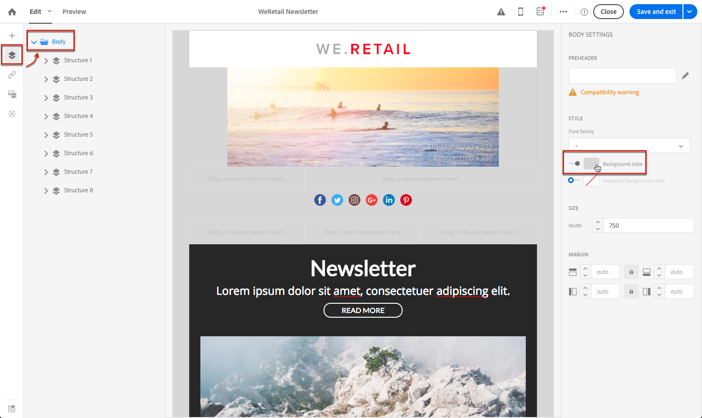

* **[!UICONTROL Viewport background color]**&#x200B;を選択して、すべての構造コンポーネントに同じ背景色を設定します。 このオプションを使用すると、背景色から別の設定を選択できます。

  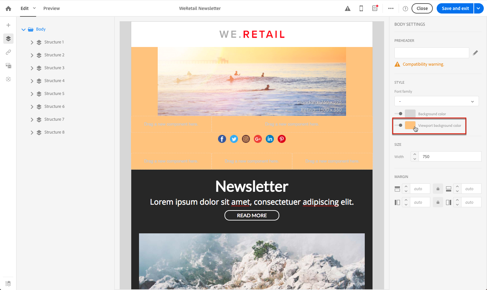

* 構造コンポーネントごとに異なる背景色を設定します。 左側のパレットからアクセス可能なナビゲーションツリーで構造を選択し、その構造にのみ特定の背景色を適用します。

  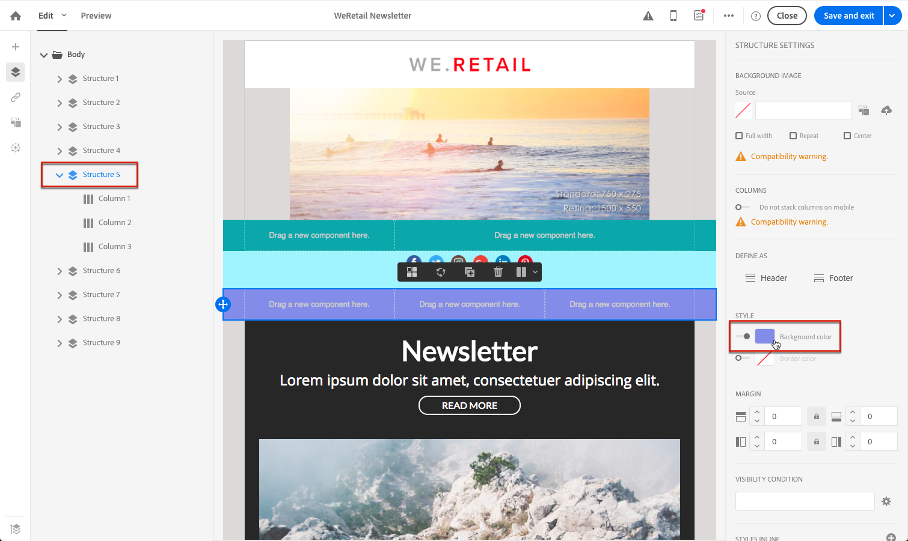

  構造の背景色が隠れてしまう場合があるので、ビューポートの背景色を設定しないでください。

* 構造コンポーネントのコンテンツに&#x200B;**[!UICONTROL Background image]**&#x200B;を設定します。

  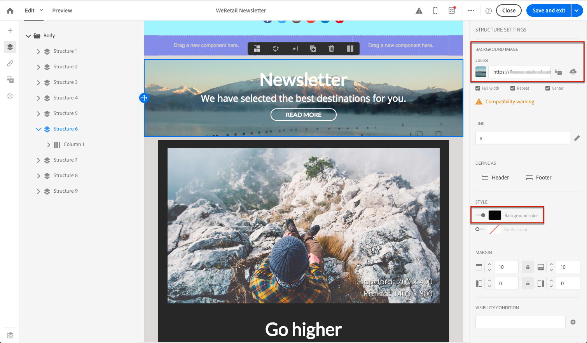

  >[!NOTE]
  >
  >一部のメールプログラムでは、背景画像はサポートされていません。 サポートされていない場合は、代わりに行の背景色が使用されます。 画像を表示できない場合は、必ず適切なフォールバックの背景色を選択してください。

* 列レベルで背景色を設定します。

  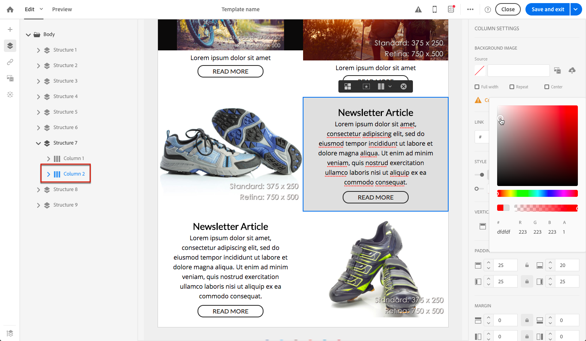

  >[!NOTE]
  >
  >これは最も一般的な使用例です。 アドビでは、メールコンテンツ全体を柔軟に編集できるように、背景色を列レベルで設定することをお勧めします。

  また、列レベルで背景画像を設定することもできますが、ほとんど使用されません。

### 例：垂直方向の整列とパディングの調整 {#example--adjusting-vertical-alignment-and-padding}

3つの列で構成される構造コンポーネント内のパディングと垂直方向の整列を調整します。 これを行うには、次の手順に従います。

1. メール内で構造コンポーネントを直接選択するか、左側の&#x200B;**パレット**&#x200B;から利用できる構造ツリーを使用します。
1. **コンテキストツールバー**&#x200B;から、**[!UICONTROL Select a column]**&#x200B;をクリックし、編集するツールバーを選択します。 構造ツリーから選択することもできます。

   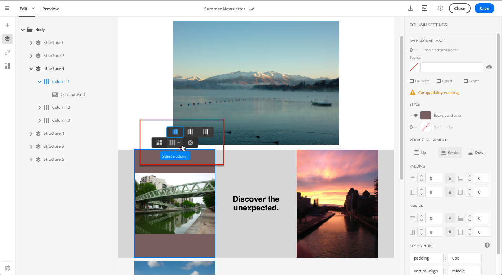

   その列の編集可能なパラメーターは、右側の&#x200B;**[!UICONTROL Settings]** ペインに表示されます。

1. **[!UICONTROL Vertical alignment]**&#x200B;で、**[!UICONTROL Up]**&#x200B;を選択します。

   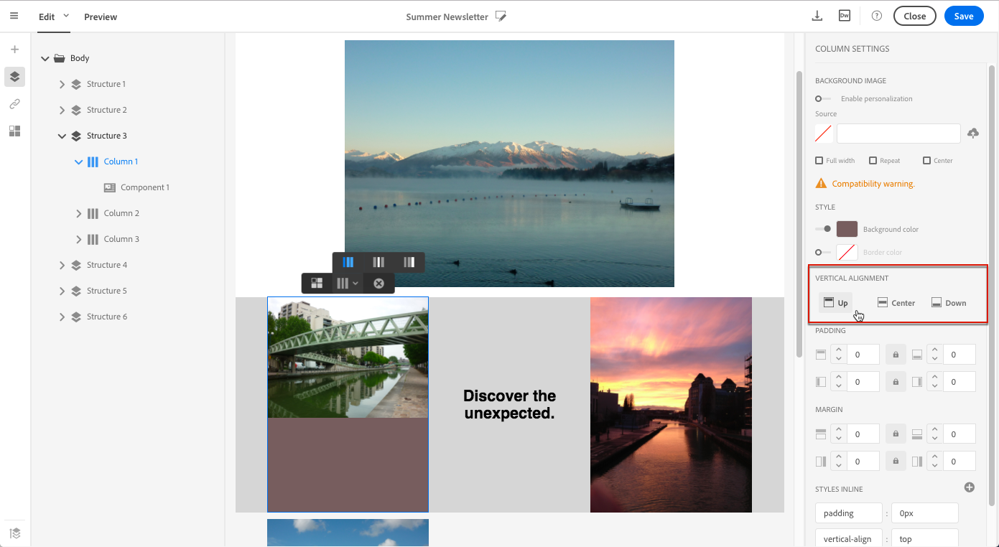

   コンテンツコンポーネントが列の上に表示されます。

1. **[!UICONTROL Padding]**&#x200B;で、列内の先頭のパディングを定義します。 ロックアイコンをクリックして、下部のパディングとの同期を解除します。

   その列の左右のパディングを定義します。

   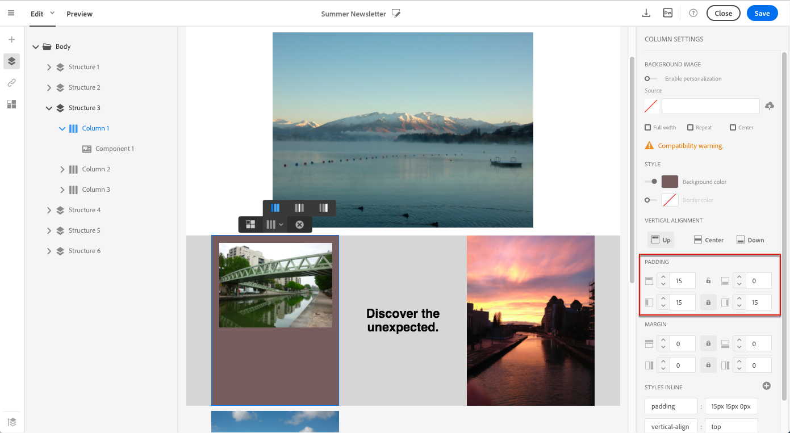

1. 他の列の整列とパディングを調整する場合と同様に行います。

   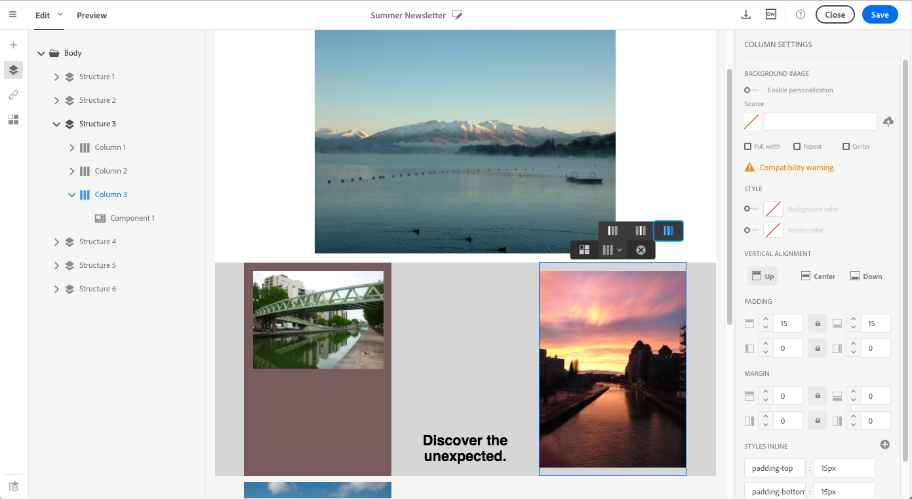

1. 変更内容を保存します。

## リンクのスタイル設定 {#about-styling-links}

E メールデザイナーでは、リンクに下線を引き、その色とターゲットを選択できます。

1. リンクが挿入されているコンポーネントで、リンクのラベルテキストを選択します。

1. コンポーネント設定で、**[!UICONTROL Underline link]**&#x200B;をチェックして、リンクのラベルテキストに下線を引きます。

   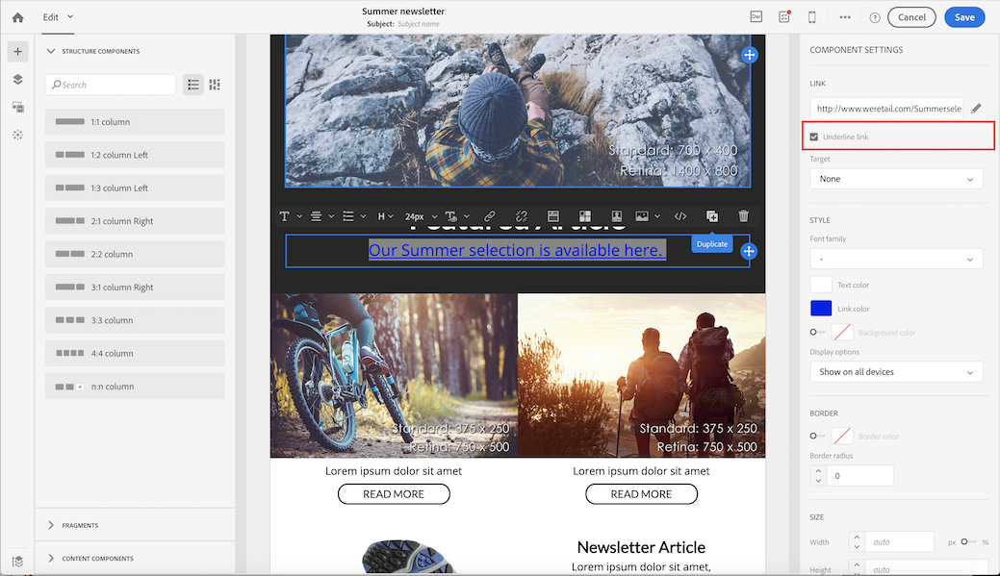

1. リンクを開くブラウジングコンテキストを選択するには、**[!UICONTROL Target]**&#x200B;を選択します。

   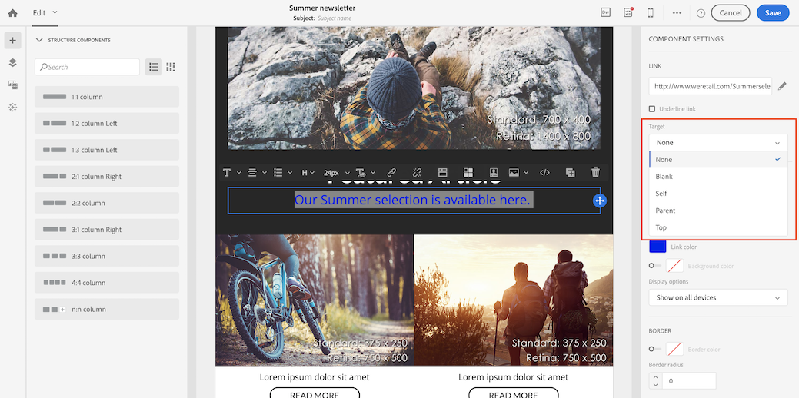

1. リンクの色を変更するには、**[!UICONTROL Link color]**&#x200B;をクリックします。

   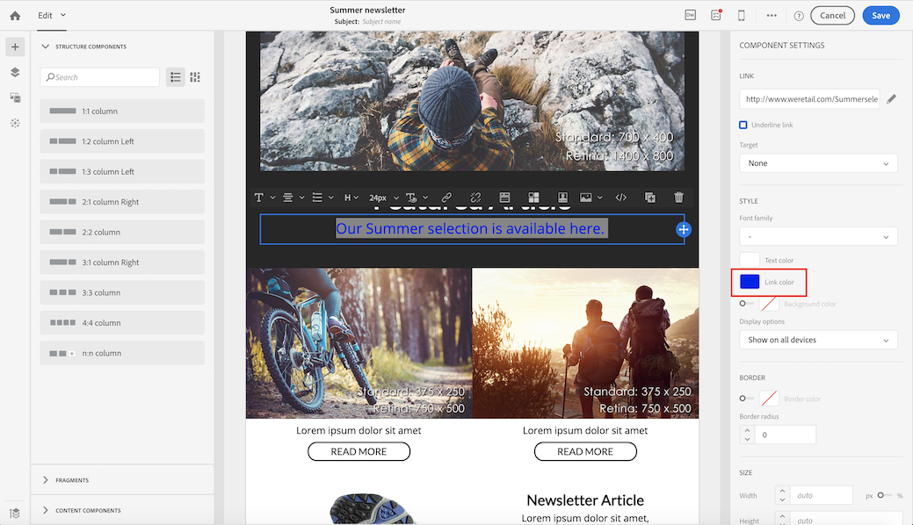

1. 必要な色を選択します。

   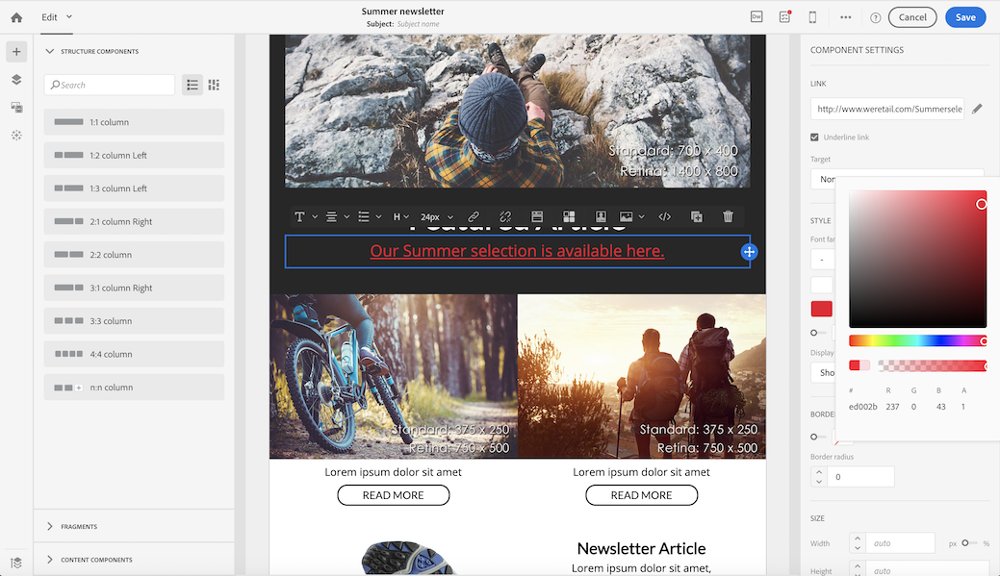

1. 変更内容を保存します。

## インラインスタイル属性の追加 {#adding-inline-styling-attributes}

電子メールDesigner インターフェイスでエレメントを選択し、サイドパネルに設定を表示すると、そのエレメントのインライン属性とその値をカスタマイズできます。

1. コンテンツ内の要素を選択します。
1. サイドパネルで、**[!UICONTROL Styles Inline]**&#x200B;設定を探します。

   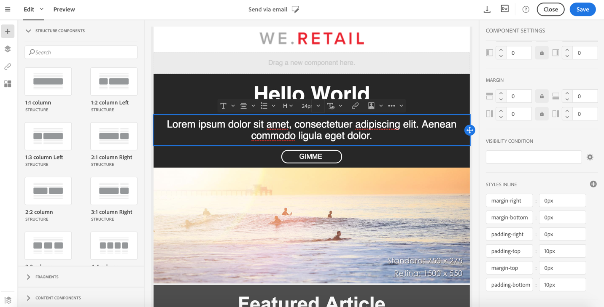

1. 既存の属性の値を変更するか、**+** ボタンを使用して新しい属性を追加します。 CSS に準拠している任意の属性と値を追加できます。

スタイル設定は、選択したエレメントに適用されます。 子要素に特定のスタイル属性が定義されていない場合、親要素のスタイル設定が継承されます。
