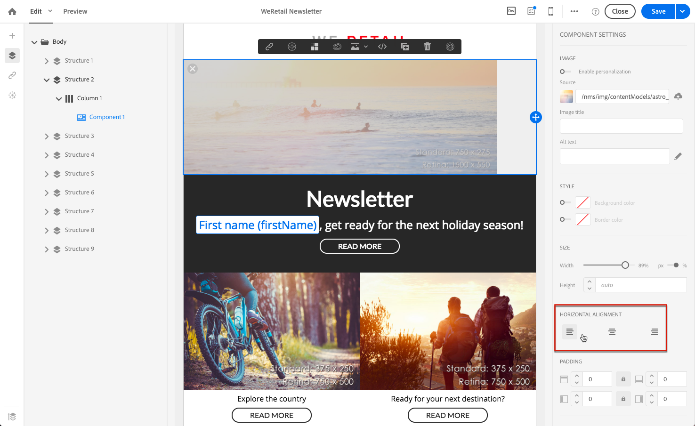
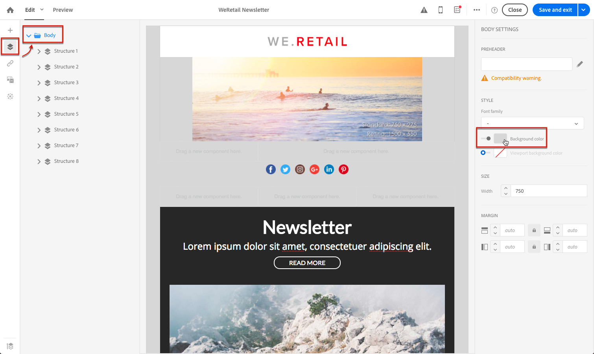

# E メールスタイルの管理 {#managing-styles}

E メールデザイナーでは、要素を選択すると、選択したコンテンツのタイプに固有のオプションが **[!UICONTROL Settings]** ウィンドウ これらのオプションを使用すると、E メールのスタイルを簡単に変更できます。

## 要素の選択 {#selecting-an-element}

E メールデザイナーインターフェイスで要素を選択するには、次のいずれかを実行します。

* 電子メールで直接クリックし、
* または、左側にあるオプションから使用できる構造ツリーを参照します。 **パレット**.

構造ツリーを参照すると、より正確な選択が可能になります。 次のいずれかを選択できます。

* 構造の構成要素全体
* 構造コンポーネントを構成する列の 1 つ
* または、列内に配置されているコンポーネントのみ。

列を選択するには、次の操作も実行できます。

1. （E メール内で直接、または左側にある構造ツリーを使用して）構造コンポーネントを選択します **パレット**) をクリックします。
1. 次の **コンテキストツールバー**&#x200B;をクリックし、 **[!UICONTROL Select a column]** をクリックして、目的の列を選択します。

詳しくは、 [この節](#example--adjusting-vertical-alignment-and-padding).

## スタイル設定の調整 {#adjusting-style-settings}

1. E メール内の要素を選択します。 詳しくは、 [要素の選択](#selecting-an-element).
1. 必要に応じて設定を調整します。 選択した各要素には、異なる設定セットが用意されています。

   背景の挿入、サイズの変更、水平方向または垂直方向の整列の変更、色の管理、追加を行うことができます [パディングまたはマージン](#selecting-an-element)など。

   これをおこなうには、 **[!UICONTROL Settings]** ウィンドウまたは [インラインスタイル属性を追加](#adding-inline-styling-attributes).

   

1. コンテンツを保存します。

## パディングとマージンの調整 {#about-padding-and-margin}

E メールデザイナーインターフェイスを使用すると、パディングとマージンの設定をすばやく調整できます。

**[!UICONTROL Padding]**:この設定を使用すると、要素の境界線内にあるスペースを管理できます。

例：

* パディングを使用して、画像の左右に余白を設定します。
* 上と下のパディングを使用して、1 つ以上の間隔を追加します **[!UICONTROL Text]** または **[!UICONTROL Divider]** コンポーネント。
* 構造要素内の列間の境界線を設定するには、各列のパディングを定義します。

**[!UICONTROL Margin]**:この設定を使用すると、要素の境界線と次の要素の間のスペースを管理できます。

>[!NOTE]
>
>選択内容（構造コンポーネント、列コンポーネント、コンテンツコンポーネント）に応じて、結果は同じになりません。 Adobeは、 **[!UICONTROL Padding]** および **[!UICONTROL Margin]** パラメーターを設定します。

両方 **[!UICONTROL Padding]** および **[!UICONTROL Margin]**&#x200B;をクリックし、上、下、右、左の各パラメーターの同期を解除するには、ロックアイコンをクリックします。 これにより、各パラメータを個別に調整できます。

## スタイルの整列 {#about-alignment}

* **テキストの整列**:マウスのカーソルをテキスト上に置き、コンテキストツールバーを使用して位置を揃えます。

   

* **水平方向の整列** は、テキスト、画像およびボタンに適用できます。現在、 **[!UICONTROL Divider]** および **[!UICONTROL Social]** コンポーネント。

   

* 設定するには **垂直方向の整列**&#x200B;で、構造コンポーネント内の列を選択し、設定ウィンドウからオプションを選択します。

   

## 背景の設定 {#about-backgrounds}

>[!CONTEXTUALHELP]
>id="ac_edition_backgroundimage"
>title="背景設定"
>abstract="E メールデザイナーを使用すると、コンテンツの背景色や背景画像をパーソナライズできます。背景画像は、すべての E メールクライアントでサポートされているわけではありません。"

E メールデザイナーで背景を設定する場合、Adobeは次のことを推奨します。

1. デザインで必要に応じて、E メールの本文に背景色を適用します。
1. ほとんどの場合、列レベルで背景色を設定します。
1. 画像やテキストコンポーネントは管理が困難なので、背景色を使用しないようにしてください。

使用可能な背景設定を次に示します。

* を設定します。 **[!UICONTROL Background color]** 電子メール全体に対して 左側のパレットからアクセス可能なナビゲーションツリーで、ボディ設定を選択していることを確認してください。

   

* すべての構造コンポーネントに同じ背景色を設定するには、 **[!UICONTROL Viewport background color]**. このオプションを使用すると、背景色から別の設定を選択できます。

   

* 構造コンポーネントごとに異なる背景色を設定します。 左側のパレットからアクセス可能なナビゲーションツリーで構造を選択し、その構造にのみ特定の背景色を適用します。

   

   構造の背景色が隠れる場合があるので、ビューポートの背景色を設定しないでください。

* を設定します。 **[!UICONTROL Background image]** 構造コンポーネントのコンテンツ用。

   

   >[!NOTE]
   >
   >一部のメールプログラムでは、背景画像がサポートされていません。 サポートされていない場合は、代わりに行の背景色が使用されます。 画像を表示できない場合は、必ず適切なフォールバックの背景色を選択してください。

* 列レベルで背景色を設定します。

   

   >[!NOTE]
   >
   >これは最も一般的な使用例です。 Adobeでは、E メールコンテンツ全体を柔軟に編集できるように、背景色を列レベルで設定することをお勧めします。

   また、列レベルで背景画像を設定することもできますが、ほとんど使用されません。

### 例：垂直方向の整列とパディングの調整 {#example--adjusting-vertical-alignment-and-padding}

3 つの列で構成される構造コンポーネント内のパディングと垂直方向の整列を調整する場合。 これは、次の手順に従って行います。

1. E メール内で直接構造コンポーネントを選択するか、左側にある構造ツリーを使用して選択します **パレット**.
1. 次の **コンテキストツールバー**&#x200B;をクリックし、 **[!UICONTROL Select a column]** をクリックし、編集するものを選択します。 構造ツリーから選択することもできます。

   

   その列の編集可能なパラメータが、 **[!UICONTROL Settings]** 右側のパネル

1. の下 **[!UICONTROL Vertical alignment]**&#x200B;を選択します。 **[!UICONTROL Up]**.

   

   コンテンツコンポーネントは、列の上に表示されます。

1. の下 **[!UICONTROL Padding]**、列内の上のパディングを定義します。 ロックアイコンをクリックすると、下のパディングとの同期が解除されます。

   その列の左右のパディングを定義します。

   

1. 他の列の整列とパディングを調整する場合と同様に行います。

   

1. 変更内容を保存します。

## リンクのスタイル設定 {#about-styling-links}

E メールデザイナーで、リンクに下線を引き、その色とターゲットを選択できます。

1. リンクが挿入されるコンポーネントで、リンクのラベルテキストを選択します。

1. コンポーネント設定で、 **[!UICONTROL Underline link]** リンクのラベルテキストに下線を引く場合。

   

1. リンクを開くブラウジングコンテキストを選択するには、 **[!UICONTROL Target]**.

   

1. リンクの色を変更するには、 **[!UICONTROL Link color]**.

   

1. 必要な色を選択します。

   

1. 変更内容を保存します。

## インラインスタイル属性の追加 {#adding-inline-styling-attributes}

E メールデザイナーインターフェイスで、要素を選択し、サイドパネルにその設定を表示する際に、その要素のインライン属性と値をカスタマイズできます。

1. コンテンツ内の要素を選択します。
1. サイドパネルで、 **[!UICONTROL Styles Inline]** 設定。

   

1. 既存の属性の値を変更するか、 **+** 」ボタンをクリックします。 CSS に準拠している任意の属性と値を追加できます。

次に、選択した要素にスタイルが適用されます。 子要素に特定のスタイル属性が定義されていない場合、親要素のスタイル設定が継承されます。
