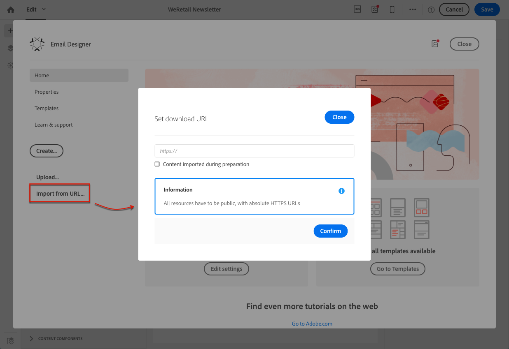

# 既存のコンテンツを使用したデザイン {#designing-using-existing-content}

## 既存のコンテンツの選択{#selecting-an-existing-content}

Adobe Campaignには、使い始めるのに役立つ、事前定義済みのコンテンツのセットが付属しています。 これらのいずれかを使用するか、送信する必要があるメッセージのコンテンツがAdobe Campaign以外で準備されている場合は、コンピューターまたは URL から読み込むことができます。

E メールまたはランディングページを作成する際に、別のソースから既存のコンテンツを読み込むように選択できます。

>[!NOTE]
>
>以下の画像は、 [E メールデザイナー](../../designing/using/designing-content-in-adobe-campaign.md).

1. E メールまたはランディングページを作成したら、そのコンテンツを開きます。
1. ホームアイコンをクリックして、 **[!UICONTROL Email Designer]** ホームページ。

   

1. 読み込むコンテンツのソースを選択します。

   * [コンテンツテンプレート](../../designing/using/using-reusable-content.md#content-templates)：をクリックします。 **[!UICONTROL Templates]** タブをクリックします。
   * [コンテンツを新規に作成](../../designing/using/designing-from-scratch.md#designing-an-email-content-from-scratch)をクリックし、新規に開始します。 **[!UICONTROL Create]** 」ボタンをクリックします。
   * [コンピューターから ZIP ファイルまたはHTMLファイルとしてのコンテンツ](#importing-content-from-a-file)：をクリックします。 **[!UICONTROL Upload]** 」ボタンをクリックします。
   * [既存の URL からのコンテンツ](#importing-content-from-a-url) （E メールの場合のみ）: **[!UICONTROL Import from URL]** 」ボタンをクリックします。

   

1. コンテンツを読み込みます。 選択したコンテンツが現在のコンテンツを置き換えます。

   読み込まれたコンテンツは、編集やパーソナライズが可能です。

   >[!NOTE]
   >
   >The [E メールデザイナー](../../designing/using/designing-content-in-adobe-campaign.md) は特定のタグ付けを使用します。 Campaign にアップロードされる標準HTMLコンテンツは、E メールデザイナーから完全に互換性を持ち、編集可能なタグと一致する必要があります。 一致しない場合、コンテンツは次の場所にアップロードされます： [互換モード](#compatibility-mode). 既存のコンテンツに互換性を持たせるには、 [この節](#editing-existing-contents-with-the-email-designer).

**関連トピック：**

* [E メールの作成](../../channels/using/creating-an-email.md)
* [ランディングページの管理](../../channels/using/getting-started-with-landing-pages.md)

## E メールデザイナーでの既存のコンテンツの編集{#editing-existing-contents-with-the-email-designer}

のエディションの可能性を最大限活用するには [E メールデザイナー](../../designing/using/designing-content-in-adobe-campaign.md)に設定する場合、アップロードするHTMLには、WYSIWYG エディターに準拠する特定のタグが含まれている必要があります。

HTMLのすべてまたは一部にこのタグがない場合、コンテンツは「 [互換モード](#compatibility-mode)&#39;.

既存の外部コンテンツを E メールデザイナー内で完全に編集可能にするには、 [既存のコンテンツを使用した E メールのデザイン](../../designing/using/using-existing-content.md) 」セクションに入力します。

## 既存の E メールコンテンツのインポート {#importing}

### ファイルからのコンテンツの読み込み {#importing-content-from-a-file}

E メールデザイナーのホームページで、 **[!UICONTROL Upload]** ボタンをクリックして、お使いのコンピューターからファイルをアップロードし、確定します。

zip ファイル構造に制約はありません。 ただし、HTMLファイルの参照は、zip フォルダーのツリー構造に従って相対パスで指定する必要があります。

読み込みでは、次の形式がサポートされます。

* スタイルHTMLが組み込まれたシートファイル
* HTMLファイル、スタイルシート (.CSS) および画像を格納した.zip フォルダー

>[!NOTE]
>
>E メールコンテンツの場合は、スタイルシートを組み込んだ単一のHTMLファイルを読み込むことをお勧めします。

#### URL からのコンテンツの読み込み {#importing-content-from-a-url}

URL からコンテンツを読み込む前に、次の要件に従っていることを確認します。

* コンテンツは、この URL 経由で公開されている必要があります。
* セキュリティ上の理由から、URL のみが **[!UICONTROL https]** は許可されています。
* すべてのリソース（画像、CSS）が絶対リンクと HTTPS で設定されていることを確認します。 そうしないと、E メールを送信した後、ミラーページがリソースなしで表示されます。 絶対リンク定義の例を次に示します。

  ```
  <a href="https://www.mywebsite.com/images/myimage.png">
  ```

>[!NOTE]
>
>URL からのコンテンツの読み込みは、E メールチャネルでのみ使用できます。

URL から既存のコンテンツを取得するには、次の手順に従います。

1. E メールデザイナーのホームページから、 **[!UICONTROL Import from URL]** 」ボタンをクリックします。

   

1. コンテンツの取得元となる URL を定義します。
1. 「**[!UICONTROL Confirm]**」をクリックします。

ビデオでこの機能を確認する.

>[!VIDEO](https://video.tv.adobe.com/v/25926?quality=12)

その他のCampaign Standardのハウツービデオも利用できます [ここ](https://experienceleague.adobe.com/docs/campaign-standard-learn/tutorials/overview.html?lang=ja).

### 準備時に URL からコンテンツを自動的に取得する {#retrieving-content-from-a-url-automatically-at-preparation-time}

メッセージの準備中に URL からコンテンツを読み込むと、E メールが準備されるたびに最新のHTMLコンテンツを取得できます。 これにより、繰り返し E メールのコンテンツは、送信時に常に最新の状態に保たれます。 また、この機能を使用すると、コンテンツがまだ準備できていなくても、特定の日付にスケジュールされたメッセージを作成できます。

準備時にコンテンツを取得するには、次の手順に従います。

1. を選択します。 **[!UICONTROL Content imported during preparation]** オプション。

   

1. URL コンテンツは、読み取り専用としてエディターに表示されます。

   >[!CAUTION]
   >
   >この手順では、HTMLのコンテンツエディターでの表示を考慮に入れないでください。 準備段階で取得されます。

1. 取得された URL コンテンツをプレビューするには、メッセージを作成後に開き、 **[!UICONTROL Preview]** 」ボタンをクリックします。

コンテンツの取得元となるリモート URL をパーソナライズできます。 これを行うには、次の手順に従います。

1. 画面上部の E メールラベルをクリックして、E メールデザイナーにアクセスします **[!UICONTROL Properties]** タブをクリックします。
1. 次を検索： **[!UICONTROL Remote URL]** フィールドに入力します。

   

1. 目的のパーソナライゼーションフィールド、コンテンツブロックまたは動的テキストを挿入します。

   The **[!UICONTROL Current date - YYYYMMDD]** コンテンツブロックを使用すると、日付を挿入できます。

   >[!NOTE]
   >
   >使用可能なパーソナライゼーションフィールドは、 **配信** 属性のみ（E メールの作成日、ステータス、キャンペーンラベル…）

コンテンツのダウンロードが最初の試行で失敗した場合は、2 回再試行できます。

1. 2 回目の試行は、最初の試行から 50 ミリ秒後に開始します。
1. 3 回目の試行は、2 回目の試行後、100 ミリ秒後に開始します。

これらの再試行は、次の場合に役立ちます。

* 遠隔サーバーでの短時間のサービス障害
* クラスターでのサーバー障害。この場合、作業用サーバーへのロードバランシングによって再試行が成功する可能性が高くなります。

### 互換性モード {#compatibility-mode}

コンテンツをアップロードする際、電子メールデザイナーの WYSIWYG エディターに完全に準拠して編集可能にするには、特定のタグがそのコンテンツに含まれている必要があります。

アップロードされたHTMLのすべてまたは一部が想定されるタグ付けに準拠していない場合、コンテンツは「互換性モード」で読み込まれ、UI を使用した編集の可能性が制限されます。

コンテンツが互換モードで読み込まれる場合でも、インターフェイスを通じて次の変更を実行できます（使用できないアクションは非表示になります）。

* テキストの変更または画像の変更
* リンクとパーソナライゼーションフィールドの挿入
* 選択したオプションブロックのスタイル設定HTMLを編集
* 条件付きコンテンツの定義


E メールに新しいセクションを追加したり、高度なスタイル設定をおこなうなど、その他の変更は、HTMLモードで E メールのソースコードで直接おこなう必要があります。

既存の E メールを E メールデザイナー互換の E メールに変換する方法について詳しくは、 [この節](../../designing/using/using-existing-content.md).

**関連トピック**：

* [E メールの作成](../../channels/using/creating-an-email.md)
* [E メールデザイナーの概要ビデオ](../../designing/using/designing-content-in-adobe-campaign.md#video)
* [新規での E メールコンテンツのデザイン](../../designing/using/designing-from-scratch.md#designing-an-email-content-from-scratch)

## HTMLコンテンツを変換中 {#converting-an-html-content}

組み合わせて複数の E メールで再利用できる、モジュール式のテンプレートとフラグメントのフレームワークを構築する場合は、E メールHTMLを E メールデザイナーテンプレートに変換することを検討してください。

この使用例では、HTML電子メールを電子メールデザイナーコンポーネントにすばやく変換できます。

>[!CAUTION]
>
>この節は、HTMLコードに詳しい上級ユーザー向けです。

>[!NOTE]
>
>互換モードと同様に、HTMLコンポーネントは、制限付きオプションで編集できます。インプレース編集のみ実行できます。

E メールデザイナー以外では、元のHTMLが再利用可能なセクションに分割されていることを確認します。

そうでない場合は、HTMLから別のブロックを切り離します。 例：

```
<!-- 3 COLUMN w/CTA (SCALED) -->
<table width="100%" align="center" cellspacing="0" cellpadding="0" border="0" role="presentation" style="max-width:680px;">
<tbody>
<tr>
<td class="padh10" align="center" valign="top" style="padding:0 5px 20px 5px;">
<table width="100%" cellspacing="0" cellpadding="0" border="0" role="presentation">
<tbody>
<tr>
...
</tr>
</tbody>
</table>
</td>
</tr>
</tbody>
</table>
<!-- //3 COLUMN w/CTA (SCALED) -->
```

すべてのブロックを特定したら、E メールデザイナーで、既存の E メールの各セクションに対して次の手順を繰り返します。

1. E メールデザイナーを開いて、空の E メールコンテンツを作成します。
1. ボディレベルの属性（背景色、幅など）を設定します。 詳しくは、[メールスタイルの編集](../../designing/using/styles.md)を参照してください。
1. 構造コンポーネントを追加します。 詳しくは、[メール構造の編集](../../designing/using/designing-from-scratch.md#defining-the-email-structure)を参照してください。
1. HTMLコンポーネントを追加。 詳しくは、[フラグメントとコンポーネントの追加](../../designing/using/designing-from-scratch.md#defining-the-email-structure)を参照してください。
1. そのコンポーネントにHTMLをコピー&amp;ペーストします。
1. モバイル表示に切り替え. 詳しくは、[この節](../../designing/using/plain-text-html-modes.md#switching-to-mobile-view)を参照してください。

   CSS がないので、レスポンシブビューが壊れています。

1. これを修正するには、ソースコードモードに切り替えて、スタイルセクションを新しいスタイルセクションにコピー&amp;ペーストします。 例：

   ```
   <style type="text/css">
   a {text-decoration:none;}
   body {min-width:100% !important; margin:0 auto !important; padding:0 !important;}
   img {line-height:100%; text-decoration:none; -ms-interpolation-mode:bicubic;}
   ...
   </style>
   ```

   >[!NOTE]
   >
   >別のカスタムスタイルタグで、この後にスタイルを必ず追加してください。
   >
   >E メールデザイナーで生成された CSS を変更しないでください。
   >
   >* `<style data-name="default" type="text/css">(##)</style>`
   >* `<style data-name="supportIOS10" type="text/css">(##)</style>`
   >* `<style data-name="mediaIOS8" type="text/css">(##)</style>`
   >* `<style data-name="media-default-max-width-500px" type="text/css">(##)</style>`
   >* `<style data-name="media-default--webkit-min-device-pixel-ratio-0" type="text/css">(##)</style>`

1. モバイル表示に戻って、コンテンツが正しく表示されていることを確認し、変更を保存します。
