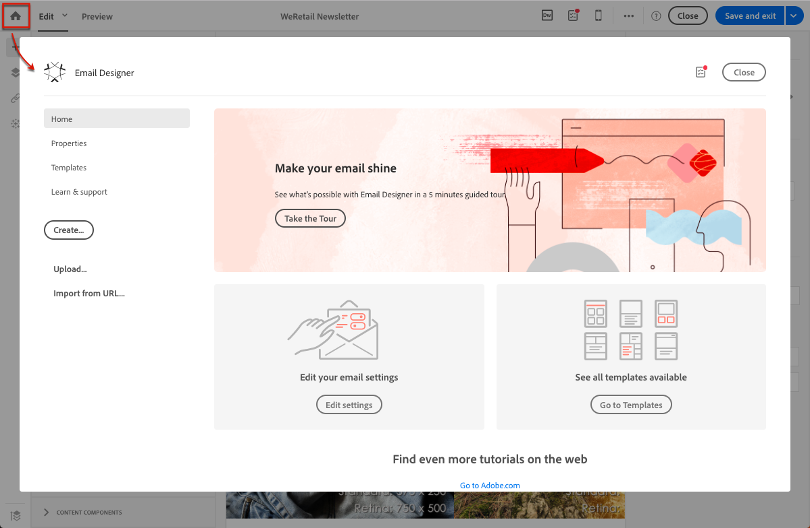
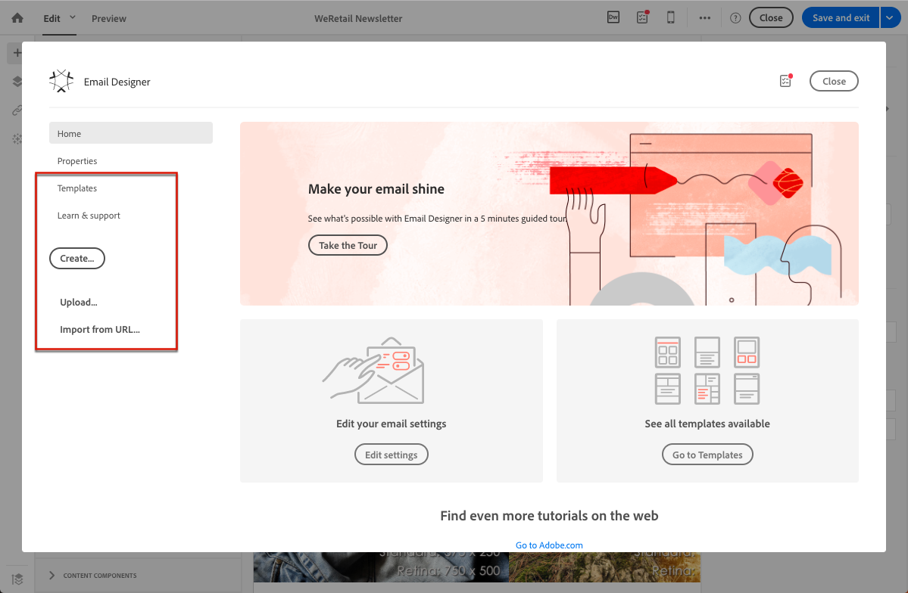
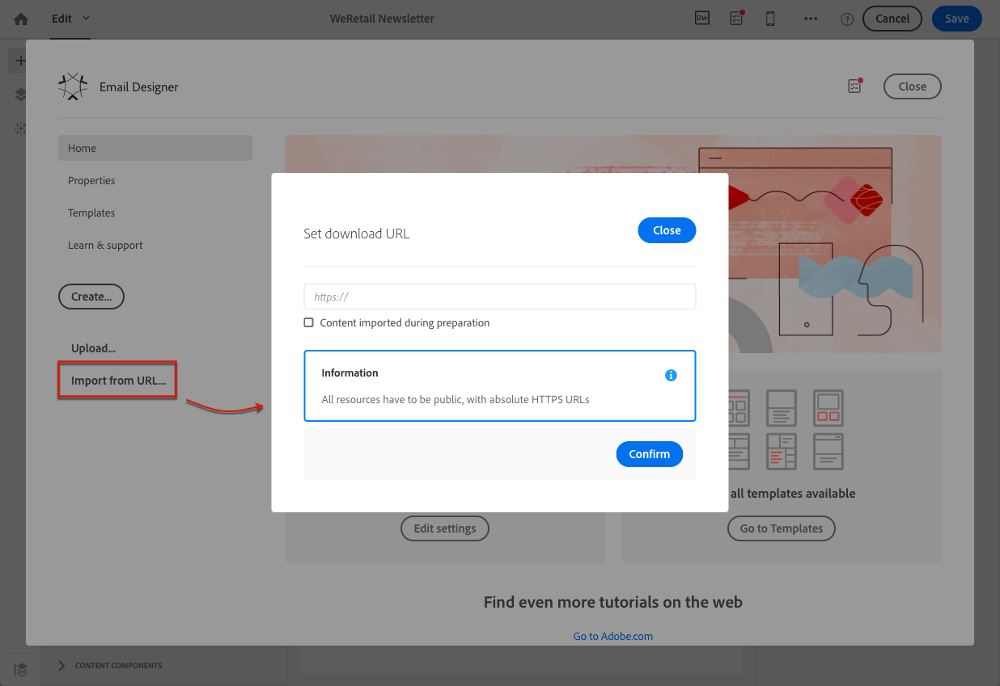
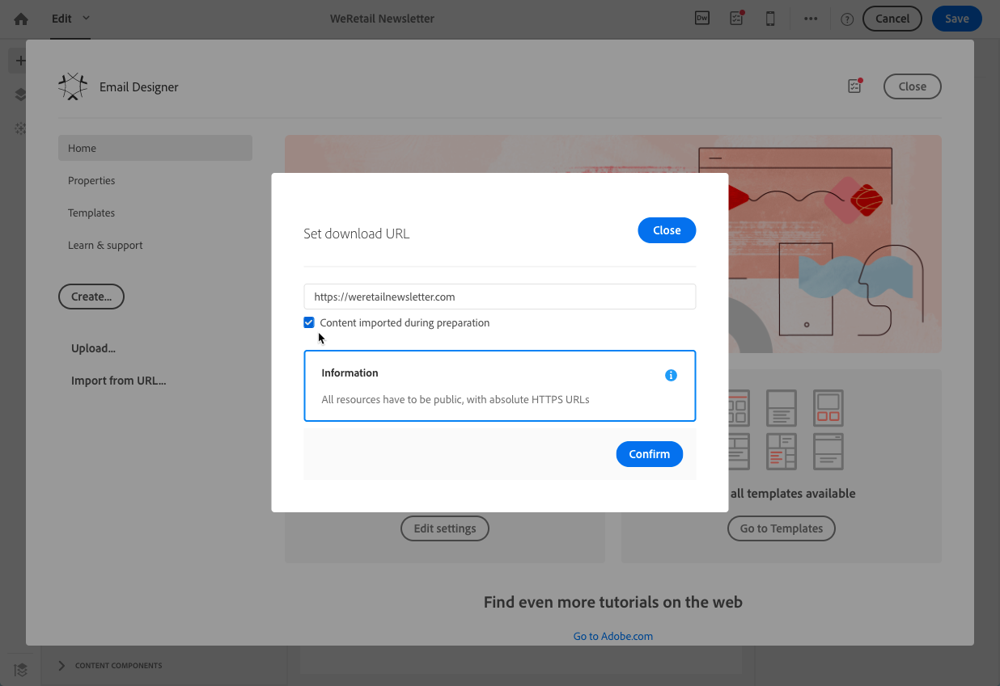
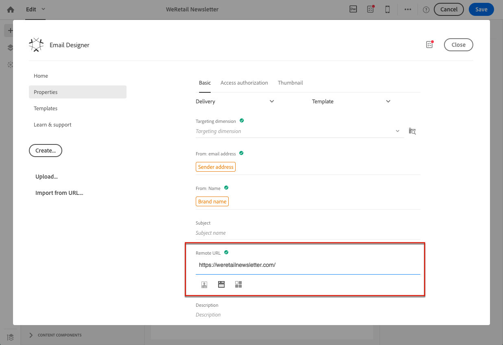
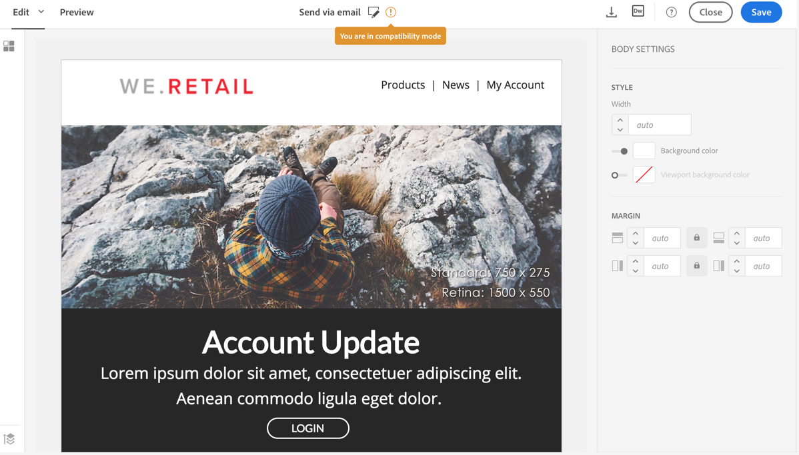

# 既存のコンテンツを利用した設計 {#designing-using-existing-content}

## 既存のコンテンツの選択{#selecting-an-existing-content}

Adobe Campaignには、定義済みの一連のコンテンツが用意されています。これらのコンテンツを使用して作業を開始できます。 これらのいずれかを使用するか、送信する必要があるメッセージの内容がAdobe Campaign以外で準備されている場合は、コンピューターまたはURLから読み込むことができます。

メールやランディングページを作成する際に、別のソースから既存のコンテンツを読み込むかどうかを選択できます。

>[!NOTE]
>
>以下の画像は、[電子メール Designer](../../designing/using/designing-content-in-adobe-campaign.md)を使用して既存のコンテンツを読み込む方法を示しています。

1. メールまたはランディングページを作成したら、そのコンテンツを開きます。
1. ホームアイコンをクリックして、**[!UICONTROL Email Designer]** ホームページにアクセスします。

   

1. 読み込むコンテンツのソースを選択：

   * [&#x200B; コンテンツテンプレート &#x200B;](../../designing/using/using-reusable-content.md#content-templates):「**[!UICONTROL Templates]**」タブをクリックします。
   * [最初からコンテンツ &#x200B;](../../designing/using/designing-from-scratch.md#designing-an-email-content-from-scratch)を作成して新しい作業を開始するには、**[!UICONTROL Create]** ボタンをクリックします。
   * [&#x200B; コンピューターのコンテンツをZIPまたはHTML ファイルとして](#importing-content-from-a-file):「**[!UICONTROL Upload]**」ボタンをクリックします。
   * [既存のURLからのコンテンツ &#x200B;](#importing-content-from-a-url) （メールのみ）:「**[!UICONTROL Import from URL]**」ボタンをクリックします。

   

1. コンテンツを読み込みます。 選択したコンテンツが現在のコンテンツを置き換えます。

   インポートされたコンテンツはパーソナライズできます。

   >[!NOTE]
   >
   >[電子メール Designer](../../designing/using/designing-content-in-adobe-campaign.md)は、特定のタグ付けを使用しています。 Campaignにアップロードされる標準のHTML コンテンツは、電子メールDesignerから完全に互換性があり、編集可能なタグ付けとして期待されるタグと一致する必要があります。 一致しない場合、コンテンツは[互換モード &#x200B;](#compatibility-mode)でアップロードされます。 既存のコンテンツに互換性を持たせるには、[この節](#editing-existing-contents-with-the-email-designer)を参照してください。

**関連トピック：**

* [メールの作成](../../channels/using/creating-an-email.md)
* [ランディングページの管理](../../channels/using/getting-started-with-landing-pages.md)

## E メール Designerを使用した既存のコンテンツの編集{#editing-existing-contents-with-the-email-designer}

[電子メール Designer](../../designing/using/designing-content-in-adobe-campaign.md)の編集機能を最大限に活用するには、アップロードしたHTMLに、WYSIWYG エディターに準拠する特定のタグが含まれている必要があります。

HTMLの全体または一部にこのタグ付けがない場合、コンテンツは&#39;[互換モード &#x200B;](#compatibility-mode)&#39;で読み込まれます。

電子メール Designer内で既存の外部コンテンツを完全に編集可能にするには、[既存のコンテンツを使用した電子メールのデザイン &#x200B;](../../designing/using/using-existing-content.md) セクションを参照してください。

## 既存のメールコンテンツのインポート {#importing}

### ファイルからのコンテンツのインポート {#importing-content-from-a-file}

メールDesignerのホームページで、「**[!UICONTROL Upload]**」ボタンをクリックして、コンピューターからファイルをアップロードし、確定します。

zip ファイル構造に制約はありません。 ただし、HTML ファイルを参照する場合は、zip フォルダーのツリー構造を基準とした相対パスにする必要があります。

読み込みでは、次の形式がサポートされています。

* スタイルシートが組み込まれたHTML ファイル
* HTML ファイル、スタイルシート（.CSS）および画像を含む.zip フォルダー

>[!NOTE]
>
>メールコンテンツの場合は、スタイルシートが組み込まれた1つのHTML ファイルを読み込むことをお勧めします。

#### URLからのコンテンツのインポート {#importing-content-from-a-url}

URLからコンテンツを読み込む前に、次の要件に従っていることを確認してください。

* コンテンツは、このURLを通じて公開する必要があります。
* セキュリティ上の理由から、**[!UICONTROL https]**&#x200B;で始まるURLのみが許可されています。
* すべてのリソース（画像、CSS）が絶対リンクとHTTPSで設定されていることを確認してください。 そうしないと、メールを送信した後、ミラーページがリソースなしで表示されます。 絶対リンク定義の例を次に示します。

  ```
  <a href="https://www.mywebsite.com/images/myimage.png">
  ```

>[!NOTE]
>
>URLからのコンテンツの読み込みは、メールチャネルでのみ使用できます。

既存のコンテンツをURLから取得するには、次の手順に従います。

1. メールDesignerのホームページから、「**[!UICONTROL Import from URL]**」ボタンを選択します。

   

1. コンテンツを取得するURLを定義します。
1. 「**[!UICONTROL Confirm]**」をクリックします。

この機能については、動画でご確認ください。

>[!VIDEO](https://video.tv.adobe.com/v/25926?quality=12)

その他のCampaign Standardのハウツー動画は[こちら](https://experienceleague.adobe.com/docs/campaign-standard-learn/tutorials/overview.html?lang=ja)でご覧いただけます。

### 準備時にURLからコンテンツを自動的に取得する {#retrieving-content-from-a-url-automatically-at-preparation-time}

メッセージの準備中にURLからコンテンツを読み込むと、メールの準備が完了するたびに最新のHTML コンテンツを取得できます。 これにより、定期的な電子メールのコンテンツは、送信時に常に最新になります。 この機能を使用すると、コンテンツの準備ができていない場合でも、特定の日付にスケジュールされたメッセージを作成できます。

準備時にコンテンツを取得するには、次の手順に従います。

1. 「**[!UICONTROL Content imported during preparation]**」オプションを選択します。

   

1. URL コンテンツは、エディターに読み取り専用として表示されます。

   >[!CAUTION]
   >
   >この手順では、コンテンツエディターでのHTML表示を考慮しないでください。 準備段階で取得されます。

1. 取得したURL コンテンツをプレビューするには、作成したメッセージを開き、**[!UICONTROL Preview]** ボタンをクリックします。

コンテンツの取得元となるリモート URLをパーソナライズできます。 これを行うには、次の手順に従います。

1. 画面の上部にある電子メールラベルをクリックして、「メールDesigner **[!UICONTROL Properties]**」タブにアクセスします。
1. **[!UICONTROL Remote URL]** フィールドを検索します。

   

1. 目的のパーソナライゼーションフィールド、コンテンツブロックまたはダイナミックテキストを挿入します。

   例えば、**[!UICONTROL Current date - YYYYMMDD]** コンテンツブロックを使用すると、日付を挿入できます。

   >[!NOTE]
   >
   >使用可能なパーソナライゼーションフィールドは、**配信**&#x200B;属性にのみリンクされています（メール作成日、ステータス、キャンペーンラベル…）。

コンテンツのダウンロードが最初の試行時に失敗した場合は、2回再試行できます。

1. 2回目の試行は、最初の試行から50 ミリ秒後に開始します。
1. 3回目の試行は2回目の試行から100 ミリ秒後に開始されます。

これらの再試行は、次のような場合に役立ちます。

* 遠隔地のサーバーで短時間のサービス障害が発生した
* クラスタ上のサーバ障害。この場合、動作しているサーバへのロード・バランシングにより、再試行が成功する可能性が高くなります

### 互換性モード {#compatibility-mode}

コンテンツをアップロードする場合、電子メールDesignerのWYSIWYG エディターで完全に準拠し、編集可能な特定のタグが含まれている必要があります。

アップロードされたHTMLの全部または一部が期待されるタグ付けに準拠していない場合、コンテンツは「互換モード」で読み込まれ、UIを通じて編集の可能性が制限されます。

コンテンツが互換モードで読み込まれた場合でも、インターフェイスを通じて次の変更を実行できます（使用できないアクションは非表示になります）。

* テキストの変更または画像の変更
* リンクとパーソナライゼーションフィールドの挿入
* 選択したHTML ブロックの一部のスタイル設定オプションを編集する
* 条件付きコンテンツの定義



メールに新しいセクションを追加したり、詳細なスタイルを設定したりするなど、その他の変更は、HTML モードを使用して、メールのソースコードで直接行う必要があります。

既存の電子メールをEmail Designer互換の電子メールに変換する方法について詳しくは、[この節](../../designing/using/using-existing-content.md)を参照してください。

**関連トピック**：

* [メールの作成](../../channels/using/creating-an-email.md)
* [電子メール Designerの概要ビデオ](../../designing/using/designing-content-in-adobe-campaign.md#video)
* [メールコンテンツをゼロから設計](../../designing/using/designing-from-scratch.md#designing-an-email-content-from-scratch)

## HTML コンテンツの変換 {#converting-an-html-content}

複数の電子メールで再利用できるように、モジュール形式のテンプレートとフラグメントを組み合わせて使用するフレームワークを構築する場合は、電子メールのHTMLを電子メールのDesigner テンプレートに変換することを検討してください。

このユースケースでは、HTMLの電子メールをDesignerの電子メールコンポーネントに素早く変換する方法を提供します。

>[!CAUTION]
>
>この節は、HTML コードに精通している上級者向けです。

>[!NOTE]
>
>互換モードと同様に、HTML コンポーネントは限られたオプションで編集可能です。インプレースエディションのみ実行できます。

電子メールDesigner以外では、元のHTMLが再利用可能なセクションに分割されていることを確認します。

そうでない場合は、HTMLからさまざまなブロックを切り取ります。 例：

```
<!-- 3 COLUMN w/CTA (SCALED) -->
<table width="100%" align="center" cellspacing="0" cellpadding="0" border="0" role="presentation" style="max-width:680px;">
<tbody>
<tr>
<td class="padh10" align="center" valign="top" style="padding:0 5px 20px 5px;">
<table width="100%" cellspacing="0" cellpadding="0" border="0" role="presentation">
<tbody>
<tr>
...
</tr>
</tbody>
</table>
</td>
</tr>
</tbody>
</table>
<!-- //3 COLUMN w/CTA (SCALED) -->
```

すべてのブロックを識別したら、メール Designerで、既存のメールの各セクションに対して次の手順を繰り返します。

1. メールDesignerを開いて、空のメールコンテンツを作成します。
1. ボディレベルの属性（背景色、幅など）の設定詳しくは、[電子メールスタイルの編集](../../designing/using/styles.md)を参照してください。
1. 構造コンポーネントを追加します。 詳しくは、[メール構造の編集](../../designing/using/designing-from-scratch.md#defining-the-email-structure)を参照してください。
1. HTML コンポーネントを追加します。 詳しくは、[フラグメントとコンポーネントの追加](../../designing/using/designing-from-scratch.md#defining-the-email-structure)を参照してください。
1. HTMLをそのコンポーネントにコピー&amp;ペーストします。
1. モバイル表示に切り替えます。 詳しくは、[この節](../../designing/using/plain-text-html-modes.md#switching-to-mobile-view)を参照してください。

   CSSが見つからないため、レスポンシブビューが壊れています。

1. これを修正するには、ソースコードモードに切り替え、スタイルセクションを新しいスタイルセクションにコピー&amp;ペーストします。 例：

   ```
   <style type="text/css">
   a {text-decoration:none;}
   body {min-width:100% !important; margin:0 auto !important; padding:0 !important;}
   img {line-height:100%; text-decoration:none; -ms-interpolation-mode:bicubic;}
   ...
   </style>
   ```

   >[!NOTE]
   >
   >この後に別のカスタムスタイルタグにスタイルを追加してください。
   >
   >電子メールDesignerで生成されたCSSを変更しないでください。
   >
   >* `<style data-name="default" type="text/css">(##)</style>`
   >* `<style data-name="supportIOS10" type="text/css">(##)</style>`
   >* `<style data-name="mediaIOS8" type="text/css">(##)</style>`
   >* `<style data-name="media-default-max-width-500px" type="text/css">(##)</style>`
   >* `<style data-name="media-default--webkit-min-device-pixel-ratio-0" type="text/css">(##)</style>`

1. モバイルビューに戻って、コンテンツが正しく表示されていることを確認し、変更を保存します。
