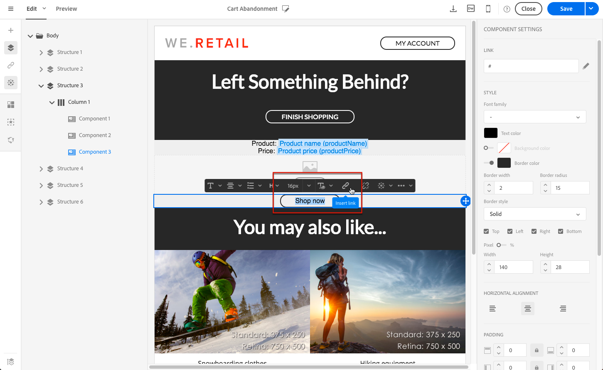

# トランザクションメッセージでの製品リストの使用{#using-product-listings}

>[!IMPORTANT]
>
>製品リストは、**トランザクション電子メールメッセージ**&#x200B;に対して、[電子メールデザイナー](../../designing/using/designing-content-in-adobe-campaign.md#email-designer-interface)インターフェイスからのみ利用できます。

トランザクション用の電子メールのコンテンツを編集する場合、1つ以上のデータコレクションを参照する製品リストを作成できます。 例えば、買い物かごの放棄の電子メールでは、ユーザがWebサイトを離れたときに買い物かごに含まれていたすべての商品のリストを、画像、価格、各商品へのリンクと共に含めることができます。

トランザクションメッセージに放棄された製品のリストを追加するには、次の手順に従います。

また、[この一連のビデオ](https://experienceleague.adobe.com/docs/campaign-standard-learn/tutorials/designing-content/product-listings-in-transactional-email.html?lang=en#configure-product-listings-in-transactional-emails)を見て、トランザクション用電子メールでの製品リストの設定に必要な手順を説明することもできます。

>[!NOTE]
>
>Adobe Campaign は入れ子になった製品リストをサポートしていません。つまり、別の製品リストに製品を含めることはできません。

## 製品リストの定義{#defining-a-product-listing}

トランザクションメッセージ内の製品リストを使用する前に、表示するリストの各製品のリストとフィールドをイベントレベルで定義する必要があります。詳しくは、[データコレクションの定義](../../channels/using/configuring-transactional-event.md#defining-data-collections)を参照してください。

1. トランザクションメッセージで、「**[!UICONTROL Content]**」ブロックをクリックしてメールの内容を変更します。
1. 構造コンポーネントをワークスペースにドラッグ＆ドロップします。詳しくは、[電子メール構造の定義](../../designing/using/designing-from-scratch.md#defining-the-email-structure)を参照してください。

   例えば、1 列の構造コンポーネントを選択し、テキストコンポーネント、画像コンポーネント、ボタンコンポーネントを追加します。詳しくは、[コンテンツコンポーネントの使用](../../designing/using/designing-from-scratch.md#about-content-components)を参照してください。

1. 先ほど作成した構造コンポーネントを選択し、コンテキストツールバーの「**[!UICONTROL Enable product listing]**」アイコンをクリックします。

   

   構造コンポーネントはオレンジ色のフレームでハイライト表示され、「**[!UICONTROL Product listing]**」設定は左側のパレットに表示されます。

   

1. コレクションの要素の表示方法を選択します。

   * **[!UICONTROL Row]**：水平方向とは、他の行の下の各要素を意味します。
   * **[!UICONTROL Column]**：垂直方向とは、同じ行で各要素が隣り合っていることを意味します。

   >[!NOTE]
   >
   >この **[!UICONTROL Column]** オプションは、複数列の構造コンポーネント（**[!UICONTROL 2:2 column]**、**[!UICONTROL 3:3 column]** および **[!UICONTROL 4:4 column]**）を使用する場合にのみ使用できます。製品リストを編集する場合は、最初の列にのみ入力します。他の列は考慮されません。構造コンポーネントの選択について詳しくは、[電子メール構造の定義](../../designing/using/designing-from-scratch.md#defining-the-email-structure)を参照してください。

1. トランザクションメッセージに関連するイベントを設定する際に作成したデータ収集を選択します。これは、**[!UICONTROL Context]**／**[!UICONTROL Real-time event]**／**[!UICONTROL Event context]** ノードの下にあります。

   

   イベントの設定について詳しくは、[データコレクションの定義](../../channels/using/configuring-transactional-event.md#defining-data-collections)を参照してください。

1. 「**[!UICONTROL First item]**」ドロップダウンリストを使用して、メールに表示されるリストを開始する要素を選択します。

   例えば、「2」を選択した場合、コレクションの最初のアイテムはメールに表示されません。2 つ目のアイテムは製品リストに開始されます。

1. リストに表示するアイテムの最大数を選択します。

   >[!NOTE]
   >
   >リストの要素を垂直に表示する場合（**[!UICONTROL Column]**）は、選択した構造コンポーネント（2、3、4 列）に応じて、アイテムの最大数が制限されます。構造コンポーネントの選択について詳しくは、[メール構造の編集](../../designing/using/designing-from-scratch.md#defining-the-email-structure)を参照してください。

## 製品リストへの入力{#populating-the-product-listing}

トランザクションメールにリンクされたイベントからの製品のリストを表示するには、次の手順に従います。

コレクションの設定時に、イベントおよび関連するフィールドを作成する方法について詳しくは、[データコレクションの定義](../../channels/using/configuring-transactional-event.md#defining-data-collections)を参照してください。

1. 挿入したイメージコンポーネントを選択し、「**[!UICONTROL Enable personalization]**」を選択して設定パネルで鉛筆をクリックします。

   

1. 開いた「**[!UICONTROL Image source URL]**」ウィンドウで「**[!UICONTROL Add personalization field]**」を選択します。

   **[!UICONTROL Context]**／**[!UICONTROL Real-time event]**／**[!UICONTROL Event context]** ノードで、作成したコレクションに対応するノード（ここでは **[!UICONTROL Product list]**）を開き、定義した画像フィールド（ここでは **[!UICONTROL Product image]**）を選択します。「**[!UICONTROL Save]**」をクリックします。

   

   選択したパーソナライゼーションフィールドが設定ペインに表示されます。

1. 目的の位置で、コンテキストツールバーから「**[!UICONTROL Insert personalization field]**」を選択します。

   

1. **[!UICONTROL Context]**／**[!UICONTROL Real-time event]**／**[!UICONTROL Event context]** ノードで、作成したコレクションに対応するノード（ここでは **[!UICONTROL Product list]**）を開き、作成したフィールド（ここでは **[!UICONTROL Product name]**）を選択します。「**[!UICONTROL Confirm]**」をクリックします。

   

   選択したパーソナライゼーションフィールドがメールコンテンツ内の目的の位置に表示されます。

1. 価格を挿入する場合と同様におこないます。
1. テキストを選択し、コンテキストツールバーから「**[!UICONTROL Insert link]**」を選択します。

   

1. 開いた「**[!UICONTROL Insert link]**」ウィンドウで「**[!UICONTROL Add personalization field]**」を選択します。

   **[!UICONTROL Context]**／**[!UICONTROL Real-time event]**／**[!UICONTROL Event context]** ノードで、作成したコレクションに対応するノード（ここでは **[!UICONTROL Product list]**）を開き、作成した URL フィールド（ここでは **[!UICONTROL Product URL]**）を選択します。「**[!UICONTROL Save]**」をクリックします。

   >[!IMPORTANT]
   >
   >セキュリティ上の理由から、適切な静的ドメイン名で始まるリンク内にパーソナライゼーションフィールドを挿入してください。

   

   選択したパーソナライゼーションフィールドが設定ペインに表示されます。

1. 製品リストを適用する構造コンポーネントを選択し、デフォルトコンテンツを定義する場合に「**[!UICONTROL Show fallback]**」を選択します。

   

1. 1 つまたは複数のコンテンツコンポーネントをドラッグし、必要に応じて編集します。

   

   顧客が買い物かごに何も入れていない場合など、イベントがトリガーされたときにコレクションが空の場合、フォールバックのコンテンツが表示されます。

1. 設定ペインで、製品リストのスタイルを編集します。詳しくは、[電子メールスタイルの管理](../../designing/using/styles.md)を参照してください。
1. 関連するトランザクションイベントにリンクされ、収集データを定義したテストプロファイルを使用して、メールをプレビューします。例えば、使用するテストプロファイルの「**[!UICONTROL Event data]**」セクションに次の情報を追加します。

   

   トランザクションメッセージでのテストプロファイルの定義について詳しくは、[この節](../../channels/using/testing-transactional-message.md#defining-specific-test-profile)を参照してください。
