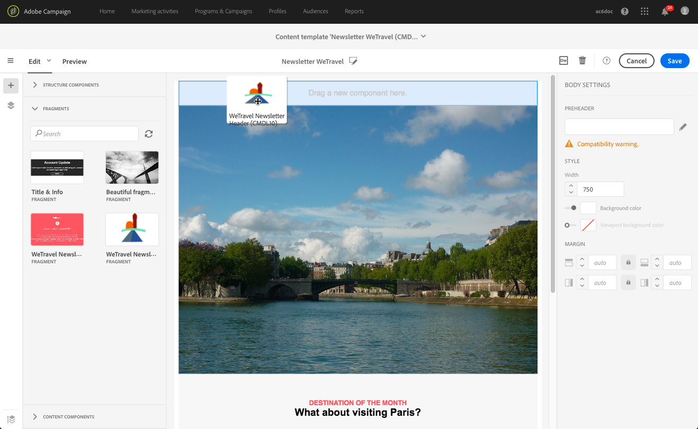
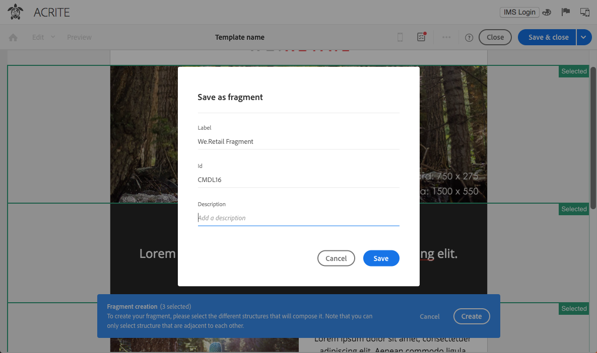
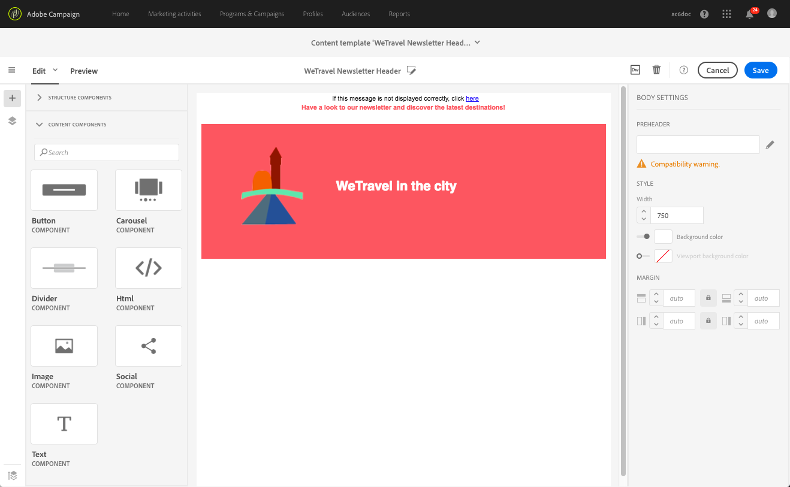

# 再利用可能なコンテンツの作成と使用 {#using-reusable-content}

Eメールコンテンツの編集をマスターする方法を説明します。 Eメールデザイナーを使用すると、独自の定義済みコンテンツを使用してテンプレートとフラグメントを作成し、後で配信する際に再利用できます。

## テンプレートを使用したEメールのデザイン {#designing-templates}

>[!NOTE]
>
> Adobe Campaign Standardでは、**リソース** / **テンプレート**&#x200B;メニューからアクセスできる様々なタイプのテンプレートを作成できます。 Eメールデザイナーで使用されるテンプレートは、コンテンツテンプレートです。 詳しくは、[テンプレートについて](../../start/using/marketing-activity-templates.md)を参照してください。

 [ビデオでテンプレートを作成する方法を確認する](#video)

### コンテンツテンプレートについて {#content-templates}

[Eメールデザイナー](../../designing/using/designing-content-in-adobe-campaign.md)のホームページの「**[!UICONTROL Templates]**」タブで提供されるHTMLコンテンツを管理できます。

標準のEメールコンテンツテンプレートには、モバイル用に最適化された18個のレイアウトと、Behanceのアーティストがデザインしたクラス最高の4つのレスポンシブテンプレートが含まれています。 これらは、顧客歓迎メッセージ、ニュースレター、再エンゲージメントEメールなど、最新の使用状況に対応しています。 ブランドのコンテンツを使用して簡単にカスタマイズでき、ゼロからEメールを簡単にデザインできます。

HTMLコンテンツテンプレートには、[詳細設定メニュー](../../start/using/interface-description.md#advanced-menu)の&#x200B;**[!UICONTROL Resources]** > **[!UICONTROL Content templates & fragments]**&#x200B;画面からアクセスできます。 ここから、ランディングページコンテンツテンプレート、Eメールコンテンツテンプレートおよびフラグメントを管理できます。

標準のコンテンツテンプレートは読み取り専用です。 そのうちの1つを編集するには、まず目的のテンプレートを複製する必要があります。

新しいテンプレートまたはフラグメントを作成し、独自のコンテンツを定義できます。 詳しくは、[コンテンツテンプレートの作成](#creating-a-content-template)および[コンテンツフラグメントの作成](#creating-a-content-fragment)を参照してください。

Eメールデザイナーでコンテンツを編集する場合は、コンテンツをフラグメントまたはテンプレートとして保存して、コンテンツテンプレートを作成することもできます。 詳しくは、 [コンテンツをテンプレートとして保存する](#saving-content-as-template)および[コンテンツをフラグメントとして保存する](../../designing/using/using-reusable-content.md#saving-content-as-a-fragment)を参照してください。

**関連トピック：**

* コンテンツの編集について詳しくは、「[Eメールコンテンツのデザインについて](../../designing/using/designing-content-in-adobe-campaign.md)」を参照してください。

### コンテンツテンプレートの作成 {#creating-a-content-template}

独自のコンテンツテンプレートを作成して、必要な回数だけ使用できます。

次の例は、Eメールコンテンツテンプレートの作成方法を示しています。

1. **[!UICONTROL Resources]** > **[!UICONTROL Content templates & fragments]**&#x200B;に移動し、**[!UICONTROL Create]**&#x200B;をクリックします。
1. Eメールラベルをクリックして、Eメールデザイナーの「**[!UICONTROL Properties]**」タブにアクセスします。
1. このテンプレートをEメールで使用できるように、認識可能なラベルを指定し、次のパラメーターを選択します。

   * **[!UICONTROL Content type]**&#x200B;ドロップダウンリストから&#x200B;**[!UICONTROL Shared]**&#x200B;または&#x200B;**[!UICONTROL Delivery]**&#x200B;を選択します。
   * **[!UICONTROL HTML type]**&#x200B;ドロップダウンリストから&#x200B;**[!UICONTROL Template]**&#x200B;を選択します。

   

1. 必要に応じて、テンプレートのサムネールとして使用する画像を設定できます。 テンプレートプロパティの「**[!UICONTROL Thumbnail]**」タブから選択します。

   

   このサムネールは、[Eメールデザイナー](../../designing/using/designing-content-in-adobe-campaign.md)のホームページの「**[!UICONTROL Templates]**」タブに表示されます。

1. **[!UICONTROL Properties]**&#x200B;タブを閉じて、メインワークスペースに戻ります。
1. 必要に応じてカスタマイズできる構造コンポーネントとコンテンツコンポーネントを追加します。
   >[!NOTE]
   >
   > コンテンツテンプレート内にパーソナライゼーションフィールドや条件付きコンテンツを挿入することはできません。
1. 編集が完了したら、テンプレートを保存します。

このテンプレートは、Eメールデザイナーで作成した任意のEメールで使用できるようになりました。 [Eメールデザイナー](../../designing/using/designing-content-in-adobe-campaign.md)のホームページの「**[!UICONTROL Templates]**」タブから選択します。

### コンテンツをテンプレートとして保存 {#saving-content-as-template}

EメールデザイナーでEメールを編集する際に、そのEメールの内容をテンプレートとして直接保存できます。

<!--[!CAUTION]
>
>You cannot save as template a structure containing personalization fields or dynamic content.-->

1. Eメールデザイナーのメインツールバーから&#x200B;**[!UICONTROL Save as template]**&#x200B;を選択します。

   

1. 必要に応じてラベルと説明を追加し、「**[!UICONTROL Save]**」をクリックします。

   

1. 作成したテンプレートを探すには、**[!UICONTROL Resources]** > **[!UICONTROL Content templates & fragments]**&#x200B;に移動します。

1. 新しいテンプレートを使用するには、[Eメールデザイナー](../../designing/using/designing-content-in-adobe-campaign.md)ホームページの「**[!UICONTROL Templates]**」タブから選択します。

   

### フラグメントとコンポーネントを使用したテンプレートの作成 {#template-fragments-components}

これで、EメールデザイナーでEメールテンプレートを作成できます。 コンテンツコンポーネントを使用して、Eメールの様々なセクションを反映し、元のニュースレターにできるだけ近づくように設定を調整します。 最後に、作成したフラグメントを挿入します。

1. Eメールデザイナーを使用して、テンプレートを作成します。 詳しくは、[コンテンツテンプレート](#content-templates)を参照してください。
1. テンプレートに、電子メールのヘッダー、フッター、本文に対応する構造コンポーネントを挿入します。 構造コンポーネントの追加について詳しくは、[Eメールデザイナーでの電子メール構造の編集](../../designing/using/designing-from-scratch.md#defining-the-email-structure)を参照してください。
1. コンテンツコンポーネントを必要な数だけ挿入して、ニュースレターの本文を作成します。 これは、毎月更新するEメールの編集可能なコンテンツになります。

   

   HTMLコードに精通している場合は、元の電子メールのより複雑な要素をコピー&amp;ペーストできる&#x200B;**[!UICONTROL Html]**&#x200B;コンポーネントを活用することをAdobeにお勧めします。 残りのコンテンツには、**[!UICONTROL Button]**、**[!UICONTROL Image]**、**[!UICONTROL Text]**&#x200B;などの他のコンポーネントを使用します。 詳しくは、[コンテンツコンポーネントについて](../../designing/using/designing-from-scratch.md#about-content-components)を参照してください。

   >[!NOTE]
   >
   >**[!UICONTROL Html]**&#x200B;コンポーネントを使用すると、制限付きオプションで編集可能なコンポーネントが作成されます。 このコンポーネントを選択する前に、HTMLコードの処理方法を理解しておいてください。

1. コンテンツコンポーネントを、元のEメールとできるだけ一致するように調整します。

   

   スタイル設定とインライン属性の管理について詳しくは、[電子メールスタイルの編集](../../designing/using/styles.md)を参照してください。

1. 作成済みの2つのフラグメント（ヘッダーとフッター）を、目的の構造コンポーネントに挿入します。

   

1. テンプレートを保存します。

これで、Eメールデザイナー内でこのテンプレートを完全に管理し、毎月受信者に送信するニュースレターを作成および更新できます。

Eメールを使用するには、Eメールを作成し、先ほど作成したコンテンツテンプレートを選択します。

**関連トピック**：

* [E メールの作成](../../channels/using/creating-an-email.md)
* [Eメールデザイナーの紹介ビデオ](../../designing/using/designing-content-in-adobe-campaign.md#video)
* [Eメールコンテンツをゼロからデザインする](../../designing/using/designing-from-scratch.md#designing-an-email-content-from-scratch)

### チュートリアルビデオ {#video}

このビデオでは、独自のテンプレートの作成方法を説明します。

>[!VIDEO](https://video.tv.adobe.com/v/23106?quality=12)

追加のCampaign Standardハウツービデオは[こちら](https://experienceleague.adobe.com/docs/campaign-standard-learn/tutorials/overview.html?lang=ja)からご覧いただけます。

## フラグメントについて {#about-fragments}

>[!CONTEXTUALHELP]
>id="ac_fragments"
>title="フラグメントについて"
>abstract="フラグメントは、1つ以上のEメールで参照できる再利用可能なコンテンツブロックです。"

フラグメントは、1つ以上のEメールで参照できる再利用可能なコンポーネントです。
これらは、**リソース** > **コンテンツフラグメントとテンプレート**&#x200B;の下のインターフェイスにあります。

Eメールデザイナーでフラグメントを最大限に活用するには、次の手順を実行します。

* 独自のフラグメントを作成する。 [コンテンツフラグメントの作成](#creating-a-content-fragment)および[コンテンツをフラグメントとして保存](#saving-content-as-a-fragment)を参照してください。
* 必要な回数だけEメールで使用します。 [Eメールへの要素の挿入](#inserting-elements-into-an-email)を参照してください。
* フラグメントを編集すると、変更が同期されます。フラグメントが含まれているすべてのeメール（まだ準備または送信されていない場合）に自動的に反映されます。

Eメールに追加すると、フラグメントはデフォルトでロックされます。 特定のEメールのフラグメントを変更する場合は、そのフラグメントが使用されているEメール内のロックを解除することで、元のフラグメントとの同期を解除できます。 変更は同期されなくなります。

Eメール内のフラグメントのロックを解除するには、フラグメントを選択し、コンテキストツールバーのロックアイコンをクリックします。

そのフラグメントは、元のフラグメントにリンクされなくなったスタンドアロンコンポーネントになります。 その後、他のコンテンツコンポーネントとして編集できます。 [コンテンツコンポーネントについて](../../designing/using/designing-from-scratch.md#about-content-components)を参照してください。

### フラグメントのEメールへの挿入 {#inserting-elements-into-an-email}

Eメールのコンテンツを定義するには、あらかじめ配置した構造コンポーネントにコンテンツ要素を追加します。 [Eメール構造の編集](../../designing/using/designing-from-scratch.md#defining-the-email-structure)を参照してください。

1. 左側の&#x200B;**+**&#x200B;アイコンを選択して、コンテンツ要素にアクセスします。 「[フラグメント](#about-fragments)」または「[コンテンツコンポーネント](../../designing/using/designing-from-scratch.md#about-content-components)」を選択します。
1. 追加するフラグメントのラベルまたはラベルの一部が既にわかっている場合は、それを検索できます。

   

1. パレットからEメールの構造コンポーネントにフラグメントまたはコンテンツコンポーネントをドラッグ&amp;ドロップします。

   

   要素をEメールに追加した後は、構造コンポーネント内、またはEメール内の別の構造コンポーネント内に移動できます。

   

1. このEメールのニーズに合わせて要素を編集します。 テキスト、リンク、画像などを追加できます。

   >[!NOTE]
   >
   >フラグメントは、Eメールに追加されると、デフォルトでロックされます。 特定のEメールのフラグメントを変更する場合や、フラグメントで直接変更する場合は、元のフラグメントとの同期を解除できます。 [フラグメントについて](#about-fragments)を参照してください。

1. Eメールに追加する必要のあるすべての要素に対して、この手順を繰り返します。
1. 電子メールを保存します。

これで、Eメールの構造が設定され、各コンテンツ要素のスタイルを編集できます。 [要素の編集](../../designing/using/styles.md)を参照してください。

>[!NOTE]
>
>フラグメントを変更すると、変更内容がそのフラグメントが使用されているEメールに自動的に反映されます。 詳しくは、[フラグメントについて](#about-fragments)を参照してください。

### コンテンツフラグメントの作成 {#creating-a-content-fragment}

独自のコンテンツフラグメントを作成して、必要に応じて1つ以上のEメールで使用できます。

1. **[!UICONTROL Resources]** > **[!UICONTROL Content templates & fragments]**&#x200B;に移動し、**[!UICONTROL Create]**&#x200B;をクリックします。
1. Eメールラベルをクリックして、Eメールデザイナーの「**[!UICONTROL Properties]**」タブにアクセスします。
1. Eメールコンテンツの編集時にフラグメントを見つけるには、認識可能なラベルを指定し、次のパラメーターを選択します。

   * フラグメントはEメールとのみ互換性があるので、**[!UICONTROL Content type]**&#x200B;ドロップダウンリストから「**[!UICONTROL Delivery]**」を選択します。
   * **[!UICONTROL HTML type]**&#x200B;ドロップダウンリストから&#x200B;**[!UICONTROL Fragment]**&#x200B;を選択すると、このコンテンツをフラグメントとして使用できます。

   

1. 必要に応じて、フラグメントのサムネールとして使用する画像を設定できます。 テンプレートプロパティの「**[!UICONTROL Thumbnail]**」タブから選択します。

   

   このサムネールは、Eメールの編集時にフラグメントのラベルの横に表示されます。

1. **[!UICONTROL Properties]**&#x200B;タブを閉じて、メインワークスペースに戻ります。
1. 必要に応じてカスタマイズできる構造コンポーネントとコンテンツコンポーネントを追加します。

   >[!CAUTION]
   >
   >フラグメントには、パーソナライゼーションフィールド、動的コンテンツ、別のフラグメントを含めることはできません.
   >
   >空の構造コンポーネントを含むフラグメントコンテンツとして保存しないでください。 フラグメントを挿入すると、編集できなくなります。
   >
   >[モバイルビュー](../../designing/using/plain-text-html-modes.md#switching-to-mobile-view)はフラグメントでは使用できません。

1. 編集が完了したら、フラグメントを保存します。

このフラグメントは、Eメールデザイナーで作成された任意のEメールで使用できるようになりました。 パレットの&#x200B;**[!UICONTROL Fragments]**&#x200B;セクションの下に表示されます。

>[!NOTE]
>
>パーソナライゼーションフィールドをフラグメント内に挿入することはできません。ただし、Eメールで使用され、ロックが解除されている場合は除きます。 [フラグメントについて](#about-fragments)を参照してください。

### コンテンツをフラグメントとして保存 {#saving-content-as-a-fragment}

EメールデザイナーでEメールを編集する際に、そのEメールの一部をフラグメントとして直接保存できます。

* パーソナライゼーションフィールド、動的コンテンツ、または別のフラグメントを含む構造をフラグメントとして保存することはできません。
* 互いに隣り合う構造のみを選択できます。
<!-- - You cannot select an empty structure.-->

1. EメールデザイナーでEメールを編集する際に、メインツールバーから&#x200B;**[!UICONTROL Save as fragment]**&#x200B;を選択します。

   

1. ワークスペースから、フラグメントを構成する構造を選択します。

   

   >[!NOTE]
   >
   >互いに隣接し、パーソナライゼーションフィールド、動的コンテンツ、別のフラグメントを含まない構造を選択していることを確認します。
   <!--You cannot select an empty structure.-->

1. 「**[!UICONTROL Create]**」をクリックします。

1. 必要に応じてラベルと説明を追加し、「**[!UICONTROL Save]**」をクリックします。

   

1. 作成したフラグメントを探すには、**[!UICONTROL Resources]** > **[!UICONTROL Content templates & fragments]**&#x200B;に移動します。

   

1. 新しいフラグメントを使用するには、任意のEメールコンテンツを開き、フラグメントリストから選択します。

>[!NOTE]
>[モバイルビュー](../../designing/using/plain-text-html-modes.md#switching-to-mobile-view)はフラグメントでは使用できません。 電子メールのモバイル表示を編集する場合は、コンテンツをフラグメントとして保存する前に編集します。

<!--You need to copy-paste the HTML corresponding to the section that you want to save into a new fragment.

>[!NOTE]
>
>To do this, you need to be familiar with HTML code.

To save as a fragment some email content that you created, follow the steps below.

1. When editing an email in the Email Designer, select **[!UICONTROL Edit]** > **[!UICONTROL HTML]** to open the HTML version of that email.
1. Select and copy the HTML corresponding to the part that you want to save.
1. Go to **[!UICONTROL Resources]** > **[!UICONTROL Content templates & fragments]** and click **[!UICONTROL Create]**.
1. Click the email label to access the **[!UICONTROL Properties]** tab of the Email Designer and select **[!UICONTROL Fragment]** from the **[!UICONTROL HTML type]** drop-down list.
1. Select **[!UICONTROL Edit]** > **[!UICONTROL HTML]** to open the HTML version of the fragment.
1. Paste the HTML that you copied where appropriate.
1. Switch back to the **[!UICONTROL Edit]** view to check the result and save the new fragment.-->

## フラグメントを使用した再利用可能なヘッダーとフッターの作成 {#header-footer-fragments}

Eメールデザイナーを使用して、再利用可能な各セクション用のフラグメントを作成します。 この例では、2つのフラグメントを作成します。1つはヘッダー用、もう1つはフッター用です。 その後、既存のコンテンツの関連する部分をこれらのフラグメントにコピーできます。

これは、次の手順に従って行います。

1. Adobe Campaignで、 **[!UICONTROL Resources]** / **[!UICONTROL Content templates & fragments]**&#x200B;に移動し、ヘッダーのフラグメントを作成します。 詳しくは、[コンテンツフラグメントの作成](#creating-a-content-fragment)を参照してください。
1. フラグメントに必要な数の構造コンポーネントを追加します。

   

1. 構造に画像コンポーネントとテキストコンポーネントを挿入します。

   

1. 対応する画像をアップロードし、テキストを入力して設定を調整します。

   

1. フラグメントを保存します。
1. 同様に、フッターを作成して保存します。

   

これで、フラグメントをテンプレートで使用する準備が整いました。
