# 再利用可能なコンテンツの制作と利用 {#using-reusable-content}

メールコンテンツの編集方法を学びましょう。 電子メールDesignerでは、独自の定義済みコンテンツを使用してテンプレートやフラグメントを作成し、それらを次の配信に再利用できます。

## テンプレートを使用したメールのデザイン {#designing-templates}

>[!NOTE]
>
> Adobe Campaign Standardでは、**リソース** > **テンプレート** メニューからアクセスできる様々なタイプのテンプレートを作成できます。 メールDesignerで使用されるテンプレートは、コンテンツテンプレートです。 詳しくは、[ テンプレートについて](../../start/using/marketing-activity-templates.md)を参照してください。

 [ ビデオでテンプレートを作成する方法を確認](#video)

### コンテンツテンプレートについて {#content-templates}

[電子メールDesigner](../../designing/using/designing-content-in-adobe-campaign.md) ホームページの「**[!UICONTROL Templates]**」タブで提供されるHTML コンテンツを管理できます。

すぐに使用できるメールコンテンツテンプレートには、モバイルに最適化された18種類のレイアウトと、Behanceのアーティストがデザインしたクラス最高のレスポンシブテンプレート 4種類が含まれています。 これらのレポートは、顧客のウェルカムメッセージ、ニュースレター、リエンゲージメントメールなどの最新の使用状況に対応しています。 また、ブランドコンテンツに合わせて容易にカスタマイズできるため、ゼロからメールを設計するプロセスを簡素化できます。

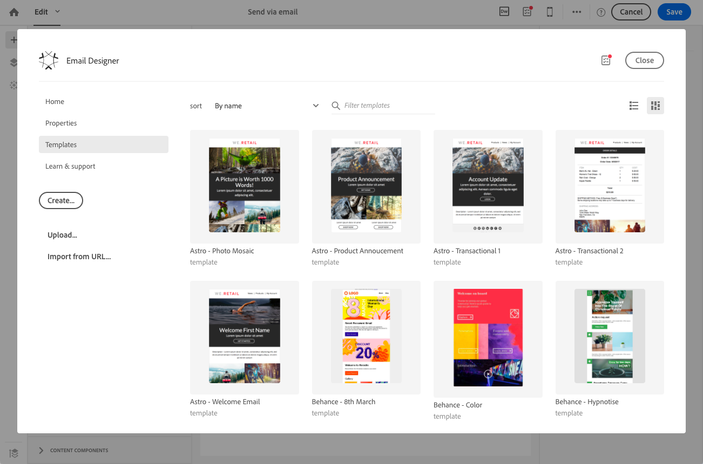

HTML コンテンツテンプレートには、[詳細メニュー](../../start/using/interface-description.md#advanced-menu)の&#x200B;**[!UICONTROL Resources]** > **[!UICONTROL Content templates & fragments]**&#x200B;画面からアクセスできます。 これにより、ランディングページのコンテンツテンプレート、メールコンテンツテンプレートおよびフラグメントを管理できます。

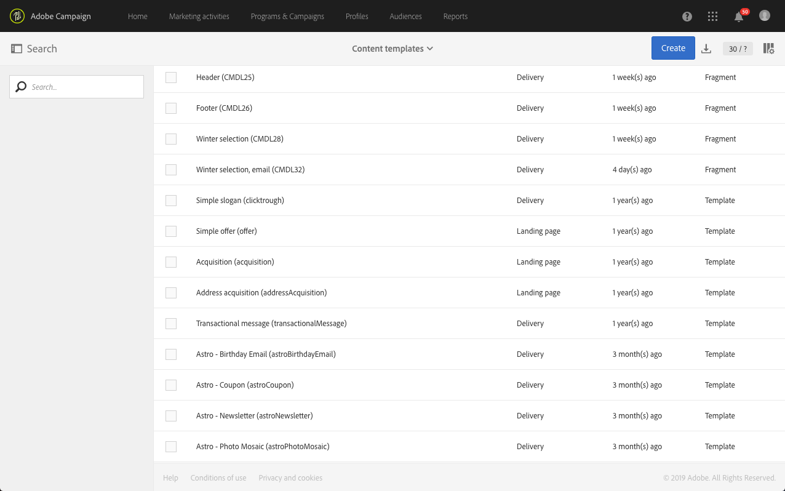

すぐに使用できるコンテンツテンプレートは読み取り専用です。 そのうちの1つを編集するには、まず目的のテンプレートを複製する必要があります。

新しいテンプレートやフラグメントを作成し、独自のコンテンツを定義できます。 詳しくは、[ コンテンツテンプレートの作成](#creating-a-content-template)および[ コンテンツフラグメントの作成](#creating-a-content-fragment)を参照してください。

メールDesignerを使用してコンテンツを編集する場合は、コンテンツをフラグメントまたはテンプレートとして保存して、コンテンツテンプレートを作成することもできます。 詳しくは、[ コンテンツをテンプレートとして保存](#saving-content-as-template)および[ コンテンツをフラグメントとして保存](../../designing/using/using-reusable-content.md#saving-content-as-a-fragment)を参照してください。

**関連トピック：**

* コンテンツの編集について詳しくは、[電子メールコンテンツデザインについて](../../designing/using/designing-content-in-adobe-campaign.md)を参照してください。

### コンテンツテンプレートの作成 {#creating-a-content-template}

独自のコンテンツテンプレートを作成し、必要に応じて何度でも使用できます。

次の例は、メールコンテンツテンプレートを作成する方法を示しています。

1. **[!UICONTROL Resources]** > **[!UICONTROL Content templates & fragments]**&#x200B;に移動し、**[!UICONTROL Create]**&#x200B;をクリックします。
1. 電子メールラベルをクリックして、電子メールDesignerの「**[!UICONTROL Properties]**」タブにアクセスします。
1. 認識可能なラベルを指定し、次のパラメーターを選択して、このテンプレートをメールで使用できるようにします。

   * **[!UICONTROL Content type]** ドロップダウンリストから&#x200B;**[!UICONTROL Shared]**&#x200B;または&#x200B;**[!UICONTROL Delivery]**&#x200B;を選択します。
   * 「**[!UICONTROL HTML type]**」ドロップダウンリストから「**[!UICONTROL Template]**」を選択します。

   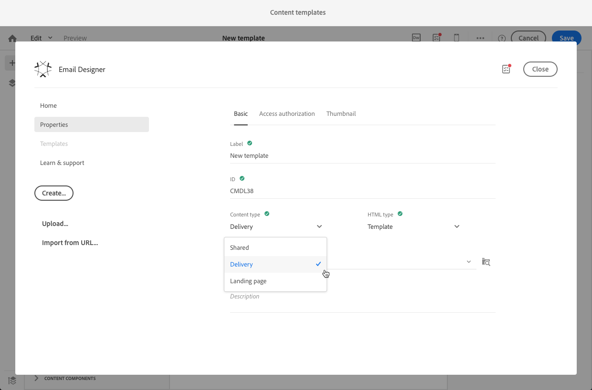

1. 必要に応じて、テンプレートのサムネールとして使用する画像を設定できます。 テンプレートプロパティの「**[!UICONTROL Thumbnail]**」タブから選択します。

   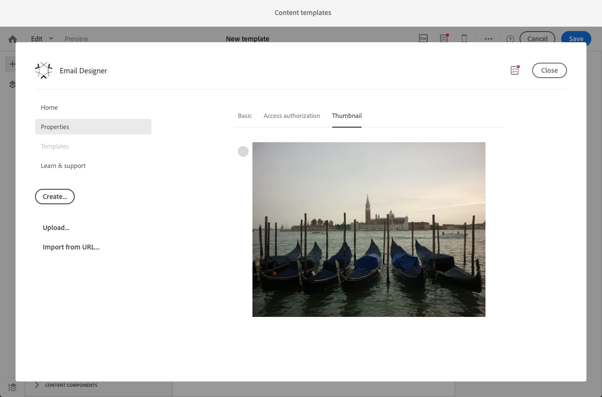

   このサムネールは、[電子メール Designer](../../designing/using/designing-content-in-adobe-campaign.md) ホームページの&#x200B;**[!UICONTROL Templates]** タブに表示されます。

1. 「**[!UICONTROL Properties]**」タブを閉じて、メインワークスペースに戻ります。
1. 必要に応じてカスタマイズできる構造コンポーネントやコンテンツコンポーネントを追加できます。
   >[!NOTE]
   >
   > コンテンツテンプレート内にパーソナライゼーションフィールドまたは条件付きコンテンツを挿入することはできません。
1. 編集したら、テンプレートを保存します。

このテンプレートは、Email Designerで作成されたメールで使用できるようになりました。 [電子メール Designer](../../designing/using/designing-content-in-adobe-campaign.md) ホームページの「**[!UICONTROL Templates]**」タブから選択します。

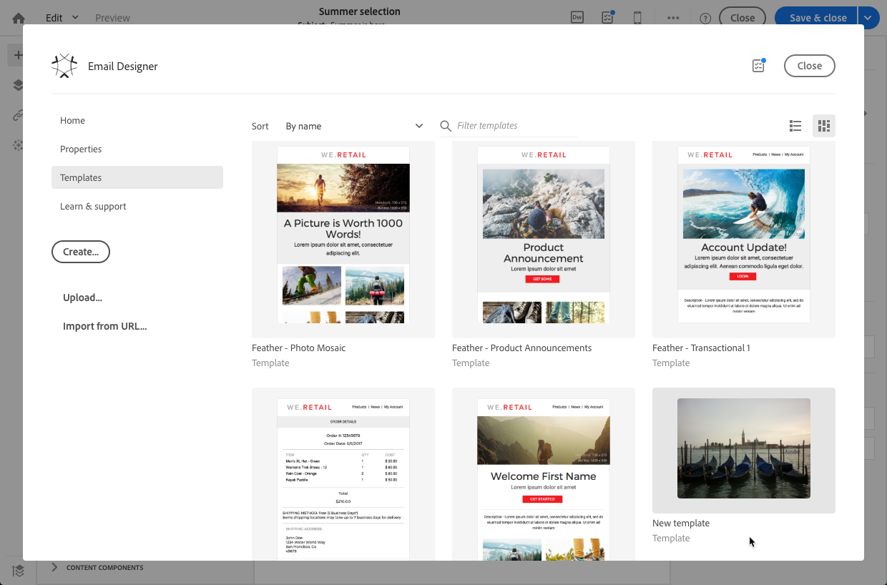

### コンテンツをテンプレートとして保存 {#saving-content-as-template}

メールDesignerを使用してメールを編集する場合、そのメールの内容をテンプレートとして直接保存できます。

<!--
[!CAUTION]
>
>You cannot save as template a structure containing personalization fields or dynamic content.
-->

1. メールDesignerのメインツールバーから「**[!UICONTROL Save as template]**」を選択します。

   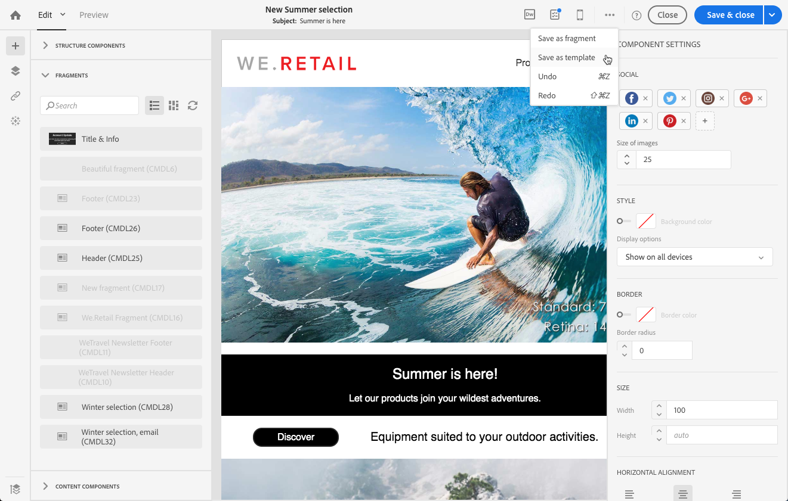

1. 必要に応じてラベルと説明を追加し、**[!UICONTROL Save]**&#x200B;をクリックします。

   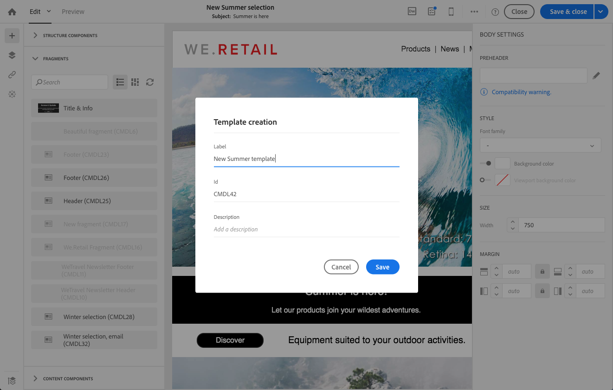

1. 作成したテンプレートを見つけるには、**[!UICONTROL Resources]** > **[!UICONTROL Content templates & fragments]**&#x200B;に移動します。

1. 新しいテンプレートを使用するには、[電子メールDesigner](../../designing/using/designing-content-in-adobe-campaign.md) ホームページの「**[!UICONTROL Templates]**」タブからテンプレートを選択します。

   

### フラグメントとコンポーネントを使用したテンプレートの作成 {#template-fragments-components}

これで、電子メールDesignerを使用して電子メールテンプレートを作成できます。 コンテンツコンポーネントを使用して、電子メールのさまざまなセクションを反映し、設定を調整して、元のニュースレターにできるだけ近づけます。 最後に、作成したばかりのフラグメントを挿入します。

1. 電子メールDesignerを使用して、テンプレートを作成します。 詳しくは、[ コンテンツテンプレート ](#content-templates)を参照してください。
1. メールのヘッダー、フッター、本文に対応する複数の構造コンポーネントをテンプレートに挿入します。 構造コンポーネントの追加について詳しくは、[電子メール Designerを使用した電子メール構造の編集](../../designing/using/designing-from-scratch.md#defining-the-email-structure)を参照してください。
1. ニュースレターの本文を作成するには、必要な数のコンテンツコンポーネントを挿入します。 これは、毎月更新されるメールの編集可能なコンテンツです。

   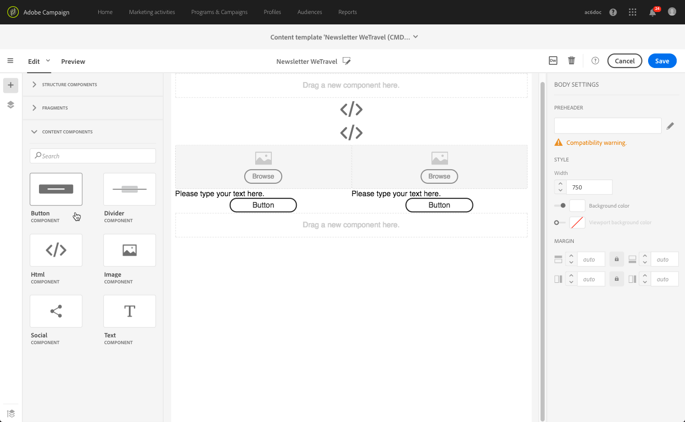

   HTML コードに精通している場合は、Adobeでは、元の電子メールのより複雑な要素をコピー&amp;ペーストできる&#x200B;**[!UICONTROL Html]** コンポーネントを活用することをお勧めします。 残りのコンテンツには、**[!UICONTROL Button]**、**[!UICONTROL Image]**、**[!UICONTROL Text]**&#x200B;などの他のコンポーネントを使用します。 詳しくは、[ コンテンツコンポーネントについて](../../designing/using/designing-from-scratch.md#about-content-components)を参照してください。

   >[!NOTE]
   >
   >**[!UICONTROL Html]** コンポーネントを使用すると、限られたオプションで編集可能なコンポーネントが作成されます。 このコンポーネントを選択する前に、HTML コードの処理方法を確認してください。

1. コンテンツコンポーネントは、元のメールとできるだけ一致するように調整します。

   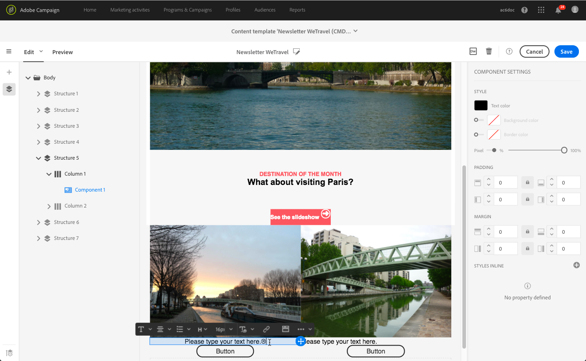

   スタイル設定とインライン属性の管理について詳しくは、[電子メールスタイルの編集](../../designing/using/styles.md)を参照してください。

1. 以前に作成した2つのフラグメント（ヘッダーとフッター）を、目的の構造コンポーネントに挿入します。

   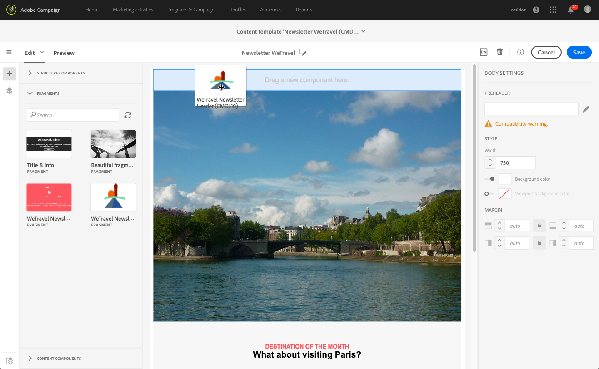

1. テンプレートを保存します。

これで、電子メールDesigner内でこのテンプレートを完全に管理して、毎月の受信者に送信するニュースレターを作成および更新できるようになりました。

使用するには、メールを作成し、作成したコンテンツテンプレートを選択します。

**関連トピック**：

* [メールの作成](../../channels/using/creating-an-email.md)
* [電子メール Designerの概要ビデオ](../../designing/using/designing-content-in-adobe-campaign.md#video)
* [メールコンテンツをゼロから設計](../../designing/using/designing-from-scratch.md#designing-an-email-content-from-scratch)

### チュートリアルビデオ {#video}

このビデオでは、独自のテンプレートの作成方法を説明します。

>[!VIDEO](https://video.tv.adobe.com/v/23106?quality=12)

その他のCampaign Standardのハウツー動画は[こちら](https://experienceleague.adobe.com/docs/campaign-standard-learn/tutorials/overview.html?lang=ja)でご覧いただけます。

## フラグメントについて {#about-fragments}

>[!CONTEXTUALHELP]
>id="ac_fragments"
>title="フラグメントについて"
>abstract="フラグメントは、1 つ以上のメールで参照できる再利用可能なコンテンツブロックです。"

フラグメントは、1つ以上のメールで参照できる再利用可能なコンポーネントです。
これらは、**リソース**/**コンテンツフラグメントとテンプレート**&#x200B;の下のインターフェイスにあります。

電子メールDesignerのフラグメントを最大限に活用するには：

* 独自のフラグメントを作成。 [ コンテンツフラグメントの作成](#creating-a-content-fragment)および[ コンテンツをフラグメントとして保存](#saving-content-as-a-fragment)を参照してください。
* 電子メールは必要な回数だけ使用します。 [電子メールへの要素の挿入](#inserting-elements-into-an-email)を参照してください。
* フラグメントを編集すると、変更は同期されます。フラグメントを含むすべての電子メールに自動的に反映されます（まだ準備または送信されていない場合）。

メールに追加すると、フラグメントはデフォルトでロックされます。 特定の電子メールのフラグメントを変更する場合は、使用する電子メール内でフラグメントのロックを解除することで、元のフラグメントとの同期を解除できます。 変更は同期されなくなります。

メール内のフラグメントのロックを解除するには、そのフラグメントを選択し、コンテキストツールバーのロックアイコンをクリックします。

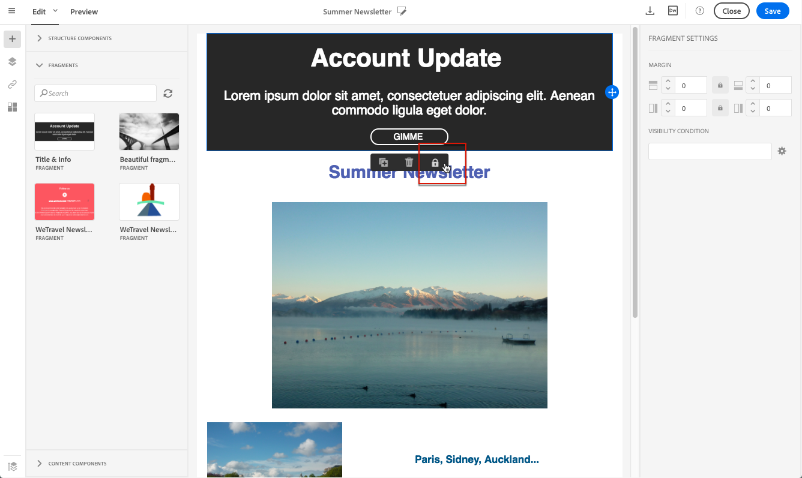

そのフラグメントは、元のフラグメントにリンクされていないスタンドアロンコンポーネントになります。 その後、他のコンテンツコンポーネントとして編集できます。 [ コンテンツコンポーネントについて](../../designing/using/designing-from-scratch.md#about-content-components)を参照してください。

### メールへのフラグメントの挿入 {#inserting-elements-into-an-email}

メールのコンテンツを定義するには、事前に配置した構造コンポーネントにコンテンツ要素を追加します。 [ メール構造の編集](../../designing/using/designing-from-scratch.md#defining-the-email-structure)を参照してください。

1. 左側の&#x200B;**+** アイコンを選択して、コンテンツ要素にアクセスします。 [ フラグメント ](#about-fragments)または[ コンテンツコンポーネント ](../../designing/using/designing-from-scratch.md#about-content-components)を選択します。
1. 追加するフラグメントのラベルまたはラベルの一部が既にわかっている場合は、それを検索できます。

   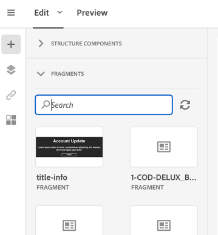

1. フラグメントまたはコンテンツコンポーネントをパレットからメールの構造コンポーネントにドラッグ&amp;ドロップします。

   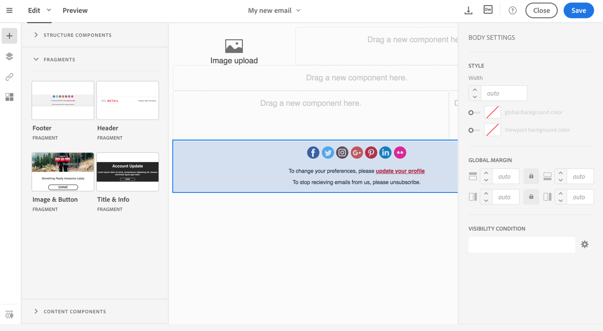

   要素がメールに追加されると、その要素は構造コンポーネント内またはメール内の別の構造コンポーネントに移動できます。

   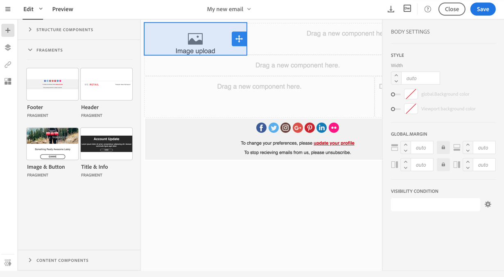

1. このメールのニーズに合わせて要素を編集します。 テキスト、リンク、画像などを追加できます。

   >[!NOTE]
   >
   >フラグメントは、メールに追加すると、デフォルトでロックされます。 特定の電子メールのフラグメントを変更する場合や、フラグメント内で直接変更を行う場合は、元のフラグメントとの同期を解除できます。 「[ フラグメントについて](#about-fragments)」を参照してください。

1. 電子メールに追加する必要があるすべての要素について、この手順を繰り返します。
1. メールアドレスを保存。

メール構造が入力されたので、各コンテンツ要素のスタイルを編集できます。 [要素の編集](../../designing/using/styles.md)を参照してください。

>[!NOTE]
>
>フラグメントが変更されると、その変更は使用されるメールに自動的に反映されます。 詳しくは、「[ フラグメントについて](#about-fragments)」を参照してください。

### コンテンツフラグメントの作成 {#creating-a-content-fragment}

独自のコンテンツフラグメントを作成し、必要に応じて1つ以上のメールで使用できます。

1. **[!UICONTROL Resources]** > **[!UICONTROL Content templates & fragments]**&#x200B;に移動し、**[!UICONTROL Create]**&#x200B;をクリックします。
1. 電子メールラベルをクリックして、電子メールDesignerの「**[!UICONTROL Properties]**」タブにアクセスします。
1. 認識可能なラベルを指定し、次のパラメーターを選択して、メールコンテンツの編集時にフラグメントを検索します。

   * フラグメントはメールとのみ互換性があるので、**[!UICONTROL Content type]** ドロップダウンリストから&#x200B;**[!UICONTROL Delivery]**&#x200B;を選択します。
   * 「**[!UICONTROL HTML type]**」ドロップダウンリストから「**[!UICONTROL Fragment]**」を選択すると、このコンテンツをフラグメントとして使用できます。

   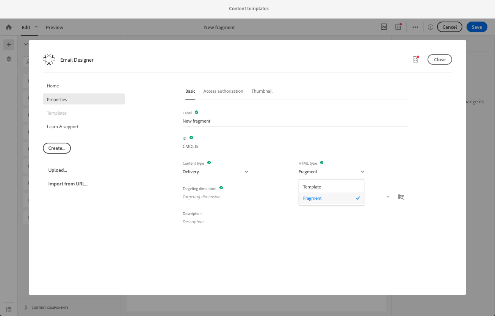

1. 必要に応じて、フラグメントのサムネールとして使用する画像を設定できます。 テンプレートプロパティの「**[!UICONTROL Thumbnail]**」タブから選択します。

   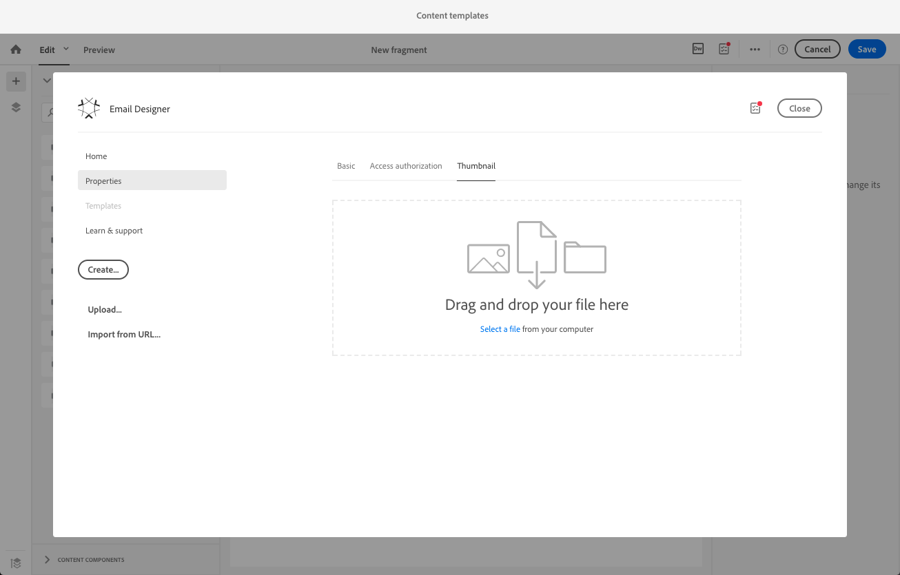

   このサムネールは、メールの編集時にフラグメントのラベルの横に表示されます。

1. 「**[!UICONTROL Properties]**」タブを閉じて、メインワークスペースに戻ります。
1. 必要に応じてカスタマイズできる構造コンポーネントやコンテンツコンポーネントを追加できます。

   >[!CAUTION]
   >
   >フラグメントには、パーソナライゼーションフィールド、動的コンテンツ、または別のフラグメントを含めることはできません。
   >
   >空の構造コンポーネントを含むフラグメントコンテンツとして保存しないでください。 > フラグメントを挿入すると、編集できなくなります。
   >
   >[ モバイルビュー](../../designing/using/plain-text-html-modes.md#switching-to-mobile-view)はフラグメントでは利用できません。

1. 編集したら、フラグメントを保存します。

このフラグメントは、メールDesignerで作成されたあらゆるメールで使用できるようになりました。 パレットの「**[!UICONTROL Fragments]**」セクションに表示されます。

>[!NOTE]
>
>パーソナライゼーションフィールドをフラグメント内に挿入するには、電子メールで使用され、ロックを解除する必要があります。 「[ フラグメントについて](#about-fragments)」を参照してください。

### コンテンツをフラグメントとして保存 {#saving-content-as-a-fragment}

メールDesignerを使用してメールを編集する場合、そのメールの一部をフラグメントとして直接保存できます。

* パーソナライゼーションフィールド、動的コンテンツ、または別のフラグメントを含む構造をフラグメントとして保存することはできません。
* 隣接する構造のみを選択できます。
  <!-- - You cannot select an empty structure.-->

1. メールDesignerでメールを編集する場合は、メインツールバーから「**[!UICONTROL Save as fragment]**」を選択します。

   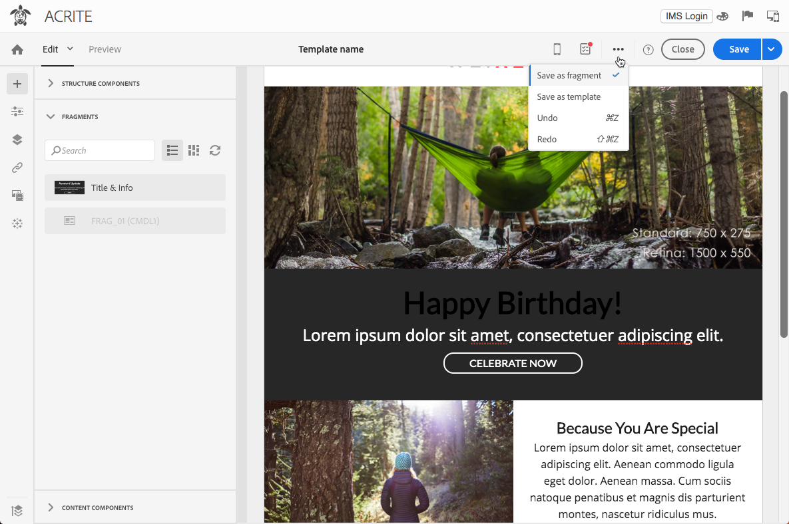

1. ワークスペースから、フラグメントを構成する構造を選択します。

   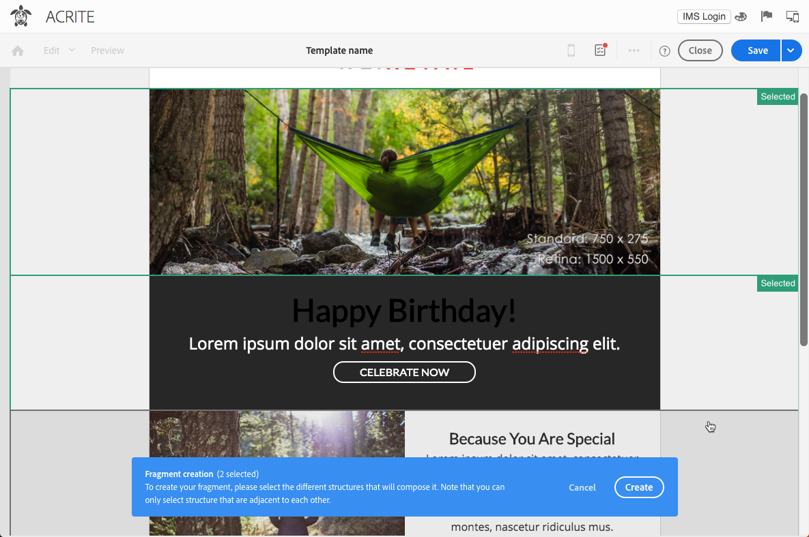

   >[!NOTE]
   >
   >パーソナライゼーションフィールド、動的コンテンツ、または別のフラグメントを含まない、互いに隣接する構造を選択してください。
   <!--You cannot select an empty structure.-->

1. 「**[!UICONTROL Create]**」をクリックします。

1. 必要に応じてラベルと説明を追加し、**[!UICONTROL Save]**&#x200B;をクリックします。

   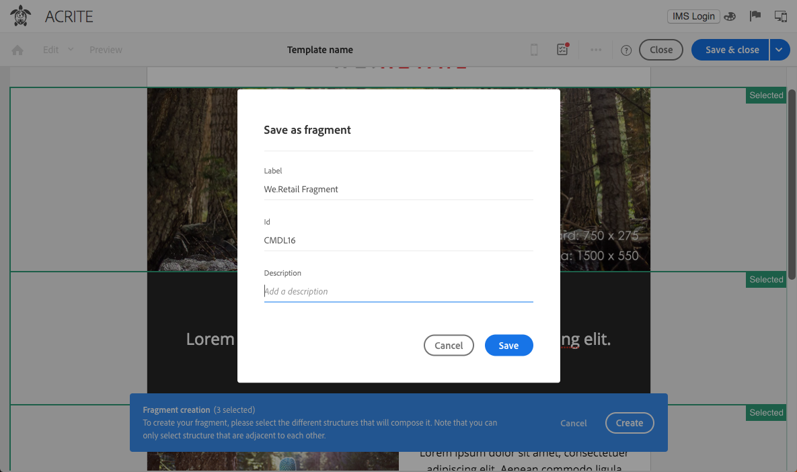

1. 作成したフラグメントを見つけるには、**[!UICONTROL Resources]** > **[!UICONTROL Content templates & fragments]**&#x200B;に移動します。

   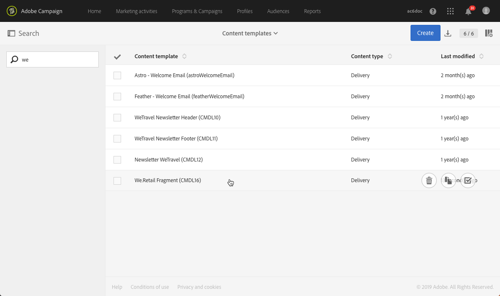

1. 新しいフラグメントを使用するには、任意のメールコンテンツを開き、フラグメントリストから選択します。

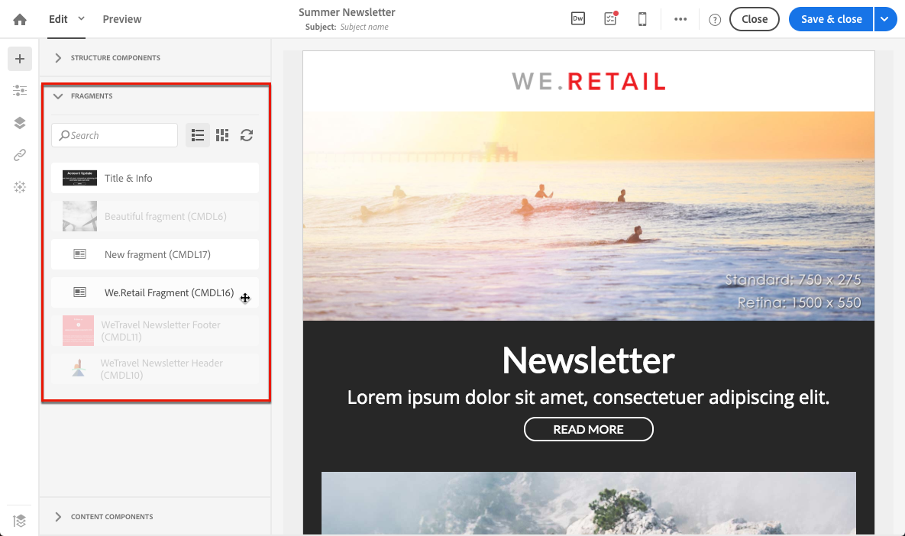

>[!NOTE]
>[ モバイルビュー](../../designing/using/plain-text-html-modes.md#switching-to-mobile-view)はフラグメントでは利用できません。 メールのモバイルビューを編集する場合は、コンテンツをフラグメントとして保存する前に編集します。

<!--
You need to copy-paste the HTML corresponding to the section that you want to save into a new fragment.

>[!NOTE]
>
>To do this, you need to be familiar with HTML code.

To save as a fragment some email content that you created, follow the steps below.

1. When editing an email in the Email Designer, select **[!UICONTROL Edit]** > **[!UICONTROL HTML]** to open the HTML version of that email.
1. Select and copy the HTML corresponding to the part that you want to save.
1. Go to **[!UICONTROL Resources]** > **[!UICONTROL Content templates & fragments]** and click **[!UICONTROL Create]**.
1. Click the email label to access the **[!UICONTROL Properties]** tab of the Email Designer and select **[!UICONTROL Fragment]** from the **[!UICONTROL HTML type]** drop-down list.
1. Select **[!UICONTROL Edit]** > **[!UICONTROL HTML]** to open the HTML version of the fragment.
1. Paste the HTML that you copied where appropriate.
1. Switch back to the **[!UICONTROL Edit]** view to check the result and save the new fragment.
-->

## フラグメントを使用した再利用可能なヘッダーとフッターの作成 {#header-footer-fragments}

メールDesignerを使用して、再利用可能なセクションごとにフラグメントを作成します。 この例では、ヘッダー用とフッター用の2つのフラグメントを作成します。 次に、既存のコンテンツから関連する部分をこれらのフラグメントにコピーできます。

これを行うには、次の手順に従います。

1. Adobe Campaignで、**[!UICONTROL Resources]** > **[!UICONTROL Content templates & fragments]**&#x200B;に移動し、ヘッダーのフラグメントを作成します。 詳しくは、[ コンテンツフラグメントの作成](#creating-a-content-fragment)を参照してください。
1. 構造コンポーネントを必要な数だけフラグメントに追加します。

   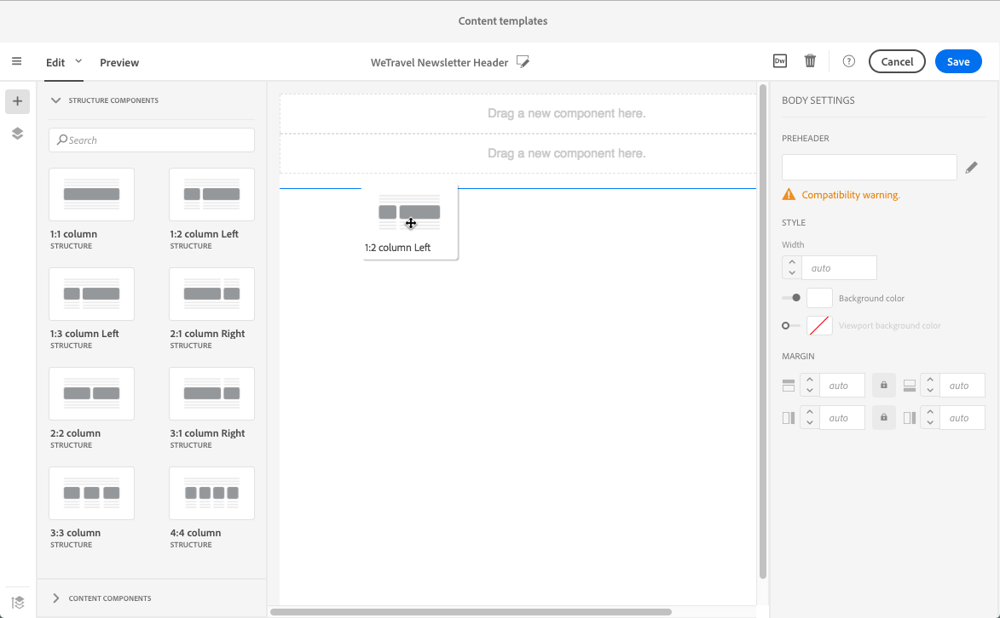

1. 画像コンポーネントとテキストコンポーネントを構造に挿入します。

   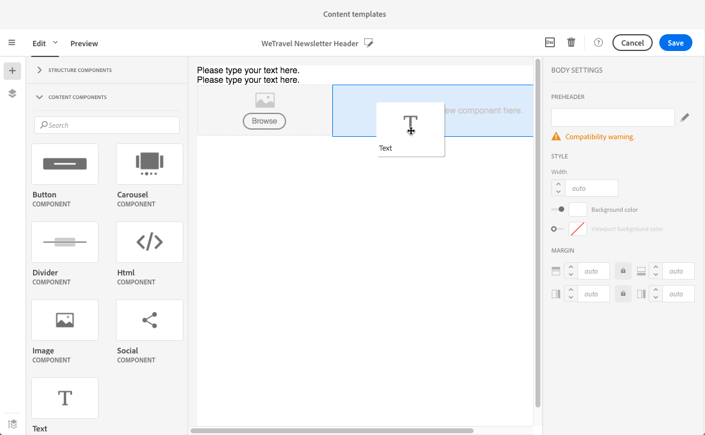

1. 対応する画像をアップロードし、テキストを入力して設定を調整します。

   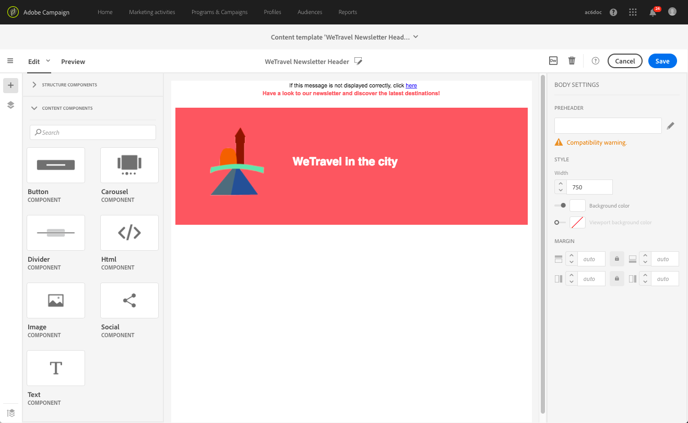

1. フラグメントを保存します。
1. 同様に、フッターを作成して保存します。

   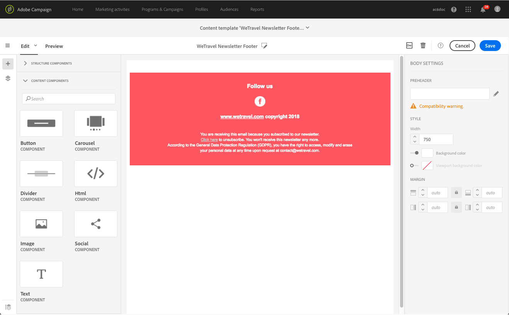

これで、フラグメントをテンプレートで使用する準備が整いました。
