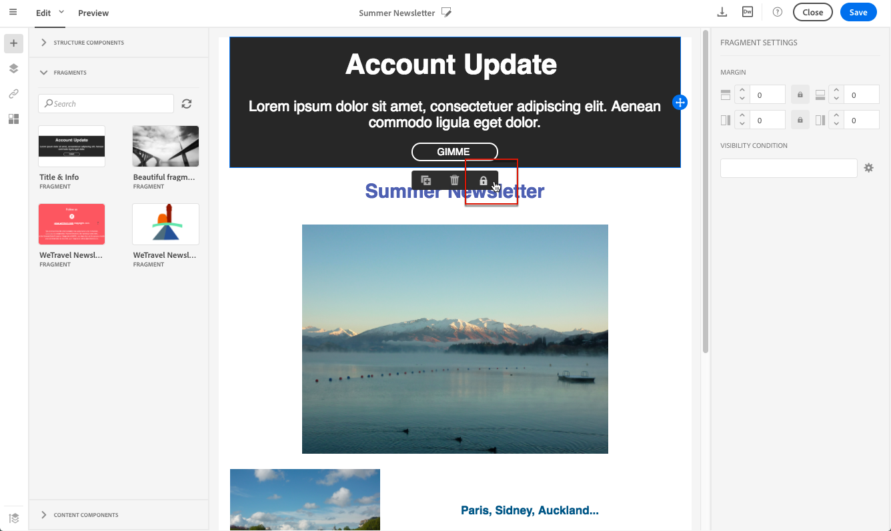

# 再利用可能なコンテンツの作成と使用 {#using-reusable-content}

E メールコンテンツのマスター方法を説明します。 E メールデザイナーでは、独自の事前定義済みコンテンツを使用してテンプレートとフラグメントを作成し、後続の配信に再利用できます。

## テンプレートを使用した E メールのデザイン {#designing-templates}

>[!NOTE]
>
> Adobe Campaign Standardでは、 **リソース** > **テンプレート** メニュー E メールデザイナーで使用されるテンプレートは、コンテンツテンプレートです。 詳しくは、 [テンプレートについて](../../start/using/marketing-activity-templates.md).

 [テンプレートの作成方法をビデオで確認](#video)

### コンテンツテンプレートについて {#content-templates}

HTMLコンテンツは、 **[!UICONTROL Templates]** タブ [メールデザイナー](../../designing/using/designing-content-in-adobe-campaign.md) ホームページ。

標準の E メールコンテンツテンプレートには、モバイルに最適化された 18 個のレイアウトと、Behanceのアーティストが設計したクラス最高の 4 つのレスポンシブテンプレートが含まれています。 これらは、顧客歓迎メッセージ、ニュースレター、再エンゲージメント E メールなど、最新の使用状況に対応しています。 ブランドのコンテンツを使用して簡単にカスタマイズできるので、ゼロから E メールを簡単に設計できます。

HTMLコンテンツテンプレートには、 **[!UICONTROL Resources]** > **[!UICONTROL Content templates & fragments]** 画面 [詳細設定メニュー](../../start/using/interface-description.md#advanced-menu). ここから、ランディングページコンテンツテンプレート、E メールコンテンツテンプレート、フラグメントを管理できます。

標準のコンテンツテンプレートは読み取り専用です。 そのうちの 1 つを編集するには、まず目的のテンプレートを複製する必要があります。

新しいテンプレートまたはフラグメントを作成し、独自のコンテンツを定義できます。 詳しくは、 [コンテンツテンプレートの作成](#creating-a-content-template) および [コンテンツフラグメントの作成](#creating-a-content-fragment).

E メールデザイナーでコンテンツを編集する際に、コンテンツをフラグメントまたはテンプレートとして保存することで、コンテンツテンプレートを作成することもできます。 詳しくは、 [コンテンツをテンプレートとして保存中](#saving-content-as-template) および [コンテンツをフラグメントとして保存中](../../designing/using/using-reusable-content.md#saving-content-as-a-fragment).

**関連トピック：**

* コンテンツの編集について詳しくは、 [E メールコンテンツデザインについて](../../designing/using/designing-content-in-adobe-campaign.md).

### コンテンツテンプレートの作成 {#creating-a-content-template}

独自のコンテンツテンプレートを作成して、必要な回数だけ使用できます。

次の例は、E メールコンテンツテンプレートの作成方法を示しています。

1. に移動します。 **[!UICONTROL Resources]** > **[!UICONTROL Content templates & fragments]** をクリックし、 **[!UICONTROL Create]**.
1. 電子メールラベルをクリックして、 **[!UICONTROL Properties]** E メールデザイナーのタブ
1. メールでこのテンプレートを使用するには、認識可能なラベルを指定し、次のパラメーターを選択します。

   * 選択 **[!UICONTROL Shared]** または **[!UICONTROL Delivery]** から **[!UICONTROL Content type]** 」ドロップダウンリストから選択できます。
   * 選択 **[!UICONTROL Template]** から **[!UICONTROL HTML type]** 」ドロップダウンリストから選択できます。

   

1. 必要に応じて、テンプレートのサムネールとして使用する画像を設定できます。 次から選択します。 **[!UICONTROL Thumbnail]** 」タブをクリックします。

   

   このサムネールは、 **[!UICONTROL Templates]** タブ [メールデザイナー](../../designing/using/designing-content-in-adobe-campaign.md) ホームページ。

1. を閉じる **[!UICONTROL Properties]** タブをクリックして、メインのワークスペースに戻ります。
1. 必要に応じてカスタマイズできる構造コンポーネントとコンテンツコンポーネントを追加します。
   >[!NOTE]
   >
   > コンテンツテンプレート内にパーソナライゼーションフィールドや条件付きコンテンツを挿入することはできません。
1. 編集が完了したら、テンプレートを保存します。

このテンプレートは、E メールデザイナーで作成された任意の E メールで使用できるようになりました。 次から選択します。 **[!UICONTROL Templates]** タブ [メールデザイナー](../../designing/using/designing-content-in-adobe-campaign.md) ホームページ。

### コンテンツをテンプレートとして保存中 {#saving-content-as-template}

E メールデザイナーで E メールを編集する際に、その E メールの内容をテンプレートとして直接保存できます。

<!--[!CAUTION]
>
>You cannot save as template a structure containing personalization fields or dynamic content.-->

1. 選択 **[!UICONTROL Save as template]** E メールデザイナーのメインツールバーから。

   

1. 必要に応じてラベルと説明を追加し、「 **[!UICONTROL Save]**.

   

1. 作成したテンプレートを検索するには、次に移動します。 **[!UICONTROL Resources]** > **[!UICONTROL Content templates & fragments]**.

1. 新しいテンプレートを使用するには、 **[!UICONTROL Templates]** タブ [メールデザイナー](../../designing/using/designing-content-in-adobe-campaign.md) ホームページ。

   

### フラグメントとコンポーネントを使用したテンプレートの作成 {#template-fragments-components}

これで、E メールデザイナーを使用して E メールテンプレートを作成できます。 コンテンツコンポーネントを使用して、E メールの様々なセクションを反映し、元のニュースレターにできるだけ近づくように設定を調整します。 最後に、作成したフラグメントを挿入します。

1. E メールデザイナーを使用して、テンプレートを作成します。 詳しくは、 [コンテンツテンプレート](#content-templates).
1. テンプレートに、電子メールのヘッダー、フッター、本文に対応する構造コンポーネントを挿入します。 構造コンポーネントの追加について詳しくは、 [E メールデザイナーでの E メール構造の編集](../../designing/using/designing-from-scratch.md#defining-the-email-structure).
1. ニュースレターの本文を作成するために、必要な数のコンテンツコンポーネントを挿入します。 これは、毎月更新する E メールの編集可能なコンテンツになります。

   

   HTMLコードに詳しい場合は、Adobeで **[!UICONTROL Html]** 元の e メールのより複雑な要素をコピー&amp;ペーストできるコンポーネント。 次のような他のコンポーネントを使用します。 **[!UICONTROL Button]**, **[!UICONTROL Image]** または **[!UICONTROL Text]** コンテンツの残りの部分に対して 詳しくは、 [コンテンツコンポーネントについて](../../designing/using/designing-from-scratch.md#about-content-components).

   >[!NOTE]
   >
   >の使用 **[!UICONTROL Html]** コンポーネントを使用すると、制限付きオプションで編集可能なコンポーネントを作成できます。 このコンポーネントを選択する前に、HTMLコードの処理方法を知っている必要があります。

1. 元の E メールに合わせてコンテンツコンポーネントをできるだけ調整します。

   

   スタイル設定とインライン属性の管理について詳しくは、 [E メールスタイルの編集](../../designing/using/styles.md).

1. 以前に作成した 2 つのフラグメント（ヘッダーとフッター）を、目的の構造コンポーネントに挿入します。

   

1. テンプレートを保存します。

これで、E メールデザイナー内でこのテンプレートを完全に管理して、毎月受信者に送信するニュースレターを作成および更新できるようになりました。

E メールを作成し、先ほど作成したコンテンツテンプレートを選択して使用します。

**関連トピック**：

* [E メールの作成](../../channels/using/creating-an-email.md)
* [E メールデザイナーの概要ビデオ](../../designing/using/designing-content-in-adobe-campaign.md#video)
* [新規での E メールコンテンツのデザイン](../../designing/using/designing-from-scratch.md#designing-an-email-content-from-scratch)

### チュートリアルビデオ {#video}

このビデオでは、独自のテンプレートの作成方法を紹介します。

>[!VIDEO](https://video.tv.adobe.com/v/23106?quality=12)

その他のCampaign Standardのハウツービデオも利用できます [ここ](https://experienceleague.adobe.com/docs/campaign-standard-learn/tutorials/overview.html?lang=ja).

## フラグメントについて {#about-fragments}

>[!CONTEXTUALHELP]
>id="ac_fragments"
>title="フラグメントについて"
>abstract="フラグメントは、1 つ以上のメールで参照できる再利用可能なコンテンツブロックです。"

フラグメントは、1 つ以上の E メールで参照できる再利用可能なコンポーネントです。
これらは、の下のインターフェイスにあります。 **リソース** > **コンテンツフラグメントとテンプレート**.

E メールデザイナーでフラグメントを最大限に活用するには：

* 独自のフラグメントを作成します。 詳しくは、 [コンテンツフラグメントの作成](#creating-a-content-fragment) および [コンテンツをフラグメントとして保存](#saving-content-as-a-fragment).
* 電子メールで必要な回数だけ使用します。 詳しくは、 [E メールへの要素の挿入](#inserting-elements-into-an-email).
* フラグメントを編集すると、変更が同期されます。フラグメントを含むすべての e メール（まだ準備も送信もされていない場合）に、自動的に反映されます。

E メールに追加すると、フラグメントはデフォルトでロックされます。 特定の E メールのフラグメントを変更する場合は、そのフラグメントを使用する E メール内のロックを解除することで、元のフラグメントとの同期を解除できます。 変更は同期されなくなります。

E メール内のフラグメントのロックを解除するには、フラグメントを選択し、コンテキストツールバーのロックアイコンをクリックします。

そのフラグメントは、元のフラグメントにリンクされなくなったスタンドアロンコンポーネントになります。 その後、他のコンテンツコンポーネントとして編集できます。 詳しくは、 [コンテンツコンポーネントについて](../../designing/using/designing-from-scratch.md#about-content-components).

### E メールへのフラグメントの挿入 {#inserting-elements-into-an-email}

E メールのコンテンツを定義するには、事前に配置した構造コンポーネントにコンテンツ要素を追加します。 詳しくは、 [メール構造の編集](../../designing/using/designing-from-scratch.md#defining-the-email-structure).

1. コンテンツ要素にアクセスするには、 **+** アイコンをクリックします。 選択 [フラグメント](#about-fragments) または [コンテンツコンポーネント](../../designing/using/designing-from-scratch.md#about-content-components).
1. 追加するフラグメントのラベルまたはラベルの一部が既にわかっている場合は、それを検索できます。

   

1. パレットから E メールの構造コンポーネントにフラグメントまたはコンテンツコンポーネントをドラッグ&amp;ドロップします。

   

   要素を E メールに追加した後は、構造コンポーネント内、または E メール内の別の構造コンポーネントに移動できます。

   

1. この E メールのニーズに合わせて要素を編集します。 テキスト、リンク、画像などを追加できます。

   >[!NOTE]
   >
   >フラグメントは、E メールに追加されたときにデフォルトでロックされます。 特定の E メールのフラグメントを変更する場合や、フラグメント内で直接変更する場合は、元のフラグメントとの同期を解除できます。 詳しくは、 [フラグメントについて](#about-fragments).

1. E メールに追加する必要のあるすべての要素に対して、この手順を繰り返します。
1. メールを保存します。

これで、E メール構造が入力され、各コンテンツ要素のスタイルを編集できます。 詳しくは、 [要素の編集](../../designing/using/styles.md).

>[!NOTE]
>
>フラグメントが変更されると、変更内容が使用されている E メールに自動的に反映されます。 詳しくは、 [フラグメントについて](#about-fragments).

### コンテンツフラグメントの作成 {#creating-a-content-fragment}

必要に応じて、1 つ以上の E メールで使用する独自のコンテンツフラグメントを作成できます。

1. に移動します。 **[!UICONTROL Resources]** > **[!UICONTROL Content templates & fragments]** をクリックし、 **[!UICONTROL Create]**.
1. 電子メールラベルをクリックして、 **[!UICONTROL Properties]** E メールデザイナーのタブ
1. E メールコンテンツの編集時にフラグメントを見つけるには、認識可能なラベルを指定し、次のパラメーターを選択します。

   * フラグメントは E メールとのみ互換性があるので、「 **[!UICONTROL Delivery]** から **[!UICONTROL Content type]** 」ドロップダウンリストから選択できます。
   * 選択 **[!UICONTROL Fragment]** から **[!UICONTROL HTML type]** ドロップダウンリストを使用して、このコンテンツをフラグメントとして使用できます。

   

1. 必要に応じて、フラグメントのサムネールとして使用する画像を設定できます。 次から選択します。 **[!UICONTROL Thumbnail]** 」タブをクリックします。

   

   このサムネールは、E メールの編集時にフラグメントのラベルの横に表示されます。

1. を閉じる **[!UICONTROL Properties]** タブをクリックして、メインのワークスペースに戻ります。
1. 必要に応じてカスタマイズできる構造コンポーネントとコンテンツコンポーネントを追加します。

   >[!CAUTION]
   >
   >フラグメントには、パーソナライゼーションフィールド、動的コンテンツ、別のフラグメントを含めることはできません.
   >
   >空の構造コンポーネントを含むフラグメントコンテンツとして保存しないでください。 フラグメントを挿入すると、編集できなくなります。
   >
   >この [モバイル表示](../../designing/using/plain-text-html-modes.md#switching-to-mobile-view) はフラグメントでは使用できません。

1. 編集が完了したら、フラグメントを保存します。

このフラグメントは、電子メールデザイナーで作成された任意の電子メールで使用できるようになりました。 これは、 **[!UICONTROL Fragments]** 」セクションに表示されます。

>[!NOTE]
>
>パーソナライゼーションフィールドは、電子メールで使用され、ロックが解除されていない限り、フラグメント内に挿入できません。 詳しくは、 [フラグメントについて](#about-fragments).

### コンテンツをフラグメントとして保存 {#saving-content-as-a-fragment}

E メールデザイナーで E メールを編集する際に、その E メールの一部をフラグメントとして直接保存できます。

* パーソナライゼーションフィールド、動的コンテンツ、別のフラグメントを含む構造をフラグメントとして保存することはできません。
* 互いに隣接する構造のみを選択できます。
   <!-- - You cannot select an empty structure.-->

1. E メールデザイナーで E メールを編集する際に、 **[!UICONTROL Save as fragment]** を選択します。

   

1. ワークスペースから、フラグメントを構成する構造を選択します。

   

   >[!NOTE]
   >
   >互いに隣接し、パーソナライゼーションフィールド、動的コンテンツ、別のフラグメントを含まない構造を選択していることを確認します。
   <!--You cannot select an empty structure.-->

1. 「**[!UICONTROL Create]**」をクリックします。

1. 必要に応じてラベルと説明を追加し、「 **[!UICONTROL Save]**.

   

1. 先ほど作成したフラグメントを見つけるには、次に移動します。 **[!UICONTROL Resources]** > **[!UICONTROL Content templates & fragments]**.

   

1. 新しいフラグメントを使用するには、任意の E メールコンテンツを開き、フラグメントリストから選択します。

>[!NOTE]
>この [モバイル表示](../../designing/using/plain-text-html-modes.md#switching-to-mobile-view) はフラグメントでは使用できません。 電子メールのモバイル表示を編集する場合は、コンテンツをフラグメントとして保存する前に表示します。

<!--You need to copy-paste the HTML corresponding to the section that you want to save into a new fragment.

>[!NOTE]
>
>To do this, you need to be familiar with HTML code.

To save as a fragment some email content that you created, follow the steps below.

1. When editing an email in the Email Designer, select **[!UICONTROL Edit]** > **[!UICONTROL HTML]** to open the HTML version of that email.
1. Select and copy the HTML corresponding to the part that you want to save.
1. Go to **[!UICONTROL Resources]** > **[!UICONTROL Content templates & fragments]** and click **[!UICONTROL Create]**.
1. Click the email label to access the **[!UICONTROL Properties]** tab of the Email Designer and select **[!UICONTROL Fragment]** from the **[!UICONTROL HTML type]** drop-down list.
1. Select **[!UICONTROL Edit]** > **[!UICONTROL HTML]** to open the HTML version of the fragment.
1. Paste the HTML that you copied where appropriate.
1. Switch back to the **[!UICONTROL Edit]** view to check the result and save the new fragment.-->

## フラグメントを使用した再利用可能なヘッダーとフッターの作成 {#header-footer-fragments}

E メールデザイナーを使用して、再利用可能な各セクションにフラグメントを作成します。 この例では、2 つのフラグメントを作成します。1 つはヘッダー用、もう 1 つはフッター用です。 その後、関連するパーツを既存のコンテンツからこれらのフラグメントにコピーできます。

これを行うには、次の手順に従います。

1. Adobe Campaignで、に移動します。 **[!UICONTROL Resources]** > **[!UICONTROL Content templates & fragments]** をクリックし、ヘッダー用のフラグメントを作成します。 詳しくは、 [コンテンツフラグメントの作成](#creating-a-content-fragment).
1. フラグメントに必要な数の構造コンポーネントを追加します。

   

1. 構造内に画像およびテキストコンポーネントを挿入します。

   

1. 対応する画像をアップロードし、テキストを入力して設定を調整します。

   

1. フラグメントを保存します。
1. フッターを作成して保存する場合と同様の手順を実行します。

   

これで、フラグメントをテンプレートで使用する準備が整いました。
