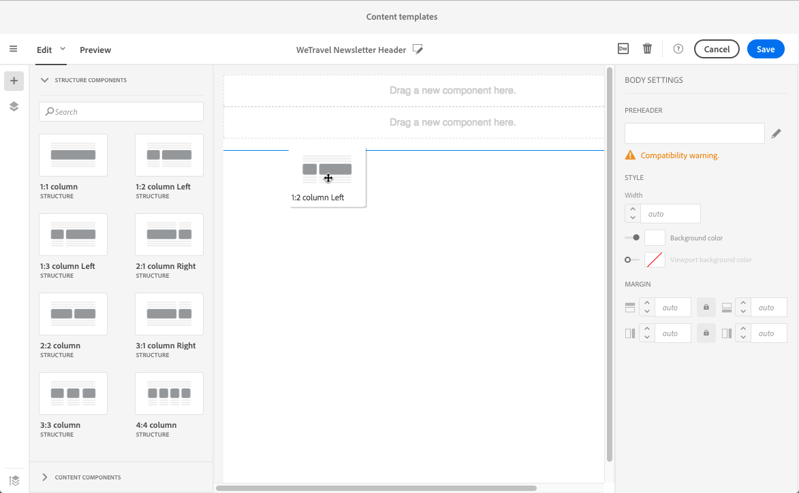
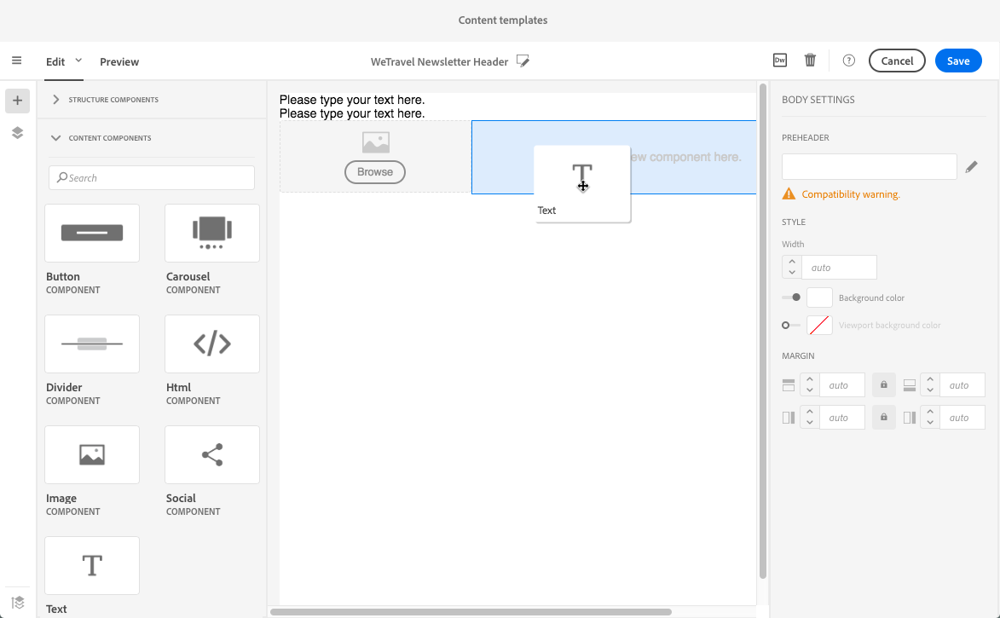

# 再利用可能なコンテンツの作成と使用 {#using-reusable-content}

電子メールコンテンツの編集をマスターする方法について説明します。 電子メールデザイナーを使用すると、独自の定義済みコンテンツを使用してテンプレートとフラグメントを作成し、後で配信する際に再利用できます。

## テンプレートを使用した電子メールのデザイン {#designing-templates}

>[!NOTE]
>
> Adobe Campaign Standardでは、リソース/テンプレートメニューからアクセスできる様々なタイプのテンプレ **ート** を作成 **できます** 。 電子メールデザイナーで使用されるテンプレートは、コンテンツテンプレートです。 詳しくは、テンプレートについてを参 [照してくださ](../../start/using/marketing-activity-templates.md)い。

### コンテンツテンプレートについて {#content-templates}

電子メールデザイナーのホームページのタブで提供さ **[!UICONTROL Templates]**れるHTMLコンテ[ンツを管理できます](../../designing/using/designing-content-in-adobe-campaign.md)。

標準搭載の電子メールコンテンツテンプレートには、モバイルに最適化された18種類のレイアウトと、Behanceのアーティストがデザインしたクラス最高の4つのレスポンシブテンプレートが含まれています。 これらは、お客様のお知らせメッセージ、ニュースレター、リエンゲージメント電子メールなど、最新の使用に対応しています。 ブランドのコンテンツを使用して簡単にカスタマイズでき、一から電子メールをデザインするプロセスを簡単に実行できます。

HTMLコンテンツテンプレートは、詳細メニューの/ **[!UICONTROL Resources]**画面か**[!UICONTROL Content templates & fragments]** らアクセ [スできます](../../start/using/interface-description.md#advanced-menu)。 ここから、ランディングページのコンテンツテンプレート、電子メールコンテンツテンプレートおよびフラグメントを管理できます。

そのまま使用できるコンテンツテンプレートは読み取り専用です。 いずれかのテンプレートを編集するには、まず目的のテンプレートを複製する必要があります。

新しいテンプレートまたはフラグメントを作成し、独自のコンテンツを定義できます。 詳しくは、「コンテンツテンプレートの作 [成」および「コンテンツ](#creating-a-content-template) フラグメ [ントの作成」を参照してください](#creating-a-content-fragment)。

電子メールデザイナーでコンテンツを編集する場合は、コンテンツをフラグメントまたはテンプレートとして保存して、コンテンツテンプレートを作成することもできます。 詳しくは、「コンテンツをテンプレートとし [て保存」および「コンテンツをフ](#saving-content-as-template) ラグメ [ントとして保存」を参照してくださ](../../designing/using/using-reusable-content.md#saving-content-as-a-fragment)い。

**関連トピック：**

* このビデオでは、コンテンツテンプレートをパーソナラ [イズする方法を説明しま](https://helpx.adobe.com/campaign/kt/acs/using/acs-email_content_templates-feature-video-use.html)す。
* コンテンツの編集について詳しくは、電子メールコンテンツデザ [インについてを参照してくださ](../../designing/using/designing-content-in-adobe-campaign.md)い。

### Creating a content template {#creating-a-content-template}

独自のコンテンツテンプレートを作成して、必要な回数だけ使用できます。

次の例は、電子メールコンテンツテンプレートの作成方法を示しています。

1. /に移動し、 **[!UICONTROL Resources]**をク**[!UICONTROL Content templates & fragments]** リックしま **[!UICONTROL Create]**す。
1. 電子メールラベルをクリックして、電子メー **[!UICONTROL Properties]**ルデザイナーのタブにアクセスします。
1. 認識可能なラベルを指定し、次のパラメーターを選択して、電子メールでこのテンプレートを使用できるようにします。

   * ドロッ **[!UICONTROL Shared]**プダウン**[!UICONTROL Delivery]** リストから **[!UICONTROL Content type]**またはを選択します。
   * ドロッ **[!UICONTROL Template]**プダウンリスト**[!UICONTROL HTML type]** から選択します。
   

1. 必要に応じて、テンプレートのサムネールとして使用する画像を設定できます。 テンプレートプロパティの **[!UICONTROL Thumbnail]**タブから選択します。

   

   このサムネールは、電子メールデザイナ **[!UICONTROL Templates]**ーのホームページの[タブに表示されます](../../designing/using/designing-content-in-adobe-campaign.md)。

1. タブを閉じ **[!UICONTROL Properties]**て、メインのワークスペースに戻ります。
1. 必要に応じてカスタマイズ可能な構造コンポーネントとコンテンツコンポーネントを追加します。
   >[!NOTE]
   >
   > コンテンツテンプレート内にパーソナライゼーションフィールドや条件付きコンテンツを挿入することはできません。
1. 編集が完了したら、テンプレートを保存します。

このテンプレートは、電子メールデザイナーで作成された任意の電子メールで使用できるようになりました。 電子メールデザイナ **[!UICONTROL Templates]**ーのホームページ[のタブから](../../designing/using/designing-content-in-adobe-campaign.md)選択します。

### コンテンツをテンプレートとして保存中 {#saving-content-as-template}

電子メールデザイナーで電子メールを編集する場合は、その電子メールの内容をテンプレートとして直接保存できます。

<!--[!CAUTION]
>
>You cannot save as template a structure containing personalization fields or dynamic content.-->

1. 電子メール **[!UICONTROL Save as template]**デザイナのメインツールバーから選択します。

   

1. 必要に応じてラベルと説明を追加し、をクリックしま **[!UICONTROL Save]**す。

   

1. 作成したテンプレートを探すには、/に移動し **[!UICONTROL Resources]**ます**[!UICONTROL Content templates & fragments]**。

1. 新しいテンプレートを使用するには、電子メールデザイナ **[!UICONTROL Templates]**ーのホームページの[タブから](../../designing/using/designing-content-in-adobe-campaign.md)、テンプレートを選択します。

   

### フラグメントとコンポーネントを使用したテンプレートの作成 {#template-fragments-components}

電子メールデザイナーで電子メールテンプレートを作成できるようになりました。 コンテンツコンポーネントを使用して、電子メールの様々なセクションを反映し、元のニュースレターにできる限り近づくように設定を調整します。 最後に、作成したフラグメントを挿入します。

1. 電子メールデザイナーを使用して、テンプレートを作成します。 詳しくは、「コンテンツテンプレート」を参 [照してください](#content-templates)。
1. テンプレートに、電子メールのヘッダー、フッター、本文に対応する構造コンポーネントを挿入します。 構造コンポーネントの追加について詳しくは、電子メールデザ [イナーを使用した電子メール構造の編集を参照してください](../../designing/using/designing-from-scratch.md#defining-the-email-structure)。
1. 必要に応じてコンテンツコンポーネントを挿入し、ニュースレターの本文を作成します。 これは、毎月更新する電子メールの編集可能なコンテンツになります。

   

   HTMLコードに詳しい場合は、元の電子メールのより複雑な要素をコ **[!UICONTROL Html]**ピー&amp;ペーストできるコンポーネントの活用をお勧めします。 その他のコンポーネント(、な**[!UICONTROL Button]**&#x200B;ど) **[!UICONTROL Image]**を残**[!UICONTROL Text]** りのコンテンツに使用します。 For more on this, see [About content components](../../designing/using/designing-from-scratch.md#about-content-components).

   >[!NOTE]
   >
   >コンポーネントを使 **[!UICONTROL Html]**用すると、限られたオプションで編集可能なコンポーネントが作成されます。 このコンポーネントを選択する前に、HTMLコードの処理方法を確認してください。

1. コンテンツのコンポーネントを、元の電子メールにできる限り合うように調整します。

   

   スタイル設定とインライン属性の管理について詳しくは、「電子メールスタイルの編 [集」を参照してくださ](../../designing/using/styles.md)い。

1. 以前に作成した2つのフラグメント（ヘッダーとフッター）を、目的の構造コンポーネントに挿入します。

   

1. テンプレートを保存します。

これで、電子メールデザイナー内でこのテンプレートを完全に管理し、毎月受信者に送信するニュースレターを作成および更新できます。

これを使用するには、電子メールを作成し、先ほど作成したコンテンツテンプレートを選択します。

**関連トピック**:

* [電子メールの作成](../../channels/using/creating-an-email.md)
* [電子メールデザイナーの紹介ビデオ](https://video.tv.adobe.com/v/22771/?autoplay=true&hidetitle=true&captions=jpn)
* [電子メールコンテンツの新規デザイン](../../designing/using/designing-from-scratch.md#designing-an-email-content-from-scratch)

## フラグメントについて {#about-fragments}

フラグメントは、1つ以上の電子メールで参照できる再利用可能なコンポーネントです。
これらは、インターフェイスの **Resources** / **Content fragments and templates**&#x200B;にあります。

電子メールデザイナーでフラグメントを最大限に活用するには：

* 独自のフラグメントを作成します。 詳しくは、コ [ンテンツフラグメントの作成](#creating-a-content-fragment) 、コンテ [ンツをフラグメントとして保存を参照してくださ](#saving-content-as-a-fragment)い。
* 電子メールで必要な回数だけ使用します。 詳しくは、 [電子メールへの要素の挿入を参照してください](#inserting-elements-into-an-email)。
* フラグメントを編集すると、変更が同期されます。フラグメントは、そのフラグメントを含むすべての電子メール（準備も送信も済んでいない場合）に自動的に反映されます。

電子メールに追加したフラグメントは、デフォルトでロックされます。 特定の電子メールのフラグメントを変更する場合は、使用先の電子メールでロックを解除することで、元のフラグメントとの同期を中断できます。 変更は同期されなくなります。

電子メール内のフラグメントのロックを解除するには、フラグメントを選択し、コンテキストツールバーからロックアイコンをクリックします。

そのフラグメントは、元のフラグメントにリンクされなくなったスタンドアロンコンポーネントになります。 その後、他のコンテンツコンポーネントとして編集できます。 詳しくは、コン [テンツコンポーネントについてを参照してくださ](../../designing/using/designing-from-scratch.md#about-content-components)い。

### 電子メールへのフラグメントの挿入 {#inserting-elements-into-an-email}

電子メールのコンテンツを定義するには、事前に配置した構造コンポーネントにコンテンツ要素を追加します。 「電子メ [ール構造の編集」を参照してください](../../designing/using/designing-from-scratch.md#defining-the-email-structure)。

1. 左側の+アイコンを選択して、コンテ **ンツ要素** にアクセスします。 「フラグメ [ント](#about-fragments) 」または「コ [ンテンツ」を選択しま](../../designing/using/designing-from-scratch.md#about-content-components)す。
1. 追加するフラグメントのラベルまたはラベルの一部が既にわかっている場合は、それを検索できます。

   

1. パレットから電子メールの構造コンポーネントにフラグメントまたはコンテンツコンポーネントをドラッグ&amp;ドロップします。

   

   電子メールに要素を追加した後は、構造コンポーネント内または電子メール内の別の構造コンポーネントに要素を移動できます。

   

1. この電子メールのニーズに合わせて要素を編集します。 テキスト、リンク、画像などを追加できます。

   >[!NOTE]
   >
   >フラグメントは、電子メールに追加されるとデフォルトでロックされます。 特定の電子メールのフラグメントを変更する場合や、フラグメント内で直接変更する場合は、元のフラグメントとの同期を中断できます。 フラグメント [についてを参照してください](#about-fragments)。

1. 電子メールに追加する必要のあるすべての要素に対して、この手順を繰り返します。
1. 電子メールを保存します。

電子メールの構造が設定されたら、各コンテンツ要素のスタイルを編集できます。 詳しくは、 [要素の編集を参照してください](../../designing/using/styles.md)。

>[!NOTE]
>
>フラグメントが変更されると、その変更が使用されている電子メールに自動的に反映されます。 For more on this, see [About fragments](#about-fragments).

### コンテンツフラグメントの作成 {#creating-a-content-fragment}

独自のコンテンツフラグメントを作成し、1つ以上の電子メールで必要に応じて使用できます。

1. /に移動し、 **[!UICONTROL Resources]**をク**[!UICONTROL Content templates & fragments]** リックしま **[!UICONTROL Create]**す。
1. 電子メールラベルをクリックして、電子メー **[!UICONTROL Properties]**ルデザイナーのタブにアクセスします。
1. 認識可能なラベルを指定し、次のパラメーターを選択して、電子メールコンテンツの編集時にフラグメントを検索します。

   * フラグメントは電子メールとのみ互換性があるので、ドロ **[!UICONTROL Delivery]**ップダウンリスト**[!UICONTROL Content type]** から選択します。
   * このコ **[!UICONTROL Fragment]**ンテンツを**[!UICONTROL HTML type]** フラグメントとして使用できるようにするには、ドロップダウンリストから選択します。
   

1. 必要に応じて、フラグメントのサムネールとして使用する画像を設定できます。 テンプレートプロパティの **[!UICONTROL Thumbnail]**タブから選択します。

   

   このサムネールは、電子メールの編集時にフラグメントのラベルの横に表示されます。

1. タブを閉じ **[!UICONTROL Properties]**て、メインのワークスペースに戻ります。
1. 必要に応じてカスタマイズ可能な構造コンポーネントとコンテンツコンポーネントを追加します。

   >[!CAUTION]
   >
   >フラグメントには、パーソナライゼーションフィールド、動的コンテンツ、別のフラグメントを含めることはできません。
   >
   >空の構造コンポーネントを含むフラグメントコンテンツとして保存しないでください。 >フラグメントを挿入すると、編集できなくなります。
   >
   >モバイル [ビューは](../../designing/using/plain-text-html-modes.md#switching-to-mobile-view) 、フラグメントでは使用できません。

1. 編集が完了したら、フラグメントを保存します。

このフラグメントは、電子メールデザイナーで作成された任意の電子メールで使用できるようになりました。 パレットのセクションの **[!UICONTROL Fragments]**下に表示されます。

>[!NOTE]
>
>フラグメント内にパーソナライゼーションフィールドを挿入するには、電子メールで使用し、ロックを解除する必要があります。 フラグメント [についてを参照してください](#about-fragments)。

### フラグメントとしてのコンテンツの保存 {#saving-content-as-a-fragment}

電子メールデザイナーで電子メールを編集する場合、その電子メールの一部をフラグメントとして直接保存できます。

* パーソナライゼーションフィールド、動的コンテンツまたは別のフラグメントを含む構造をフラグメントとして保存することはできません。
* 互いに隣接する構造のみを選択できます。
<!-- - You cannot select an empty structure.-->

1. 電子メールデザイナーで電子メールを編集する場合は、メインツ **[!UICONTROL Save as fragment]**ールバーからを選択します。

   

1. ワークスペースから、フラグメントを構成する構造を選択します。

   

   >[!NOTE]
   >
   >互いに隣接し、パーソナライゼーションフィールド、動的コンテンツ、別のフラグメントを含まない構造を選択してください。
   <!--You cannot select an empty structure.-->

1. クリック **[!UICONTROL Create]**.

1. 必要に応じてラベルと説明を追加し、をクリックしま **[!UICONTROL Save]**す。

   

1. 作成したフラグメントを探すには、/に移動 **[!UICONTROL Resources]**します**[!UICONTROL Content templates & fragments]**。

   

1. 新しいフラグメントを使用するには、任意の電子メールコンテンツを開き、フラグメントリストから選択します。

>[!NOTE]
>モバイル [ビューは](../../designing/using/plain-text-html-modes.md#switching-to-mobile-view) 、フラグメントでは使用できません。 電子メールモバイルビューを編集する場合は、コンテンツをフラグメントとして保存する前に行います。

<!--You need to copy-paste the HTML corresponding to the section that you want to save into a new fragment.

>[!NOTE]
>
>To do this, you need to be familiar with HTML code.

To save as a fragment some email content that you created, follow the steps below.

1. When editing an email in the Email Designer, select **[!UICONTROL Edit]** > **[!UICONTROL HTML]** to open the HTML version of that email.
1. Select and copy the HTML corresponding to the part that you want to save.
1. Go to **[!UICONTROL Resources]** > **[!UICONTROL Content templates & fragments]** and click **[!UICONTROL Create]**.
1. Click the email label to access the **[!UICONTROL Properties]** tab of the Email Designer and select **[!UICONTROL Fragment]** from the **[!UICONTROL HTML type]** drop-down list.
1. Select **[!UICONTROL Edit]** > **[!UICONTROL HTML]** to open the HTML version of the fragment.
1. Paste the HTML that you copied where appropriate.
1. Switch back to the **[!UICONTROL Edit]** view to check the result and save the new fragment.-->

## フラグメントを使用した再利用可能なヘッダーとフッターの作成 {#header-footer-fragments}

電子メールデザイナーを使用して、再利用可能な各セクションにフラグメントを作成します。 この例では、2つのフラグメントを作成します。1つはヘッダー用、もう1つはフッター用です。 その後、既存のコンテンツから関連部品をこれらのフラグメントにコピーできます。

これをおこなうには、以下の手順に従います。

1. Adobe Campaignで、/に移動し、ヘッ **[!UICONTROL Resources]**ダーのフ**[!UICONTROL Content templates & fragments]** ラグメントを作成します。 詳しくは、「コンテンツフラグメントの [作成」を参照してください](#creating-a-content-fragment)。
1. フラグメントに必要な数だけ構造コンポーネントを追加します。

1. 構造に画像とテキストコンポーネントを挿入します。

1. 対応する画像をアップロードし、テキストを入力して設定を調整します。

1. フラグメントを保存します。
1. 同様にしてフッターを作成し、保存します。

これで、フラグメントをテンプレートで使用する準備が整いました。
