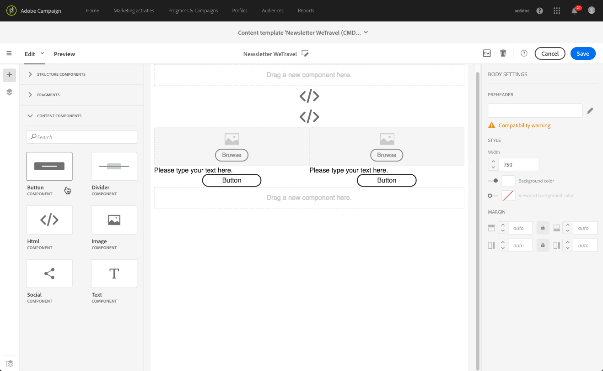

# 再利用可能なコンテンツの作成と使用{#using-reusable-content}

電子メールコンテンツのエディションをマスターする方法を説明します。 電子メールデザイナーを使用すると、独自の定義済みコンテンツを使用してテンプレートとフラグメントを作成し、後続の配信に再利用できます。

## テンプレートを使用した電子メールのデザイン{#designing-templates}

>[!NOTE]
>
> Adobe Campaign Standardでは、**リソース**/**テンプレート**&#x200B;メニューから、様々な種類のテンプレートを作成できます。 電子メールデザイナで使用されるテンプレートは、コンテンツテンプレートです。 詳しくは、[テンプレートについて](../../start/using/marketing-activity-templates.md)を参照してください。

 [ビデオでのテンプレートの作成方法の確認](#video)

### コンテンツテンプレートについて {#content-templates}

[電子メールデザイナー](../../designing/using/designing-content-in-adobe-campaign.md)ホームページの&#x200B;**[!UICONTROL Templates]**&#x200B;タブで提供されるHTMLコンテンツを管理できます。

標準搭載の電子メールコンテンツテンプレートには、モバイルに最適化された18種類のレイアウトと、Behanceのアーティストが設計したクラス最高の4種類のレスポンシブテンプレートが含まれます。 これらは、お客様の歓迎メッセージ、ニュースレター、リエンゲージメント電子メールなど、最新の使用法に対応しています。 ブランドのコンテンツを使用して簡単にカスタマイズできるので、一から電子メールをデザインするプロセスを簡単に実行できます。

The HTML content templates are accessible from the **[!UICONTROL Resources]** > **[!UICONTROL Content templates & fragments]** screen of the [Advanced menu](../../start/using/interface-description.md#advanced-menu). このページから、ランディングページコンテンツテンプレート、電子メールコンテンツテンプレートおよびフラグメントを管理できます。

標準搭載のコンテンツテンプレートは読み取り専用です。 いずれかのテンプレートを編集するには、まず目的のテンプレートを重複する必要があります。

新しいテンプレートまたはフラグメントを作成し、独自のコンテンツを定義できます。 詳しくは、[コンテンツテンプレートの作成](#creating-a-content-template)および[コンテンツフラグメントの作成](#creating-a-content-fragment)を参照してください。

電子メールデザイナーでコンテンツを編集する場合は、コンテンツをフラグメントまたはテンプレートとして保存して、コンテンツテンプレートを作成することもできます。 詳しくは、[コンテンツをテンプレートとして保存](#saving-content-as-template)および[コンテンツをフラグメントとして保存](../../designing/using/using-reusable-content.md#saving-content-as-a-fragment)を参照してください。

**関連トピック：**

* コンテンツの編集について詳しくは、[電子メールコンテンツデザインについて](../../designing/using/designing-content-in-adobe-campaign.md)を参照してください。

### コンテンツテンプレートの作成{#creating-a-content-template}

独自のコンテンツテンプレートを作成して、必要な回数だけ使用できます。

次の例は、電子メールコンテンツテンプレートの作成方法を示しています。

1. **[!UICONTROL Resources]** > **[!UICONTROL Content templates & fragments]**&#x200B;に移動し、**[!UICONTROL Create]**&#x200B;をクリックします。
1. 電子メールラベルをクリックして、電子メールデザイナの&#x200B;**[!UICONTROL Properties]**&#x200B;タブにアクセスします。
1. 認識可能なラベルを指定し、次のパラメーターを選択して、電子メールでこのテンプレートを使用できるようにします。

   * **[!UICONTROL Content type]**&#x200B;ドロップダウンリストから&#x200B;**[!UICONTROL Shared]**&#x200B;または&#x200B;**[!UICONTROL Delivery]**&#x200B;を選択します。
   * **[!UICONTROL HTML type]**&#x200B;ドロップダウンリストから&#x200B;**[!UICONTROL Template]**&#x200B;を選択します。

   

1. 必要に応じて、テンプレートのサムネールとして使用する画像を設定できます。 テンプレートプロパティの&#x200B;**[!UICONTROL Thumbnail]**&#x200B;タブから選択します。

   

   このサムネールは、[電子メールデザイナー](../../designing/using/designing-content-in-adobe-campaign.md)ホームページの&#x200B;**[!UICONTROL Templates]**&#x200B;タブに表示されます。

1. **[!UICONTROL Properties]**&#x200B;タブを閉じて、メインのワークスペースに戻ります。
1. 必要に応じてカスタマイズ可能な追加コンポーネントとコンテンツコンポーネントを構造化します。
   >[!NOTE]
   >
   > コンテンツテンプレート内にパーソナライゼーションフィールドや条件付きコンテンツを挿入することはできません。
1. 編集が完了したら、テンプレートを保存します。

このテンプレートは、電子メールデザイナーで作成された任意の電子メールで使用できるようになりました。 [電子メールデザイナ](../../designing/using/designing-content-in-adobe-campaign.md)ホームページの&#x200B;**[!UICONTROL Templates]**&#x200B;タブから選択します。

### コンテンツをテンプレートとして保存{#saving-content-as-template}

電子メールデザイナーで電子メールを編集する場合は、その電子メールの内容をテンプレートとして直接保存できます。

<!--[!CAUTION]
>
>You cannot save as template a structure containing personalization fields or dynamic content.-->

1. 電子メールデザイナーのメインツールバーで&#x200B;**[!UICONTROL Save as template]**&#x200B;を選択します。

   

1. 必要追加に応じてラベルと説明を入力し、[**[!UICONTROL Save]**]をクリックします。

   

1. 作成したテンプレートを探すには、**[!UICONTROL Resources]** > **[!UICONTROL Content templates & fragments]**&#x200B;に移動します。

1. 新しいテンプレートを使用するには、[電子メールデザイナー](../../designing/using/designing-content-in-adobe-campaign.md)ホームページの&#x200B;**[!UICONTROL Templates]**&#x200B;タブから新しいテンプレートを選択します。

   

### フラグメントとコンポーネントを使用したテンプレートの作成{#template-fragments-components}

電子メールデザイナーで電子メールテンプレートを作成できるようになりました。 コンテンツコンポーネントを使用して、電子メールの様々なセクションを反映し、元のニュースレターにできる限り近くなるように設定を調整します。 最後に、作成したフラグメントを挿入します。

1. 電子メールデザイナを使用して、テンプレートを作成します。 詳しくは、[コンテンツテンプレート](#content-templates)を参照してください。
1. テンプレートに、電子メールのヘッダー、フッター、本文に対応する構造コンポーネントをいくつか挿入します。 構造コンポーネントの追加について詳しくは、「[電子メールデザイナーでの電子メール構造の編集](../../designing/using/designing-from-scratch.md#defining-the-email-structure)」を参照してください。
1. 必要に応じてコンテンツコンポーネントを挿入し、ニュースレターの本文を作成します。 これは、毎月更新する電子メールの編集可能なコンテンツになります。

   

   HTMLコードに詳しい場合は、元の電子メールのより複雑な要素をコピー&amp;ペーストできる&#x200B;**[!UICONTROL Html]**&#x200B;コンポーネントを活用することをAdobeにお勧めします。 残りのコンテンツには、**[!UICONTROL Button]**、**[!UICONTROL Image]**、**[!UICONTROL Text]**&#x200B;などの他のコンポーネントを使用します。 詳しくは、[コンテンツコンポーネントについて](../../designing/using/designing-from-scratch.md#about-content-components)を参照してください。

   >[!NOTE]
   >
   >**[!UICONTROL Html]**&#x200B;コンポーネントを使用すると、限られたオプションで編集可能なコンポーネントが作成されます。 このコンポーネントを選択する前に、HTMLコードの処理方法を確認してください。

1. コンテンツのコンポーネントを、元の電子メールにできる限り合うように調整します。

   

   スタイル設定とインライン属性の管理について詳しくは、[電子メールスタイルの編集](../../designing/using/styles.md)を参照してください。

1. 以前に作成した2つのフラグメント（ヘッダーとフッター）を、必要な構造コンポーネントに挿入します。

   

1. テンプレートを保存します。

これで、電子メールデザイナー内でこのテンプレートを完全に管理し、毎月受信者に送信するニュースレターを作成および更新できるようになりました。

これを使用するには、電子メールを作成し、先ほど作成したコンテンツテンプレートを選択します。

**関連トピック**：

* [E メールの作成](../../channels/using/creating-an-email.md)
* [電子メールデザイナーの概要ビデオ](../../designing/using/designing-content-in-adobe-campaign.md#video)
* [電子メールコンテンツをゼロからデザインする](../../designing/using/designing-from-scratch.md#designing-an-email-content-from-scratch)

### チュートリアルビデオ {#video}

このビデオでは、独自のテンプレートの作成方法を紹介します。

>[!VIDEO](https://video.tv.adobe.com/v/23106?quality=12)

追加のCampaign Standardハウツービデオは[こちら](https://experienceleague.adobe.com/docs/campaign-standard-learn/tutorials/overview.html?lang=ja)で参照できます。

## フラグメントについて{#about-fragments}

>[!CONTEXTUALHELP]
>id="ac_fragments"
>title="フラグメントについて"
>abstract="フラグメントは、1つ以上の電子メールで参照できる、再利用可能なコンテンツブロックです。"

フラグメントは、1つ以上の電子メールで参照できる再利用可能なコンポーネントです。
これらは、**リソース** > **コンテンツのフラグメントとテンプレート**&#x200B;の下のインターフェイスにあります。

電子メールデザイナでフラグメントを最大限に活用するには：

* 独自のフラグメントを作成します。 [コンテンツフラグメントの作成](#creating-a-content-fragment)および[コンテンツをフラグメントとして保存](#saving-content-as-a-fragment)を参照してください。
* 電子メールで必要な回数だけ使用します。 [電子メールへの要素の挿入](#inserting-elements-into-an-email)を参照してください。
* フラグメントを編集すると、変更が同期されます。これらは、そのフラグメントを含むすべての電子メール（準備も送信もされていない場合）に自動的に反映されます。

電子メールに追加されたフラグメントは、デフォルトでロックされます。 特定の電子メールのフラグメントを変更する場合は、使用先の電子メールでロックを解除して、元のフラグメントとの同期を解除できます。 変更は同期されなくなります。

電子メール内のフラグメントのロックを解除するには、そのフラグメントを選択し、コンテキストツールバーのロックアイコンをクリックします。

そのフラグメントは、元のフラグメントにリンクされなくなったスタンドアロンコンポーネントになります。 その後、他のコンテンツコンポーネントとして編集できます。 [コンテンツコンポーネントについて](../../designing/using/designing-from-scratch.md#about-content-components)を参照してください。

### 電子メールへのフラグメントの挿入{#inserting-elements-into-an-email}

電子メールのコンテンツを定義するには、事前に配置した構造コンポーネントにコンテンツ要素を追加します。 「[電子メール構造の編集](../../designing/using/designing-from-scratch.md#defining-the-email-structure)」を参照してください。

1. 左側の&#x200B;**+**&#x200B;アイコンを選択して、コンテンツ要素にアクセスします。 「[フラグメント](#about-fragments)」または「[コンテンツコンポーネント](../../designing/using/designing-from-scratch.md#about-content-components)」を選択します。
1. 追加するフラグメントのラベルまたはラベルの一部が既にわかっている場合は、それを検索できます。

   

1. パレットから電子メールの構造コンポーネントに、フラグメントまたはコンテンツコンポーネントをドラッグ&amp;ドロップします。

   

   電子メールに要素を追加すると、構造コンポーネント内または電子メール内の別の構造コンポーネントに要素を移動できます。

   

1. この電子メールのニーズに合わせて要素を編集します。 テキスト、リンク、画像などを追加できます。

   >[!NOTE]
   >
   >フラグメントは、電子メールに追加されるとデフォルトでロックされます。 特定の電子メールのフラグメントを変更する場合や、フラグメント内で直接変更する場合は、元のフラグメントとの同期を中断できます。 [フラグメントについて](#about-fragments)を参照してください。

1. 電子メールに追加する必要があるすべての要素に対して、この手順を繰り返します。
1. 電子メールを保存します。

電子メールの構造が完成したら、各コンテンツ要素のスタイルを編集できます。 「[要素の編集](../../designing/using/styles.md)」を参照してください。

>[!NOTE]
>
>フラグメントが変更されると、変更が使用先の電子メールに自動的に反映されます。 詳しくは、[フラグメントについて](#about-fragments)を参照してください。

### コンテンツフラグメントの作成{#creating-a-content-fragment}

独自のコンテンツフラグメントを作成して、1つ以上の電子メールで必要に応じて使用できます。

1. **[!UICONTROL Resources]** > **[!UICONTROL Content templates & fragments]**&#x200B;に移動し、**[!UICONTROL Create]**&#x200B;をクリックします。
1. 電子メールラベルをクリックして、電子メールデザイナの&#x200B;**[!UICONTROL Properties]**&#x200B;タブにアクセスします。
1. 認識可能なラベルを指定し、次のパラメーターを選択して、電子メールコンテンツの編集時にフラグメントを見つけます。

   * フラグメントは電子メールとのみ互換性があるので、**[!UICONTROL Content type]**&#x200B;ドロップダウンリストから&#x200B;**[!UICONTROL Delivery]**&#x200B;を選択します。
   * **[!UICONTROL HTML type]**&#x200B;ドロップダウンリストから&#x200B;**[!UICONTROL Fragment]**&#x200B;を選択すると、このコンテンツをフラグメントとして使用できます。

   

1. 必要に応じて、フラグメントのサムネールとして使用する画像を設定できます。 テンプレートプロパティの&#x200B;**[!UICONTROL Thumbnail]**&#x200B;タブから選択します。

   

   電子メールを編集すると、このサムネールがフラグメントのラベルの横に表示されます。

1. **[!UICONTROL Properties]**&#x200B;タブを閉じて、メインのワークスペースに戻ります。
1. 必要に応じてカスタマイズ可能な追加コンポーネントとコンテンツコンポーネントを構造化します。

   >[!CAUTION]
   >
   >フラグメントにはパーソナライゼーションフィールド、動的コンテンツ、別のフラグメントを含めることはできません.
   >
   >空の構造コンポーネントを持つフラグメントコンテンツとして保存しないでください。 >フラグメントを挿入すると、編集できなくなります。
   >
   >[モバイル表示](../../designing/using/plain-text-html-modes.md#switching-to-mobile-view)はフラグメントでは使用できません。

1. 編集が完了したら、フラグメントを保存します。

このフラグメントは、電子メールデザイナーで作成された任意の電子メールで使用できるようになりました。 パレットの&#x200B;**[!UICONTROL Fragments]**&#x200B;セクションの下に表示されます。

>[!NOTE]
>
>電子メールで使用され、ロック解除されていない場合は、フラグメント内にパーソナライゼーションフィールドを挿入できません。 [フラグメントについて](#about-fragments)を参照してください。

### コンテンツをフラグメントとして保存{#saving-content-as-a-fragment}

電子メールデザイナーで電子メールを編集する場合、電子メールの一部をフラグメントとして直接保存できます。

* パーソナライゼーションフィールド、動的コンテンツ、または他のフラグメントを含むフラグメント構造を、フラグメントとして保存することはできません。
* 互いに隣接する構造のみを選択できます。
<!-- - You cannot select an empty structure.-->

1. 電子メールデザイナで電子メールを編集する場合は、メインツールバーから&#x200B;**[!UICONTROL Save as fragment]**&#x200B;を選択します。

   

1. ワークスペースから、フラグメントを構成する構造を選択します。

   

   >[!NOTE]
   >
   >互いに隣接し、パーソナライゼーションフィールド、動的コンテンツ、別のフラグメントを含まない構造を選択してください。
   <!--You cannot select an empty structure.-->

1. 「**[!UICONTROL Create]**」をクリックします。

1. 必要追加に応じてラベルと説明を入力し、[**[!UICONTROL Save]**]をクリックします。

   

1. 作成したフラグメントを探すには、**[!UICONTROL Resources]** > **[!UICONTROL Content templates & fragments]**&#x200B;に移動します。

   

1. 新しいフラグメントを使用するには、任意の電子メールコンテンツを開き、フラグメントリストから選択します。

>[!NOTE]
>[モバイル表示](../../designing/using/plain-text-html-modes.md#switching-to-mobile-view)はフラグメントでは使用できません。 電子メールモバイル表示を編集する場合は、コンテンツをフラグメントとして保存する前に行ってください。

<!--You need to copy-paste the HTML corresponding to the section that you want to save into a new fragment.

>[!NOTE]
>
>To do this, you need to be familiar with HTML code.

To save as a fragment some email content that you created, follow the steps below.

1. When editing an email in the Email Designer, select **[!UICONTROL Edit]** > **[!UICONTROL HTML]** to open the HTML version of that email.
1. Select and copy the HTML corresponding to the part that you want to save.
1. Go to **[!UICONTROL Resources]** > **[!UICONTROL Content templates & fragments]** and click **[!UICONTROL Create]**.
1. Click the email label to access the **[!UICONTROL Properties]** tab of the Email Designer and select **[!UICONTROL Fragment]** from the **[!UICONTROL HTML type]** drop-down list.
1. Select **[!UICONTROL Edit]** > **[!UICONTROL HTML]** to open the HTML version of the fragment.
1. Paste the HTML that you copied where appropriate.
1. Switch back to the **[!UICONTROL Edit]** view to check the result and save the new fragment.-->

## フラグメント{#header-footer-fragments}を使用した再利用可能なヘッダーとフッターの作成

電子メールデザイナーを使用して、再利用可能な各セクションに対してフラグメントを作成します。 この例では、次の2つのフラグメントを作成します。1つはヘッダー用、もう1つはフッター用です。 その後、既存のコンテンツから関連するパーツをこれらのフラグメントにコピーできます。

これをおこなうには、以下の手順に従います。

1. Adobe Campaignで、**[!UICONTROL Resources]**/**[!UICONTROL Content templates & fragments]**&#x200B;に移動し、ヘッダー用のフラグメントを作成します。 詳しくは、「[コンテンツフラグメントの作成](#creating-a-content-fragment)」を参照してください。
1. フラグメントに必要な数追加の構造コンポーネントを追加します。

   

1. 構造に画像とテキストのコンポーネントを挿入します。

   

1. 対応する画像をアップロードし、テキストを入力して設定を調整します。

   

1. フラグメントを保存します。
1. 同様にして、フッターを作成し、保存します。

   

これで、フラグメントをテンプレートで使用する準備が整いました。
