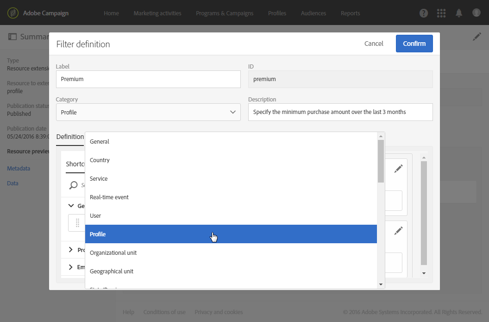

# フィルター定義の設定{#configuring-filter-definition}

「**[!UICONTROL Filter definition]**」タブでは、オーディエンスを定義する場合など、複雑なクエリを作成する場合に、ユーザーが直接アクセスできる詳細フィルターを作成できます。

ワークフロー、オーディエンスおよび REST API を使用して、リソースに値を設定し、そのデータにアクセスできるので、この手順は必須ではありません。

これらのフィルターは、クエリエディターで事前設定されたルールの形式で使用されます。設定に必要な手順を合理化できるので、特に繰り返しのセグメント化をおこなう際に役立ちます。

例えば、過去 3 ヶ月間に特定の金額を超えるすべてのトランザクションを選択できるフィルターを作成できます。

これをおこなうには、**[!UICONTROL Profiles]** リソースを拡張し、（以前に作成した）トランザクションテーブルにリンクするフィルターを定義し、トランザクション価格が特定のパラメーター以上で、トランザクション日が過去 3 ヶ月に対応する範囲内にあることを示すルールを使用します。

1. トランザクションテーブルを必ず作成して公開してください。[リソースの作成または拡張](../../developing/using/creating-or-extending-the-resource.md)を参照してください。

   >[!NOTE]
   >
   >この手順では、カスタムトランザクションテーブルの例を使用します。ご自身のビジネスニーズに合わせて調整してください。

1. **[!UICONTROL Profiles]** リソースのトランザクションテーブルに関連するフィルターを定義する前に、このテーブルへのリンクを定義し、変更を公開してください。[その他のリソースを使用したリンクの定義](../../developing/using/configuring-the-resource-s-data-structure.md#defining-links-with-other-resources)および[データベース構造の更新](../../developing/using/updating-the-database-structure.md)を参照してください。
1. 新しいフィルターの定義画面の「**[!UICONTROL Definition]**」タブで、トランザクションテーブルを選択します。

   

1. **[!UICONTROL Add a rule - Profiles/Transactions]** ウィンドウで、ワークスペースにトランザクションテーブルをドラッグ＆ドロップします。次に表示されるウィンドウで、使用するフィールドを選択します。

   

1. **[!UICONTROL Add a rule - Transactions]** ウィンドウの **[!UICONTROL Optional parameter settings]** で、「**[!UICONTROL Switch to parameters]**」チェックボックスをオンにします。

   **[!UICONTROL Filter conditions]** で、**[!UICONTROL Greater than or equal to]** 演算子を選択します。「**[!UICONTROL Parameters]**」フィールドに名前を入力し、プラス記号をクリックして新しいパラメーターを作成します。

   

1. 変更を確認します。この定義は、クエリを実行するために後で入力する必要がある設定可能なフィールドに対応します。

   

1. このルールを別のルールと組み合わせて、トランザクション日が過去 3 ヶ月間に対応する範囲内にある必要があることを指定します。

   

1. フィルターを表示するカテゴリを選択します。

   

1. フィルター定義画面の「**[!UICONTROL Parameters]**」タブで、説明とラベルを変更し、フィルターの対象をユーザーに明示します。この情報は、クエリエディターに表示されます。

   

   複数の設定可能なフィールドを定義する場合は、インターフェイスに表示される順序を変更できます。

1. 変更を保存し、リソースを公開します。詳しくは、[データベース構造の更新](../../developing/using/updating-the-database-structure.md)の節を参照してください。

**[!UICONTROL Profiles]** リソース拡張が公開されると、[クエリエディター](../../automating/using/editing-queries.md)インターフェイスのショートカットタブにこのフィルターが表示されます。

これにより、過去 3 ヶ月間に一定金額以上を支払ったすべてのクライアントに送信する E メールを作成する際に、オーディエンスを容易に定義できます。

自分で設定するのではなく、表示されるダイアログボックスに必要な量を入力するだけです。

フィルターを設定したら、次の構文を使用して、Campaign StandardAPIからフィルターを使用できます。

`GET https://mc.adobe.io/<ORGANIZATION>/campaign/profileAndServicesExt/<resourceName>/by<customFilterName>?<customFilterparam>=<customFilterValue>`

詳しくは、[Campaign StandardAPIのドキュメント](../../api/using/filtering.md#custom-filters)を参照してください。
