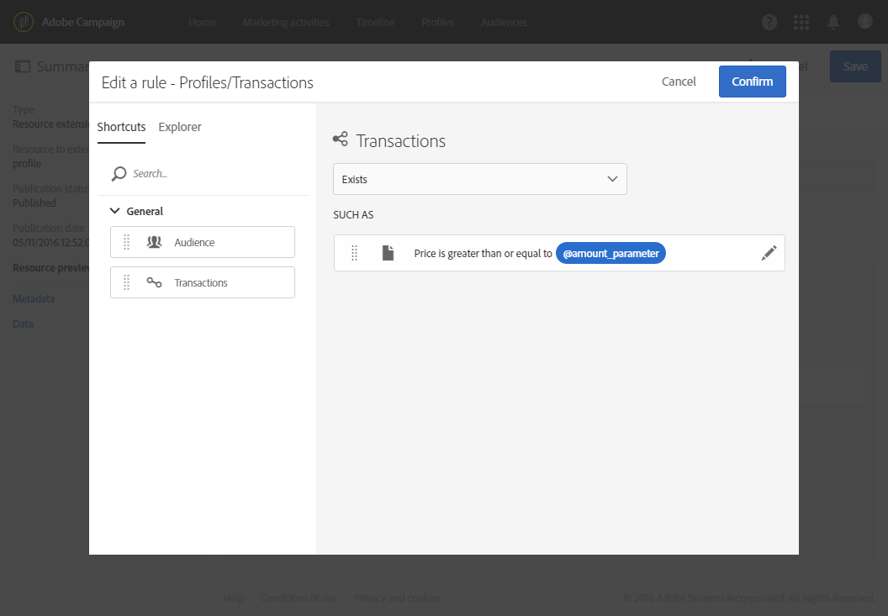

# フィルター定義の設定{#configuring-filter-definition}

この **[!UICONTROL Filter definition]** タブでは、オーディエンスを定義する場合など、複雑なクエリを作成する場合に、ユーザーが直接アクセスできる高度なフィルターを作成できます。

ワークフロー、オーディエンスおよびREST APIを使用して、リソースに値を設定し、そのデータにアクセスできるので、この手順は必須ではありません。

これらのフィルターは、クエリエディターで事前設定されたルールの形式で使用されます。 必要な設定を得るために必要な手順の数を制限できるので、繰り返しのセグメント化に特に有益です。

例えば、過去3か月間に特定の金額を超えるすべてのトランザクションを選択できるフィルターを作成できます。

これを行うには、 **[!UICONTROL Profiles]** リソースを拡張し、（以前に作成した）トランザクションテーブルにリンクするフィルタを定義し、トランザクション価格が特定のパラメータ以上で、トランザクション日が過去3か月に対応する範囲内にあることを示すルールを使用します。

1. トランザクションテーブルは必ず作成して発行してください。 See [Creating or extending the resource](../../developing/using/creating-or-extending-the-resource.md).

   >[!NOTE]
   >
   >この手順では、カスタムトランザクションテーブルの例を使用します。 お客様の場合は、ビジネスニーズに合わせて調整してください。

1. リ **[!UICONTROL Profiles]** ソースのトランザクションテーブルに関連するフィルタを定義する前に、このテーブルへのリンクを定義し、変更を発行してください。 「他のリソースを使用したリンクの [定義](../../developing/using/configuring-the-resource-s-data-structure.md#defining-links-with-other-resources) 」および「データベース構造の [更新」を参照してください](../../developing/using/updating-the-database-structure.md)。
1. 新しいフィルタの定義画面の **[!UICONTROL Definition]** タブで、トランザクションテーブルを選択します。

   

1. ウィンドウで、トランザクションテーブルをワークスペースにドラッグ&amp;ドロップします。 **[!UICONTROL Add a rule - Profiles/Transactions]** 次に表示されるウィンドウで、使用するフィールドを選択します。

   

1. ウィンドウ **[!UICONTROL Optional parameter settings]** の下部にある **[!UICONTROL Add a rule - Transactions]** チェック **[!UICONTROL Switch to parameters]** ボックスをオンにします。

   で、 **[!UICONTROL Filter conditions]****[!UICONTROL Greater than or equal to]** 演算子を選択します。 フィールドに名前を入力し、プラス記号をクリックして新しいパラメータを作成します。 **[!UICONTROL Parameters]**

   

1. 変更を確認します。 この定義は、クエリを実行するために後で入力する必要がある設定可能なフィールドに対応します。

   

1. このルールを別のルールと組み合わせて、取引日が過去3か月間に対応する範囲内にある必要があることを指定します。

   

1. フィルタを表示するカテゴリを選択します。

   

1. フィルター定義画面の **[!UICONTROL Parameters]** タブで、説明とラベルを変更し、フィルターの対象をユーザーに明確に示します。 この情報は、クエリエディターに表示されます。

   

   複数の設定可能なフィールドを定義する場合は、インターフェイスに表示される順序を変更できます。

1. 変更を保存し、リソースを発行します。 For more on this, refer to the [Updating the database structure](../../developing/using/updating-the-database-structure.md) section.

リ **[!UICONTROL Profiles]** ソース拡張機能が公開されると、 [クエリエディターインターフェイスの「ショートカット」タブにこのフィルターが表示されます](../../automating/using/editing-queries.md) 。

これにより、過去3か月間に一定金額以上を支払ったすべての顧客に送信する電子メールを作成する際に、オーディエンスを簡単に定義できます。

単に自分で設定するのではなく、表示されるダイアログボックスに必要な量を入力するだけです。

フィルターを設定したら、次の構文を使用して、Campaign StandardAPIからフィルターを使用できます。

`GET https://mc.adobe.io/<ORGANIZATION>/campaign/profileAndServicesExt/<resourceName>/by<customFilterName>?<customFilterparam>=<customFilterValue>`

詳しくは、 [Campaign StandardAPIのドキュメントを参照してください](../../api/using/filtering.md#custom-filters)。
