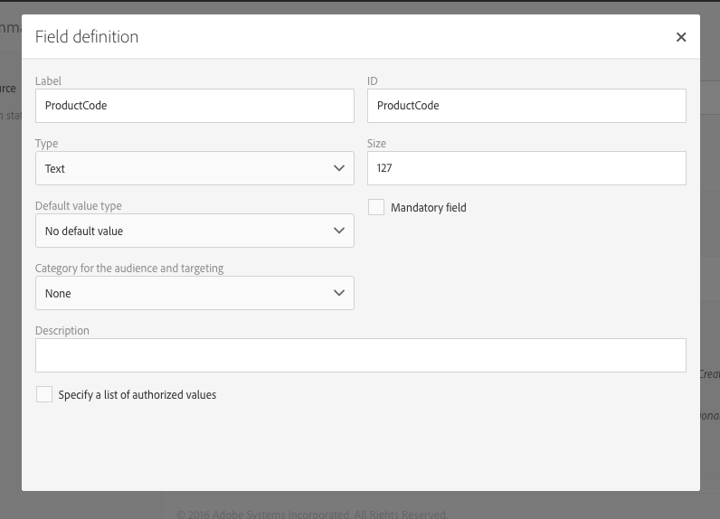
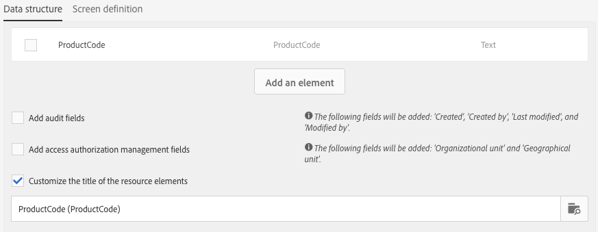
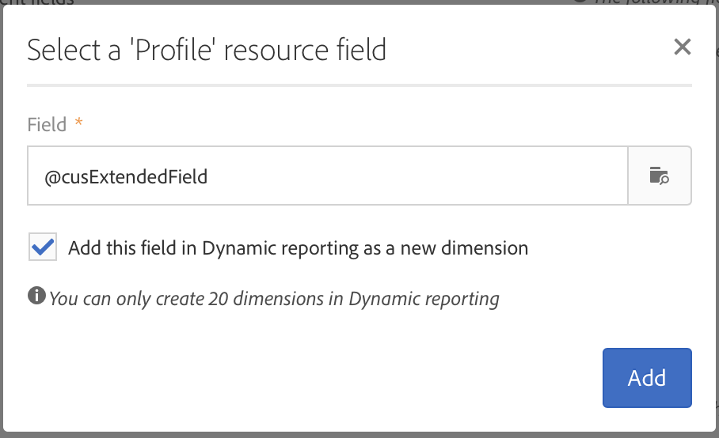

# リソースのデータ構造の設定{#configuring-the-resource-s-data-structure}

新しいカスタムリソースを作成した後は、データ構造を設定する必要があります。

リソースの編集時に、「**[!UICONTROL Data structure]**」タブで次のものを追加できます。

* [フィールド](#adding-fields-to-a-resource)
* [識別キー](#defining-identification-keys)
* [インデックス](#defining-indexes)
* [リンク](#defining-links-with-other-resources)
* [ログの送信](#defining-sending-logs-extension)

## リソースへのフィールドの追加 {#adding-fields-to-a-resource}

標準搭載のデータモデルに含まれていないデータを保存するために、リソースに新しいフィールドを追加できます。

1. フィールドを作成するには、「**[!UICONTROL Create element]**」ボタンを使用します。
1. ラベル、ID、フィールドタイプを指定し、このフィールドに許可する最大の長さを定義します。

   この「**[!UICONTROL ID]**」フィールドは必須で、フィールドを追加するごとに一意の識別子を指定する必要があります。

   >[!NOTE]
   >
   >最大 30 文字です。

   

1. いずれかのフィールドを変更する場合は、「**[!UICONTROL Edit Properties]**」ボタンをクリックします。

   

1. **[!UICONTROL Field definition]**&#x200B;画面でオーディエンスやターゲティングに使用するカテゴリーを定義できます。説明を追加することもできます。

   

1. ユーザーに提示する値（定義済みリストの値）を定義する場合は、「**[!UICONTROL Specify a list of authorized values]**」オプションをオンにします。

   次に「**[!UICONTROL Create element]**」をクリックし、「**[!UICONTROL Label]**」と「**[!UICONTROL Value]**」を指定します。値は必要な数だけ追加できます。

1. フィールドを追加し終えたら、「**[!UICONTROL Add audit fields]**」チェックボックスをオンにして、作成日、リソースを作成したユーザー、日付、および最後の変更をおこなった作成者を記述したフィールドを取り込みます。
1. 「**[!UICONTROL Add access authorization management fields]**」チェックボックスをオンにして、この特定のリソースへのアクセス権を持つユーザーを記述したフィールドを取り込みます。

   これらのフィールドは、データベースの更新がおこなわれた後に表示できるデータとメタデータに表示されます。詳しくは、[データベース構造の更新](../../developing/using/updating-the-database-structure.md)の節を参照してください。

1. ID を自動生成するには、「**[!UICONTROL Add automatic ID]**」フィールドをオンにします。既存のエンティティは空のままになります。詳しくは、[プロファイルおよびカスタムリソースに対する一意の ID の生成](../../developing/using/configuring-the-resource-s-data-structure.md#generating-a-unique-id-for-profiles-and-custom-resources)を参照してください。
1. リストや作成ステップでリソース要素の名前を表示する形式を変更するには、「**[!UICONTROL Customize the title of the resource elements]**」チェックボックスをオンにします。このリソース用として作成した要素からフィールドを選択します。

   

   >[!NOTE]
   >
   >このオプションをオンにせずに、テーブルのすべてのエンティティを一覧表示すると、自動プライマリキー（テーブルにエンティティを追加するたびに自動的に作成される）が使用されます。

これで、リソースのフィールドが定義されました。

## 識別キーの定義 {#defining-identification-keys}

各リソースには、一意のキーが少なくとも 1 つ必要です。例えば、ある購入テーブル中で 2 つの製品に同じ ID を付けることがないようにキーを指定できます。

1. テクニカルキーを自動的かつ増分的に生成させる場合は、「**[!UICONTROL Automatic primary key]**」セクションでストレージのサイズを指定します。

   

1. キーを作成するには、「**[!UICONTROL Create element]**」ボタンを使用します。

   「**[!UICONTROL Label]**」と「**[!UICONTROL ID]**」のフィールドは、デフォルトで入力されますが、編集は可能です。

   >[!NOTE]
   >
   >最大 30 文字です。

1. このキーを構成する要素を定義するには、「**[!UICONTROL Create element]**」をクリックし、このリソース用に作成したフィールドを選択します。

   

   作成したキーは、「**[!UICONTROL Custom keys]**」セクションに表示されます。

これで、リソースの識別キーが作成されます。

>[!NOTE]
>
>識別キーを作成する際のベストプラクティスについては、[こちらの節](../../developing/using/data-model-best-practices.md#keys)を参照してください。

## インデックスの定義 {#defining-indexes}

1 つのインデックスから、単一または複数のリソースフィールドを参照できます。インデックスを使用すると、データベースではレコードを並べ替えて、より簡単にレコードを回復できるようになります。インデックスにより SQL クエリのパフォーマンスが最適化されます。

インデックスの定義付けは推奨されますが、省略してもかまいません。

1. インデックスを作成するには「**[!UICONTROL Create element]**」ボタンを使用します。

   

1. 「**[!UICONTROL Label]**」と「**[!UICONTROL ID]**」のフィールドは、デフォルトで入力されますが、編集は可能です。

   >[!NOTE]
   >
   >最大 30 文字です。

1. このインデックスを構成する要素を定義するには、このリソース用に作成したフィールドから必要なフィールドを選択します。

   

1. 「**[!UICONTROL Confirm]**」をクリックします。

作成したインデックスが「**[!UICONTROL Index]**」セクションのリストに表示されます。

>[!NOTE]
>
>インデックス作成時のベストプラクティスについては、[こちらの節](../../developing/using/data-model-best-practices.md#indexes)を参照してください。

## 他のリソースとのリンクの定義 {#defining-links-with-other-resources}

リンクは、一方のテーブルともう一方のテーブルの関連付けの詳細を示します。

1. ターゲットリソースへのリンクを作成するには、「**[!UICONTROL Create element]**」ボタンを使用します。
1. 「**[!UICONTROL Select a target resource]**」をクリックします。

   

1. リソースはアルファベット順に表示されます。また、名前を基準にフィルタリングできます。技術名は角括弧で囲まれて表示されます。

   リストから要素を選択し、「**[!UICONTROL Confirm]**」をクリックします。

   

1. 基数に従って&#x200B;**[!UICONTROL Link type]**&#x200B;を選択します。選択した基数の種類によって、レコードが削除されたり、複製されたりしたときの動作が異なる場合があります。

   次のようなリンクタイプがあります。

   * **[!UICONTROL 1 cardinality simple link]**：ソーステーブルの 1 つの出現に対応するターゲットテーブルの出現を最大 1 つに制限するリンクです。
   * **[!UICONTROL N cardinality collection link]**：ソーステーブルの 1 つの出現に対応するターゲットテーブルの複数の出現が可能ですが、ターゲットテーブルの 1 つの出現に対応するソーステーブルの出現は最大 1 つに制限されます。
   * **[!UICONTROL 0 or 1 cardinality simple link]**：ソーステーブルの 1 つの出現に対応するターゲットテーブルの出現が最大 1 つまたはゼロに制限されます。この種の&#x200B;**[!UICONTROL Link type]**&#x200B;は、パフォーマンス低下の原因になることがあります。

   

1. **[!UICONTROL New link]**&#x200B;画面で、「**[!UICONTROL Label]**」と「**[!UICONTROL ID]**」のフィールドは、デフォルトで入力されますが、編集は可能です。

   >[!NOTE]
   >
   >最大 30 文字です。
   >
   >リンクの作成後にリンク名を変更することはできません。リンク名を変更するには、いったんリンクを削除した後、再び作成する必要があります。

1. **[!UICONTROL Category for the audience and targeting]**&#x200B;リストにより、このリンクをカテゴリーに割り当てて、クエリエディターツールで見やすく表示できるようになります。
1. 必要に応じて、「**[!UICONTROL Reverse link definition]**」で、ターゲットリソースに含まれるリソースのラベルと ID を表示できます。
1. リンクで参照されるレコードの動作を「**[!UICONTROL Behavior if deleted/duplicated]**」セクションで定義します。

   デフォルトでは、リンクで参照されるレコードがなくなると、ターゲットレコードは削除されます。

   

1. 「**[!UICONTROL Join definition]**」セクションでは、デフォルトの「**[!UICONTROL Use the primary keys to make the join]**」が選択されますが、次の 2 つのオプションのいずれかを選択できます。

   * **[!UICONTROL Use the primary key to make the join]**：この結合定義により、プロファイルのプライマリキーを使用して、購入のプライマリキーに紐付けできるようになります。
   * **[!UICONTROL Define specific join conditions]**：この結合定義により、両方のリソースを結合するフィールドを手動で選択できるようになります。データが正しく設定されていないと、**Purchase** レコードが表示されません。

   

作成したリンクは、「**[!UICONTROL Links]**」セクションのリストに表示されます。

>[!NOTE]
>
>インデックス作成時のベストプラクティスについては、[こちらの節](../../developing/using/data-model-best-practices.md#links)を参照してください。

**例：作成したリソースを「プロファイル」リソースにリンクする**

この例では、新しいリソース **Purchase** をカスタムリソース **Profiles** にリンクさせます。

1. 新しいリソース **Purchase** を作成します。
1. これをカスタムリソース **Profiles** にリンクさせるには、「**[!UICONTROL Data structure]**」タブの「**[!UICONTROL Links]**」セクションを展開し、「**[!UICONTROL Create element]**」をクリックします。
1. ターゲットリソース **[!UICONTROL Profiles (profile)]** を選択します。
1. この例では、デフォルトのリンクタイプ「**[!UICONTROL 1 cardinality simple link]**」を選択したままにします。

   

1. 結合定義を選択します。ここではデフォルト「**[!UICONTROL Use the primary key to make the join]**」をそのまま保持します。

   

1. 必要に応じて詳細画面を定義すれば、**Purchase** を編集し、プロファイルにリンクさせることができます。

   「**[!UICONTROL Detail screen configuration]**」セクションを展開し、「**[!UICONTROL Define a detail screen]**」をオンにして、リソースの各要素に対応する画面を設定します。このボックスをオフにすると、このリソースの要素を示す詳細表示にはアクセスできなくなります。

1. 「**[!UICONTROL Create element]**」をクリックします。
1. リンクされたリソースを選択し、「**[!UICONTROL Add]**」をクリックします。

   以降、新しいリソースは、**[!UICONTROL Client data]**／**[!UICONTROL Purchase]** を選択すれば詳細設定メニューで使用できるようになります。

   

1. 設定が完了したら、「**[!UICONTROL Confirm]**」をクリックします。

   これで、新しいリソースを公開できます。

このリンクを追加すると、**[!UICONTROL Profiles & audiences]**／**[!UICONTROL Profiles]**&#x200B;メニューで表示されるプロファイルの詳細画面に「**購入**」タブが追加されます。なお、これは **[!UICONTROL Profile]** リソースに固有のものです。

## 送信ログ拡張機能の定義 {#defining-sending-logs-extension}

送信ログ拡張機能により、次のことが可能になります。

* **プロファイルのカスタムフィールドを追加**&#x200B;することにより、動的レポートの機能を拡張する
* 送信ログデータを&#x200B;**セグメントコードとプロファイルデータ**&#x200B;で拡張する

**セグメントコードで拡張**

ユーザーは、ワークフローエンジンのセグメントコードを使用してログを拡張できます。

セグメントコードは、ワークフローの内部に定義する必要があります。

この拡張機能を有効にするには、「**[!UICONTROL Add segment code]**」オプションをオンにします。

セグメントコードについて詳しくは、[セグメント化](../../automating/using/segmentation.md)の節を参照してください。

**プロファイルフィールドで拡張**

>[!NOTE]
>
>管理者はまず、カスタムフィールドを使用して Profile リソースを拡張しておく必要があります。

「**[!UICONTROL Add field]**」をクリックして、プロファイルリソースからいずれかのカスタムフィールドを選択します。

プロファイルディメンションにリンクする新しいサブディメンションを生成するには、「**[!UICONTROL Add this field in Dynamic reporting as a new dimension]**」オプションをオンにします。

動的レポートから、カスタムフィールドディメンションをフリーフォームテーブルにドラッグ＆ドロップできます。

動的レポートについて詳しくは、[コンポーネントのリスト](../../reporting/using/list-of-components-.md)を参照してください。

>[!IMPORTANT]
>
>動的レポートに送信できるフィールドの数は 20 個に制限されます。

## リソースプロパティの編集 {#editing-resource-properties}

カスタムリソース画面の&#x200B;**[!UICONTROL Summary]**&#x200B;パネルには、新たに作成されたリソースのステータスが示されます。リソースへのアクセスと一般的なプロパティを管理できます。

1. 「**[!UICONTROL Edit properties]**」ボタンをクリックして、説明を追加します。

   

1. 必要に応じて、リソースのラベルおよび ID を変更します。

   >[!NOTE]
   >
   >最大 30 文字です。

1. このリソースへのアクセスを特定の組織単位に制限する必要がある場合は、ここで組織単位を指定します。許可された組織単位のユーザーだけが、アプリケーションでこのリソースを使用できます。
1. 変更内容を保存します。

変更内容が保存されます。変更内容を適用するには、リソースを再度、公開する必要があります。

## プロファイルおよびカスタムリソースに対する一意の ID の生成 {#generating-a-unique-id-for-profiles-and-custom-resources}

デフォルトでは、プロファイルおよびカスタムリソースの作成時に、ビジネス ID は付与されていません。要素の作成時に、自動的に一意の ID を生成するオプションを有効にすることができます。この ID は、次の目的で使用できます。

* 外部ツールでエクスポートされたレコードを簡単に識別する
* 別のアプリケーションで処理された更新データをインポートする際にレコードを紐付ける

ID を有効にできるのは、プロファイルとカスタムリソースに限られます。

1. プロファイルリソースの拡張機能を作成するか、新規のリソースを作成します。
1. データ構造の定義で「**[!UICONTROL Fields]**」セクションにある「**[!UICONTROL Add automatic ID field]**」をオンにします。

   

   >[!NOTE]
   >
   >新しいレコードだけに ACS ID が付与されます。このオプションを有効にする前は、作成したプロファイルや要素の「**[!UICONTROL ACS ID]**」フィールドは空のままになります。

1. リソースに加えた変更を保存した後、公開します。API を介して作成した要素に、このメカニズムを適用する場合は、API を拡張するオプションを選択します。

これで、「**[!UICONTROL ACS ID]**」フィールドが使用可能になり、API を介して新しい要素を手動で作成した時点、またはインポートワークフローから挿入した時点で自動的に入力されます。ACS ID フィールドは UUID フィールドとして扱われ、インデックスが付けられます。

プロファイルまたはカスタムリソースのエクスポート時に、そのリソースの ID が有効になっていれば、「**[!UICONTROL ACS ID]**」列を追加することができます。この ID を外部ツールで再利用することにより、レコードの識別が可能になります。

別のアプリケーション（例えば、CRM）で処理／更新されたデータを再インポートするときに、このデータを一意の ID に簡単に紐付けることができます。

>[!NOTE]
>
>このオプションを有効にしない限り、作成したプロファイルや要素の「**[!UICONTROL ACS ID]**」フィールドは更新されません。新しいレコードだけに ACS ID が付与されます。
>
>このフィールドは読み取り専用モードです。変更はできません。
