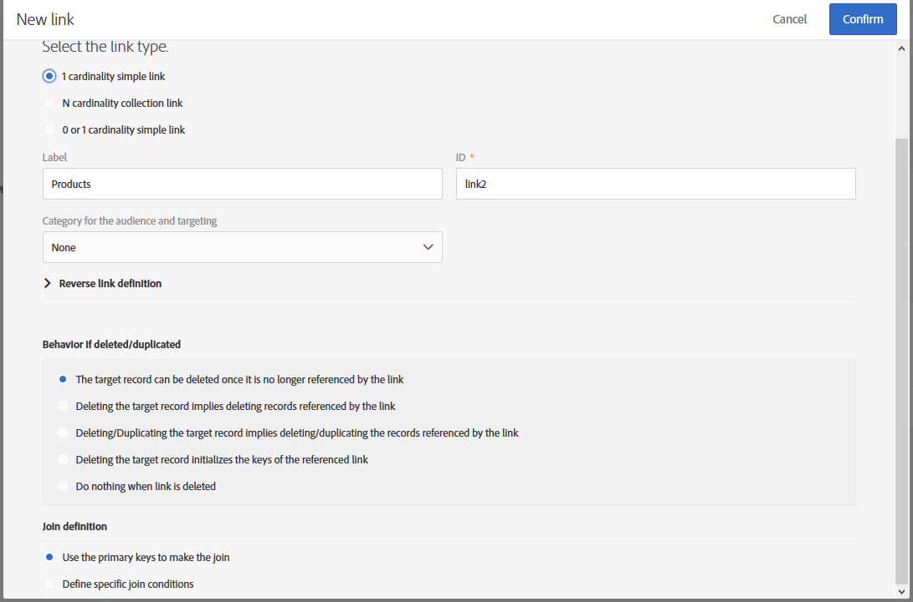
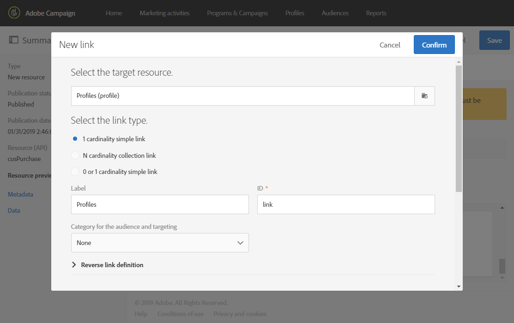

# リソースのデータ構造の設定{#configuring-the-resource-s-data-structure}

新しいカスタムリソースを作成した後、データ構造を設定する必要があります。

リソースを編集する際に、タブで **[!UICONTROL Data structure]** 次を追加できます。

* [フィールド](#adding-fields-to-a-resource)
* [識別キー](#defining-identification-keys)
* [索引](#defining-indexes)
* [リンク](#defining-links-with-other-resources)
* [ログの送信](#defining-sending-logs-extension)

## リソースへのフィールドの追加 {#adding-fields-to-a-resource}

既製のデータモデルに含まれていないデータを保存するために、リソースに新しいフィールドを追加できます。

1. ボタンを使 **[!UICONTROL Create element]** 用してフィールドを作成します。
1. ラベル、ID、フィールドタイプを指定し、このフィールドに許可される最大長を定義します。

   このフ **[!UICONTROL ID]** ィールドは必須で、追加する各フィールドに対して一意である必要があります。

   >[!NOTE]
   >
   >最大30文字を使用します。

   

1. フィールドの1つを変更するには、ボタンをオンに **[!UICONTROL Edit Properties]** します。

   

1. 画面で、 **[!UICONTROL Field definition]** オーディエンスとターゲットに使用するカテゴリを定義したり、説明を追加したりできます。

   

1. ユーザー **[!UICONTROL Specify a list of authorized values]** に提供する値（列挙値）を定義する必要がある場合は、このオプションを選択します。

   次に、をクリッ **[!UICONTROL Create element]** クし、とを指定 **[!UICONTROL Label]** しま **[!UICONTROL Value]**&#x200B;す。 必要なだけ値を追加します。

1. フィールドを追加したら、作成日、リソースを作成したユーザ、 **[!UICONTROL Add audit fields]** 日付、および最終変更の作成者を詳細に示すフィールドを含めるチェックボックスをオンにします。
1. 特定のリソー **[!UICONTROL Add access authorization management fields]** スに対するアクセス権を持つユーザーを示すフィールドを含める場合は、このチェックボックスをオンにします。

   これらのフィールドは、データベースの更新後に表示できるデータとメタデータに表示されます。 詳しくは、「データベース構造の更新 [」の節を参照してください](../../developing/using/updating-the-database-structure.md) 。

1. IDを自動的に生 **[!UICONTROL Add automatic ID]** 成するには、フィールドをチェックします。 既存のエンティティは空のままになることに注意してください。 詳しくは、プロファイルおよびカスタムリソ [ースの一意のIDの生成を参照してください](../../developing/using/configuring-the-resource-s-data-structure.md#generating-a-unique-id-for-profiles-and-custom-resources)。
1. リストと作成手順でリソース要素の名前が表示される方法を変更するには、このボックスをオンにし **[!UICONTROL Customize the title of the resource elements]** ます。 このリソース用に作成したフィールドからフィールドを選択します。

   

   >[!NOTE]
   >
   >このオプションを選択しない場合、このテーブルのすべてのエンティティを一覧表示する際に、自動主キー（エンティティがテーブルに追加されるたびに自動的に作成される）が使用されます。

これで、リソースのフィールドが定義されました。

## 識別キーの定義 {#defining-identification-keys}

各リソースには、少なくとも1つの一意のキーが必要です。 例えば、2つの製品が1つの購入テーブルで同じIDを持つことができないようにキーを指定できます。

1. テクニカル・キーを **[!UICONTROL Automatic primary key]** 自動的に増分的に生成する場合は、このセクションでストレージのサイズを指定します。

   

1. ボタンを使 **[!UICONTROL Create element]** 用してキーを作成します。

   とのフィ **[!UICONTROL Label]** ールドは **[!UICONTROL ID]** デフォルトで入力されますが、編集することはできます。

   >[!NOTE]
   >
   >最大30文字を使用します。

1. このキーを構成する要素を定義するには、をクリックし **[!UICONTROL Create element]** て、このリソース用に作成したフィールドを選択します。

   

   作成されたキーがセクションに表示さ **[!UICONTROL Custom keys]** れます。

これで、リソースのIDキーが作成されます。

>[!NOTE]
>
>IDキーを作成する際のベストプラクティスについては、この節を参照して [くださ](../../developing/using/data-model-best-practices.md#keys)い。

## インデックスの定義 {#defining-indexes}

インデックスは、1つまたは複数のリソースフィールドを参照できます。 インデックスを使用すると、データベースでレコードをソートして、より簡単にリカバリできます。 SQLクエリのパフォーマンスを最適化します。

インデックスの定義は推奨されますが、必須ではありません。

1. 索引を作成す **[!UICONTROL Create element]** るには、ボタンを使用します。

   

1. とのフィ **[!UICONTROL Label]** ールドは **[!UICONTROL ID]** デフォルトで入力されますが、編集することはできます。

   >[!NOTE]
   >
   >最大30文字を使用します。

1. このインデックスを構成する要素を定義するには、このリソース用に作成したフィールドからフィールドを選択します。

   

1. クリック **[!UICONTROL Confirm]**.

作成されたインデックスがセクションのリストに表示さ **[!UICONTROL Index]** れます。

>[!NOTE]
>
>インデックス作成時のベストプラクティスについては、この節を参照して [くださ](../../developing/using/data-model-best-practices.md#indexes)い。

## 他のリソースとのリンクの定義 {#defining-links-with-other-resources}

リンクは、あるテーブルと他のテーブルとの関連付けの詳細を示します。

1. ターゲットリ **[!UICONTROL Create element]** ソースへのリンクを作成するには、このボタンを使用します。
1. クリック **[!UICONTROL Select a target resource]**.

   

1. リソースはアルファベット順に表示され、名前でフィルタリングできます。 技術名は角括弧で囲まれて表示されます。

   リストから要素を選択し、をクリックしま **[!UICONTROL Confirm]**&#x200B;す。

   

1. 基数に従っ **[!UICONTROL Link type]** てを選択します。 選択した基数タイプによって、レコードが削除されたり重複したりした場合の動作が異なる場合があります。

   次に、様々なリンクタイプを示します。

   * **[!UICONTROL 1 cardinality simple link]**:ソース・テーブルの1つのオカレンスは、ターゲット・テーブルの対応するオカレンスを最大1つ持つことができます。
   * **[!UICONTROL N cardinality collection link]**:1つのソース・テーブルのオカレンスは、ターゲット・テーブルの対応するオカレンスを複数持つことができますが、1つのオカレンスは、ソース・テーブルの対応するオカレンスを最大1つ持つことができます。
   * **[!UICONTROL 0 or 1 cardinality simple link]**:ソーステーブルの1つのオカレンスは、ターゲットテーブルの対応するオカレンスを1つだけ持つことができます。 この種の場合、パフォーマンスの問題 **[!UICONTROL Link type]** が発生する可能性があります。
   

1. 画面では、 **[!UICONTROL New link]** フィールドはデ **[!UICONTROL Label]** フォ **[!UICONTROL ID]** ルトで入力されますが、編集することはできます。

   >[!NOTE]
   >
   >最大30文字を使用します。

   >[!CAUTION]
   >
   >リンクの作成後にリンク名を変更することはできません。 リンクの名前を変更するには、リンクを削除して再び作成する必要があります。

1. このリ **[!UICONTROL Category for the audience and targeting]** ンクをカテゴリに割り当てて、クエリーエディターツールで表示しやすくすることができます。
1. 必要に応じて、このセ **[!UICONTROL Reverse link definition]** クションでは、対象のリソース内のリソースのラベルとIDを表示できます。
1. セクション内のリンクで参照されるレコードの動作を定義し **[!UICONTROL Behavior if deleted/duplicated]** ます。

   デフォルトでは、リンクから参照されなくなったターゲットレコードは削除されます。

   

1. このセクション **[!UICONTROL Join definition]** では、デフォルトのオ **[!UICONTROL Use the primary keys to make the join]** プションが選択されていますが、次の2つのオプションから選択できます。

   * **[!UICONTROL Use the primary key to make the join]**:この結合定義を使用すると、プロファイルの主キーを使用して、購入の主キーと調整できます。
   * **[!UICONTROL Define specific join conditions]**:この結合定義を使用すると、両方のリソースを結合するフィールドを手動で選択できます。 データが正しく設定されていない場合、購入レコードは **表示されない** ことに注意してください。
   

作成されたリンクは、セクションのリストに表示さ **[!UICONTROL Links]** れます。

>[!NOTE]
>
>インデックス作成時のベストプラクティスについては、この節を参照して [くださ](../../developing/using/data-model-best-practices.md#links)い。

**例：作成したリソースを&#39;Profiles&#39;リソースにリンクする**

この例では、新しいリソース **PurchaseをProfilesカスタムリソースとリン** クします **** 。

1. 新しい購入リソー **スを作成** 。
1. これをプロファイルカスタムリソ **ースとリンクするには** 、タブのセクシ **[!UICONTROL Links]** ョンを展開し、 **[!UICONTROL Data structure]** をクリックしま **[!UICONTROL Create element]**&#x200B;す。
1. ターゲットリソースを選択しま **[!UICONTROL Profiles (profile)]**&#x200B;す。
1. この例では、デフォルトのリンクタイプを選 **[!UICONTROL 1 cardinality simple link]** 択したままにします。

   

1. 結合定義を選択します。ここではデフォルトのままにしま **[!UICONTROL Use the primary key to make the join]**&#x200B;す。

   

1. 必要に応じて、購入を編集してプロファイルにリンクできる詳細画面 **を定義できます** 。

   セクション **[!UICONTROL Detail screen configuration]** を展開し、リソースの各 **[!UICONTROL Define a detail screen]** 要素に対応する画面を設定するようにを確認します。 このチェックボックスをオフにすると、このリソースの要素の詳細ビューにアクセスできなくなります。

1. クリック **[!UICONTROL Create element]**.
1. リンクされたリソースを選択し、をクリックしま **[!UICONTROL Add]**&#x200B;す。

   新しいリソースは、詳細メニューで/を選択して使用で **[!UICONTROL Client data]** きます **[!UICONTROL Purchase]**。

   

1. 設定が完了したら、をクリックしま **[!UICONTROL Confirm]**&#x200B;す。

   これで、新しいリソースを公開できます。

このリンクを追加すると、「購入 **」タブが/メニューからプロファイルの詳細画面に** 追加さ **[!UICONTROL Profiles & audiences]****[!UICONTROL Profiles]** れます。 これはリソースに固有のものであることに注意してく **[!UICONTROL Profile]** ださい。

## 送信ログの拡張の定義 {#defining-sending-logs-extension}

送信ログの拡張機能を使用すると、次のことができます。

* プロファイルカスタムフィールドを追加して動的レポ **ート機能を拡張するには**
* セグメントコードとプロファイルデータを使用し **て送信ログデータを拡張するには**

**セグメントコードで拡張**

ユーザーは、ワークフローエンジンからのセグメントコードを使用してログを拡張できます。

セグメントコードは、ワークフロー内に定義する必要があります。

この拡張機能を有効にするには、オプションをオンにしま **[!UICONTROL Add segment code]**&#x200B;す。

セグメントコードについて詳しくは、「セグメント化  」を参照してください。

**プロファイルフィールドを使用して拡張**

>[!NOTE]
>
>管理者は、カスタムフィールドを使用してプロファイルリソースを拡張する必要があります。

をクリック **[!UICONTROL Add field]** し、プロファイルリソースから任意のカスタムフィールドを選択します。

プロファイルディメンションにリンクされた新しいサブディメンションを生成するには、このオプションをオンに **[!UICONTROL Add this field in Dynamic reporting as a new dimension]** します。

Dynamic Reportingから、カスタムフィールドディメンションをフリーフォームテーブルにドラッグ&amp;ドロップできます。

Dynamic Reportingの詳細は、「コンポーネントのリスト」を参 [照してください](../../reporting/using/list-of-components-.md)。

>[!CAUTION]
>
>Dynamic Reportingに送信されるフィールドの数は20個に制限されています。

## リソースプロパティの編集 {#editing-resource-properties}

カスタムリソース画面では、新しく作 **[!UICONTROL Summary]** 成されたリソースの状態がペインに表示されます。 アクセスとその一般的なプロパティを管理できます。

1. ボタンをクリ **[!UICONTROL Edit properties]** ックして説明を追加します。

   

1. 必要に応じて、リソースのラベルとIDを変更します。

   >[!NOTE]
   >
   >最大30文字を使用します。

1. このリソースへのアクセスを特定の組織単位に制限する必要がある場合は、ここで指定します。 許可された単位数のユーザーのみが、アプリケーションでこのリソースを操作できます。
1. 変更を保存します。

変更が保存されます。 リソースを適用するには、再度リソースを発行する必要があります。

## プロファイルおよびカスタムリソースの一意のIDの生成 {#generating-a-unique-id-for-profiles-and-custom-resources}

デフォルトでは、プロファイルとカスタムリソースは、作成時にビジネスIDを持ちません。 要素の作成時に一意のIDを自動的に生成するオプションを有効にできます。 このIDは、次の目的で使用できます。

* 外部ツールでエクスポートされたレコードを簡単に識別できます。
* 別のアプリケーションで処理された更新済みデータをインポートする際に、レコードを調整します。

プロファイルとカスタムリソースに対してのみ有効にできます。

1. プロファイルリソースの拡張を作成するか、新しいリソースを作成します。
1. データ構造の定義で、セクションの下にあ **[!UICONTROL Add automatic ID field]** るオプションを選択 **[!UICONTROL Fields]** します。

   

   >[!NOTE]
   >
   >ACS IDを持つのは新しいレコードのみです。 このオプ **[!UICONTROL ACS ID]** ションを有効にする前に作成されたプロファイルまたは要素のフィールドは空のままです。

1. リソースに対して行った変更を保存して発行します。 このメカニズムをAPIを介して作成されたエレメントに適用する場合は、APIを拡張するオプションを選択します。

新しい **[!UICONTROL ACS ID]** 要素を手動、APIから、または読み込みワークフローから挿入したときに、このフィールドが使用可能になり、自動的に設定されるようになりました。 ACS IDフィールドはUUIDフィールドで、インデックスが作成されます。

プロファイルやカスタムリソースを書き出す際に、そのリソースに対して列が有効になっ **[!UICONTROL ACS ID]** ている場合、列を追加できるようになりました。 このIDを外部ツールで再利用して、レコードを識別できます。

別のアプリケーション（CRMなど）で処理または更新されたデータを再インポートする場合、この一意のIDを使用して簡単に調整できます。

>[!NOTE]
>
>オプション **[!UICONTROL ACS ID]** を有効にする前に作成されたプロファイルまたは要素に対して、このフィールドは更新されません。 ACS IDを持つのは新しいレコードのみです。
>
>このフィールドは読み取り専用モードです。 変更はできません。
