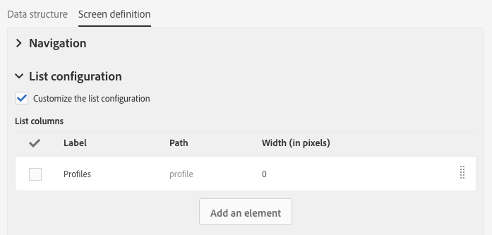

# 画面定義の設定{#configuring-the-screen-definition}

リソースを作成する場合、または既存のリソースに新しいフィールドを追加する場合、インタフェースに表示する方法を定義できます。

この手順は必須ではありません。リソースにデータを入力し、ワークフロー、オーディエンスおよびREST APIを通じてそのデータにアクセスできるからです。

このタブでは、次 **[!UICONTROL Screen definition]** の操作を実行できます。

* ナビゲ追加ーションウィンドウでのカスタムリソースへのアクセス
* リソースを構成する要素のリストを提示する方法をパーソナライズする
* リソースの各要素の詳細表示の表示方法を定義します

## ナビゲーションメニューからのアクセスの有効化 {#enabling-access-from-the-navigation-menu}

リソースに専用の画面を設定する場合は、ナビゲーションメニューからその画面を使用できます。

1. リソースの **[!UICONTROL Screen definition]** タブから、セクションを展開 **[!UICONTROL Navigation]** します。
1. ナビゲーションペ **[!UICONTROL Add an entry in the 'Client data' section]** インからこのリソースにアクセスできるようにするには、このボックスをオンにします。

   

リソースはセクション内のサブエントリとして表示さ **[!UICONTROL Client data]** れます。

## デフォルトのリスト設定の定義 {#defining-the-default-list-configuration}

画面定 **[!UICONTROL List configuration]** 義のセクションでは、リソースの概要にデフォルトで表示される列と情報を定義できます。

1. リソースの **[!UICONTROL Customize the list configuration]** 列の表示方法を定義するには、チェックボックスをオンにします。
1. 作成したフ **[!UICONTROL Create element]** ィールドからフィールドを選択するには、このボタンを使用します。
1. 作成されたフィールドがリストに表示されます。 ラベルと幅を編集できます。

   

1. このセクシ **[!UICONTROL Simple search]** ョンで、検索に含め **[!UICONTROL Specify the fields to be taken into account in the search]** るフィールドを定義するには、をチェックします。

   >[!IMPORTANT]
   >
   >この設定は、デフォルトの検索で使用されるフィールドを置き換えます。

1. このセクション **[!UICONTROL Advanced filtering]** で、単純検索フィールドの **[!UICONTROL Add search fields]** 後にフィールドを追加する場合は、このボックスをオンにします。 例えば、作成したフィールドから「日付」フィールドを選択すると、その日付のみを参照する検索を実行できます。
1. 2つの検索タイプのフィールドの順序を変更できます。
1. 詳細検索では、リンクされたリソースにリンクするフィールドを追加できます。 これらのフィルターは、生成さ **[!UICONTROL Search]** れた画面のメニューに表示されます。

これで、リソースの概要画面が定義されました。

## 詳細画面の設定の定義 {#defining-the-detail-screen-configuration}

画面定 **[!UICONTROL Detail screen configuration]** 義のセクションでは、リソースの各要素の詳細画面に表示される列と情報を定義できます。

1. セクション **[!UICONTROL Detail screen configuration]** を展開し、リソー **[!UICONTROL Define a detail screen]** スの各要素に対応する画面を設定します。 このチェックボックスをオフにすると、このリソースの要素の詳細表示にアクセスできなくなります。
1. 1回のクリックで、カスタムリソースのすべてのフィールドを追加できます。 これを行うには、アイコンをクリック  するか、ボタンを使用 **[!UICONTROL Add an element]** します。
1. このリソース用に作成された要素から要素を選択し、フィールドタイプを指定します。

   * **[!UICONTROL Input field]**:は編集可能なフィールドです。
   * **[!UICONTROL Value]**:は読み取り専用フィールドです。
   * **[!UICONTROL List]**:はテーブルです。
   * **[!UICONTROL Separator]**:要素を複数のカテゴリに分割
   

1. 追加された要素がリストに表示されます。 ラベルを編集できます。

   

1. 追加要素を別の **[!UICONTROL Separator]** カテゴリに分割する必要がある限り。

   これにより、区切り文字を表示して、ウィンドウをより整理できます。

   

これで、リソースの詳細画面が設定されました。

## データセクションのアクション {#actions-on-data-section}

これらの設定を使用すると、カスタムリソース画面にコントロールバーを表示できます。 次の3つのオプションを使用できます。

* **[!UICONTROL Authorize creating]**:このオプションを使用すると、リソースの作成要素をアクティブにできます。 このため、ユーザーはレコードを追加できます。

   >[!NOTE]
   >
   >このオプションを有効にするには、まずリソースにリンクされた詳細画面をアクティブにする必要があります。

* **[!UICONTROL Authorize duplicating]**:このオプションを使用すると、カスタムリソースにリンクされた重複レコードをアクティブにできます。
* **[!UICONTROL Authorize deleting]**:このオプションを使用すると、カスタムリソースにリンクされたレコードの削除をアクティブにできます。
