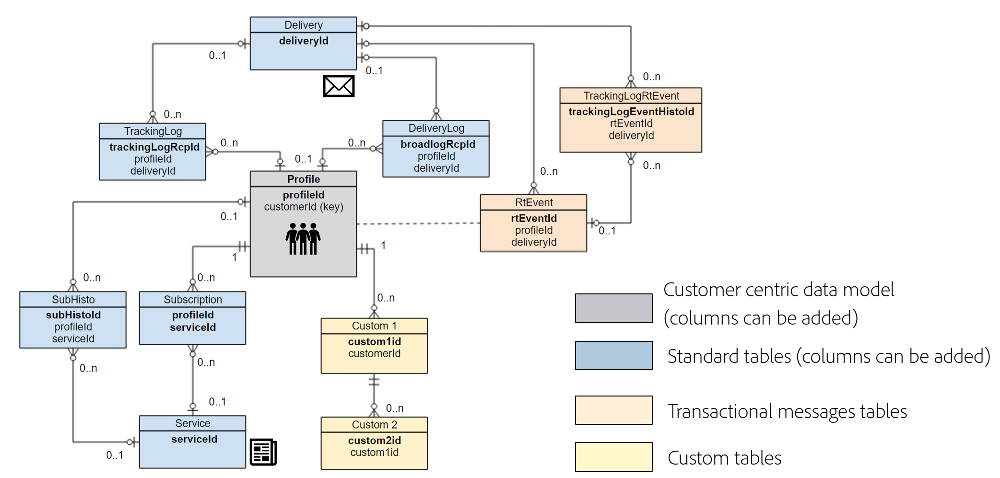

# データモデルのベストプラクティス{#data-model-best-practices}

このドキュメントでは、Adobe Campaignデータモデルを設計する際の主な推奨事項の概要を説明します。

>[!NOTE]
>
>Adobe Campaignの事前定義データモデルを拡張するためのリソースを作成および変更するには、 [この節を参照してください](../../developing/using/key-steps-to-add-a-resource.md)。
>
>このページには、組み込みリソースのデータモデル表現が表示され [ます](../../developing/using/datamodel-introduction.md)。

## 概要 {#overview}

Adobe Campaignシステムは非常に柔軟性が高く、最初の実装以外にも拡張できます。 ただし、可能性は無限ですが、賢明な判断を下し、開始がデータモデルを設計するための強力な基盤を構築することは非常に重要です。

このドキュメントでは、Adobe Campaignツールを適切に設計する方法を学ぶための一般的な使用例とベストプラクティスを紹介します。

## データモデルのアーキテクチャ {#data-model-architecture}

Adobe Campaign Standardは、オンラインとオフラインの戦略を調整して、パーソナライズされた顧客体験を作り出すのに役立つ強力なクロスチャネルキャンペーン管理システムです。

### 顧客中心アプローチ {#customer-centric-approach}

ほとんどの電子メールサービスプロバイダーはリスト中心アプローチを使用してお客様と通信していますが、Adobe Campaignは、お客様とその属性の幅広い表示を活用するために、リレーショナルデータベースに依存しています。

この顧客中心アプローチは、次の図のようになります。 灰色の **プロファイル** ・リソースは、すべての作成が行われている主な顧客テーブルを表します。

この [節では、Adobe Campaignのデフォルトのデータモデルについて説明し](../../developing/using/datamodel-introduction.md)ます。

<!--You can find a datamodel representation for the out-of-the-box resources [here](../../developing/using/datamodel-introduction.md).-->

<!--### What is a customer? {#customer-definition}

If you have customer data in more than one system, you need to determine which solution will allow you to identify records as one person. This work might require rules, eventually a match and merge processes to determine the primary record. This primary record should be the one sent to Adobe Campaign.

While some of this data cleansing might be performed in Adobe Campaign, the recommendation is to run these processes outside and only import clean data in Adobe Campaign. You should keep Campaign as a marketing solution more than a data cleansing tool.

Be able to provide a primary customer record which will be sent to Adobe Campaign.-->

### Adobe Campaign用データ {#data-for-campaign}

Adobe Campaignに送信するデータ マーケティングアクティビティに必要なデータを決定することが重要です。

>[!NOTE]
>
>Adobe CampaignはData Warehouseではありません。 したがって、可能な顧客とその関連情報をすべてAdobe Campaignにインポートしないでください。

属性をAdobe Campaignに必要とするかどうかを決定するには、属性が次のいずれかのカテゴリに該当するかどうかを決定します。
* セグメント化に使用する **属性**
* **データ管理プロセスに使用される属性** (集計の計算など)
* パー **ソナライゼーションに使用する属性**
* **レポートに使用される属性** (カスタムプロファイルデータに基づいてレポートを作成可能)

これらのいずれかに該当しない場合、Adobe Campaignでこの属性は必要ないと思われます。

### データタイプ {#data-types}

システムのアーキテクチャとパフォーマンスを確実に保つには、次のベストプラクティスに従ってAdobe Campaignでデータを設定します。
* 文字列フィールドの長さは、常に列で定義する必要があります。 デフォルトでは、Adobe Campaignの最大長は255文字ですが、サイズが短くならないことが既にわかっている場合は、Adobeでフィールドの長さを短くすることをお勧めします。
* ソース・システムのサイズが過大評価されていて、サイズに達しないことが確実な場合は、ソース・システムのAdobe Campaignよりもフィールドの方が短い場合でも構いません。 Adobe Campaignが短い文字列か、それより小さい整数を意味する場合があります。

## データ構造の設定 {#configuring-data-structure}

ここでは、リソースのデータ構造を [設定する際のベストプラクティスについて説明します](../../developing/using/configuring-the-resource-s-data-structure.md)。

### 識別子 {#identifiers}

Adobe Campaignリソースには3つの識別子があり、別の識別子を追加できます。

次の表に、これらの識別子とその目的を示します。

>[!NOTE]
>
>表示名は、Adobe Campaignユーザーインターフェイスを介してユーザーに表示されるフィールドの名前です。 技術的な名前は、リソース定義の実際のフィールド名（およびテーブルの列名）です。

| 表示名 | 技術名 | 説明 | ベストプラクティス |
|--- |--- |--- |--- |
|  | PKey | <ul><li>PKeyは、Adobe Campaignテーブルの物理的な主キーです。</li><li>このIDは、通常、特定のAdobe Campaignインスタンスに対して一意です。</li><li>Adobe Campaign Standardでは、この値はエンドユーザーに対しては表示されません（URLを除く）。</li></ul> | <ul><li>APIシステムを介して 、PKey値（物理キーではなく生成/ハッシュ値）を取得できます。</li><li>APIを使用したレコードの取得、更新、削除以外の目的で使用することはお勧めしません。</li></ul> |
| ID | nameまたはinternalName | <ul><li>この情報は、テーブル内のレコードの一意の識別子です。 この値は手動で更新できます。</li><li>このIDは、別のAdobe Campaignインスタンスにデプロイする場合に値を保持します。 パッケージを介してエクスポートできるように、生成された値とは異なる名前を付ける必要があります。</li><li>これは、テーブルの実際の主キーではありません。</li></ul> | <ul><li>スペース&quot;&quot;、セミコラム&quot;:&quot;、ハイフン&quot;-&quot;などの特殊文字は使用しないでください。</li><li>これらの文字はすべて、アンダースコア「_」に置き換えられます（許可されている文字）。 例えば、&quot;abc-def&quot;と&quot;abc:def&quot;は&quot;abc_def&quot;として保存され、互いに上書きされます。</li></ul> |
| ラベル | label | <ul><li>ラベルは、Adobe Campaign内のオブジェクトまたはレコードのビジネス識別子です。</li><li>このオブジェクトでは、スペースと特殊文字を使用できます。</li><li>レコードの一意性を保証するものではありません。</li></ul> | <ul><li>オブジェクトのラベルの構造を決定することをお勧めします。</li><li>これは、Adobe Campaignユーザーのレコードまたはオブジェクトを識別するための、最も使いやすいソリューションです。</li></ul> |
| ACS ID | acsId | <ul><li>追加の識別子を生成できます。ACS ID 。</li><li>PKeyはAdobe Campaignユーザーインターフェイスでは使用できないので、プロファイルレコードの挿入時に生成される一意の値を取得するソリューションです。</li><li>この値は、レコードがAdobe Campaignに挿入される前にリソースでこのオプションが有効になっている場合にのみ、自動的に生成されます。</li></ul> | <ul><li>このUUIDは紐付けキーとして使用できます。</li><li>自動生成されたACS IDは、ワークフロー内またはパッケージ定義内の参照として使用できません。</li><li>この値は、Adobe Campaignインスタンスに固有です。</li></ul> |

### 識別キー {#keys}

Adobe Campaignで作成される各リソースには、少なくとも1つの一意の [IDキーが必要です](../../developing/using/configuring-the-resource-s-data-structure.md#defining-identification-keys)。

<!--Most organizations are importing records from external systems. While the physical key of a resource lies behind the PKey attribute, it is possible to determine a custom key in addition.

This custom key is the actual record primary key in the external system feeding Adobe Campaign.

When an out-of-the-box resource has both an internal auto-generated and an internal custom key, the internal key will be set as a unique index in the physical database table.-->

カスタムリソースを作成する場合、次の2つの方法があります。

* 自動生成されたキーと内部カスタムキーの組み合わせ。 このオプションは、システムキーが複合キーである場合や整数でない場合に興味深いものです。 整数は、大きいテーブルで高いパフォーマンスを提供し、他のテーブルと結合します。
* 外部システムの主キーとして主キーを使用する。 異なるシステム間で一貫したキーを持つデータのインポートとエクスポートのアプローチを簡素化するので、通常、このソリューションをお勧めします。

IDキーは、ワークフローで参照として使用しないでください。

<!--For more on defining identification keys, see [this section](../../developing/using/configuring-the-resource-s-data-structure.md#defining-identification-keys).-->

### インデックス {#indexes}

Adobe Campaignは、リソースに定義されているすべての主キーと内部キーに [インデックス](../../developing/using/configuring-the-resource-s-data-structure.md#defining-indexes) を自動的に追加します。

* Adobeでは、パフォーマンスが向上する可能性があるので、追加のインデックスを定義することをお勧めします。
* ただし、インデックスの追加数は、データベース上の領域を使用するため、多くにしないでください。 多数のインデックスがある場合も、パフォーマンスに悪影響を及ぼす可能性があります。
* 定義する必要のあるインデックスを慎重に選択します。

<!--For more on defining indexes, see [this section](../../developing/using/configuring-the-resource-s-data-structure.md#defining-indexes).

When you are performing an initial import with very high volumes of data insert in Adobe Campaign database, it is recommended to run that import without custom indexes at first. It will allow to accelerate the insertion process. Once you’ve completed this important import, it is possible to enable the index(es).-->

### リンク {#links}

他のリソースを使用したリンクの定義については、 [この節で説明します](../../developing/using/configuring-the-resource-s-data-structure.md#defining-links-with-other-resources)。

* ワークフロー内の任意のテーブルを結合できますが、Adobeでは、リソース間の共通リンクをデータ構造の定義に直接定義することをお勧めします。
* リンクは、テーブル内の実際のデータと整列して定義する必要があります。 誤った定義は、予期せぬレコードの複製など、リンクを介して取得したデータに影響を与える可能性があります。
* リソース名を使用して、リンクに一貫した名前を付けます。リンク名は、遠隔テーブルの内容を理解するのに役立ちます。
* 「id」をサフィックスとして含むリンクの名前を付けないでください。 例えば、「transactionId」ではなく「transaction」という名前を付けます。

<!--For more on defining links with other resources, see [this section](../../developing/using/configuring-the-resource-s-data-structure.md#defining-links-with-other-resources).-->

## パフォーマンス {#performance}

パフォーマンスを常に向上させるには、次のベストプラクティスに従ってください。

### 一般的な推奨事項 {#general-recommendations}

* クエリで「CONTAINS」などの操作を使用しないでください。 何を求められ、フィルターを適用するかがわかっている場合は、同じ条件を「EQUAL TO」または他の特定のフィルター演算子と共に適用します。
* ワークフローーでデータを作成する際は、インデックスが付けられていないフィールドとの結合を避けます。
* インポートやエクスポートなどのプロセスが業務時間外に発生することを確認してください。
* すべての日別アクティビティのスケジュールがあることを確認し、スケジュールに従います。
* 毎日のプロセスの1つまたは数が失敗し、その同じ日に実行する必要がある場合は、手動プロセスを開始する際に、システムのパフォーマンスに影響を与える可能性があるので、競合するプロセスが実行されていないことを確認します。
* 読み込みプロセス中、または手動プロセスが実行されたときに、毎日のキャンペーンが実行されないことを確認します。
* すべての行にフィールドを複製する代わりに、1つまたは複数の参照テーブルを使用します。 キーと値のペアを使用する場合は、数値キーを選択することをお勧めします。
* 短い文字列は引き続き使用できます。 参照テーブルが外部システムに既に配置されている場合、それを再利用すると、Adobe Campaignとのデータ統合が容易になります。

### 1対多の関係 {#one-to-many-relationships}

* データデザインはユーザビリティと機能に影響を与えます。 多数の1対多の関係を持つデータモデルを設計する場合、ユーザーがアプリケーション内で意味のあるロジックを作成するのが難しくなります。 1対多のフィルターロジックは、技術的でないマーケターが正しく構築し理解するのが困難な場合があります。
* 重要なフィールドはすべて1つのテーブルにまとめておくと、クエリの作成が容易になるので便利です。 結合を避けることができる場合に、テーブルをまたいでいくつかのフィールドを重複するのにパフォーマンスが良いこともあります。
* 特定の組み込み機能は、1対多の関係(オファーの重み付けの数式や配信など)を参照できません。

### 大きいテーブル {#large-tables}

大きなテーブルと複雑な結合を使用してデータモデルを設計する際に従うべきベストプラクティスを以下に示します。

* 特に未使用の列を識別して、列の数を減らします。
* 複数の条件や複数の列に対する結合など、複雑な結合を避けて、データモデルのリレーションを最適化します。
* 結合キーには、文字列ではなく常に数値データを使用します。
* ログ保持の深さをできる限り減らします。 より深い履歴が必要な場合は、集計の計算やカスタムログテーブルの処理を行って、より大きな履歴を保存できます。