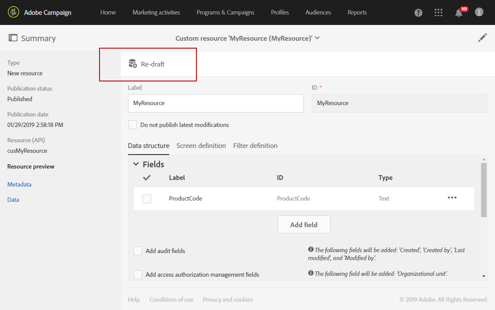
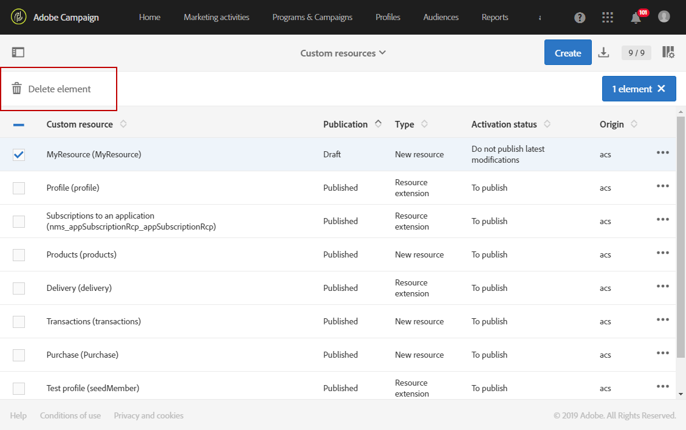

# リソースの削除{#deleting-a-resource}

リソースを削除するには、対象となるリソースが&#x200B;**[!UICONTROL Draft]**&#x200B;である必要があります。 次の場合、リソースは&#x200B;**[!UICONTROL Draft]** ステータスになります。

* 作成されたばかりで、まだ公開されていません。
* 既に公開されている場合は、リソースを再作成する必要があります。

>[!IMPORTANT]
>
>カスタムリソースの再作成と削除は、他のリソースに影響を与える可能性のある機密性の高い操作です。 これらのアクションは、エキスパートユーザーのみが実行する必要があります。

公開したリソースを再ドラフトして削除するには：

1. 再作成するリソースを選択します。
1. アクションバーの「**[!UICONTROL Re-draft]**」ボタンをクリックします。

   

1. 「**[!UICONTROL Ok]**」をクリックします。

   >[!IMPORTANT]
   >
   >このアクションは決定的です。リソースのデータベーステーブルまたはカラムとそのデータは、変更が公開されると完全に削除され、他のカスタムリソースからのリンクが壊れる可能性があります。 リソース定義のみが使用できます。

   

   >[!NOTE]
   >
   >標準の&#x200B;**プロファイル（プロファイル）** リソースの拡張機能を再ドラフトする場合は、定義した&#x200B;**テストプロファイル（シードメンバー）**&#x200B;拡張機能も再ドラフトする必要があります。 プロファイルリソースの拡張について詳しくは、[この節](../../developing/using/extending-the-profile-resource-with-a-new-field.md)を参照してください。

1. リソースを公開します。 詳細な手順については、[&#x200B; カスタムリソースの公開](../../developing/using/updating-the-database-structure.md#publishing-a-custom-resource)を参照してください。

   その後、リソースは&#x200B;**ドラフト** モードになり、アクティベーションのステータスは&#x200B;**[!UICONTROL Inactive]**&#x200B;です。

1. **[!UICONTROL List]** モードで、削除するリソースを確認し、 **[!UICONTROL Delete element]** アイコンをクリックします。

   

リソースがデータモデルから削除されます。

>[!NOTE]
>
>イベントで使用されているカスタムリソースのフィールドが変更または削除された場合、対応するイベントは自動的に非公開になります。 「[&#x200B; トランザクションイベントの非公開](../../channels/using/publishing-transactional-event.md#unpublishing-an-event)」を参照してください。
