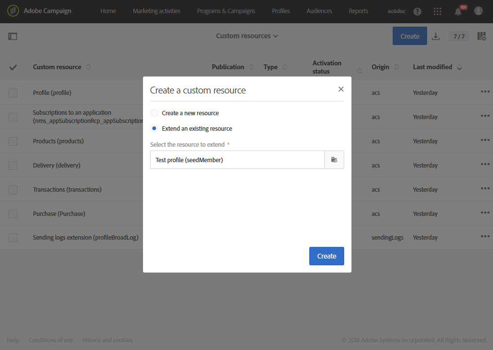
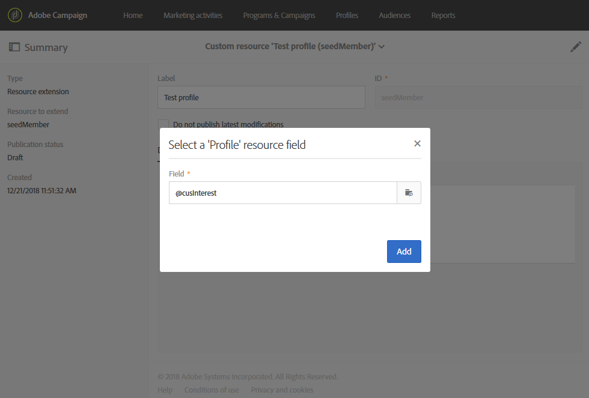
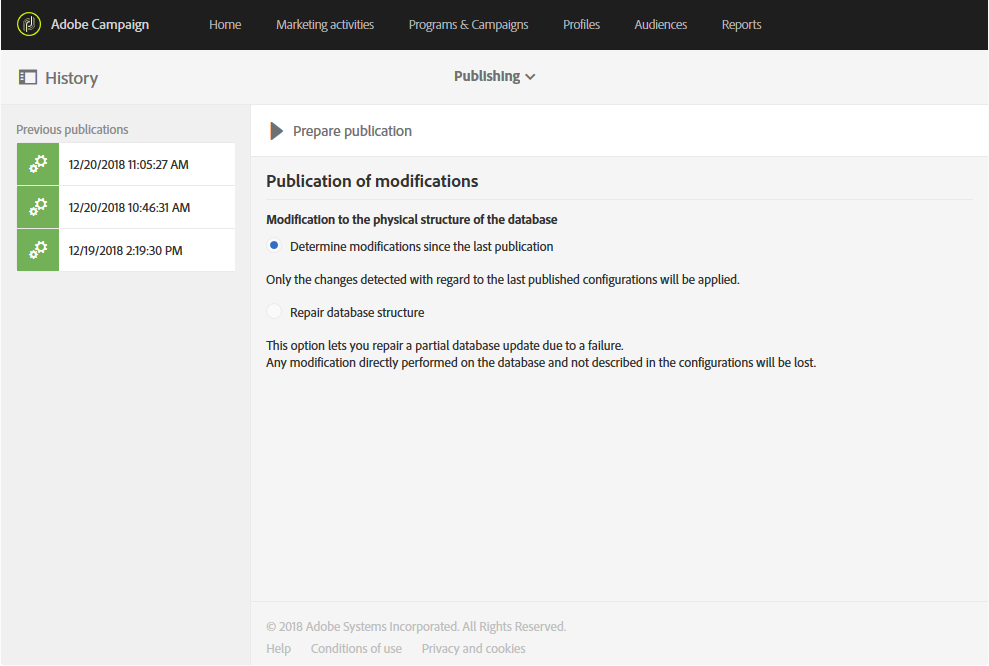
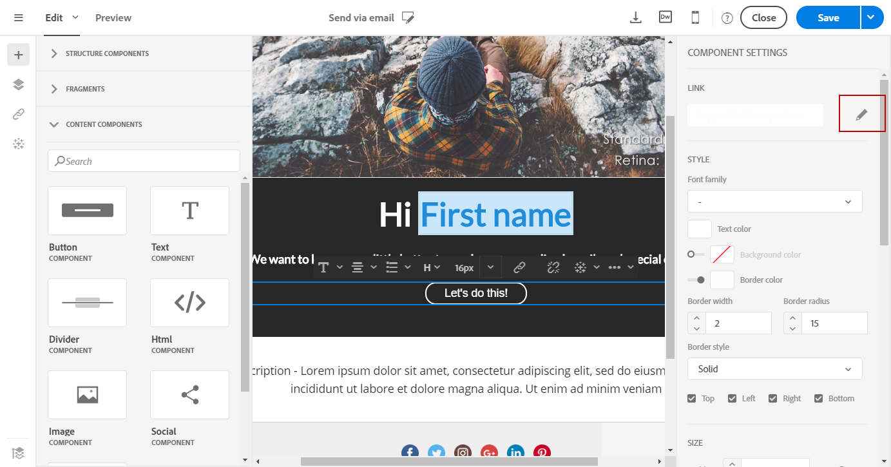

# 新しいフィールドを使用したプロファイルリソースの拡張{#extending-the-profile-resource-with-a-new-field}

## プロファイルの拡張について {#about-extending-profiles}

この使用例では、該当するフィールドを使用してプロファイルおよびテストプロファイルを拡張する方法について詳しく説明します。

ここでは、ランディングページを使用して新しいフィールドでプロファイルを更新し、プロファイルの興味に応じた固有のニュースレターでプロファイルのターゲティングをおこないます。

これをおこなうには、以下の手順に従います。

* [手順 1：プロファイルリソースの拡張](#step-1--extend-the-profile-resource)
* [手順 2：テストプロファイルの拡張](#step-2--extend-the-test-profile)
* [手順 3：カスタムリソースの公開](#step-3--publish-your-custom-resource)
* [手順 4：ワークフローを使用したプロファイルの更新とターゲティング](#step-4--update-and-target-profiles-with-a-workflow)

次のフィールドがプロファイルに追加され、配信でプロファイルのターゲティングを実行できます。

関連トピック：

* [カスタムリソースについて](../../developing/using/data-model-concepts.md)
* [プロファイルの管理](../../audiences/using/about-profiles.md)
* [テストプロファイルの管理](../../audiences/using/managing-test-profiles.md)

## 手順 1：プロファイルリソースの拡張 {#step-1--extend-the-profile-resource}

プロファイルの新しい「**Interest**」フィールドを作成するには、まず標準の **[!UICONTROL Profiles (profile)]** リソースを拡張する必要があります。

1. 詳細設定メニューの Adobe Campaign ロゴから、**[!UICONTROL Administration]**／**[!UICONTROL Development]**／**[!UICONTROL Custom resources]** を選択します。
1. まだ **[!UICONTROL Profiles]** リソースを拡張していない場合は、「**[!UICONTROL Create]**」をクリックします。
1. 「**[!UICONTROL Extend an existing resource]**」オプションを選択します。
1. **[!UICONTROL Profile (profile)]** リソースを選択します。
1. 「**[!UICONTROL Create]**」をクリックします。

   

1. 「**[!UICONTROL Data structure]**」タブの **[!UICONTROL Fields]** カテゴリで、「**[!UICONTROL Create element]**」をクリックします。

   >[!NOTE]
   >
   >前述の目的で既に **[!UICONTROL Profile]** リソースを拡張している場合は、「**[!UICONTROL Add field]**」をクリックしてこの手順から開始できます。

   

1. **[!UICONTROL Label]** と **[!UICONTROL ID]** を追加します。**[!UICONTROL Text]** タイプを選択し、「**[!UICONTROL Add]**」をクリックします。

   

1. フィールドを設定するには、**[!UICONTROL Data structure]** ドロップダウンの下にある「**[!UICONTROL Fields]**」タブで、 をクリックしてから、以前作成したフィールドの  をクリックします。
1. この例では、特定の値を追加します。それには、「**[!UICONTROL Specify a list of authorized values]**」チェックボックスをオンにします。

   

1. 「**[!UICONTROL Add an element]**」をクリックし、**[!UICONTROL Label]** と **[!UICONTROL ID]** を追加して「**[!UICONTROL Add]**」をクリックし、必要な数だけ値を追加します。

   ここでは、プロファイルが選択できるオプションとして「Books」、「Exhibitions」、「Movies」、「N/A」の値を作成します。

   

1. このフィールドを **[!UICONTROL Profile]** 画面で追加するには、「**[!UICONTROL Screen definition]**」タブをクリックします。
1. **[!UICONTROL Detail screen configuration]** ドロップダウンで、「**[!UICONTROL Add a personalized fields section]**」をクリックしてから「**[!UICONTROL Create element]**」をクリックします。

   

1. **[!UICONTROL Type]**.を選択します。ここで、入力フィールドを追加します。次に、以前に作成したフィールドを選択し、「**[!UICONTROL Add]**」をクリックします。

   

1. プロファイルウィンドウを整理しやすくするためのセパレーターを追加するには、「**[!UICONTROL Create an element]**」をクリックし、**[!UICONTROL Type]** ドロップダウンから「**[!UICONTROL Separator]**」を選択します。

   

これで、フィールドが設定されました。次に、フィールドをテストプロファイルに拡張する必要があります。

>[!NOTE]
>
>テストプロファイルリソースを拡張する必要がない場合は、公開の手順に進むことができます。

## 手順 2：テストプロファイルの拡張 {#step-2--extend-the-test-profile}

新しく作成されたフィールドが正しく設定されているかどうかをテストするには、配信をテストプロファイルに送信します。まず、新しく作成されたフィールドをテストプロファイルに対しても実行する必要があります。

1. 詳細設定メニューの Adobe Campaign ロゴから、**[!UICONTROL Administration]**／**[!UICONTROL Development]**／**[!UICONTROL Custom resources]** を選択します。
1. まだ **[!UICONTROL Profiles]** リソースを拡張していない場合は、「**[!UICONTROL Create]**」をクリックします。
1. 「**[!UICONTROL Extend an existing resource]**」オプションを選択します。
1. **[!UICONTROL Test profile (seedMember)]** リソースを選択します。
1. 「**[!UICONTROL Create]**」をクリックします。

   

1. 「**[!UICONTROL Data structure]**」タブで、「**[!UICONTROL Create element]**」をクリックします。

   

1. 以前に作成したリソースフィールドを選択し、「**[!UICONTROL Add]**」をクリックします。

   

1. 上記の拡張プロファイルのチュートリアルと同じ手順 11～13 を実行し、**[!UICONTROL Test profile]** 画面でこのフィールドを追加します。
1. 「**[!UICONTROL Save]**」をクリックします。

これで、プロファイルとテストプロファイルの両方で、新しいフィールドが使用可能になります。正しく設定するには、カスタムリソースを公開する必要があります。

## 手順 3：カスタムリソースの公開 {#step-3--publish-your-custom-resource}

リソースでおこなわれた変更を適用して使用できるようにするには、データベースの更新を実行する必要があります。

1. 詳細設定メニューで、**Administration**／**Development**／**Publishing** を選択します。
1. デフォルトでは、「**[!UICONTROL Determine modifications since the last publication]**」オプションはオンになっており、最後の更新以降に実行された変更のみが適用されます。

   

1. データベースを更新するための分析を開始するには、「**[!UICONTROL Prepare publication]**」をクリックします。
1. 公開されたら、「**Publish**」ボタンをクリックして新しい設定を適用します。

   

1. リソースが公開されると、各リソースの **Summary** ペインでステータスが「**Published**」になり、最後の公開日が表示されます。

   

1. 「**[!UICONTROL Profiles]**」タブを選択し、「**[!UICONTROL New]**」をクリックして変更が正しく実装されているかどうかを確認します。

   

これで、新しいリソースフィールドを使用して、配信でターゲットを設定できる状態になりました。

## 手順 4：ワークフローを使用したプロファイルの更新とターゲティング {#step-4--update-and-target-profiles-with-a-workflow}

プロファイルを新しいカスタムフィールドのデータで更新するには、**[!UICONTROL Profile acquisition]** テンプレートを使用してランディングページを作成します。ランディングページについて詳しくは、この[ページ](../../channels/using/getting-started-with-landing-pages.md)を参照してください。

ここでは、このフィールドに入力しなかったワークフロープロファイルにターゲットを設定します。各プロファイルには、パーソナライズされたニュースレターやオファーを受信するためにプロファイルの更新を求める E メールが届きます。その後、選択した興味に応じてパーソナライズされたニュースレターを受け取るようになります。

まず、ターゲットプロファイルの「**Interest**」フィールドを更新するランディングページを作成する必要があります。

1. **[!UICONTROL Marketing activities]** から「**[!UICONTROL Create]**」をクリックし、**[!UICONTROL Landing page]** を選択します。
1. ランディングページのタイプを選択します。ここでは、プロファイルを更新するので、**[!UICONTROL Profile acquisition]** を選択します。
1. 「**[!UICONTROL Create]**」をクリックします。
1. **[!UICONTROL Content]** ブロックをクリックして、ランディングページのコンテンツの編集を開始します。

   

1. 必要に応じてランディングページをカスタマイズします。
1. プロファイルが興味を選択するために設定するフィールドをクリックします。左側のペインで、以前に作成した **Interest** カスタムリソースを選択します。

   

1. ランディングページを保存してテストし、フィールドが正しく設定されていることを確認します。
1. ランディングページの準備が整ったら、「**[!UICONTROL Publish]**」をクリックします。

これで、ランディングページの準備が整いました。プロファイルを更新するには、選択された興味に応じて特別なオファーを送信するワークフローを作成します。

1. 「**[!UICONTROL Marketing activities]**」タブで「**[!UICONTROL Create]**」をクリックし、「**[!UICONTROL Workflow]**」を選択します。
1. 「**[!UICONTROL Query]**」アクティビティをドラッグ＆ドロップして、必要なプロファイルやオーディエンスをターゲットします。
1. 「**[!UICONTROL Email delivery]**」アクティビティをドラッグ＆ドロップして、ランディングページへのリンクを含む E メールの設定を開始します。「**[!UICONTROL Add an outbound transition with the population]**」を選択します。

   

1. 必要に応じて E メールを作成し、デザインします。E メールのパーソナライゼーションについて詳しくは、この[ページ](../../designing/using/quick-start.md)を参照してください。
1. プロファイルをランディングページにリダイレクトするためのボタンを E メールに追加します。
1. 追加されたボタンを選択し、左側のペインの「**[!UICONTROL Link]**」セクションで  をクリックします。

   

1. **[!UICONTROL Insert link]** ウィンドウで、**[!UICONTROL Link type]** ドロップダウンから「**[!UICONTROL Landing page]**」を選択し、以前に作成したランディングページを選択します。

   

1. 「**[!UICONTROL Save]**」をクリックします。E メールの準備が整ったので、ワークフローに戻ります。
1. プロファイルがランディングページで必要事項を入力する時間を確保するために、「**[!UICONTROL Wait]**」アクティビティを追加します。
1. アウトバウンドトランジションを&#x200B;**興味**&#x200B;に応じて分割するために、「**[!UICONTROL Segmentation]**」アクティビティを追加します。
1. 各&#x200B;**興味**&#x200B;に対してアウトバウンドセグメントを作成します。

   

1. 各トランジションの後に「**[!UICONTROL Email delivery]**」アクティビティを追加して、選択された&#x200B;**興味**&#x200B;に応じてパーソナライズされた E メールを作成します。
1. 設定が完了したら、ワークフローを開始します。

   

プロファイルは、この Interest フィールドに必要事項を入力するように求める E メールを受け取り、その後選択した値に応じてパーソナライズされた E メールを受信します。
