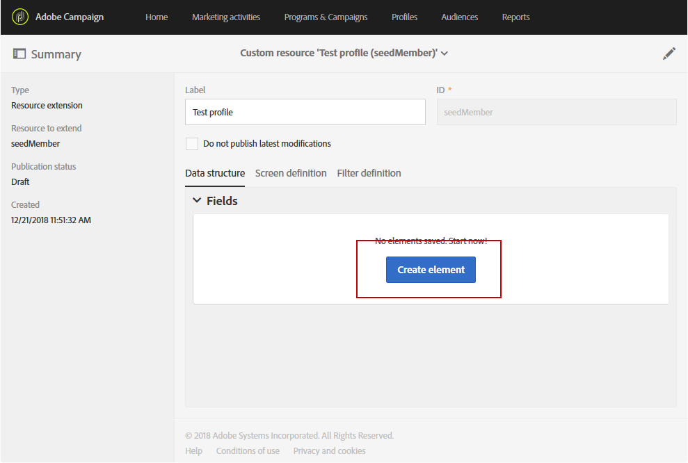

# 新しいフィールドを使用したプロファイルリソースの拡張{#extending-the-profile-resource-with-a-new-field}

## プロファイルの拡張について {#about-extending-profiles}

この使用例では、専用フィールドを使用してプロファイルとテストプロファイルを拡張する方法について詳しく説明します。

ここでは、ランディングページを使用して新しいフィールドでプロファイルを更新し、興味を持つユーザーに特化したニュースレターでプロファイルをターゲット設定します。

これを行うには、次の手順に従います。

* [手順1:プロファイルリソースの拡張](#step-1--extend-the-profile-resource)
* [手順2:テストプロファイルの拡張](#step-2--extend-the-test-profile)
* [手順3:カスタムリソースの発行](#step-3--publish-your-custom-resource)
* [手順4:ワークフローを使用したプロファイルの更新とターゲット設定](#step-4--update-and-target-profiles-with-a-workflow)

次のフィールドがプロファイルに追加され、配信のターゲット設定が可能になります。

関連トピック：

* [カスタムリソースについて](../../developing/using/data-model-concepts.md)
* [プロファイルの管理](../../audiences/using/about-profiles.md)
* [テストプロファイルの管理](../../sending/using/managing-test-profiles-and-sending-proofs.md#managing-test-profiles)

## 手順1:プロファイルリソースの拡張 {#step-1--extend-the-profile-resource}

プロファイルの新しい **Interest** （関心）フィールドを作成するには、まずそのまま使用できるリソースを拡張する必要があ **[!UICONTROL Profiles (profile)]** ります。

1. アドバンスメニューで、Adobe Campaignロゴを使用して/を選 **[!UICONTROL Administration]** 択し、 **[!UICONTROL Development]**&#x200B;次に選択しま **[!UICONTROL Custom resources]**&#x200B;す。
1. リソースをまだ拡張していない場合 **[!UICONTROL Profiles]** は、をクリックしま **[!UICONTROL Create]**&#x200B;す。
1. オプションを選 **[!UICONTROL Extend an existing resource]** 択します。
1. リソースを選択 **[!UICONTROL Profile (profile)]** します。
1. Click **[!UICONTROL Create]**.

   

1. タブのカ **[!UICONTROL Fields]** テゴリで、をク **[!UICONTROL Data structure]** リックしま **[!UICONTROL Create element]**&#x200B;す。

   >[!NOTE]
   >
   >以前の目的で既にリソースを拡張し **[!UICONTROL Profile]** ている場合は、をクリックしてこの手順から開始できま **[!UICONTROL Add field]**&#x200B;す。

   

1. とを追加 **[!UICONTROL Label]** します **[!UICONTROL ID]**。 タイプを選択し **[!UICONTROL Text]** 、をクリックしま **[!UICONTROL Add]**&#x200B;す。

   

1. フィールドを設定するには、「**[!UICONTROL Data structure]** ドロップダウンの下にある「**[!UICONTROL Fields]**」タブで、 をクリックしてから、以前作成したフィールドの  をクリックします。
1. この例では、特定の値を追加し、クリックします **[!UICONTROL Specify a list of authorized values]**。

   

1. をクリ **[!UICONTROL Add an element]** ックし、とを追加してをクリックし、必要なだけ **[!UICONTROL Label]** 値を追 **[!UICONTROL ID]** 加しま **[!UICONTROL Add]**&#x200B;す。

   ここでは、プロファイルの書籍、展覧会、映画、該当なしの値を作成し、これらのオプションを選択します。

   

1. このフィールドを画面に追加するに **[!UICONTROL Profile]** は、タブをクリック **[!UICONTROL Screen definition]** します。
1. ドロップダウ **[!UICONTROL Detail screen configuration]** ンでをクリックし、をク **[!UICONTROL Add a personalized fields section]** リックしま **[!UICONTROL Create element]**&#x200B;す。

   

1. を選択しま **[!UICONTROL Type]**&#x200B;す。 ここで、入力フィールドを追加します。 次に、以前に作成したフィールドを選択し、をクリックしま **[!UICONTROL Add]**&#x200B;す。

   

1. プロファイルウィンドウを整理しやすくするためにセパレーターを追加するには、をク **[!UICONTROL Create an element]** リックし、ドロ **[!UICONTROL Separator]** ップダウン **[!UICONTROL Type]** から選択します。

   

これでフィールドが設定されました。 次に、それをテストプロファイルに拡張する必要があります。

>[!NOTE]
>
>テストプロファイルリソースを拡張する必要がない場合は、発行手順に進むことができます。

## 手順2:テストプロファイルの拡張 {#step-2--extend-the-test-profile}

新しく作成されたフィールドが正しく設定されているかどうかをテストするには、テストプロファイルに配信を送信してテストします。 まず、新しいフィールドもテストプロファイルに対して実行する必要があります。

1. アドバンスメニューで、Adobe Campaignロゴを使用して/を選 **[!UICONTROL Administration]** 択し、 **[!UICONTROL Development]**&#x200B;次に選択しま **[!UICONTROL Custom resources]**&#x200B;す。
1. リソースをまだ拡張していない場合 **[!UICONTROL Profiles]** は、をクリックしま **[!UICONTROL Create]**&#x200B;す。
1. オプションを選 **[!UICONTROL Extend an existing resource]** 択します。
1. リソースを選択 **[!UICONTROL Test profile (seedMember)]** します。
1. Click **[!UICONTROL Create]**.

   

1. タブで、をク **[!UICONTROL Data structure]** リックしま **[!UICONTROL Create element]**&#x200B;す。

   

1. 以前に作成したリソースフィールドを選択し、をクリックしま **[!UICONTROL Add]**&#x200B;す。

   

1. 手順11 ～ 13と同じ手順を、上の延長プロファイルのチュートリアルと同じ手順で、このフィールドを画面に追加 **[!UICONTROL Test profile]** します。
1. Click **[!UICONTROL Save]**.

これで、プロファイルとテストプロファイルの両方で新しいフィールドが使用できるようになります。 正しく設定するには、カスタムリソースを発行する必要があります。

## 手順3:カスタムリソースの発行 {#step-3--publish-your-custom-resource}

リソースで実行された変更を適用し、それを使用できるようにするには、データベースの更新を実行する必要があります。

1. 詳細設定メニューで、管理/開発 **を選択し** 、 **「公開**」を選択 **します**。
1. デフォルトでは、このオ **[!UICONTROL Determine modifications since the last publication]** プションはオンになっており、最後の更新以降に実行された変更のみが適用されます。

   

1. をクリッ **[!UICONTROL Prepare publication]** クして、データベースを更新する分析を開始します。
1. パブリケーションが実行されたら、「公開」ボタンを **クリックし** 、新しい設定を適用します。

   

1. 発行されると、各リソ **ースの** [概要]ウィンドウに、そのステータスが[発行済み **** ]になったことが示され、最後の発行日が指定されます。

   

1. タブを選択し **[!UICONTROL Profiles]** 、をクリックし **[!UICONTROL New]** て、変更が正しく実装されているかどうかを確認します。

   

これで、新しいリソースフィールドを使用し、配信のターゲットを設定する準備が整いました。

## 手順4:ワークフローを使用したプロファイルの更新とターゲット設定 {#step-4--update-and-target-profiles-with-a-workflow}

新しいカスタムフィールドのデータを使用してプロファイルを更新するには、テンプレートを使用してランディングページを作成 **[!UICONTROL Profile acquisition]** します。 For more information on landing pages, refer to this [page](../../channels/using/about-landing-pages.md).

ここでは、このフィールドに入力されなかったワークフロープロファイルをターゲットにします。 個人向けニュースレターやオファーを受け取るためのプロファイルの更新を求める電子メールが届きます。 その後、選択した興味に応じて、個人向けのニュースレターが各プロファイルに送信されます。

最初に、ターゲットプロファイルの「関心」フィールドを更新するランデ **ィング** ページを作成する必要があります。

1. からをクリ **[!UICONTROL Marketing activities]**&#x200B;ックし、を **[!UICONTROL Create]** 選択しま **[!UICONTROL Landing page]**&#x200B;す。
1. ランディングページのタイプを選択します。 ここで、プロファイルを更新するので、を選択しま **[!UICONTROL Profile acquisition]**&#x200B;す。
1. Click **[!UICONTROL Create]**.
1. ブロックをク **[!UICONTROL Content]** リックして、ランディングページのコンテンツの編集を開始します。

   

1. 必要に応じてランディングページをカスタマイズします。
1. プロファイルに設定されているフィールドをクリックして、「関心」の選択肢を選択します。 左側のウィンドウで、以前に作成した **Interest** カスタムリソースを選択します。

   

1. ランディングページを保存し、テストしてフィールドが正しく設定されていることを確認します。
1. ランディング **[!UICONTROL Publish]** ページの準備が整ったら、をクリックします。

これで、ランディングページの準備が整いました。 プロファイルを更新するには、選択した関心に応じて特別オファーを送信するワークフローを作成します。

1. タブでをク **[!UICONTROL Marketing activities]** リックし、を **[!UICONTROL Create]** 選択しま **[!UICONTROL Workflow]**&#x200B;す。
1. アクティビティをドラッグ&amp;ドロッ **[!UICONTROL Query]** プして、必要なプロファイルまたはオーディエンスをターゲットにします。
1. アクティビティをドラッグ&amp; **[!UICONTROL Email delivery]** ドロップして、ランディングページへのリンクを含む電子メールの設定を開始します。 を選択しま **[!UICONTROL Add an outbound transition with the population]**&#x200B;す。

   

1. 必要に応じて電子メールを作成し、デザインします。 For more information on email personalization, refer to this [page](../../designing/using/quick-start.md).
1. ランディングページにプロファイルをリダイレクトするボタンを電子メールに追加します。
1. 追加するボタンを選択し、左ペ  インのセク **[!UICONTROL Link]** ション内をクリックします。

   

1. ウィンドウ **[!UICONTROL Insert link]** で、ドロップダ **[!UICONTROL Landing page]** ウンから **[!UICONTROL Link type]** を選択し、以前に作成したランディングページを選択します。

   

1. Click **[!UICONTROL Save]**. 電子メールの準備が整いました。ワークフローに戻ることができます。
1. プロファイル **[!UICONTROL Wait]** がランディングページに表示されるまでの時間を確保するためのアクティビティを追加します。
1. アクティビティ **[!UICONTROL Segmentation]** を追加して、関心事に応じてアウトバウンド移行を分割 **します**。
1. 各関心に対してアウトバウンドセグメントを作 **成します**。

   

1. 各トランジシ **[!UICONTROL Email delivery]** ョンの後にアクティビティを追加し、選択したInterestに従ってパーソナライズされた電子メールを作 **成します**。
1. 設定が完了したら、ワークフローを開始します。

   

プロファイルは、選択した値に応じてパーソナライズされた電子メールを受け取り、この「関心」フィールドに入力するように求めます。
