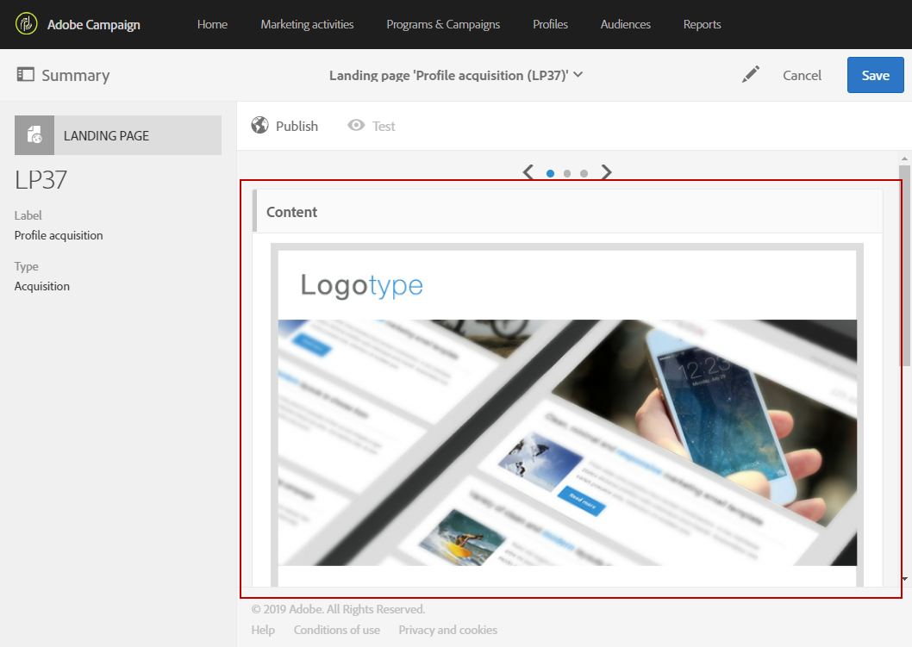

# 新しいフィールドを使用してプロファイルリソースを拡張する{#extending-the-profile-resource-with-a-new-field}

## プロファイルの延長について {#about-extending-profiles}

この使用例では、専用フィールドを使用してプロファイルとテストプロファイルを拡張する方法を詳しく説明します。

ここでは、ランディング·ページを使用して新しいフィールドでプロファイルを更新し、目的に合ったニュースレターでプロファイルをターゲットにします。

そのためには、次の手順に従います。

* [ステップ1:プロファイルリソースの拡張](../../developing/using/extending-the-profile-resource-with-a-new-field.md#step-1--extend-the-profile-resource)
* [手順2:テストプロファイルの拡張](../../developing/using/extending-the-profile-resource-with-a-new-field.md#step-2--extend-the-test-profile)
* [ステップ3:カスタムリソースの発行](../../developing/using/extending-the-profile-resource-with-a-new-field.md#step-3--publish-your-custom-resource)
* [手順4:ワークフローを使用してプロファイルを更新し、ターゲットにする](../../developing/using/extending-the-profile-resource-with-a-new-field.md#step-4--update-and-target-profiles-with-a-workflow)

次のフィールドがプロファイルに追加され、配信の対象になります。

関連トピック：

* [カスタムリソースについて](../../developing/using/data-model-concepts.md)
* [プロファイルの管理](../../audiences/using/about-profiles.md)
* [テストプロファイルの管理](../../sending/using/managing-test-profiles-and-sending-proofs.md#managing-test-profiles)

## ステップ1:プロファイルリソースの拡張 {#step-1--extend-the-profile-resource}

プロファイルの新しい **Interest** （利益）フィールドを作成するには、まず、既定のリソースを拡張する必要があ **[!UICONTROL Profiles (profile)]** ります。

1. 詳細メニューから、Adobe Campaignロゴを使用して、 &gt;を選 **[!UICONTROL Administration]** 択し、 **[!UICONTROL Development]**&#x200B;を選択しま **[!UICONTROL Custom resources]**&#x200B;す。
1. リソースをまだ拡張していない場 **[!UICONTROL Profiles]** 合は、をクリックしま **[!UICONTROL Create]**&#x200B;す。
1. オプションを選択 **[!UICONTROL Extend an existing resource]** します。
1. リソースを選択 **[!UICONTROL Profile (profile)]** します。
1. Click **[!UICONTROL Create]**.

   

1. タブのカテ **[!UICONTROL Fields]** ゴリで、を **[!UICONTROL Data structure]** クリックしま **[!UICONTROL Create element]**&#x200B;す。

   >[!NOTE]
   >
   >以前の目的でリソースを拡張し **[!UICONTROL Profile]** た場合は、をクリックしてこの手順を開始できます **[!UICONTROL Add field]**。

   

1. とを追 **[!UICONTROL Label]** 加します **[!UICONTROL ID]**。 タイプを選択し、 **[!UICONTROL Text]** をクリックしま **[!UICONTROL Add]**&#x200B;す。

   

1. フィールドを設定するには、「**[!UICONTROL Data structure]** ドロップダウンの下にある「**[!UICONTROL Fields]**」タブで、 をクリックしてから、以前作成したフィールドの  をクリックします。
1. この例では、特定の値を追加し、をクリックします **[!UICONTROL Specify a list of authorized values]**。

   

1. をクリ **[!UICONTROL Add an element]** ックし、とを追加してをクリックし、必要な数だ **[!UICONTROL Label]** け値を追 **[!UICONTROL ID]** 加します **[!UICONTROL Add]**。

   ここでは、プロファイルのブック、展示会、映画、およびN/A値を作成し、これらのオプションを選択します。

   

1. このフィールドを画面に追加す **[!UICONTROL Profile]** るには、タブをクリック **[!UICONTROL Screen definition]** します。
1. ドロップダウ **[!UICONTROL Detail screen configuration]** ンでをクリックし、をク **[!UICONTROL Add a personalized fields section]** リックしま **[!UICONTROL Create element]**&#x200B;す。

   

1. を選択しま **[!UICONTROL Type]**&#x200B;す。 ここでは、入力フィールドを追加します。 次に、以前に作成したフィールドを選択し、をクリックしま **[!UICONTROL Add]**&#x200B;す。

   

1. プロファイルウィンドウを整理しやすくするためにセパレータを追加するには、をク **[!UICONTROL Create an element]** リックし、ドロ **[!UICONTROL Separator]** ップダウン **[!UICONTROL Type]** から選択します。

   

フィールドが構成されました。 テストプロファイルに拡張する必要があります。

>[!NOTE]
>
>テストプロファイルリソースを拡張する必要がない場合は、[発行]の手順に進みます。

## 手順2:テストプロファイルの拡張 {#step-2--extend-the-test-profile}

新しく作成されたフィールドが正しく構成されているかどうかをテストするには、テストプロファイルに配信を送信してテストします。 まず、新しいフィールドをテストプロファイルに対して実行する必要があります。

1. 詳細メニューから、Adobe Campaignロゴを使用して、 &gt;を選 **[!UICONTROL Administration]** 択し、 **[!UICONTROL Development]**&#x200B;を選択しま **[!UICONTROL Custom resources]**&#x200B;す。
1. リソースをまだ拡張していない場 **[!UICONTROL Profiles]** 合は、をクリックしま **[!UICONTROL Create]**&#x200B;す。
1. オプションを選択 **[!UICONTROL Extend an existing resource]** します。
1. リソースを選択 **[!UICONTROL Test profile (seedMember)]** します。
1. Click **[!UICONTROL Create]**.

   

1. タブで、をク **[!UICONTROL Data structure]** リックしま **[!UICONTROL Create element]**&#x200B;す。

   

1. 以前に作成したリソースフィールドを選択し、をクリックし **[!UICONTROL Add]**&#x200B;ます。

   

1. 手順11 ~ 13と同じ手順を、上の延長プロファイルウォークスルーと同じ手順で実行し、このフィールドを画面に追加 **[!UICONTROL Test profile]** します。
1. Click **[!UICONTROL Save]**.

これで、プロファイルとテストプロファイルの両方に新しいフィールドが使用可能になります。 正しく設定するには、カスタムリソースを公開する必要があります。

## ステップ3:カスタムリソースの発行 {#step-3--publish-your-custom-resource}

リソースに対して実行された変更を適用し、その変更を使用できるようにするには、データベースの更新を実行する必要があります。

1. 詳細メニューから、「管理」&gt;「開発」&gt;「パブリッシ **ング** 」を選 **択します******。
1. デフォルトでは、このオ **[!UICONTROL Determine modifications since the last publication]** プションはオンになっています。つまり、最後の更新以降に実行された変更のみが適用されます。

   

1. をクリック **[!UICONTROL Prepare publication]** して、データベースを更新する分析を開始します。
1. パブリケーションが実行されたら、[パブリッシュ]ボタンをク **リックし** 、新しい設定を適用します。

   

1. 発行後、各リソー **スの** [概要]ウィンドウには、現在の状態が[発行済み **** ]であることが示され、最後の発行日が指定されます。

   

1. タブを選択し **[!UICONTROL Profiles]** 、をクリックし **[!UICONTROL New]** て、変更が正しく実装されているかどうかを確認します。

   

新しいリソースフィールドを使用し、たとえば配信の対象にする準備が整いました。

## 手順4:ワークフローを使用してプロファイルを更新し、ターゲットにする {#step-4--update-and-target-profiles-with-a-workflow}

新しいカスタムフィールドのデータを使用して縦断を更新するには、テンプレートを使用してランディングページを作成 **[!UICONTROL Profile acquisition]** します。 ランディング·ページの詳細は、このページを参照してく [ださい](../../channels/using/about-landing-pages.md)。

ここでは、このフィールドに値を入力しなかったワークフロープロファイルを対象にします。 個人用のニュースレターや内定を受け取るために、自分のプロフィールを更新するように求めるEメールが届きます。 次に、各プロファイルには、選択した興味に応じて個別のニュースレターが送信されます。

最初に、ターゲットプロファイルの **Interest** （関心事）フィールドを更新するランディング·ページを作成する必要があります。

1. からをクリック **[!UICONTROL Marketing activities]**&#x200B;し、を選 **[!UICONTROL Create]** 択しま **[!UICONTROL Landing page]**&#x200B;す。
1. ランディング·ページ·タイプを選択します。 ここで、プロファイルを更新するため、を選択しま **[!UICONTROL Profile acquisition]**&#x200B;す。
1. Click **[!UICONTROL Create]**.
1. ブロックをク **[!UICONTROL Content]** リックして、ランディング·ページの内容の編集を開始します。

   

1. 必要に応じて、ランディング·ページをカスタマイズします。
1. プロファイルに設定されているフィールドをクリックして、[関心事]を選択します。 左側のペインで、以前に作成した関心事のカスタムリソ **ース** を選択します。

   

1. ランディング·ページを保存し、フィールドが正しく設定されているか確認します。
1. ランディング **[!UICONTROL Publish]** ページの準備が整ったら、をクリックします。

ランディング·ページの準備が整いました。 プロファイルを更新するには、選択した関心事に応じて特別な内定を送信するワークフローを作成します。

1. タブでをク **[!UICONTROL Marketing activities]** リックし、を **[!UICONTROL Create]** 選択しま **[!UICONTROL Workflow]**&#x200B;す。
1. アクティビティをドラッグ·アン **[!UICONTROL Query]** ド·ドロップして、必要なプロファイルまたは対象ユーザーをターゲットにします。
1. アクティビティをドラッグ·ア **[!UICONTROL Email delivery]** ンド·ドロップして、ランディング·ページへのリンクを含む電子メールの構成を開始します。 を選択しま **[!UICONTROL Add an outbound transition with the population]**&#x200B;す。

   

1. 必要に応じて、Eメールを作成してデザインします。 電子メールの個人用設定の詳細については、このページを参照して [ください](../../designing/using/quick-start.md)。
1. プロファイルをランディングページにリダイレクトするボタンを電子メールに追加します。
1. 追加ボタンを選択し、左ペイン  のセクション **[!UICONTROL Link]** をクリックします。

   

1. ウィンドウ **[!UICONTROL Insert link]** で、ドロップダ **[!UICONTROL Landing page]** ウンから **[!UICONTROL Link type]** を選択し、前に作成したランディング·ページを選択します。

   

1. Click **[!UICONTROL Save]**. メールの準備が整いました。ワークフローに戻ることができます。
1. アクティビテ **[!UICONTROL Wait]** ィを追加して、プロファイルがランディング·ページを埋めるまでの時間を設定します。
1. 活動を追加し **[!UICONTROL Segmentation]** て、関心事に応じて外部遷移を分割 **します**。
1. 各利息のアウトバウンド·セグメントを作 **成します**。

   

1. 各移行後に **[!UICONTROL Email delivery]** 活動を追加し、選択した関心事に応じて個人用の電子メールを作成 **します**。
1. 構成が完了したら、ワークフローを開始します。

   

プロファイルには、選択した値に応じて、この「関心事」フィールドに入力するように求める電子メールが送信され、その後に個人用の電子メールが送信されます。
