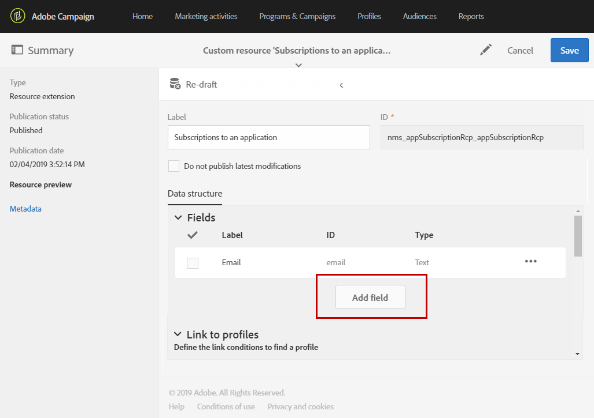

# アプリケーションリソースの購読の拡張{#extending-the-subscriptions-to-an-application-resource}

Adobe Campaign では、モバイルデバイスから送信されたモバイルプロファイル属性データは、アプリケーション購読者から収集するデータを定義できる「**[!UICONTROL Subscriptions to an application (appSubscriptionRcp)]**」リソースに保存されます。カスタムリソースの詳細については、[このページ](../../developing/using/key-steps-to-add-a-resource.md)を参照してください。

このリソースは、モバイルデバイスからAdobe Campaignに送信するデータを収集するように拡張できます。

1. 詳細設定メニューの Adobe Campaign ロゴから、**[!UICONTROL Administration]**／**[!UICONTROL Development]**／**[!UICONTROL Custom resources]** を選択します。
1. **[!UICONTROL Create]**&#x200B;をクリックし、**[!UICONTROL Extend an existing resource]**&#x200B;オプションを選択します。
1. **[!UICONTROL Subscriptions to an application (appSubscriptionRcp)]**&#x200B;リソースを選択し、「**[!UICONTROL Create]**」をクリックします。

   

1. 「**[!UICONTROL Data structure]**」タブの「**[!UICONTROL Fields]**」カテゴリで、「**[!UICONTROL Add field]**」ボタンをクリックして、モバイルアプリケーションから取得する顧客データを定義します。

   >[!NOTE]
   >
   >複数のモバイルアプリケーションを管理している場合は、すべてのアプリケーションで使用されるすべてのフィールドを一覧表示する必要があります。 iOSまたはAndroidの収集PII呼び出しは、各アプリケーションで取り込むフィールドを定義します。

   

1. 新しいフィールドに&#x200B;**[!UICONTROL Label]**&#x200B;と&#x200B;**[!UICONTROL ID]**&#x200B;を追加します。 フィールドの&#x200B;**[!UICONTROL Type]**&#x200B;を選択します。

   

1. 「 **[!UICONTROL Link to profiles]** 」カテゴリで、Adobe CampaignデータベースのプロファイルをEメールなどのアプリケーション購読者にリンクするために使用する紐付けキーを設定します。

   アプリ内メッセージでは、すべてのモバイルアプリケーションに対して1つの紐付けキーのみを定義できます。

   

1. **[!UICONTROL Save]** カスタムリソースを公開します。カスタムリソースのパブリッシュについて詳しくは、この[ページ](../../developing/using/updating-the-database-structure.md#publishing-a-custom-resource)を参照してください。
