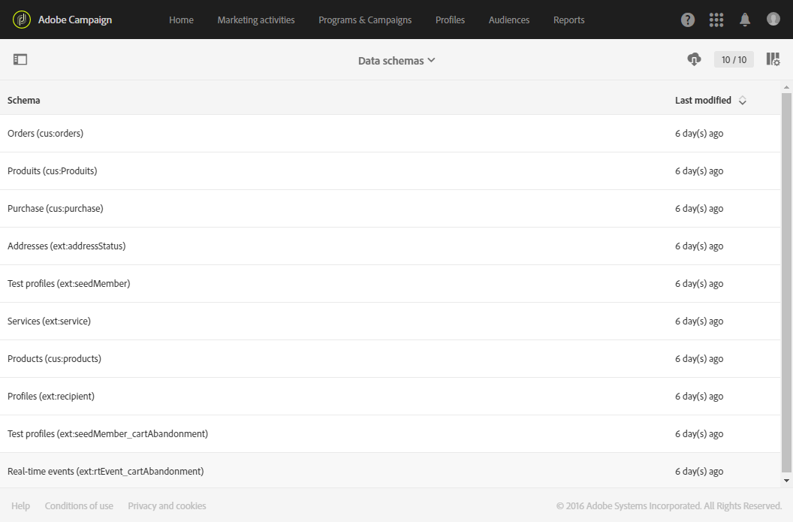
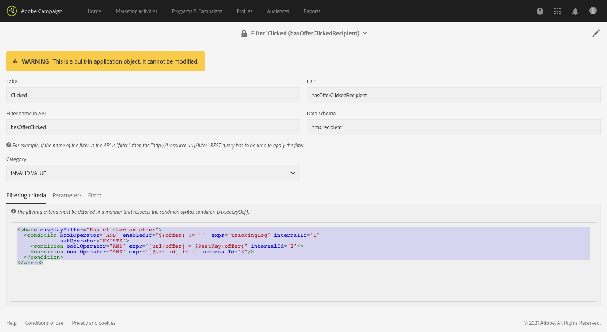

# データモデルの変更の監視{#monitoring-data-model-changes}

**[!UICONTROL Diagnosis]** メニューから、アプリケーションによって生成されたテクニカル オブジェクトを分析するために表示できます。

>[!NOTE]
>
>このメニューの画面は読み取り専用です。



次の種類のオブジェクトを表示できます。

* データスキーマ
* Web ページ
* フィルター
* ナビゲーション
* コンポーネント
* バッチジョブ

リスト設定を変更できます。

* 列を追加したり削除したりできます。
* 列名を定義することもできます。
* リスト内の列の表示順序を定義できます。
* リスト内の値の並べ替え順序を選択できます。

リストをフィルタリングできます。

* ネイティブデータスキーマ、web ページ、フィルター、ナビゲーションオブジェクトを含めることも除外することもできます。
* 名前でオブジェクトを検索できます。
* ステータス、開始日、終了日でバッチジョブをフィルタリングできます。

コンマ区切りの値を含むTXT形式のファイルに表示されたリストをダウンロードできます。

選択したオブジェクトの詳細を表示できます。

例えば、この機能を使用して、標準のフィルターのフィルター条件を表示できます。 次の例は、標準フィルターのフィルター条件に表示されるコードを示しています。

```xml
<where displayFilter="Has clicked an offer">
  <condition boolOperator="AND" enabledIf="$(offer) != ''" expr="trackingLog" internalId="1" setOperator="EXISTS">
    <condition boolOperator="AND" expr="[url/offer] = $RestKey(offer)" internalId="2"/>
    <condition boolOperator="AND" expr="[@url-id] != 1" internalId="3"/>
  </condition>
</where>
```

