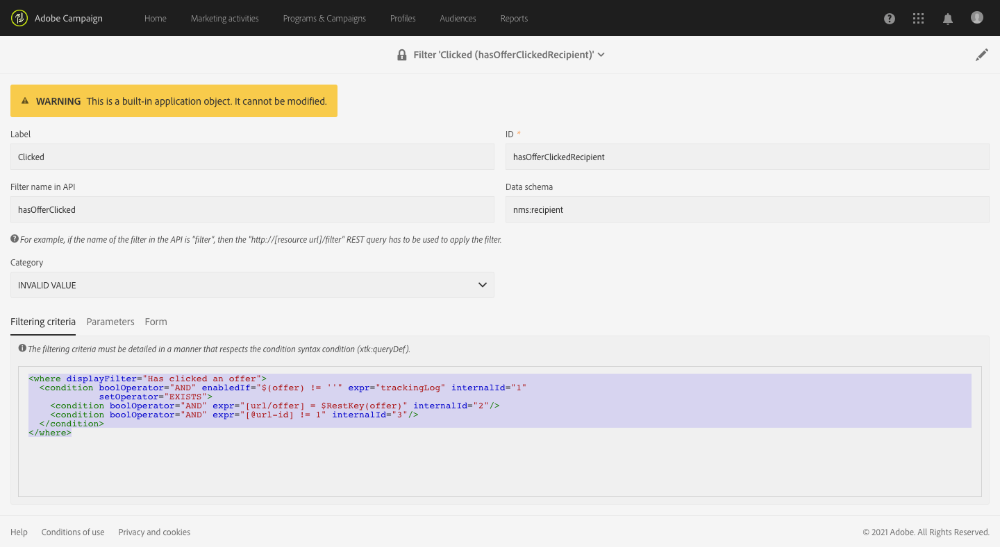

# データモデルの変更の監視{#monitoring-data-model-changes}

次から： **[!UICONTROL Diagnosis]** メニューを使用すると、アプリケーションで生成された技術オブジェクトを表示して、それらを分析できます。

>[!NOTE]
>
>このメニューの画面は読み取り専用です。


次のタイプのオブジェクトを表示できます。

* データスキーマ
* Web ページ
* フィルター
* ナビゲーション
* コンポーネント
* バッチジョブ

リストの設定は、次のように変更できます。

* 列の追加と削除を行うことができます。
* 列名を定義できます。
* リスト内の列の表示順を定義できます。
* リスト内の値の並べ替え順を選択できます。

リストはフィルタリングできます。

* ネイティブデータスキーマ、Web ページ、フィルターおよびナビゲーションオブジェクトを含めたり除外したりできます。
* オブジェクトは名前で検索できます。
* バッチジョブのステータス、開始日および終了日に基づいて、バッチジョブをフィルタリングできます。

表示されたリストは、コンマ区切り値を使用して TXT 形式でダウンロードできます。

選択したオブジェクトの詳細を表示できます。

例えば、この機能を使用して、標準のフィルターのフィルター条件を表示できます。 次の例は、標準のフィルターのフィルター条件に対して表示されるコードを示しています。

```xml
<where displayFilter="Has clicked an offer">
  <condition boolOperator="AND" enabledIf="$(offer) != ''" expr="trackingLog" internalId="1" setOperator="EXISTS">
    <condition boolOperator="AND" expr="[url/offer] = $RestKey(offer)" internalId="2"/>
    <condition boolOperator="AND" expr="[@url-id] != 1" internalId="3"/>
  </condition>
</where>
```

