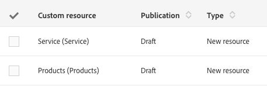

# リソースのステータス{#resource-statuses}

発行またはアクティベーションの状態によっては、リソースの状態が異なる場合があります。

**[!UICONTROL Custom resources]**&#x200B;画面には、これらのステータスを表示するための列が2つあります。

**パブリケーションのステータス**

* **ドラフト**:リソースが作成または再ドラフトされたとき。対応するAPIだけでなくデータベーステーブルも作成するには、リソースを再公開する必要があります。 リソースの再ドラフト中は、発行手順の後、自動的に非アクティブになります。
* **保留中の再ドラフト**:資源は再起草された。再ドラフト処理は次のパブリケーションで行われます。 再作図は元に戻せません。 ユーザに通知する警告メッセージがいくつか表示されます。このメッセージは、再作図とパブリッシュの準備の両方で表示されます。

   再作図の詳細については、「[リソース](../../developing/using/deleting-a-resource.md)の削除」を参照してください。

   >[!NOTE]
   >
   >**[!UICONTROL Cancel re-draft]**&#x200B;オプションは、再ドラフトするリソースに、「発行済み」ステータスの他のリソースを経由するリンクが含まれている場合に利用できます。 このオプションを使用すると、「再ドラフト」プロセスを元に戻すことができます。 その後、カスタムリソースは元のステータスに戻ります。

* **発行済み**:リソースが公開されました。リソースが最終変更日より後に変更された場合は、最新の変更を考慮してリソースを再発行するように促すメッセージが表示されます。

**[!UICONTROL Do not publish latest modifications]**&#x200B;フィールドは、今後のパブリケーションで変更が考慮されないようにします。

このフィールドは、カスタムリソース定義で設定できます。
