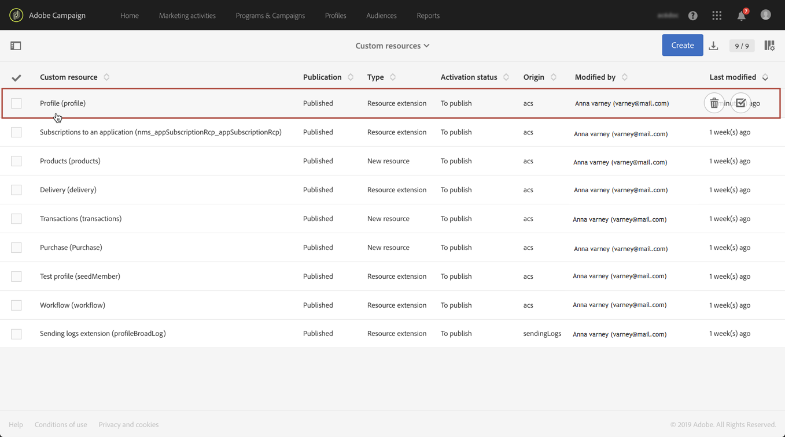
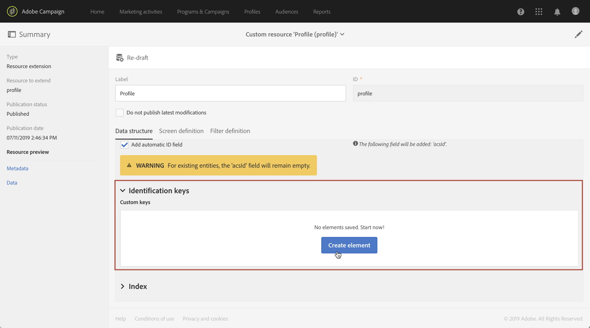
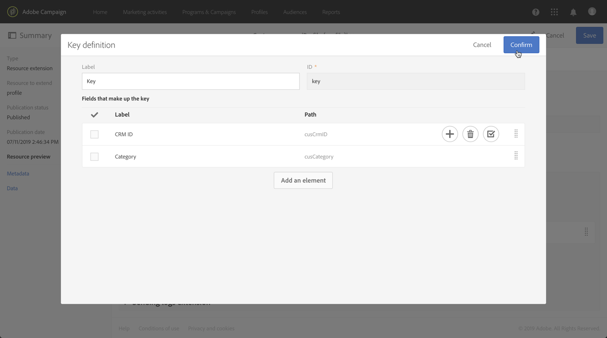
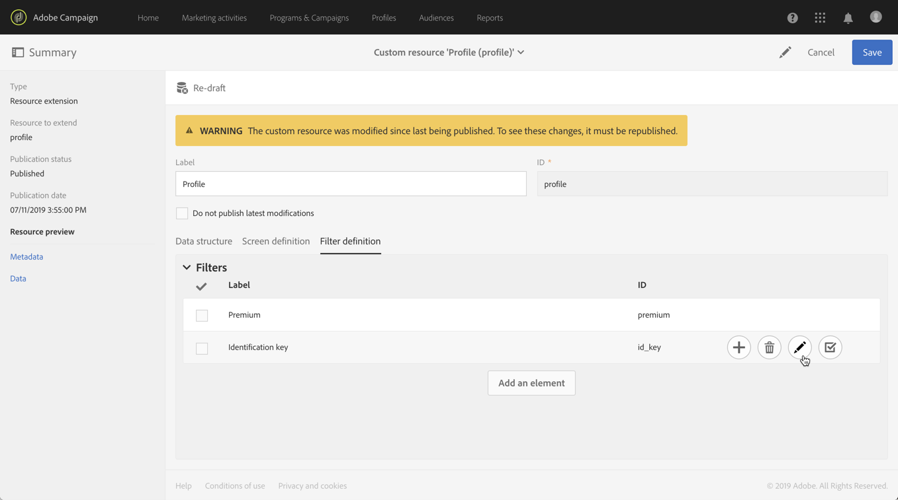
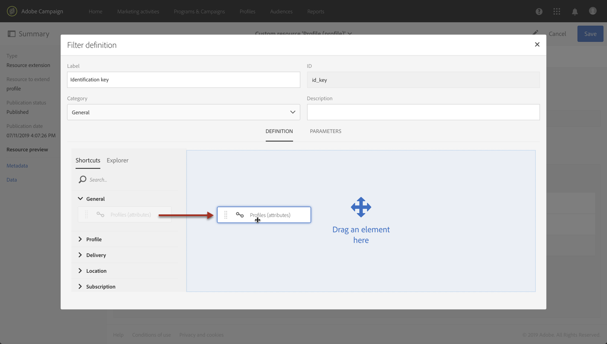
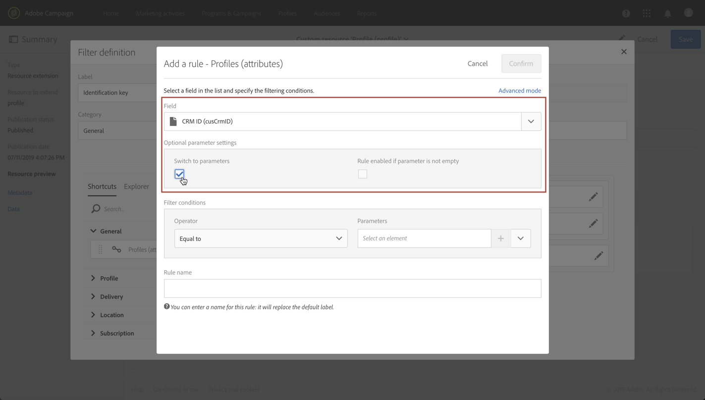
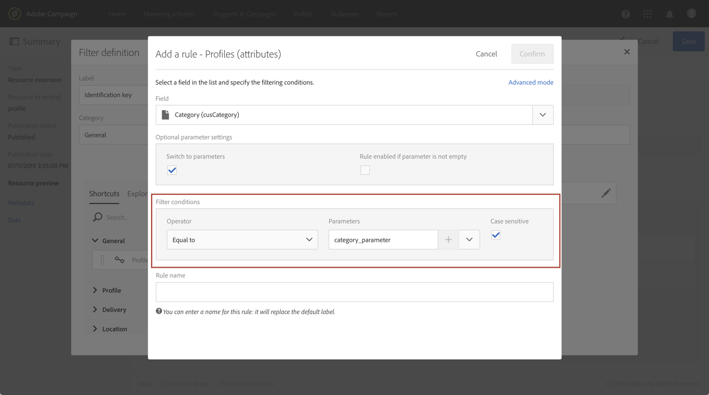
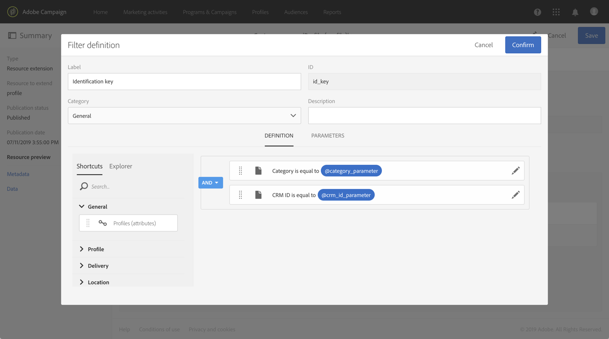
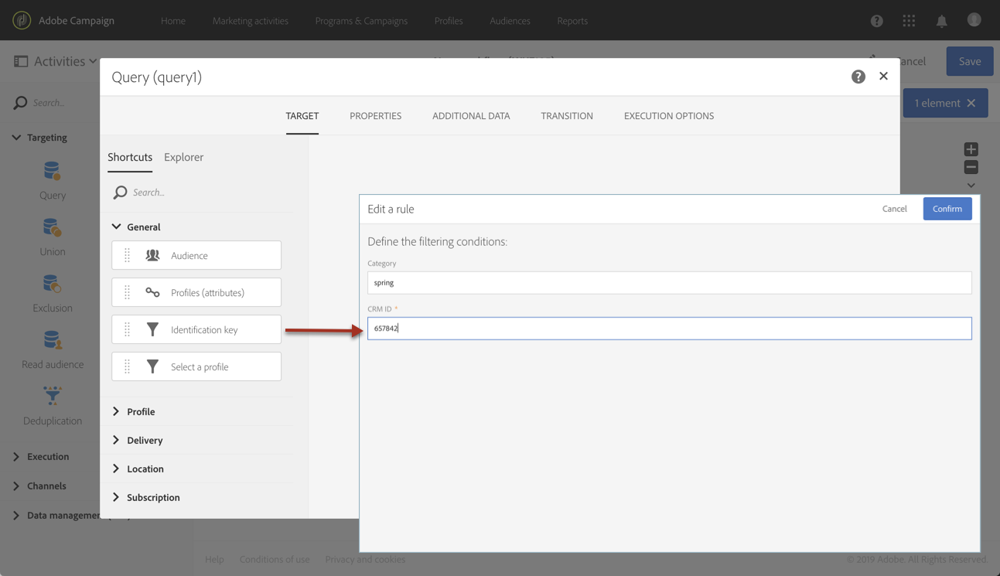

# 複合 ID キーを使用したリソースの呼び出し{#calling-a-resource-using-a-composite-identification-key}

場合によっては、リソースに対して、2つのフィールドで構成される識別キーを定義する必要が生じる場合があります。 ID キーを設定したら、Campaign Standard インターフェイスまたはAPIから、このID キーを使用してリソースを呼び出せるように、フィルター定義を設定する必要があります。

この使用例では、**プロファイル** リソースが、カスタム **&quot;CRM ID&quot;**&#x200B;および&#x200B;**&quot;category&quot;** フィールドで拡張されています。 プロファイルリソース用の識別キーを作成します。このキーは、これら2つのフィールドで構成されます。 次に、フィルター定義を設定して、ID キーを使用してプロファイルリソースにアクセスできるようにします。

このユースケースの主な手順は次のとおりです。

1. 2つのフィールドに基づいて、プロファイルリソースの識別キーを設定します。
1. ID キーを使用してプロファイルリソースを呼び出すことができるように、フィルター定義を設定します。
1. インターフェイスまたはAPからプロファイルリソースを呼び出します。

関連トピック ：

* [リソースの作成または拡張](../../developing/using/creating-or-extending-the-resource.md)
* [ID キーの定義](../../developing/using/configuring-the-resource-s-data-structure.md#defining-identification-keys)
* [CAMPAIGN STANDARD REST API](../../api/using/get-started-apis.md)

## 手順1：識別キーの設定{#step-1-configure-the-identification-key}

>[!NOTE]
> 識別キーを設定する際のグローバルな概念については、[この節](../../developing/using/configuring-the-resource-s-data-structure.md#defining-identification-keys)で詳しく説明しています。

1. ID キーを設定する前に、リソースが目的のフィールドで拡張され、公開されていることを確認します。 詳しくは、[この節](../../developing/using/creating-or-extending-the-resource.md)を参照してください。

1. **[!UICONTROL Administration]** / **[!UICONTROL Development]** / **[!UICONTROL Custom resources]** メニューに移動し、**[!UICONTROL Profile]** リソースを開きます。

   

1. **[!UICONTROL Identification keys]** セクションで、「**[!UICONTROL Create element]**」ボタンをクリックします。

   

1. 2つのカスタム「CRM ID」フィールドと「カテゴリ」フィールドを追加し、**[!UICONTROL Confirm]**&#x200B;をクリックします。

   

   >[!NOTE]
   > プロファイルのインターフェイスに2つのカスタムフィールドを表示する場合は、「**[!UICONTROL Screen definition]**」タブを設定します。 詳しくは、[この節](../../developing/using/configuring-the-screen-definition.md)を参照してください。

1. これで、フィルター定義を設定して、ID キーを使用してリソースを呼び出せるようになりました。

## 手順2：フィルター定義の設定{#step-2-configure-the-filter-definition}

>[!NOTE]
> フィルター定義を設定する際のグローバルな概念について詳しくは、[この節](../../developing/using/configuring-filter-definition.md)を参照してください。

1. 「**[!UICONTROL Filter definition]**」タブで「**[!UICONTROL Add an element]**」をクリックし、フィルター定義のラベルとIDを入力します。

1. フィルター定義のプロパティを編集して、ルールを設定します。

   

1. ID キーで使用されるフィールドを含むテーブルをワークスペースにドラッグ&amp;ドロップします。

   

1. ID キー（「CRM ID」）で使用される最初のフィールドを選択し、**[!UICONTROL Switch to parameters]** オプションを有効にします。

   

1. **[!UICONTROL Filter conditions]** セクションで、**[!UICONTROL Equal]**&#x200B;演算子を保持し、パラメーターの名前を定義し、プラス記号をクリックして作成します。

   

   >[!NOTE]
   > **+** ボタンをクリックすると、パラメーターの名前が自動的に生成されます。 APIのフィルターを使用する必要があるため、この情報に注意してください。

1. ID キー（「カテゴリ」）を構成するすべてのフィールドで上記の手順を繰り返し、変更を保存します。

   

1. これで、フィルター定義が設定されました。 リソースを公開して、フィルターを使用できるようにすることができます。

## 手順3:ID キーに基づいてリソースを呼び出す{#step-3-call-the-resource-based-on-its-identification-key}

識別キーとそのフィルター定義を設定したら、それらを使用して、Campaign標準インターフェイスまたはREST APIからリソースを呼び出すことができます。

インターフェイスからフィルター定義を使用するには、ワークフローで&#x200B;**[!UICONTROL Query]** アクティビティを使用します（[このセクション ](../../automating/using/query.md)を参照）。 その後、左側のペインでフィルターを利用できます。



Campaign Standard REST APIのフィルター定義を使用するには、次の構文を使用します。

```
GET /profileAndServicesExt/<resourceName>/by<filterName>?<param1_parameter>=<value>&<param2_parameter>=<value>
```

>[!NOTE]
>カスタムフィルターを呼び出すには、[手順2](../../developing/using/uc-calling-resource-id-key.md#step-2-configure-the-filter-definition)でフィルター定義を設定する際に定義されたフィルター名の後に「by」プレフィックスを使用します。

この場合、「123456」 CRM IDを持つ「spring」カテゴリからプロファイルを取得する構文は次のようになります。

```
GET https://mc.adobe.io/<ORGANIZATION>/campaign/profileAndServicesExt/profile/byidentification_key?category_parameter=spring&crm_id_parameter=123456
```

詳しくは、[Campaign Standard REST API ドキュメント ](../../api/using/filtering.md)を参照してください。
