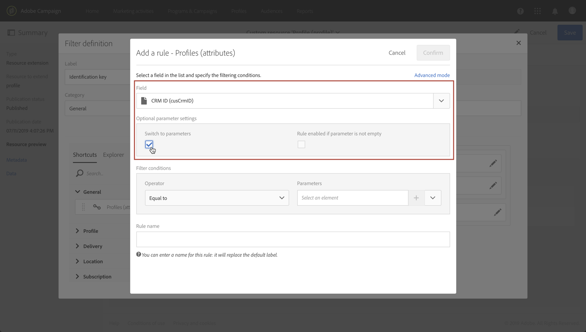

# 複合 ID キーを使用したリソースの呼び出し{#calling-a-resource-using-a-composite-identification-key}

場合によっては、2つのフィールドで構成される識別キーをリソースに対して定義する必要があります。 IDキーを設定したら、Campaign StandardインターフェイスまたはAPIからこのIDキーを使用してリソースを呼び出せるように、フィルター定義を設定する必要があります。

この場合、**プロファイル**&#x200B;リソースは、カスタムの&#x200B;**&quot;CRM ID&quot;**&#x200B;および&#x200B;**&quot;カテゴリ&quot;**&#x200B;フィールドを使用して拡張されています。 この2つのフィールドで構成されるプロファイルリソースのIDキーを作成します。 次に、IDキーを使用してプロファイルリソースにアクセスできるように、フィルター定義を設定します。

この使用例の主な手順は次のとおりです。

1. 2つのフィールドに基づいて、プロファイルリソースのIDキーを設定します。
1. IDキーを使用してプロファイルリソースを呼び出せるように、フィルター定義を設定します。
1. プロファイルリソースをインターフェイスまたはAPから呼び出します。

関連トピック ： 

* [リソースの作成または拡張](../../developing/using/creating-or-extending-the-resource.md)
* [識別キーの定義](../../developing/using/configuring-the-resource-s-data-structure.md#defining-identification-keys)
* [Campaign StandardREST API](../../api/using/get-started-apis.md)

## 手順1:IDキーを設定{#step-1-configure-the-identification-key}

>[!NOTE]
> IDキーを設定する際のグローバルな概念については、[この節](../../developing/using/configuring-the-resource-s-data-structure.md#defining-identification-keys)で詳しく説明します。

1. IDキーを設定する前に、目的のフィールドでリソースが拡張され、発行されていることを確認します。 詳しくは、[こちらの節](../../developing/using/creating-or-extending-the-resource.md)を参照してください。

1. **[!UICONTROL Administration]** / **[!UICONTROL Development]** / **[!UICONTROL Custom resources]**&#x200B;メニューに移動し、**[!UICONTROL Profile]**&#x200B;リソースを開きます。

   

1. 「**[!UICONTROL Identification keys]**」セクションで、「**[!UICONTROL Create element]**」ボタンをクリックします。

   

1. 2つ追加のカスタム「CRM ID」と「カテゴリ」フィールドを選択し、**[!UICONTROL Confirm]**&#x200B;をクリックします。

   

   >[!NOTE]
   > プロファイルのインターフェイスに2つのカスタムフィールドを表示する場合は、「**[!UICONTROL Screen definition]**」タブを設定します。 詳しくは、[こちらの節](../../developing/using/configuring-the-screen-definition.md)を参照してください。

1. これで、フィルター定義のIDキーを使用してリソースを呼び出せるようにフィルター定義を設定できます。

## 手順2:フィルタ定義{#step-2-configure-the-filter-definition}を設定

>[!NOTE]
> フィルター定義を設定する際のグローバル概念については、[このセクション](../../developing/using/configuring-filter-definition.md)で詳しく説明します。

1. 「**[!UICONTROL Filter definition]**」タブで、「**[!UICONTROL Add an element]**」をクリックし、フィルター定義のラベルとIDを入力します。

1. フィルター定義のプロパティを編集して、ルールを設定します。

   

1. IDキーで使用されるフィールドを含むテーブルをワークスペースにドラッグ&amp;ドロップします。

   

1. IDキーで使用される最初のフィールド(「CRM ID」)を選択し、**[!UICONTROL Switch to parameters]**&#x200B;オプションをアクティブにします。

   

1. **[!UICONTROL Filter conditions]**&#x200B;セクションで、**[!UICONTROL Equal]**&#x200B;演算子を残し、パラメーターの名前を定義し、プラス記号をクリックして作成します。

   

   >[!NOTE]
   > 「**+**」ボタンをクリックすると、パラメーター名が自動的に生成されます。 この情報は、APIのフィルタを使用する必要があるので、注意してください。

1. IDキー(「カテゴリ」)を構成するすべてのフィールドに対して上記の手順を繰り返し、変更を保存します。

   

1. これで、フィルター定義が設定されます。 リソースを公開して、フィルターを使用できます。

## 手順3:識別キーに基づいてリソースを呼び出す{#step-3-call-the-resource-based-on-its-identification-key}

IDキーとそのフィルター定義が設定されたら、それらを使用して、キャンペーン標準インターフェイスまたはREST APIからリソースを呼び出すことができます。

インターフェイスのフィルター定義を使用するには、ワークフローで&#x200B;**[!UICONTROL Query]**&#x200B;アクティビティを使用します（[このセクション](../../automating/using/query.md)を参照）。 その後、左側のペインでフィルターを使用できます。


Campaign StandardREST APIのフィルター定義を使用するには、次の構文を使用します。

```
GET /profileAndServicesExt/<resourceName>/by<filterName>?<param1_parameter>=<value>&<param2_parameter>=<value>
```

>[!NOTE]
>カスタムフィルターを呼び出すには、[手順2](../../developing/using/uc-calling-resource-id-key.md#step-2-configure-the-filter-definition)でフィルター定義を設定する際に定義したフィルター名の後に、「by」プレフィックスを使用します。

この例では、「123456」CRM IDを持つ「spring」カテゴリからプロファイルを取得する構文は次のようになります。

```
GET https://mc.adobe.io/<ORGANIZATION>/campaign/profileAndServicesExt/profile/byidentification_key?category_parameter=spring&crm_id_parameter=123456
```

詳しくは、[Campaign StandardREST APIのドキュメント](../../api/using/filtering.md)を参照してください。