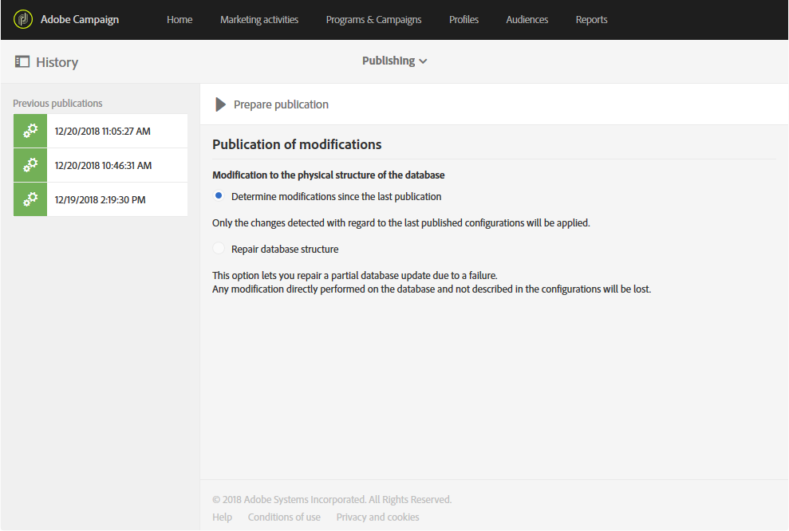

# Updating the database structure{#updating-the-database-structure}

データモデルを有効にして使用できるようにするには、データベース構造を更新する必要があります。

>[!NOTE]
>
>カスタムリソースは、アドビが実行した自動更新時に自動的に更新されます。

## Publishing a custom resource {#publishing-a-custom-resource}

リソースに対して実行された変更を適用するには、データベースの更新を実行する必要があります。

>[!NOTE]
>
>イベントで使用されているカスタムリソースのフィールドが変更または削除されると、対応するイベントが自動的に非公開になります。[トランザクションメッセージ](../../administration/using/configuring-transactional-messaging.md)の設定を参照してください。

1. From the advanced menu, via the Adobe Campaign logo, select **[!UICONTROL Administration]** &gt; **[!UICONTROL Development]**, then **[!UICONTROL Publishing]**.
1. By default, the option **[!UICONTROL Determine modifications since the last publication]** is checked, which means that only the changes carried out since the last update will be applied.

   >[!NOTE]
   >
   >The **[!UICONTROL Repair database structure]** reestablishes a correct configuration if the publication failed before completing. データベース内で直接実行され、カスタムリソースを使用しない変更は削除されます。

   

1. Click the **[!UICONTROL Prepare publication]** button to start the analysis. ワークフローによってインスタンスが大量に煩雑になっていない場合、大きなテーブルが更新されることに注意してください。

   To learn more on the action to perform on the Profiles &amp; Services API, refer to [Publishing a resource with API extension](../../developing/using/updating-the-database-structure.md#publishing-a-resource-with-api-extension).

   

1. Once the publication has been carried out, click the **[!UICONTROL Publish]** button to apply your new configurations.
1. Once published, the **[!UICONTROL Summary]** pane of each resource indicates that the status is now **[!UICONTROL Published]** and specifies the date of the last publication.

   >[!NOTE]
   >
   >リソースに新しい変更を加えた場合は、この操作を繰り返して変更を適用する必要があります。

   If resources have the **[!UICONTROL Pending re-draft]** status before publishing, then an additional message will appear inviting you to check your actions because publishing will result in definitive changes (deleting columns, tables...). To help you carry out this last change, an **[!UICONTROL SQL Script]** tab is available. パブリケーション中に実行されるSQLコマンドが提供されます。

   

   >[!NOTE]
   >
   >You can stop the Re-draft process by clicking the **[!UICONTROL Cancel re-draft]** button. この操作により、リソースのステータスが元の状態に戻されます。

1. If your publication failed, you can always go back to the previous publication by clicking **[!UICONTROL Back to latest successful publication]**.

   パブリケーションを失敗した場合は、このパブリケーションの修正を促すために、インスタンスにログインするとすぐにポップアップウィンドウが開きます。パブリケーションが修正されるまで、インスタンスは新しい製品バージョンでアップグレードされません。

   

## Publishing a resource with API extension {#publishing-a-resource-with-api-extension}

プロファイルおよびサービスAPIは次の場合に作成できます。

* When you extend the custom resources **[!UICONTROL Profiles]** or **[!UICONTROL Services]**, you can perform an update of the Profiles and Services API to integrate the fields declared in the custom resources extension.
* When you define a custom resource and you create a link between the resources **[!UICONTROL Profiles]** or **[!UICONTROL Services]** and the custom resource, you can perform an update to include the new resource in the API.

このオプションは、公開画面で選択できます。

* APIがまだ公開されていない場合（つまり、リソースを拡張したことがない場合や、このリソースまたは別のリソースに対してこのオプションをまだ確認していない場合）は、選択できます。

   

* APIが既に公開されている場合（つまり、既にリソースを拡張してこのオプションをオンにしている場合）、APIの更新が強制されます。

   実際には、作成後、APIは再度公開するたびに更新されます。これは、このAPIのプロファイルまたはサービスリソースを中断し、インスタンスを阻害しないようにするためです。

Note that by default, the custom resource is integrated, but, for a specific behavior, if you don't want to publish this resource, you can select the option **[!UICONTROL Hide this resource from APIs]** available in the **[!UICONTROL Resource Properties]**.

**[!UICONTROL Prepare Publication]** この手順の後、Adobe Campaignでは、タブのパブリケーションの後に、APIの現在のバージョンと今後のバージョンの間の差分が表示 **[!UICONTROL Profiles & Services API Preview]**&#x200B;されます。APIを初めて拡張すると、差分によって標準的なカスタムリソース定義が拡張機能と比較されます。

タブに表示される情報は、3つのセクションに分かれています。追加、削除、および変更された要素。

デルタの分析は、API動作を変更するための必須の手順であり、ほとんどの場合、周囲の開発にはドミノ効果の周囲の開発に影響します。

>[!NOTE]
>
>This publication updates the **[!UICONTROL profilesAndServicesExt]** API. **[!UICONTROL profilesAndServices]** APIは更新されません。

For more information on the Adobe Campaign API, consult the dedicated Adobe Campaign documentation on [Adobe IO](https://docs.campaign.adobe.com/doc/standard/en/adobeio.html).
