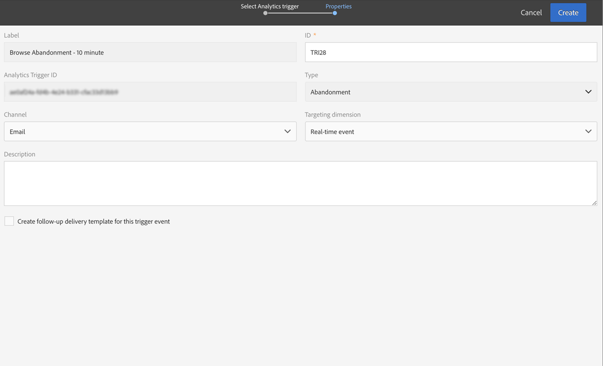

# 放棄トリガーのユースケース{#abandonment-triggers-use-cases}

この節では、Adobe Campaign と Experience Cloud Triggers の統合を使用して実装できる様々な使用例を示します。次の 2 つの使用例があります。

* [閲覧中断トリガー](#browse-abandonment-trigger)：Web サイトで閲覧を中止した顧客にメッセージを送信します。
* [検索中断トリガー](#search-abandonment-trigger)：Web サイトで検索をおこなったが購入しなかった訪問者に再び接触します。

>[!NOTE]
>
>この節で説明する使用例では、Experience Cloud の訪問者 ID を使用しています。Experience Cloud の宣言済み ID を使用して実装することもできます。ハッシュ化および暗号化された宣言済み ID もサポートされます。暗号化された E メールアドレス／携帯電話番号を直接暗号化解除することで、キャンペーンに存在しないプロファイルに E メール／SMS を送信できます。ただし、この場合、プロファイルデータを使用したパーソナライゼーションは使用できません。

## 前提条件 {#pre-requisites}

これらの使用例を実装するには、次のソリューション／コアサービスにアクセスする必要があります。

* Adobe Campaign
* Adobe Analytics Ultimate、Premium、Foundation、OD、Select、Prime、Mobile Apps、Select、または Standard。
* Experience Cloud Triggers コアサービス
* Experience Cloud DTM コアサービス
* Experience Cloud 訪問者 ID と Experience Cloud People コアサービス

また、稼働中の Web サイトも必要です。

詳しくは、[ソリューションおよびサービスの設定](../../integrating/using/configuring-triggers-in-experience-cloud.md#configuring-solutions-and-services)を参照してください。

## 閲覧中断トリガー {#browse-abandonment-trigger}

この使用例では、クライアントが Web サイトの訪問を中断するたびに実行される単純なトリガーを作成します。この例では、DTM で既にデータを収集して Adobe Analytics にプッシュしていて、すべてのイベントが作成されていることを前提としています。

### Experience Cloud トリガーの作成 {#creating-an-experience-cloud-trigger}

1. Experience Cloud アクティベーションコアサービスメニューから「**[!UICONTROL Manage Triggers]**」を選択します。

   

1. トリガーのタイプを選択します（この使用例では「**[!UICONTROL Abandonment]**」）。

   

1. この使用例では、単純な中断トリガーが必要です。ビジネスの目的は、旅行予約ウェブサイトを閲覧し、「掘り出し物」ページを見ているのに、旅行を予約しない訪問者を特定することです。このオーディエンスを特定したら、すぐに再び連絡を取る必要があります。この例では、10 分後にトリガーを送信するように選択します。

   

### Adobe Campaign でのトリガーの使用 {#using-the-trigger-in-adobe-campaign}

Experience Cloud トリガーを作成したら、Adobe Campaign で使用します。

Adobe Campaign では、Experience Cloud で作成したトリガーにリンクしたトリガーを作成する必要があります。

1. Adobe Campaignでトリガーを作成するには、左上隅の&#x200B;**Adobe**&#x200B;ロゴをクリックし、**[!UICONTROL Marketing plans]** / **[!UICONTROL Transactional messages]** / **[!UICONTROL Experience Cloud triggers]**&#x200B;を選択します。

   

1. 「**[!UICONTROL Create]**」をクリックします。
1. 作成したトリガーを選択し、「**[!UICONTROL Next]**」をクリックします。

   

1. **[!UICONTROL Email]** チャネルと **[!UICONTROL Real-time event]** ターゲティングディメンションを選択し、「**[!UICONTROL Create]**」をクリックします。

   

1. Adobe Campaign でトリガーを公開します。このプロセスでは、トランザクションメッセージテンプレートが自動的に作成されます。

   

1. メッセージテンプレートを表示するには、右上の「**[!UICONTROL More]**」ボタンをクリックし、次に「**[!UICONTROL Trigger Transactional Template]**」をクリックします。

1. 内容と送信者の詳細をパーソナライズします。

   

1. メッセージテンプレートを公開します。トリガーが稼働し、機能します。

   

### シナリオの実行 {#running-the-scenario}

1. この使用例では、まず Adobe Campaign でオーディエンスに最初の E メールを送信します。

   

1. 受信者が E メールを開きます。

   

1. 受信者はリンクをクリックし、Web サイトに移動します。この例では、受信者がバナーから旅行予約 Web サイトのホームページに移動します。

   

1. 受信者は「掘り出し物」のページを開きますが、そこで閲覧を終了してしまいます。10 分後に、Adobe Campaign がトランザクションメッセージの送信をトリガーします。

   

1. Experience Cloud のログでトリガーの発生回数をいつでも確認できます。

   

1. Adobe Campaign トリガーレポートを表示することもできます。

   

## 検索中断トリガー {#search-abandonment-trigger}

この使用例では、旅行予約 Web サイトを訪問し、目的地を検索し、望む結果を得られず、その後予約をしていない訪問者に再度接触するためのトリガーを作成します。全体的なプロセスは、前の使用例と同じです（[閲覧中断トリガー](#browse-abandonment-trigger)を参照）。ここでは、リマーケティング用の E メールメッセージをパーソナライズする方法を説明します。

### Experience Cloud トリガーの作成 {#creating-an-experience-cloud-trigger-1}

前の使用例で説明した手順に従って、Experience Cloud トリガーを作成します。詳しくは、[Experience Cloud トリガーの作成](#creating-an-experience-cloud-trigger)を参照してください。主な違いは、トリガーの定義です。

「**[!UICONTROL Include Meta Data]**」セクションでは、Analytics から収集されたすべてのデータをトリガーペイロードに渡すことができます。この例では、カスタム eVar（eVar 3 など）を作成して、訪問者が入力した検索語を収集します。この用語は、同じ訪問者に送信されるトランザクション用の E メールメッセージで使用されます。

### Adobe Campaign でのトリガーの使用 {#using-the-trigger-in-adobe-campaign-1}

1. 前の使用例で説明した手順に従って、Adobe Campaign でトリガーを作成します。[Adobe Campaign でのトリガーの使用](#using-the-trigger-in-adobe-campaign)を参照してください。主な違いは、トリガーペイロードにプッシュされたメタデータに Adobe Campaign でアクセスし使用する方法です。
1. Adobe Campaign で作成した検索中断トリガーで、「**[!UICONTROL Event content and enrichment]**」アイコンをクリックして、Adobe Campaign にプッシュされたペイロードを表示します。

   

1. このように、カスタム eVar はトリガーペイロードで渡され、**イベントコンテキスト**&#x200B;テーブル（ctx）にマッピングされます。これで、トランザクションメッセージをパーソナライズするためのアクセスが可能になります。

   

1. この例では、件名行と E メール本文に目的地検索語を入れることにします。

   

1. パーソナライズされたフィールドを選択する場合は、**トランザクションイベント**（rtEvent）テーブル、次に&#x200B;**イベントコンテキスト**（ctx）サブテーブルでペイロードメタデータを探します。

   

### シナリオの実行 {#running-the-scenario-1}

1. 訪問者は旅行予約 Web サイトに行き、目的地を検索します。この例では、訪問者は日本への旅行を探していますが、何の結果も見つかりません。この機会に、この訪問者に再度接触して、代わりの旅行プランをお勧めします。

   

   >[!NOTE]
   >
   >この使用例では、訪問者／受信者が既に同じ Web サイトからの E メールを開いてクリックしているものと仮定しています。これにより、訪問者 ID を使用および収集し、受信者にマッピングできます。この操作が必要なのは 1 回だけです。

1. しばらくすると、同じ訪問者／受信者がリマーケティングメッセージを受信します。このメッセージには、最近検索された目的地が記載されています。

   
