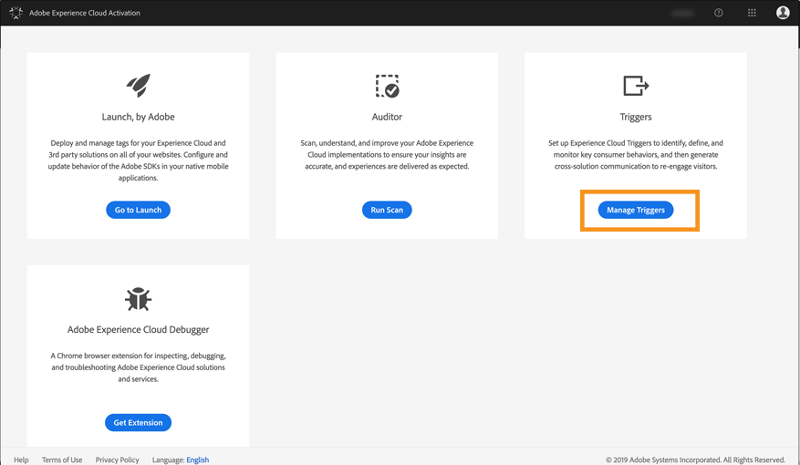
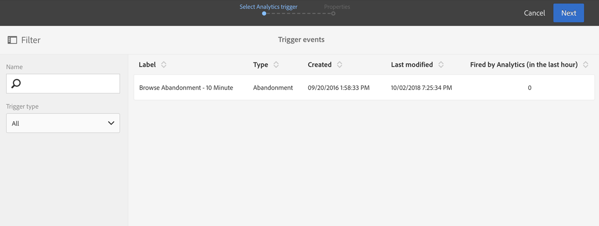
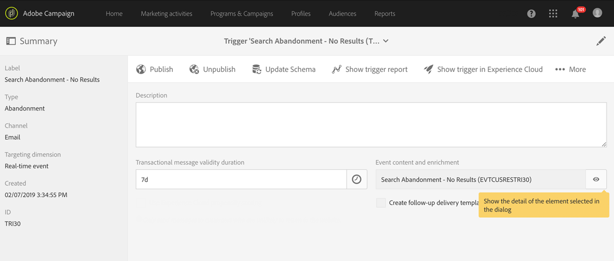
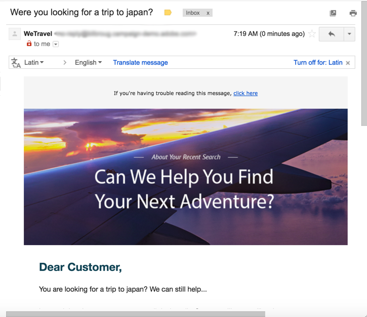

# 廃棄トリガーの使用例{#abandonment-triggers-use-cases}

この節では、Adobe CampaignとExperience Cloud Triggerの統合を使用して実装できるさまざまなユースケースについて説明します。 次の2つの使用例があります。

* [ブラウズ破棄トリガ](../../integrating/using/abandonment-triggers-use-cases.md#browse-abandonment-trigger):ウェブサイトでの訪問を断念したお客様に連絡を送る。
* [検索破棄トリガ](../../integrating/using/abandonment-triggers-use-cases.md#search-abandonment-trigger):ウェブサイトで検索を行ったが、購入しなかった訪問者と再び契約を結びます。

>[!NOTE]
>
>このセクションで説明する使用例は、エクスペリエンスクラウドビジターIDに基づいています。 また、エクスペリエンスクラウド宣言IDを使用して実装することもできます。 ハッシュ化および暗号化された宣言済みIDもサポートされます。 暗号化された電子メールアドレス/携帯電話番号を直接復号化することで、キャンペーンに存在しないプロファイルに電子メール/SMSを送信できます。 しかし、この場合、プロファイルデータを使用した個人用設定は使用できません。

## 前提条件 {#pre-requisites}

これらの使用例を実装するには、次のソリューション/コア·サービスにアクセスする必要があります。

* アドビキャンペーン
* Adobe Analytics Ultimate、Premium、Foundation、OD、選択、プライム、モバイルアプリ、選択、または標準。
* Experience Cloudがコアサービスをトリガー
* Experience Cloud DTM Core Service
* 体験クラウドビジターIDと体験クラウドのPeopleコアサービス

また、作業中のWebサイトも必要です。

詳細については、「ソリューションとサ [ービスの構成」を参照してください](../../integrating/using/configuring-triggers-in-experience-cloud.md#configuring-solutions-and-services)。

## ブラウズ破棄トリガ {#browse-abandonment-trigger}

この使用例では、クライアントがWebサイトへの訪問を放棄するたびに起動する簡単なトリガを作成します。 この例では、DTMがAdobe Analyticsにデータを収集してプッシュし、すべてのイベントを作成していることを前提としています。

### エクスペリエンスクラウドトリガーの作成 {#creating-an-experience-cloud-trigger}

1. Experience Cloud Activation Core Serviceメ **[!UICONTROL Manage Triggers]** ニューから選択します。

   

1. トリガの種類を選択しま **[!UICONTROL Abandonment]** す（この使用例では）。

   

1. この使用例に対しては、簡単な廃棄トリガが必要です。 出張予約のWebサイトを閲覧する訪問者を特定し、「案件」のページを見て、旅行を予約しないことがビジネスの目的です。 このお客様を特定したら、短い時間で連絡を取り直したいと思います。 この例では、10分間後にトリガを送信するように選択します。

   

### Adobe Campaignでのトリガの使用 {#using-the-trigger-in-adobe-campaign}

Experience Cloud Triggerを作成しました。Adobe Campaignで使用します。

Adobe Campaignでは、エクスペリエンスクラウドで作成したトリガーにリンクしたトリガーを作成する必要があります。

1. Adobe CampaignでTriggerを作成するには、左上隅のロ **[!UICONTROL Adobe Campaign]** ゴをクリックし、 &gt; &gt;を選 **[!UICONTROL Marketing plans]** 択し **[!UICONTROL Transactional messages]** ます **[!UICONTROL Experience Cloud triggers]**。

   

1. Click **[!UICONTROL Create]**.
1. 前に作成したトリガーを選択し、をクリックしま **[!UICONTROL Next]**&#x200B;す。

   

1. チャンネルとタ **[!UICONTROL Email]** ーゲット次元を選 **[!UICONTROL Real-time event]** 択し、をクリックしま **[!UICONTROL Create]**&#x200B;す。

   

1. Adobe Campaignでトリガを公開します。 このプロセスは、トランザクションメッセージテンプレートを自動的に作成します。

   

1. メッセージテンプレートを表示するには、 **[!UICONTROL More]** 右上のボタンをクリックし、をクリックしま **[!UICONTROL Trigger Transactional Template]**&#x200B;す。

1. コンテンツと送信者の詳細をカスタマイズします。

   

1. メッセージテンプレートを発行します。 トリガは現在、有効で機能しています。

   

### シナリオの実行 {#running-the-scenario}

1. このユースケースは、Adobe Campaignを使用して初めてお客様に送信される電子メールから始まります。

   

1. 受信者が電子メールを開きます。

   

1. リンクをクリックすると、Webサイトに移動します。 この例では、バナーを使用して、旅行予約Webサイトのホームページに受信者を表示します。

   

1. 受取人は「案件」ページに行くが、突然訪問を中止する。 10分後、Adobe Campaignはトランザクションメッセージの送信をトリガーします。

   

1. エクスペリエンスクラウドのログをいつでも確認して、トリガーが何回起動したかを確認できます。

   

1. また、Adobe Campaignトリガーレポートを表示することもできます。

   

## 検索破棄トリガ {#search-abandonment-trigger}

この使用例では、旅行予約Webサイトに行き、目的地を探し、成功した結果が見つからず、その後何も予約しなかった訪問者と再会する引き金を作成します。 一般的なプロセスは、前の使用例と同じです(「Browse abbonding Trigger [」を参照](../../integrating/using/abandonment-triggers-use-cases.md#browse-abandonment-trigger))。 ここでは、リマーケティングのEメール·メッセージをパーソナライズする方法について説明します。

### エクスペリエンスクラウドトリガーの作成 {#creating-an-experience-cloud-trigger-1}

前の使用例で説明した手順に従って、Experience Cloud Triggerを作成します。 Creating an Experience Cloud Trigger [を参照してください](../../integrating/using/abandonment-triggers-use-cases.md#creating-an-experience-cloud-trigger)。 主な違いはトリガ定義です。

このセク **[!UICONTROL Include Meta Data]** ションでは、分析から収集されたデータをトリガーペイロードに渡すことができます。 この例では、ビジターが入力する検索語を収集するカスタムeVar（eVar 3など）を作成します。 この用語は、同じ訪問者に送信されるトランザクション電子メールメッセージで使用されます。

### Adobe Campaignでのトリガの使用 {#using-the-trigger-in-adobe-campaign-1}

1. 前の使用例で説明した手順に従って、Adobe Campaignでトリガーを作成します。 Adobe Campainのト [リガーの使用を参照してください](../../integrating/using/abandonment-triggers-use-cases.md#using-the-trigger-in-adobe-campaign)。 主な違いは、Adobe Campaignでは、Triggerペイロードにプッシュされたメタデータにアクセスし、使用する方法です。
1. Adobe Campaignで作成した「Search Abbondant」トリガーで、アイコンをクリックして、Adobe Campaignにプ **[!UICONTROL Event content and enrichment]** ッシュされたペイロードを表示します。

   

1. このように、カスタムeVarはトリガペイロードに渡され、 **Event Context** (ctx)テーブルにマップされます。 これで、トランザクション·メッセージをパーソナライズできます。

   

1. この例では、宛先の検索語を件名行と電子メール本文に含めます。

   

1. 個人用フィールドを選択する場合は、 **Transactional event** (rtEvent)テーブルでペイロードのメタデータを探し、次に **Eventコンテキスト** (ctx)サブテーブルでペイロードのメタデータを探します。

   

### シナリオの実行 {#running-the-scenario-1}

1. 訪問者は旅行予約のWebサイトに行き、目的地を探します。 この例では、訪問者は日本への旅行を探しているが、何の結果も見つからない。 これは、この訪問者に連絡し、別の旅行計画を提案する機会です。

   

   >[!NOTE]
   >
   >この使用例では、同じWebサイトから送信された電子メールを訪問者/受信者が既に開いてクリックしたと仮定します。 これにより、VisitorIDを使用して収集し、受信者にマッピングできます。 1回だけだ。

1. 数分後、同じ訪問者/受信者が再マーケティングメッセージを受け取ります。 メッセージには、最近検索した宛先が含まれます。

   

