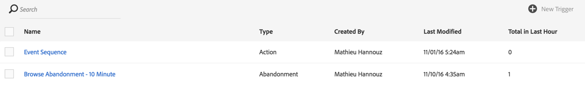

# 中断トリガーの使用例{#abandonment-triggers-use-cases}

ここでは、Adobe CampaignとExperience Cloud Triggersの統合を使用して実装できる様々な使用例を示します。 使用例は2つあります。

* [放棄トリガーの閲覧](#browse-abandonment-trigger):ウェブサイトでの訪問を中止した顧客にコミュニケーションを送信します。
* [検索中断トリガ](#search-abandonment-trigger):ウェブサイトで検索を行ったが購入を行わなかった訪問者と再び関わりを持ちます。

>[!NOTE]
>
>この節で説明する使用例は、Experience cloud訪問者IDに依存しています。 また、Experience cloud宣言済みIDを使用して実装することもできます。 ハッシュ化および暗号化された宣言済みIDもサポートされます。 暗号化された電子メールアドレス/携帯電話番号を直接復号化することで、Campaignに存在しないプロファイルに電子メール/SMSを送信できます。 ただし、この場合、プロファイルデータを使用したパーソナライゼーションは使用できません。

## 前提条件 {#pre-requisites}

これらの使用例を実装するには、次のソリューション/コアサービスにアクセスできる必要があります。

* Adobe Campaign
* Adobe Analytics Ultimate、Premium、Foundation、OD、Select、Prime、Mobile Apps、SelectまたはStandard。
* Experience Cloud Triggersコアサービス
* Experience Cloud DTMコアサービス
* Experience cloud訪問者IDとExperience cloud訪問者コアサービス

また、作業中のWebサイトも必要です。

詳しくは、「ソリューションおよびサービス [の設定」を参照してください](../../integrating/using/configuring-triggers-in-experience-cloud.md#configuring-solutions-and-services)。

## 閲覧放棄トリガー {#browse-abandonment-trigger}

この使用例では、クライアントがWebサイトの訪問を中断するたびに実行する単純なトリガーを作成します。 この例では、データを収集してAdobe AnalyticsにプッシュするDTMが既に存在し、すべてのイベントが作成されていることを前提としています。

### Experience cloudトリガーの作成 {#creating-an-experience-cloud-trigger}

1. Experience Cloud Activationコ **[!UICONTROL Manage Triggers]** アサービスメニューから選択します。

   

1. トリガーのタイプを選択しま **[!UICONTROL Abandonment]** す（使用事例）。

   

1. この使用例では、単純な中断トリガーが必要です。 ビジネスの目的は、旅行予約Webサイトを閲覧し、「取引」ページを見ながら旅行を予約しない訪問者を識別することです。 このオーディエンスを特定したら、短い期間で再度訪問者に連絡します。 この例では、10分後にトリガーを送信するように選択します。

   

### Adobe Campaignでのトリガーの使用 {#using-the-trigger-in-adobe-campaign}

Experience cloudトリガーを作成したので、Adobe Campaignで使用しましょう。

Adobe Campaignで、Experience cloudで作成したトリガーにリンクしたトリガーを作成する必要があります。

1. Adobe Campaignでトリガーを作成するには、左上隅 **[!UICONTROL Adobe Campaign]** のロゴをクリックし、//を選 **[!UICONTROL Marketing plans]** 択し **[!UICONTROL Transactional messages]** ます **[!UICONTROL Experience Cloud triggers]**。

   

1. Click **[!UICONTROL Create]**.
1. 前に作成したトリガーを選択し、をクリックしま **[!UICONTROL Next]**&#x200B;す。

   

1. チャネルとターゲ **[!UICONTROL Email]** ットディメンション **[!UICONTROL Real-time event]** を選択し、をクリックしま **[!UICONTROL Create]**&#x200B;す。

   

1. Adobe Campaignでのトリガーの公開を参照してください。 このプロセスは、トランザクションメッセージテンプレートを自動的に作成します。

   

1. メッセージテンプレートを表示するには、右上 **[!UICONTROL More]** のボタンをクリックし、をクリックしま **[!UICONTROL Trigger Transactional Template]**&#x200B;す。

1. コンテンツと送信者の詳細をパーソナライズします。

   

1. メッセージテンプレートを公開します。 トリガーがライブになり、機能します。

   

### シナリオの実行 {#running-the-scenario}

1. この使用例は、Adobe Campaignでオーディエンスに最初の電子メールが送信されるときに開始します。

   

1. 受信者が電子メールを開きます。

   

1. 彼が貴社のウェブサイトに来るリンクをクリックします。 この例では、バナーを使用して、旅行予約Webサイトのホームページに受信者を移動します。

   

1. 受信者は「掘り出し物」ページに移動しますが、突然訪問を中止します。 10分後に、Adobe Campaignはトランザクションメッセージの送信をトリガーします。

   

1. Experience cloudのログをいつでも確認して、トリガーが発生した回数を確認できます。

   

1. また、Adobe Campaignトリガーレポートを表示することもできます。

   

## 検索中断トリガー {#search-abandonment-trigger}

この使用例では、旅行予約Webサイトを閲覧し、目的地を検索し、成功の結果を見つけず、それ以降は何も予約しなかった訪問者と再び関わるトリガーを作成します。 一般的なプロセスは、前の使用例と同じです(「中断トリガーの参照 [」を参照](#browse-abandonment-trigger))。 ここでは、リマーケティング用の電子メールメッセージをパーソナライズする方法に焦点を当てます。

### Experience cloudトリガーの作成 {#creating-an-experience-cloud-trigger-1}

前の使用例で説明した手順に従って、Experience cloudトリガーを作成します。 詳しくは、 [Experience cloudトリガーの作成を参照してください](#creating-an-experience-cloud-trigger)。 主な違いは、トリガーの定義です。

このセ **[!UICONTROL Include Meta Data]** クションでは、Analyticsから収集したデータをトリガーペイロードに渡すことができます。 この例では、カスタムeVar（eVar 3など）を作成して、訪問者が入力した検索用語を収集します。 この用語は、同じ訪問者に送信されるトランザクション用の電子メールメッセージで使用されます。

### Adobe Campaignでのトリガーの使用 {#using-the-trigger-in-adobe-campaign-1}

1. 前の使用例で説明した手順に従って、Adobe Campaignでトリガーを作成します。 詳しく [は、Adobe Campaignでのトリガーの使用を参照してください](#using-the-trigger-in-adobe-campaign)。 主な違いは、Adobe Campaignで、トリガーペイロードにプッシュされたメタデータにアクセスして使用する方法です。
1. Adobe Campaignで作成した検索の中断トリガーで、アイコンをクリックして、Adobe Campaignに **[!UICONTROL Event content and enrichment]** プッシュされたペイロードを表示します。

   

1. ご覧のように、カスタムeVarはトリガーペイロードで渡され、イベントコンテキストテーブル **** (ctx)にマッピングされます。 これで、トランザクションメッセージをパーソナライズすることができます。

   

1. この例では、電子メールの本文と同様に件名行に宛先検索用語を含めます。

   

1. パーソナライズされたフィールドを選択する場合は、 **Transactional event** (rtEvent)テーブルでペイロードメタデータを探し、次に **Eventコンテキスト** (ctx)サブテーブルでデータを探します。

   

### シナリオの実行 {#running-the-scenario-1}

1. 訪問者は旅行予約のWebサイトにアクセスし、目的地を検索します。 この例では、訪問者は日本への旅行を探していますが、結果は見つかりません。 これは、この訪問者に戻って、別の旅行計画を提案する機会です。

   

   >[!NOTE]
   >
   >この使用例では、訪問者/受信者が同じWebサイトからの電子メールを既に開いてクリックしていると仮定します。 これにより、VisitorIDを使用して収集し、受信者にマッピングすることができます。 必要なのは1回だけです

1. しばらくすると、同じ訪問者/受信者がリマーケティングメッセージを受信します。 メッセージには、最近検索した宛先が含まれます。

   

