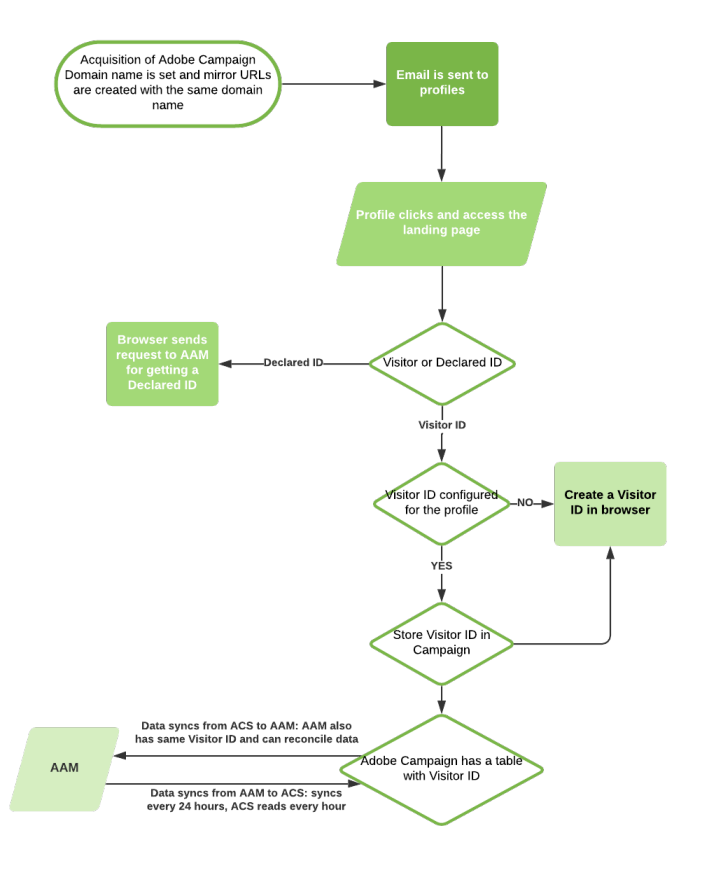

# Campaign と Audience Manager または People コアサービスの統合について{#about-campaign-audience-manager-or-people-core-service-integration}

>[!CAUTION]
>
>交換されたデータによっては、Adobe Campaignでのオーディエンスの読み込みに法的な制限が適用される場合があります。

Adobe Campaignを使用すると、様々なAdobe Experience Cloud アプリケーションとオーディエンス/セグメントを交換して共有できます。 **Adobe Campaign** を **People コアサービス**（**Profiles &amp; Audiences コアサービス**&#x200B;とも呼ばれます）または Adobe Audience Manager と統合すると、次のことが可能になります。

* 様々なAdobe Experience Cloud ソリューションからAdobe Campaignにオーディエンス/セグメントを読み込みます。 Adobe Campaignの&#x200B;**[!UICONTROL Audiences]** メニューからオーディエンスを読み込むことができます。
* オーディエンスを共有オーディエンス/セグメントとして書き出します。 これらのオーディエンスは、お使いの他の Adobe Experience Cloud ソリューションで使用できます。 オーディエンスは、**[!UICONTROL Save audience]** アクティビティを使用して、ワークフロー内のアクティビティをターゲティングした後に書き出すことができます。

統合では、次の2種類のAdobe Experience Cloud IDをサポートしています。

* **訪問者ID**：この種類のIDを使用すると、Adobe Experience Cloudの訪問者とAdobe Campaign プロファイルを紐付けることができます。 Adobe IMSを介した接続が有効になると、Marketing Cloud Visitor ID サービスが有効になり、Adobe Campaignで使用される永続的なCookieに置き換わります。 これにより、訪問者を特定してプロファイルにリンクできます。
   Adobe Campaignを介して送信された電子メールでプロファイルがクリックすると、訪問者IDがプロファイルにリンクされます。
   * プロファイルに既に訪問者IDがある場合、プロファイルのブラウザーデータを使用すると、Adobe Campaignはプロファイルを復元し、訪問者IDに自動的にリンクできます。
   * 訪問者IDが見つからない場合は、新しいIDが作成されます。 この訪問者IDは、プロファイルトラッキングログに保存されます。

  この ID は、他の Adobe Marketing Cloud アプリケーションに同じ CNAME で認識されます。

* **宣言されたID**：この種類のIDを使用すると、任意の種類のデータをAdobe Campaign データベースの要素と照合できます。 Adobe Campaign では、事前定義された紐付けキーとして示されます。 データを交換する場合、Adobe Campaign データベース IDはハッシュ化されます。 これらのハッシュ化された ID は、インポートまたはエクスポートに含まれる Adobe Marketing Cloud オーディエンスのハッシュ化された ID と比較されます。
   この統合では、通常の宣言されたID、ハッシュ化された宣言されたID、暗号化された宣言されたIDがサポートされています。

  >[!NOTE]
  >
  >宣言済み ID データソースも People コアサービス統合で使用できるようになりました。
  >
  >People コアサービス統合を使用していて、Audience Manager 統合を追加する場合は、Adobe Audience Manager コンテキストでこの宣言済み ID データソースに移行する際に収集された ID 同期がすべて失われないように、Adobe Audience Manager コンサルタントの支援が必要です。

  暗号化を使用すると、暗号化アルゴリズムを指定して、宣言されたIDを使用して、暗号化されたデータをデータソース（PIIなど）で共有できます。

  例えば、暗号化された電子メールアドレスやSMS番号を復号できる機能を使用すると、Adobe Campaign データベースにプロファイルが存在しない場合でも、トリガーメッセージをユーザーに送信できます。

次の図は、この統合の仕組みについて詳しく説明しています。 ここで、AAMはAdobe Audience Managerを、ACSはAdobe Campaign Standardを表します。

