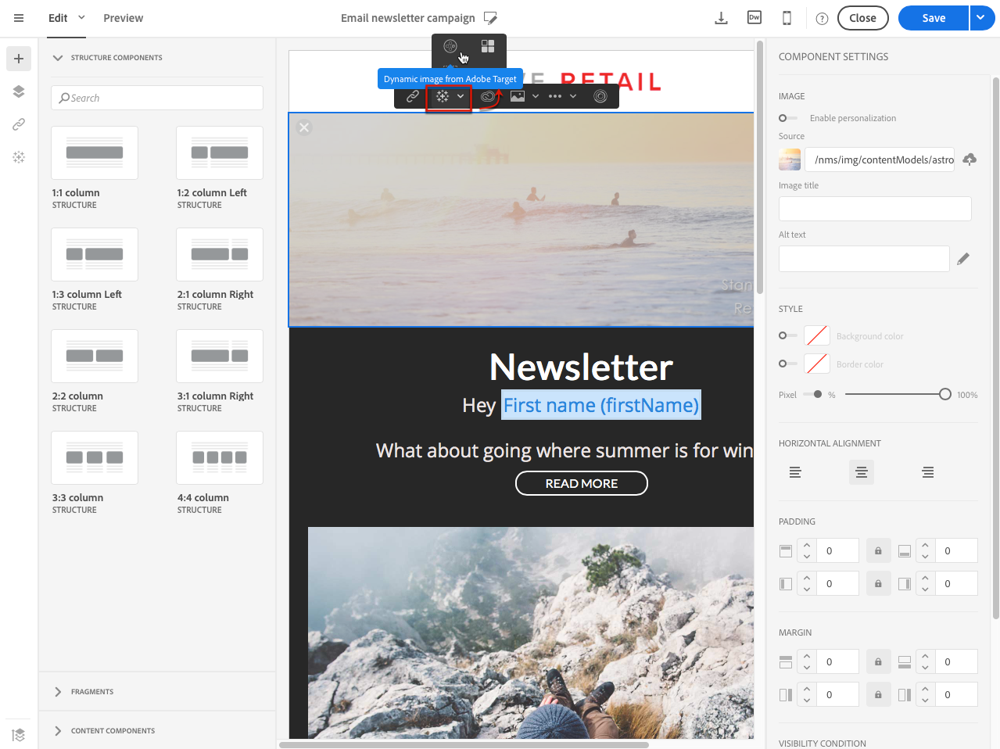
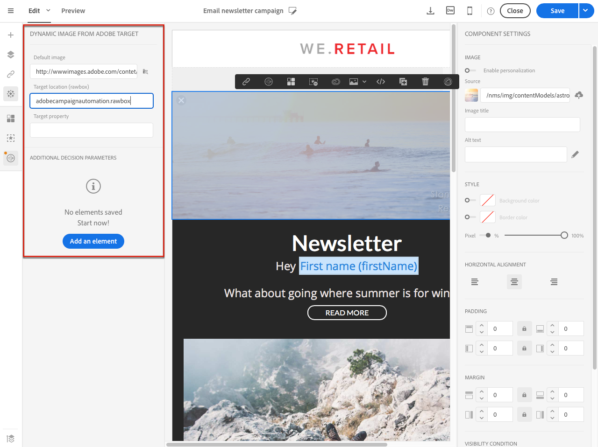

# Target の動的コンテンツの追加{#adding-target-dynamic-content}

Adobe Targetとの連携により、動的画像を配信に追加し、エクスペリエンスに応じてコンテンツをパーソナライズできます。

メールの編集中に、受信者によって異なるAdobe Targetの動的画像を挿入できます。

Adobe Campaignで画像にアクセスする前に、まずAdobe Targetで次の作業を行う必要があります。

* 1つまたは複数の[&#x200B; リダイレクトオファー](https://experienceleague.adobe.com/docs/target/using/experiences/offers/offer-redirect.html?lang=ja)を作成し、使用する画像のURLを指定する必要があります。
* 1 つ以上の[オーディエンス](https://experienceleague.adobe.com/docs/target/using/audiences/create-audiences/audiences.html?lang=ja)を作成します。アクティビティのターゲットをそこで定義します。
* [&#x200B; フォームベースのエクスペリエンスコンポーザー](https://experienceleague.adobe.com/docs/target/using/experiences/form-experience-composer.html?lang=ja) アクティビティを作成します。このアクティビティでは、作成されたリダイレクトオファーの数に応じて、レイボックスを選択し、複数のエクスペリエンスを指定する必要があります。 エクスペリエンスごとに、作成したリダイレクトオファーのいずれかを選択する必要があります。
* Adobe Campaignの情報を使用してセグメントを作成し、エクスペリエンスを特定できます。 オファーの選択ルールで Adobe Campaign からのデータを使用するには、Adobe Target のローボックスでデータを指定する必要があります。

1. メール配信を作成します。
1. メールまたはランディングページのコンテンツを編集する際に、画像ブロックに移動し、コンテキストメニューから「**[!UICONTROL Dynamic image from Adobe Target]**」を選択します。

   

1. メールにデフォルトで表示される画像を選択します。 画像URLを直接指定するか、[Assets](../../integrating/using/working-with-campaign-and-assets-core-service.md)を介して共有される画像を選択できます。

   この統合では、静的画像のみをサポートします。 残りのコンテンツはカスタマイズできません。

1. Adobe Target で指定したローボックス名を入力します。
1. Adobe Target の設定で Enterprise 権限を使用している場合は、対応するプロパティをこのフィールドに追加します。 Target の Enterprise 権限について詳しくは、[このページ](https://experienceleague.adobe.com/docs/target/using/administer/manage-users/enterprise/properties-overview.html?lang=ja)を参照してください。 このフィールドはオプションであり、Target で Enterprise 権限を使用しない場合は必要ありません。
1. **[!UICONTROL Additional decision parameters]**&#x200B;で、Adobe Target セグメントで定義されたフィールドとAdobe Campaign フィールドのマッピングを指定します。

   使用する Adobe Campaign フィールドは、rawbox で指定されている必要があります。 この例では、受信者の性別に応じて異なるエクスペリエンスを定義します。

   

1. 電子メールをプレビューして、別のプロファイルを選択する際に、Adobe Target アクティビティおよびAdobe Campaignで指定されたパラメーターに応じて、挿入された画像が変化するかどうかを確認します。

これで、動的画像を含む配信を送信できるようになります。 その結果はAdobe Targetで見つけることができます。

**関連トピック：**

* [Adobe Target Portal](https://experienceleague.adobe.com/docs/target/using/integrate/campaign-and-target.html?lang=ja)
* [メールコンテンツデザインについて](../../designing/using/designing-content-in-adobe-campaign.md)
* [&#x200B; リアルタイムでメール画像をパーソナライズ &#x200B;](https://helpx.adobe.com/marketing-cloud/how-to/email-marketing.html)動画
