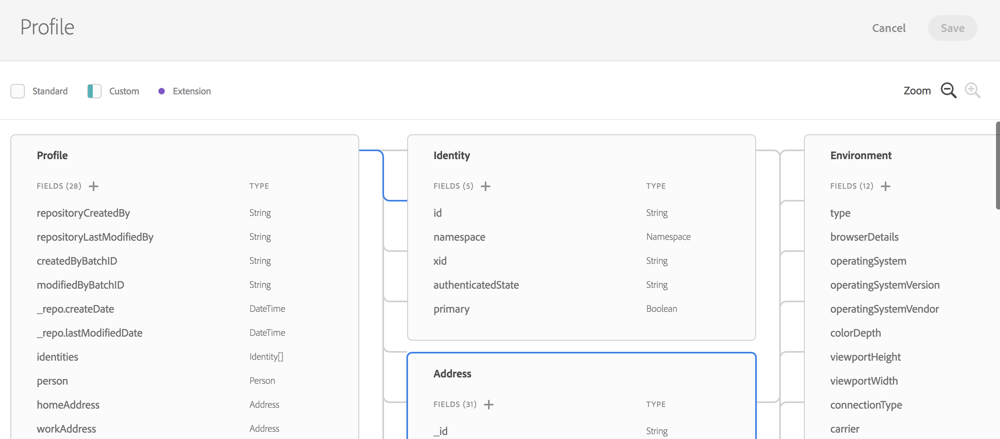

# Experience Data Modelの概要 {#experience-data-model-overview}

>[!IMPORTANT]
>
>Adobe Experience Platform Data Connectorは現在ベータ版で、予告なく頻繁に更新される可能性があります。 これらの機能にアクセスするには、Azure（現在は北米のみベータ版）でホスティングされている必要があります。 アクセスをご希望の場合は、Adobe カスタマーケアにお問い合わせください。

Experience Data Model （XDM）は、Adobe Experience Platformのソリューションや製品で使用するためにデータを取り込む可能性のある、データスキーマの標準セットです。

XDM スキーマの作成と管理は、専用APIまたはXDM ユーザーインターフェイスを使用して行うことができます。

## XDM Workspace {#xdm-workspace}

XDM Workspaceでは、データスキーマを表示、作成、拡張することができます。

XDM ユーザーインターフェイスにアクセスするには、Adobe Experience Platformを開きます。 データモデルウィンドウに移動して、XDM スキーマを作成または拡張します。

[XDM Workspaceの完全なドキュメント ](https://experienceleague.adobe.com/docs/experience-platform/xdm/api/getting-started.html)を参照してください。

## XDM API {#xdm-api}

XDM スキーマ APIを使用して、次のアクションを実行できます。

* 既存のスキーマのリストの表示
* 特定のスキーマの表示既存のスキーマの拡張
* 拡張機能へのフィールドの追加
* 新しいスキーマの作成と更新
* スキーマ記述子の表示
* スキーマ記述子の作成、更新、削除

API呼び出しを操作するための詳細については、[開発者ガイド ](https://experienceleague.adobe.com/docs/experience-platform/xdm/api/getting-started.html)を参照してください。
