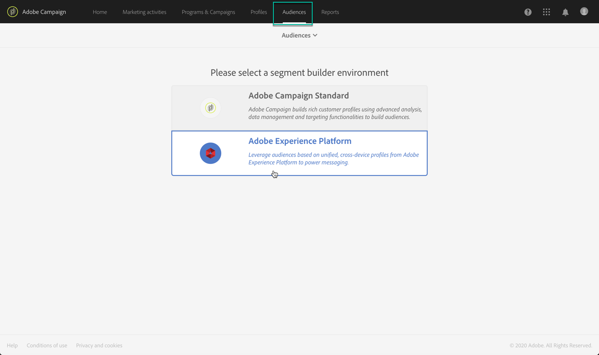
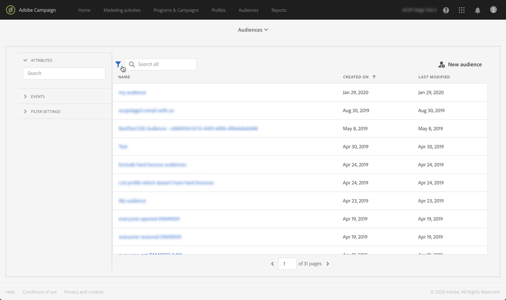
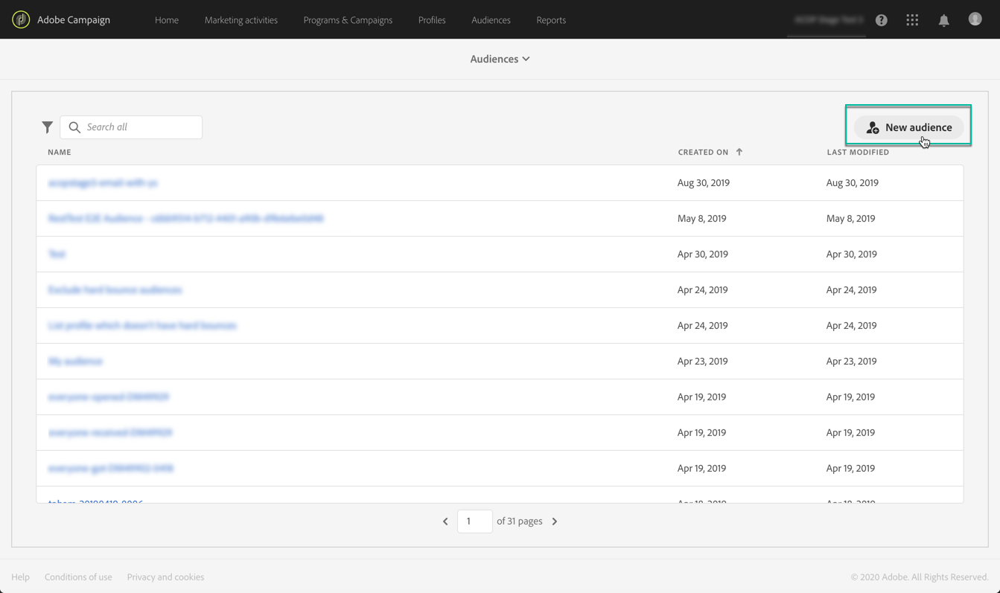
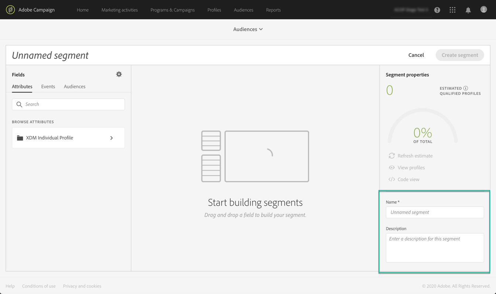
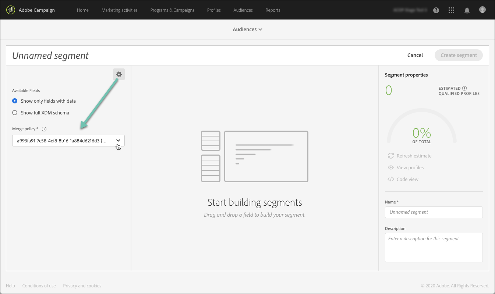
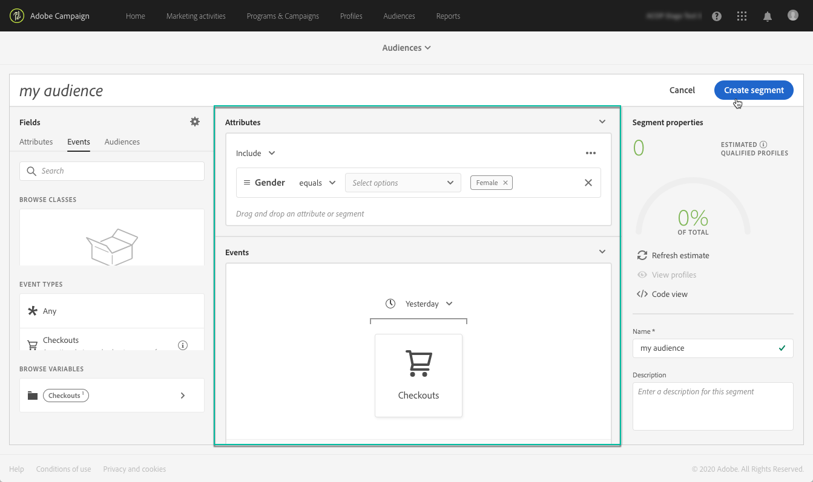
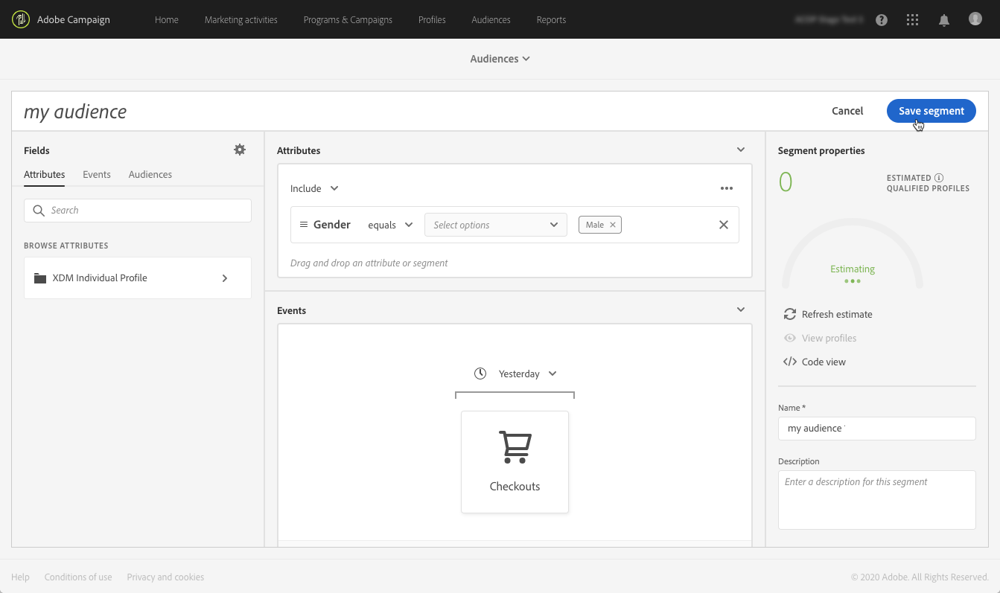

# Adobe Experience Platform オーディエンスの管理 {#about-audiences}

>[!IMPORTANT]
>
>Audience Destinations Serviceは現在ベータ版で、予告なく頻繁に更新される可能性があります。 これらの機能にアクセスするには、Azure（現在は北米のみベータ版）でホスティングされている必要があります。 アクセスをご希望の場合は、Adobe カスタマーケアにお問い合わせください。

## Adobe Experience Platformオーディエンスへのアクセス

Adobe Experience Platform セグメントビルダーにアクセスするには、Campaign Standard ホームページの&#x200B;**[!UICONTROL Audiences]** カード（またはヘッダーの&#x200B;**[!UICONTROL Audiences]** リンク）に移動し、**[!UICONTROL Adobe Experience Platform]**&#x200B;環境を選択します。

最初にAdobe Experience Platform セグメントリストページに移動します。このページでは、既存のAdobe Experience Platform セグメントにアクセスして、さらに編集することができます。

目的のAdobe Experience Platform セグメントを見つけるのに役立つ検索バーとフィルターを使用できます。

## Adobe Experience Platform オーディエンスの作成

Campaign StandardでAdobe Experience Platform オーディエンスを直接作成するには、次の手順に従います。

1. Adobe Experience Platform セグメントリストページで、右隅にある「**[!UICONTROL New audience]**」ボタンをクリックします。

   

1. セグメントビルダーがワークスペースに表示されます。 Adobe Experience Platformのデータを使用してセグメントを構築し、オーディエンスの構築に活用できます。

1. 右側のペインでセグメントに名前を付け、説明を入力します（オプション）。

   

1. セグメントを正常に作成するには、このセグメントのマーケティング目的に一致する&#x200B;**結合ポリシー**&#x200B;を選択する必要があります。

   設定ペインで、Platformのデフォルトの結合ポリシーが選択されます。 結合ポリシーについて詳しくは、[&#x200B; セグメントビルダーユーザーガイド &#x200B;](https://experienceleague.adobe.com/docs/experience-platform/segmentation/ui/overview.html)の専用セクションを参照してください。

   

1. オーディエンスで取得するプロファイルを識別するルールを定義します。

   これを行うには、左側のペインから目的の属性やイベントをワークスペースにドラッグし、対応するルールを定義してから&#x200B;**[!UICONTROL Create segment]** ボタンをクリックしてセグメントを保存します（[&#x200B; セグメントビルダーの使用](../../integrating/using/aep-using-segment-builder.md)を参照）。

   

オーディエンスをアクティブ化する準備が整ったので、キャンペーンのターゲットとして使用できます（[Adobe Experience Platform オーディエンスのターゲティング &#x200B;](../../integrating/using/aep-targeting-audiences.md)を参照）。

## オーディエンスの編集

オーディエンスを編集するには、オーディエンスを開き、セグメントビルダーインターフェイス内で必要に応じてルールを変更します（[&#x200B; セグメントビルダーの使用](../../integrating/using/aep-using-segment-builder.md)を参照）。

変更が完了したら、**[!UICONTROL Save segment]** ボタンをクリックしてオーディエンスを更新します。

