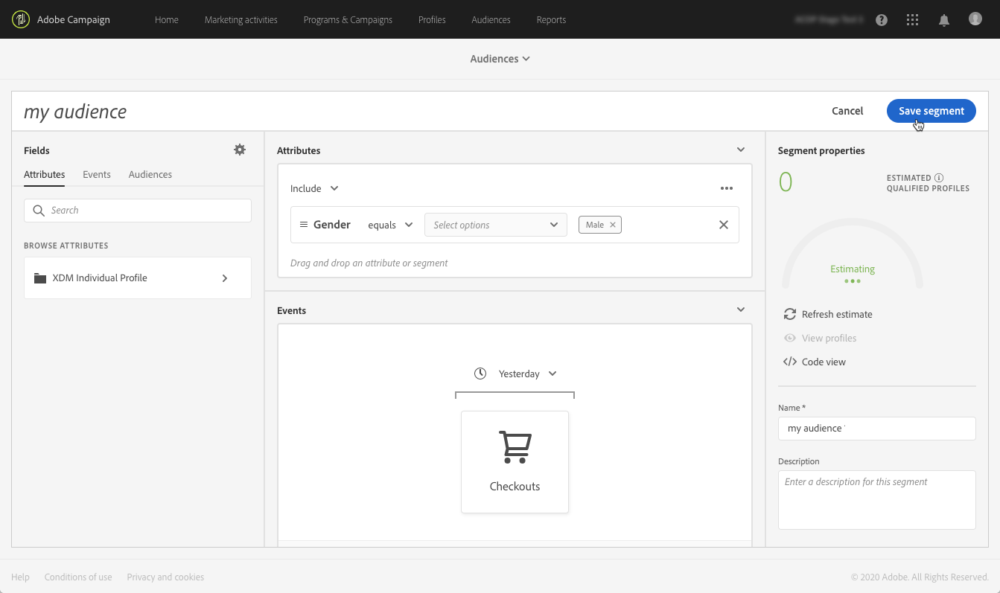

# Adobe Experience Platform オーディエンスの管理 {#about-audiences}

>[!IMPORTANT]
>
>オーディエンス宛先サービスは現在ベータ版で、予告なく頻繁に更新される場合があります。 これらの機能にアクセスするには、お客様はAzureでホストされる必要があります（現在、北米向けベータ版のみ）。 ご利用になる場合は、Adobeカスタマーケアにお問い合わせください。

## Adobe Experience Platformオーディエンスへのアクセス

Adobe Experience Platformセグメントビルダーにアクセスするには、Campaign Standardホームページの&#x200B;**[!UICONTROL Audiences]**&#x200B;カード（またはヘッダーの&#x200B;**[!UICONTROL Audiences]**&#x200B;リンク）に移動し、**[!UICONTROL Adobe Experience Platform]**&#x200B;環境を選択します。

最初に、Adobe Experience Platformセグメントリストページが表示されます。このページでは、既存のAdobe Experience Platformセグメントにアクセスして、さらに編集できます。

目的のAdobe Experience Platformセグメントを見つけるのに役立つ検索バーとフィルターが用意されています。

## Adobe Experience Platformオーディエンスの作成

Campaign Standardで直接Adobe Experience Platformオーディエンスを作成するには、次の手順に従います。

1. Adobe Experience Platformセグメントリストページで、右隅にある&#x200B;**[!UICONTROL New audience]**&#x200B;ボタンをクリックします。

   

1. セグメントビルダーがワークスペースに表示されます。 これにより、最終的にオーディエンスの作成に使用されるAdobe Experience Platformのデータを使用してセグメントを作成できます。

1. 右側のパネルでセグメントに名前を付け、説明を入力します（オプション）。

   

1. セグメントを正しく作成するには、このセグメントのマーケティング目的に合った&#x200B;**マージポリシー**&#x200B;を選択する必要があります。

   設定ウィンドウで、「Platform default merge policy」が選択されます。 結合ポリシーの詳細については、[セグメントビルダーユーザーガイド](https://docs.adobe.com/content/help/en/experience-platform/segmentation/ui/overview.html)の専用の節を参照してください。

   

1. オーディエンスで取得するプロファイルを識別するルールを定義します。

   これを行うには、目的の属性やイベントを左側のペインからワークスペースにドラッグし、対応するルールを定義してから&#x200B;**[!UICONTROL Create segment]**&#x200B;ボタンをクリックしてセグメントを保存します（「[セグメントビルダーの使用](../../integrating/using/aep-using-segment-builder.md)」を参照）。

   

オーディエンスをアクティベートする準備ができました。キャンペーンのターゲットとして使用できます(「[Adobe Experience Platformオーディエンスのターゲット設定](../../integrating/using/aep-targeting-audiences.md)」を参照)。

## オーディエンスの編集

オーディエンスを編集するには、画像を開き、セグメントビルダーインターフェイス内で必要に応じてルールを変更します（「[セグメントビルダーの使用](../../integrating/using/aep-using-segment-builder.md)」を参照）。

変更が完了したら、**[!UICONTROL Save segment]**&#x200B;ボタンをクリックしてオーディエンスを更新します。

