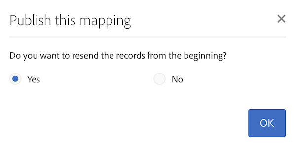
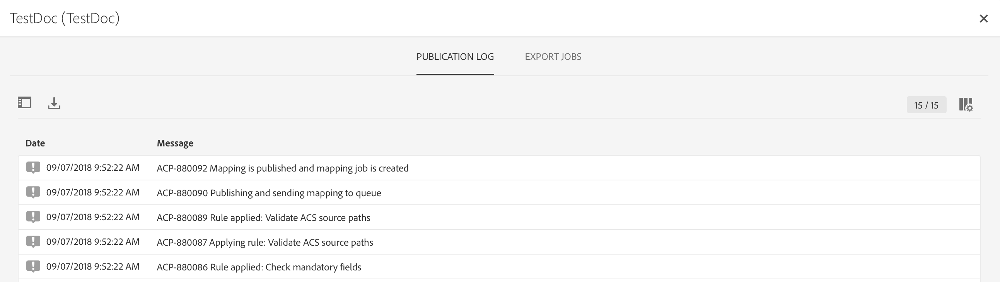
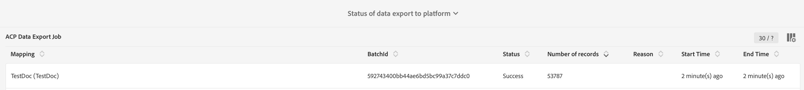
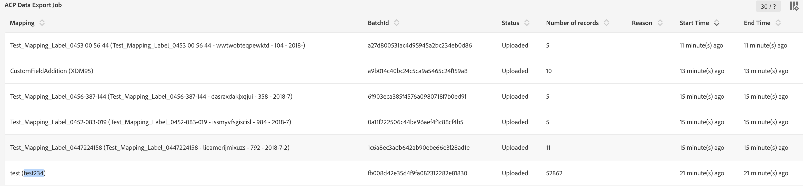
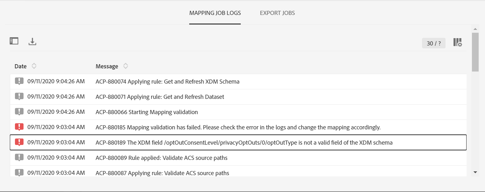
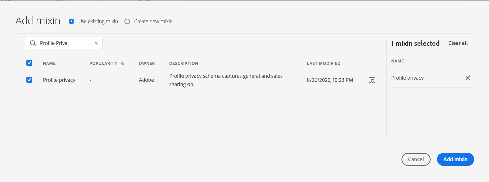
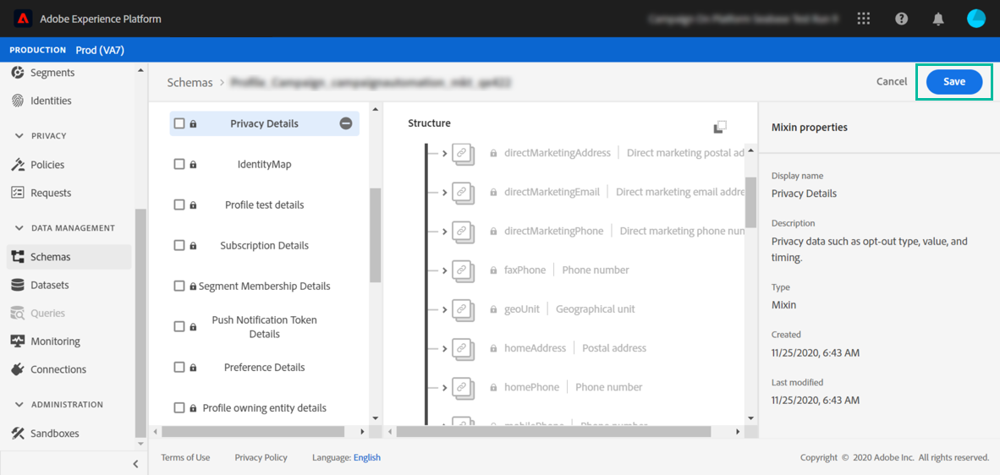

# マッピングのアクティベーション {#mapping-activation}

>[!IMPORTANT]
>
>Adobe Experience Platform Data Connectorは現在ベータ版で、予告なく頻繁に更新される可能性があります。 これらの機能にアクセスするには、Azure（現在は北米のみベータ版）でホスティングされている必要があります。 アクセスをご希望の場合は、Adobe カスタマーケアにお問い合わせください。

マッピング定義が完了したら、マッピングを公開できます。 デプロイメント手順の後、Campaign StandardとAdobe Experience Platform間のデータレプリケーションが自動的に開始されます。 いつでも、**[!UICONTROL Stop]** ボタンをクリックしてレプリケーションを停止できます。

マッピングの変更に応じて、すべてのレコードをAdobe Experience Platformに再送信できます。

デプロイメントタイルから、公開ログにアクセスし、ログを書き出すことができます。

「**[!UICONTROL Export jobs]**」タブでは、公開されたマッピングの書き出しジョブを監視できます。

すべてのデータ書き出しジョブを監視する場合は、**[!UICONTROL Administration]** > **[!UICONTROL Development]** > **[!UICONTROL Platform]** > **[!UICONTROL Status of data export to platform]** メニューに移動します。

データ取り込みジョブのステータスは次のとおりです。

* **[!UICONTROL Created]**: データ取り込みジョブが作成され、データ取り込みが進行中です。
* **[!UICONTROL Failed]**: データ取り込みジョブが失敗しました。 「理由」フィールドには、失敗の理由が記述されます。 失敗は一時的なものでも、永続的なものでもかまいません。 一時的なエラーが発生した場合、設定された間隔の後に新しい取り込みジョブが作成されます。 トラブルシューティングの最初の手順として、ユーザーは失敗の「理由」フィールドを確認できます。 理由によってユーザーがAdobe Experience Platform UIにリダイレクトされる場合、ユーザーはAdobe Experience Platformにログインでき、データセット内のバッチステータスを確認して、エラーの理由を正確に特定できます。
* **[!UICONTROL Uploaded]**: バッチが最初にAdobe Experience Platformで作成され、データがバッチに取り込まれます。 バッチ ID フィールドには、Adobe Experience Platformのバッチのバッチ IDが表示されます。 Adobe Experience Platformでは、バッチに対して事後検証も実行します。 Adobe Experience Platformが検証後の手順を完了するまで、バッチはまずアップロード済みとしてマークされます。 アップロード後、ジョブがAdobe Experience Platformに対してバッチのステータスをポーリングし続けます。 バッチは、Adobe Experience Platformの検証後に、失敗した状態または成功した状態のいずれかになります。
* **[!UICONTROL Success]**: バッチがAdobe Experience Platformにアップロードされた後、設定された間隔の後にジョブのステータス（プラットフォームでの検証後）が確認されます。 ステータス「Success」は、Adobe Experience Platformでのデータの取り込みに成功したことを識別しました。

マッピングを公開する際に、以下の検証エラーが発生する場合があります。

これは、使用しているXDM スキーマがプライバシー管理に関連する最新のXDM フィールドで更新されておらず、非推奨の「ccpa」 XDM フィールドが含まれている場合に発生します。

XDM スキーマを更新するには、次の手順に従います。

1. XDM マッピングページにあるリンクを使用して、Adobe Experience Platformのデータセットに移動します。

1. XDM スキーマに移動します。

1. スキーマに&#x200B;**[!UICONTROL Profile Privacy]** Mixinを追加します。

   

1. スキーマを保存してから、マッピングの公開を再試行してください。 公開は今や通過するはずです。

   
