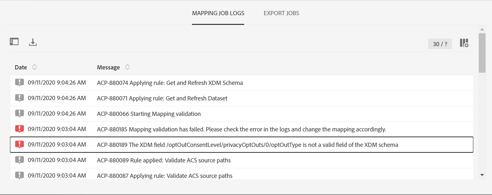

# マッピングのアクティベーション {#mapping-activation}

>[!IMPORTANT]
>
>現在、Adobe Experience Platform Data Connector はベータ版です。予告なく頻繁に更新される可能性があります。 これらの機能にアクセスするには、お客様を Azure でホストする必要があります（現在は北米向けのベータ版のみ）。 アクセスをご希望の場合は、Adobeカスタマーケアにお問い合わせください。

マッピングの定義が完了したら、マッピングを公開できます。 デプロイメントステップの後、Campaign StandardとAdobe Experience Platformの間のデータレプリケーションが自動的に開始されます。 「**[!UICONTROL Stop]**」ボタンをクリックすると、いつでもレプリケーションを停止できます。

マッピングの変更に応じて、すべてのレコードをAdobe Experience Platformに再送信することもできます。

デプロイメントタイルから、公開ログにアクセスしたり、ログを書き出したりできます。

「**[!UICONTROL Export jobs]**」タブでは、公開されたマッピングの書き出しジョブを監視できます。

すべてのデータ書き出しジョブを監視する場合は、**[!UICONTROL Administration]** / **[!UICONTROL Development]** / **[!UICONTROL Platform]** / **[!UICONTROL Status of data export to platform]** メニューに移動します。

データ取り込みジョブのステータスは次のとおりです。

* **[!UICONTROL Created]**: データ取り込みジョブが作成され、データ取り込みが進行中です。
* **[!UICONTROL Failed]**: データ取り込みジョブが失敗しました。 「理由」フィールドは、失敗の理由を説明します。 障害は一時的な場合もあれば、永続的な場合もあります。 一時的なエラーの場合は、設定した間隔の後に新しい取り込みジョブが作成されます。 トラブルシューティングの最初の手順として、エラーの理由フィールドを確認できます。 その理由でAdobe Experience Platform UI にリダイレクトされたユーザーは、Adobe Experience Platformにログインして、データセットのバッチステータスを確認することで、正確なエラー理由を判断できます。
* **[!UICONTROL Uploaded]**：最初にAdobe Experience Platformでバッチが作成され、次にデータがバッチに取り込まれます。 バッチ ID フィールドには、Adobe Experience Platformのバッチのバッチ ID が表示されます。 Adobe Experience Platformは、バッチに対しても post 検証を実行します。 バッチは、Adobe Experience Platformが検証後ステップを完了するまで、最初にアップロード済みとしてマークされます。 ジョブは、アップロード後にバッチのステータスに関してAdobe Experience Platformをポーリングし続けます。 Adobe Experience Platformでの検証後、バッチは失敗または成功状態になります。
* **[!UICONTROL Success]**：バッチがAdobe Experience Platformにアップロードされると、ジョブのステータス（Platform での検証後）が、設定された間隔の後に確認されます。 ステータス「成功」は、Adobe Experience Platformでのデータの取り込みが成功したことを識別しました。

場合によっては、マッピングを公開する際に、以下の検証エラーが発生することがあります。

この問題は、使用している XDM スキーマが、プライバシー管理に関連する最新の XDM フィールドで更新されておらず、非推奨の「ccpa」 XDM フィールドがまだ含まれている場合に発生します。

XDM スキーマを更新するには、次の手順に従います。

1. XDM マッピングページにあるリンクを使用して、Adobe Experience Platformのデータセットに移動します。

1. XDM スキーマに移動します。

1. **[!UICONTROL Profile Privacy]** Mixin をスキーマに追加します。

   

1. スキーマを保存してから、マッピングの公開を再試行してください。 これで、パブリケーションが渡されます。

   
