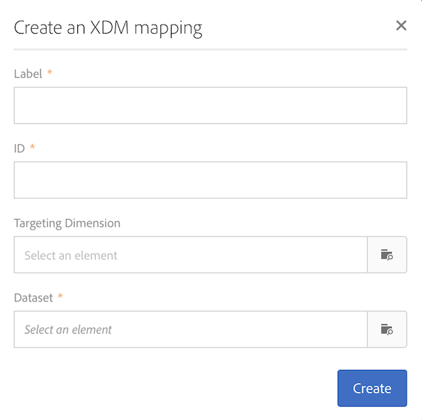
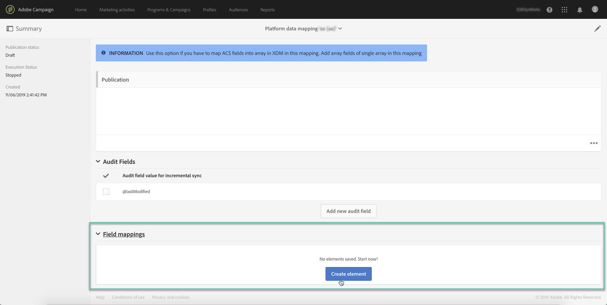
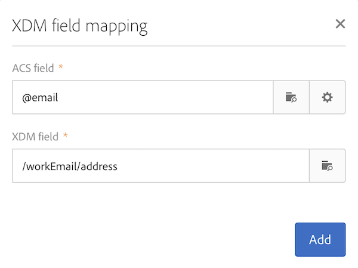
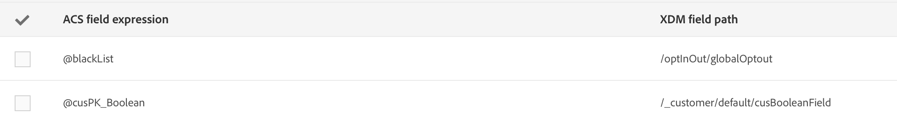
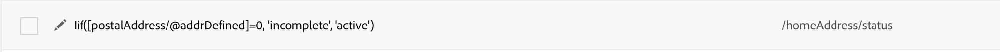
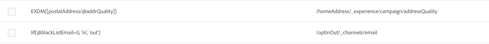
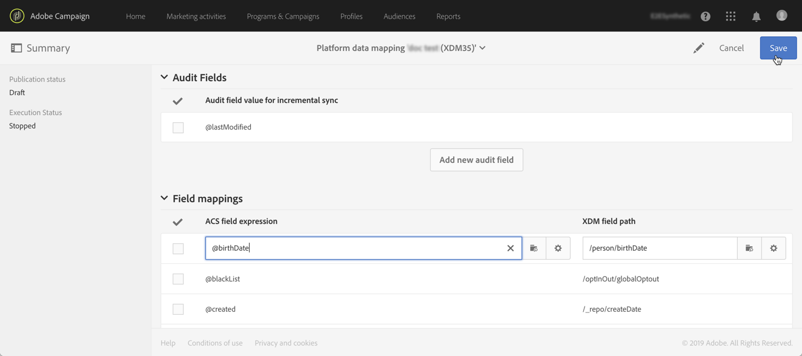

# マッピングの定義 {#mapping-definition}

>[!IMPORTANT]
>
>Adobe Experience Platform Data Connectorは現在ベータ版で、予告なく頻繁に更新される可能性があります。 これらの機能にアクセスするには、Azure（現在は北米のみベータ版）でホスティングされている必要があります。 アクセスをご希望の場合は、Adobe カスタマーケアにお問い合わせください。

この節では、Experience Data Model （XDM）フィールドを使用してCampaign Standard フィールドをマッピングする方法について説明します。

このタスクを実行するには、次の前提条件があります。

* インターフェイスを介した、またはXDMに関連付けられたREST APIを使用したXDM スキーマ定義
* xdm スキーマ定義に基づくデータセットの作成

1. **[!UICONTROL Administration]** > **[!UICONTROL Development]** > **[!UICONTROL Platform]**&#x200B;に移動し、**[!UICONTROL Data mappings]** エントリを選択します。

1. **[!UICONTROL Create]**&#x200B;をクリックして、新しいXDM マッピングを開始します。

   

1. 必須フィールドに入力し、次を選択します。

   * **ターゲティングディメンション**：これは、マッピングするCampaign Standard スキーマです
   * **データセット**：これは、Adobe Experience PlatformのXDM スキーマに関連付けられたデータパッケージです。

>[!NOTE]
>
>バッチをリアルタイム顧客プロファイルまたはID サービスに取り込むには、リアルタイム顧客プロファイル [に対してデータセットを](https://experienceleague.adobe.com/docs/experience-platform/rtcdp/intro/get-started.html?lang=ja)有効にする必要があります。
>
>選択したデータセットが既存のデータマッピングで既に使用されている場合、データがAdobe Experience Platformで上書きされる可能性があることを知らせる警告が表示されます。 これは、同じデータセットを使用するデータマッピングに共通の受信者が存在する場合に発生する可能性があります。

次の画面は、**[!UICONTROL Field mappings]** セクションを示しています。このセクションでは、Campaign Standard スキーマの各フィールドに新しいマッピングを作成できます。

**[!UICONTROL Create new field mapping]** ボタンを使用すると、XDM スキーマでCampaign Standard フィールドと対応するフィールドパス式を選択できます。

Adobe Campaign Standard フィールドが見つからない場合は、検索フィールドを使用してフィールドを検索できます。 現在、検索は、階層内で開いているフィールドに対してのみ機能します。

Campaign Standardで定義された拡張リソースは、すべてのネイティブフィールドと同様にマッピングされます。 XDMの_customer/default拡張機能で定義されます。

APIを介してXDM拡張機能をカスタマイズし、独自の拡張機能を定義することで、マッピングをより適切に制御できます。

XDM APIについて詳しくは、[Schema Registry API チュートリアル &#x200B;](https://experienceleague.adobe.com/docs/experience-platform/xdm/api/getting-started.html?lang=ja)を参照してください。

列挙フィールドをマッピングするには、式エディターを使用して、XDM値に対応する各列挙値を定義する必要があります。 例えば、postaladdressfieldは次のように定義する必要があります。

XDM値がXDM スキーマの列挙として定義されている場合は、**lif**&#x200B;構文を自動的に置き換えるネイティブ EXDM関数を使用できます。

XDM マッピングを編集するには、XDM マッピングを開き、目的の情報を変更して保存します。

>[!IMPORTANT]
>
>現時点では、**[!UICONTROL Field mappings]** セクションで値を編集し、フィールドの外側をクリックした場合、「**[!UICONTROL Save]**」ボタンをクリックするまで、変更内容はインターフェイスに表示されません。 この動作は、**[!UICONTROL Field Mappings]**&#x200B;の編集がページの最初の編集である場合にのみ発生します。
