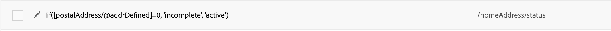

# マッピング定義 {#mapping-definition}

>[!IMPORTANT]
>
>Adobe Experience Platformデータコネクタは現在ベータ版で、予告なく頻繁に更新される可能性があります。 これらの機能にアクセスするには、お客様はAzureでホストされる必要があります（現在、北米向けベータ版のみ）。 ご利用になる場合は、Adobeカスタマーケアにお問い合わせください。

この節では、エクスペリエンスデータモデル(XDM)フィールドを使用してCampaign Standardフィールドをマッピングする方法を見つけます。

このタスクを実行するための前提条件は次のとおりです。

* インターフェイスを介した、またはXDMに関連付けられたREST APIを使用したXDMスキーマ定義
* XDMスキーマ定義に基づくデータセットの作成

1. **[!UICONTROL Administration]** > **[!UICONTROL Development]** > **[!UICONTROL Platform]**&#x200B;に移動し、**[!UICONTROL Data mappings]**&#x200B;エントリを選択します。

1. **[!UICONTROL Create]**&#x200B;をクリックして、新しいXDMマッピングを開始します。

   

1. 必須フィールドに入力し、次を選択します。

   * **ターゲティングディメンション**:これは、マッピングするCampaign Standardスキーマです
   * **データセット**:これはAdobe Experience PlatformのXDMスキーマに関連するデータパッケージです。

>[!NOTE]
>
>バッチをリアルタイム顧客プロファイルまたはIDサービスに取り込むには、データセットを[リアルタイム顧客プロファイル](https://docs.adobe.com/content/help/en/experience-platform/rtcdp/intro/get-started.html)に対して有効にする必要があります。
>
>選択したデータセットが既に既存のデータマッピングで使用されている場合は、Adobe Experience Platformでデータが上書きされる可能性があることを知らせる警告が表示されます。 これは、同じデータセットを使用するデータマッピングに一般的な受信者がある場合に発生する可能性があります。

次の画面は、Campaign Standardスキーマの各フィールドに新しいマッピングを作成できる&#x200B;**[!UICONTROL Field mappings]**&#x200B;セクションを示しています。

**[!UICONTROL Create new field mapping]**&#x200B;ボタンを押すと、XDMスキーマでCampaign Standardフィールドと対応するフィールドパス式ーを選択できます。

Adobe Campaign Standardフィールドが見つからない場合は、検索フィールドを使用してフィールドを検索できます。 現在、検索は、階層で開いているフィールドに対してのみ機能します。

Campaign Standardで定義された拡張リソースは、すべてのネイティブフィールドに「いいね！」されます。 XDMの_customer/default拡張子に定義されます。

APIを使用してXDM拡張機能をカスタマイズし、独自の拡張機能を定義すると、マッピングをより詳細に制御できます。

XDM APIについて詳しくは、[スキーマレジストリAPIチュートリアル](https://docs.adobe.com/content/help/ja-JP/experience-platform/xdm/api/getting-started.html)を参照してください。

定義済みリストフィールドをマッピングするには、式エディタを使用して、XDM値に対応する各定義済みリスト値を定義する必要があります。 例えば、postalAdressfieldを次のように定義する必要があります。

XDM値がXDMスキーマの定義済みリストとして定義されている場合は、**lif**&#x200B;構文を自動的に置き換えるネイティブのEXDM関数を使用できます。

XDMマッピングを編集するには、XDMマッピングを開き、必要な情報を変更して保存します。

>[!IMPORTANT]
>
>現時点では、**[!UICONTROL Field mappings]**&#x200B;セクションで値を編集し、フィールドの外側をクリックした場合、**[!UICONTROL Save]**&#x200B;ボタンをクリックするまで変更はインターフェイスに表示されません。 この動作は、**[!UICONTROL Field Mappings]**&#x200B;の編集がページ上の最初の編集である場合に1回だけ発生します。
