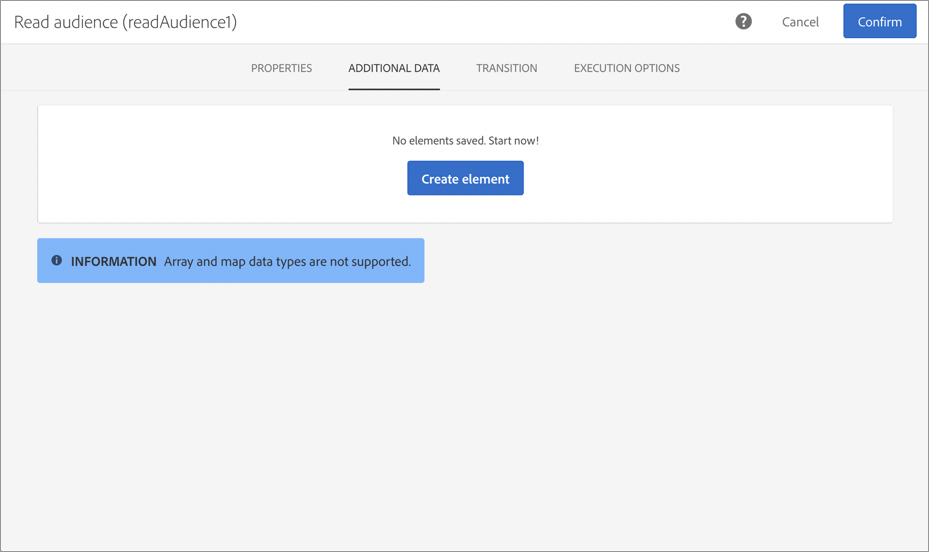
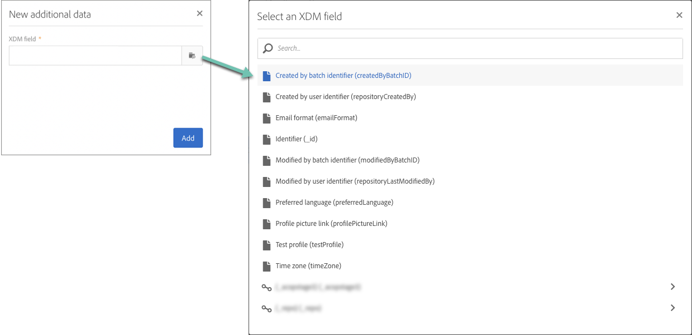
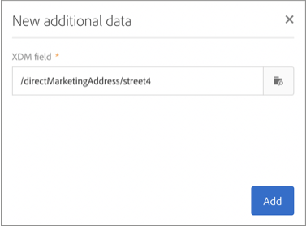

# Adobe Experience Platform 属性を使用したキャンペーンのパーソナライズ {#personalizing-campaigns-using-aep-attributes}

>[!IMPORTANT]
>
>Audience Destinations サービスは現在ベータ版で、予告なく頻繁に更新される可能性があります。 これらの機能にアクセスするには、Azure（現在は北米のみベータ版）でホスティングされている必要があります。 アクセスをご希望の場合は、Adobe カスタマーケアにお問い合わせください。
>
>**プッシュ**&#x200B;および&#x200B;**アプリ内** チャネルは、Adobe Experience Platformのコンテキストデータを使用したパーソナライゼーションにまだ利用できません。

ワークフローを[Adobe Experience Platform オーディエンス ](../../integrating/using/aep-about-audience-destinations-service.md)で設定したら、Experience Data Model （XDM）にのみ存在するプロファイル属性を使用してメッセージをパーソナライズできます。

これを行うには、次の属性を&#x200B;**[!UICONTROL Read audience]** アクティビティに追加する必要があります。

1. **[!UICONTROL Read audience]** アクティビティを開きます。 「**[!UICONTROL Additional data]**」タブで、「**[!UICONTROL Create element]**」ボタンをクリックします。

   「**[!UICONTROL Additional data]**」タブは、Adobe Experience Platform オーディエンスが選択された後にのみ使用できます。

   

   >[!NOTE]
   >
   >配列とマップのデータタイプは、この機能ではサポートされていません。 また、結合スキーマのデータのみがピッカーに表示されます。

1. リストから目的のXDM フィールドを選択し、**[!UICONTROL Confirm]**&#x200B;をクリックします。

   

1. 「**[!UICONTROL Add]**」ボタンをクリックして、追加データのリストに追加します。

   

1. ワークフローに追加するXDM フィールドごとに、これらの手順を繰り返します。

   >[!NOTE]
   >
   >**[!UICONTROL Read audience]** アクティビティには、最大20個のXDM フィールドを追加できます。

1. すべてのフィールドが追加されたら、**[!UICONTROL Confirm]** ボタンをクリックして変更を保存します。 これで、配信をパーソナライズできるようになります。

配信を作成およびパーソナライズする方法について詳しくは、Campaign Standardのドキュメントを参照してください。

* [コミュニケーションチャネルの発見](../../channels/using/get-started-communication-channels.md)
* [チャネルアクティビティについて](../../automating/using/about-channel-activities.md)
* [配信のパーソナライゼーション](../../designing/using/personalization.md)
