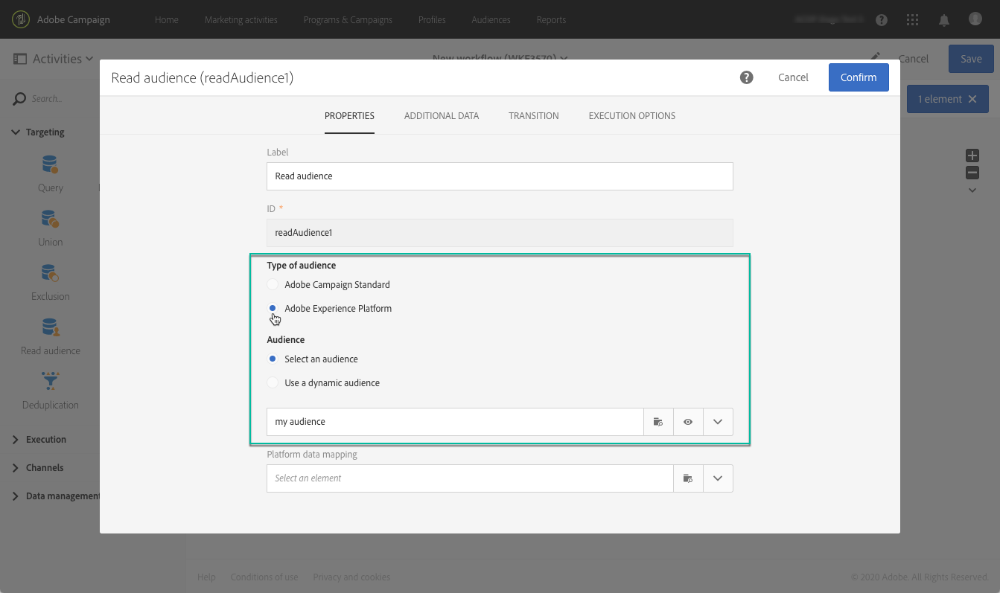
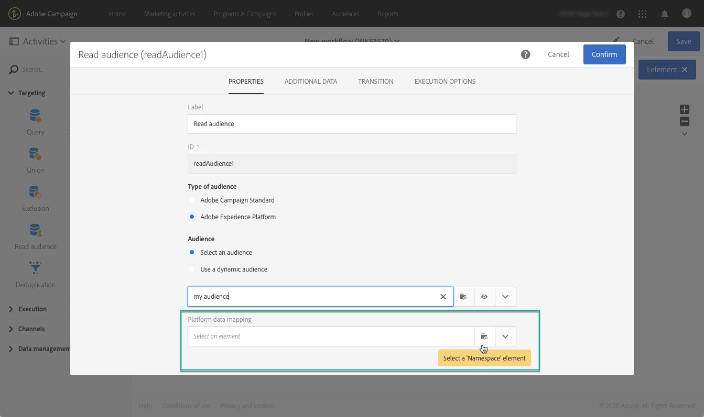
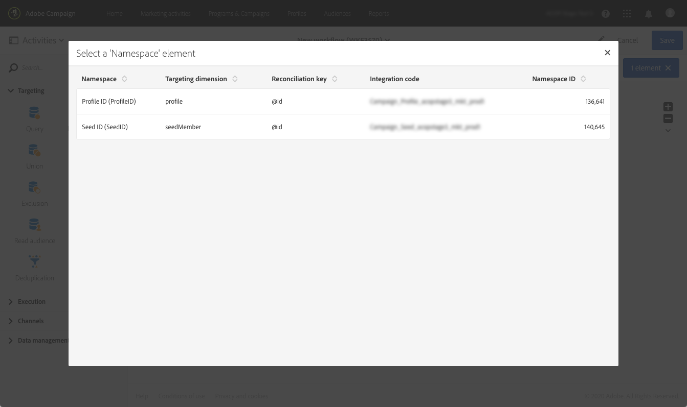
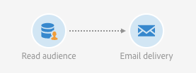

# Adobe Experience Platform オーディエンスのターゲティング {#targeting-aep-audiences}

>[!IMPORTANT]
>
>Audience Destinations サービスは現在ベータ版で、予告なく頻繁に更新される可能性があります。 これらの機能にアクセスするには、Azure（現在は北米のみベータ版）でホスティングされている必要があります。 アクセスをご希望の場合は、Adobe カスタマーケアにお問い合わせください。

セグメントビルダーを使用して[Adobe Experience Platform オーディエンス ](../../integrating/using/aep-about-audience-destinations-service.md)を作成したら、ワークフロー内のCampaign オーディエンスと同じ方法でメッセージをパーソナライズして送信できます。

ワークフローにAdobe Experience Platform オーディエンスをアクティベートするには、次の手順に従います。

1. ワークフローに&#x200B;**[!UICONTROL Read audience]** アクティビティを追加してから開きます。

1. **[!UICONTROL Adobe Experience Platform]**&#x200B;の下の&#x200B;**[!UICONTROL Type of audience]** オプションを選択し、目的のオーディエンスを追加します。

   

1. （オプション）オーディエンスを選択したら、目のボタンをクリックしてセグメント定義を確認したり、編集したりできます（必ず変更を再度保存してください）。

   目のボタンをクリックすると、Campaign内で選択したオーディエンスに関連付けられている（別のタブの）セグメントビルダーに移動します。

1. **[!UICONTROL Platform data mapping]**&#x200B;要素を選択して、選択したAdobe Experience Platform オーディエンスの目的のターゲティングディメンションを指定します。

   デフォルトでは、紐付けに使用されるプライマリキー（プロファイルテーブルのiRecipientID、AppSubscription テーブルのiAppSubscriptionIDなど）は、ドロップダウンリストから自動的に使用できます。 プライマリキー以外をターゲットにするには、カスタム **名前空間**&#x200B;を作成する必要があります。

   >[!NOTE]
   >
   >プライマリキー以外のターゲットの場合は、カスタム名前空間に対応するカスタムターゲットマッピングも作成する必要があります。 ターゲットマッピングについて詳しくは、[この節](../../administration/using/target-mappings-in-campaign.md)を参照してください。

   

   このリストには、インスタンスで設定されたすべてのExperience Data Model （XDM）マッピングが含まれます。 Adobe Experience Platform Data Connectorについて詳しくは、[この専用ドキュメント ](../../integrating/using/aep-about-data-connector.md)を参照してください。

   

1. オーディエンスとターゲティングディメンションが適切に設定されたら、**[!UICONTROL Confirm]** ボタンをクリックして変更を保存します。

他のアクティビティでワークフローを設定できるようになりました。 例えば、**[!UICONTROL Email delivery]** アクティビティをリンクして、選択したオーディエンスに電子メールを送信できます。

>[!NOTE]
>
>Campaign Standardを使用すると、電子メール、SMS メッセージ、ダイレクトメールメッセージ、プッシュ通知、アプリ内メッセージなど、あらゆる配信チャネル内でAdobe Experience Platform オーディエンスをターゲットにすることができます。
>
>* 注：すべてのプッシュおよびアプリ内メッセージについて、Campaign Standardは既知のプロファイルに対してのみ配信をサポートします。

ワークフローと配信の使用方法について詳しくは、次の節を参照してください。

* [ワークフローの発見](../../automating/using/get-started-workflows.md)
* [ワークフローの作成](../../automating/using/building-a-workflow.md)
* [コミュニケーションチャネルの発見](../../channels/using/get-started-communication-channels.md)
* [チャネルアクティビティについて](../../automating/using/about-channel-activities.md)
