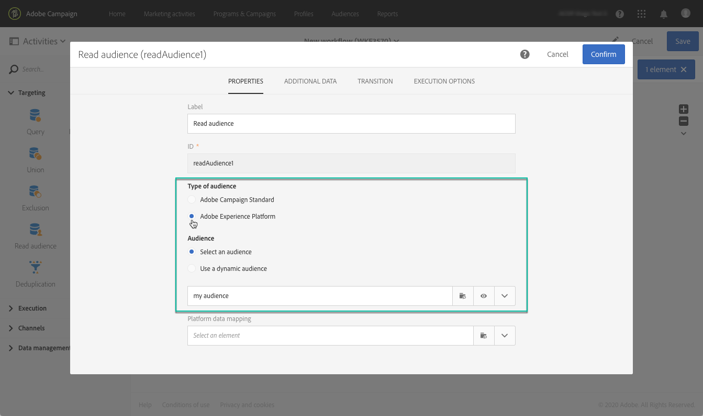

# Adobe Experience Platform オーディエンスのターゲティング {#targeting-aep-audiences}

>[!IMPORTANT]
>
>オーディエンス宛先サービスは現在ベータ版で、予告なく頻繁に更新される可能性があります。 これらの機能にアクセスするには、お客様はAzureでホストされる必要があります（現在、北米向けベータ版のみ）。 ご利用になる場合は、Adobeカスタマーケアにお問い合わせください。

セグメントビルダーを使用して[Adobe Experience Platformオーディエンス](../../integrating/using/aep-about-audience-destinations-service.md)を作成したら、ワークフロー内のキャンペーンオーディエンスと同じ方法でメッセージをパーソナライズし、送信できます。

ワークフローでAdobe Experience Platformオーディエンスをアクティブ化するには、次の手順に従います。

1. ワークフロー追加の&#x200B;**[!UICONTROL Read audience]**&#x200B;アクティビティを開きます。

1. **[!UICONTROL Type of audience]**&#x200B;の下の&#x200B;**[!UICONTROL Adobe Experience Platform]**&#x200B;オプションを選択し、必要なオーディエンスを追加します。

   

1. （オプション）オーディエンスを選択したら、目のボタンをクリックして、セグメント定義を確認または編集できます（変更を再度保存してください）。

   目のボタンをクリックすると、キャンペーン内で選択したオーディエンスに関連付けられたセグメントビルダー（別のタブ）に移動します。

1. **[!UICONTROL Platform data mapping]**&#x200B;要素を選択し、選択したAdobe Experience Platformオーディエンスに必要なターゲティングディメンションを指定します。

   デフォルトでは、調整に使用される主キー(プロファイルテーブルのiRecipientID、AppSubscriptionテーブルのiAppSubscriptionIDなど)は、ドロップダウンリストから自動的に使用できます。 主キー以外のターゲットを行うには、カスタム&#x200B;**名前空間**&#x200B;を作成する必要があります。

   >[!NOTE]
   >
   >主キー以外のターゲットの場合は、カスタム名前空間に対応するカスタムターゲットマッピングも作成する必要があります。 ターゲットマッピングの詳細については、[この](../../administration/using/target-mappings-in-campaign.md)を参照してください。

   

   このリストには、インスタンスに設定されたすべてのエクスペリエンスデータモデル(XDM)マッピングが含まれています。 Adobe Experience PlatformのData Connectorについて詳しくは、[この専用ドキュメント](../../integrating/using/aep-about-data-connector.md)を参照してください。

   

1. オーディエンスとターゲティングディメンションが正しく設定されたら、**[!UICONTROL Confirm]**&#x200B;ボタンをクリックして変更を保存します。

これで、他のアクティビティとワークフローを設定できます。 例えば、**[!UICONTROL Email delivery]**&#x200B;アクティビティをリンクして、選択したオーディエンスに電子メールを送信できます。

>[!NOTE]
>
>Campaign Standardを使用すると、すべての配信チャネル内でAdobe Experience Platformオーディエンスをターゲットできます。電子メール、SMSメッセージ、ダイレクトメールメッセージ、プッシュ通知、アプリ内メッセージ。
>
>*注意：すべてのプッシュメッセージおよびアプリ内メッセージに対して、Campaign Standardは既知のプロファイルに対する配信のみをサポートします。

ワークフローと配信の使用方法について詳しくは、次の節を参照してください。

* [ワークフローの検出](../../automating/using/get-started-workflows.md)
* [ワークフローの作成](../../automating/using/building-a-workflow.md)
* [通信チャネルの検出](../../channels/using/get-started-communication-channels.md)
* [チャネルアクティビティについて](../../automating/using/about-channel-activities.md)
